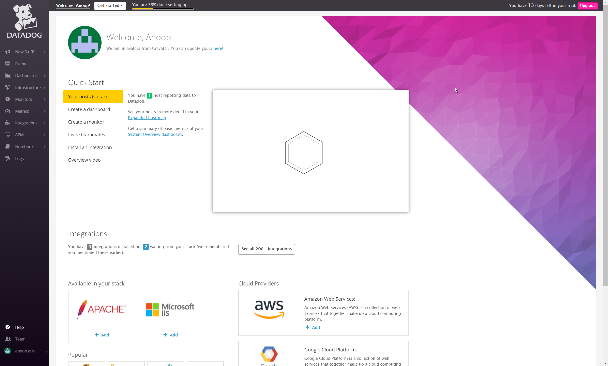

# Technical Exercise - Solutions Engineer
1. [Exercise Summary](#exercise-summary)
2. [Environment](#environment)
3. [Collecting](#collecting-metrics)
4. [Visualizing](#visualizing-data)
5. [Monitoring](#monitoring)
6. [Collecting APM Data](#collecting-apm-data)
7. [Creative Use Case](#creative-use-case)

## Exercise Summary
The objective of this exercise is to provision a Linux VM with a target application then configure metric collection, data visualization, monitoring with thresholds, collect APM data and finally suggest any interesting or creative use cases for DataDog.

I found the exercise a good introduction to getting started with DataDog and as expected from a mature product it was a straightforward process.

Since I am comfortable with the either approach I decided to move forward with Docker for Linux and the dockerized Datadog Agent image for two reasons, lower profile and an opportunity to become familiar with the dockerized agent.

## Environment

In the interests of time and ease of provisioning I chose Ubuntu 18.04.1 LTS (Bionic Beaver) with Docker CE (Docker for Ubuntu).

I followed the Official Docker instructions [1](#1) to get Docker CE installed which on a fresh Ubuntu system involves the following steps:
- Install packages to allow apt access over HTTPS
- Add Docker's GPG key & verify
- Setup the stable Docker repo to install build
- Install Docker CE
- Verify it's installed correctly by running the hello-world image.

Installation was successful and the only anomaly I noticed was that the apt-key fingerprint check included this in the output `[ unknown] Docker Release (CE deb)`. It seems safe to ignore once I confirmed it was the same result for other keys using `apt-key list` and the installed Docker version with `docker version`.

### Install DataDog Agent
The last step in completing prerequisites for the exercise is to signup and install the DataDog agent. I used the "easy one-step install" command available within the DataDog interface [2](#2) to get the agent installed & working successfully.

## Collecting Metrics
Now that we have the agent installed and reporting data back to DataDog we will proceed to the next set of tasks. If you haven't already reviewed the DataDog documentation under references this might be a good time [3](#3).

### Tagging
Tagging in Datadog can be accomplished in a few different ways - Agent, DogStatsD, Integration/Check, etc.

Initially I configured the datadog.yaml in the following format based on the commented out sample in file:
`
tags:
   - env:demo
   - role:database
   - region:socal
`
This configuration didn't work even though the existing sample in the datadog.yaml was the same, so I restarted the agent `systemctl restart datadog-agent` with no success. Next I changed it to be on a single line but still wasn't seeing the expected results.

`tags: env:demo, role:database, region:socal`

I then went looking for any DataDog logs and found the process-agent.log file which referenced a process_config env variable.

`
2018-08-11 22:11:37 INFO (main_common.go:146) - process-agent not enabled.
Set env var DD_PROCESS_AGENT_ENABLED=true or add
process_config:
  enabled: "true"
to your datadog.yaml file.
Exiting.
`

After a few searches I come across the documentation for Live Process Monitoring which included information about enabling process_config for DataDog to collect process and containers.

Once I enabled the env var updated tags were visible on the host map.

Final list of tags used: `tags: env:demo, role:database, region:socal, client:tuvu`

### Install database and DD integration
After initially considering MongoDB I went with PostgreSQL and the associated integration announced at the Ausitin 2017 Summit.

Installation was performed using apt-get - 'apt-get install postgresql-10'

Next I followed the PostgreSQL integration documentation [4](#4) and reviewed blog post [5](#5) to configure the postgres.d/conf.yaml file.

After restarting the Agent I started seeing some basic information appearing in DataDog but other expected metrics were not visible.

To get more information about other PostgreSQL metrics I created a database and imported data from the UK Open Data set:
https://data.gov.uk/dataset/e33718a8-5d42-44c9-b87b-c94ac6b0bec2/uk-foreign-post-locations

Unfortunately I didn't see the metrics I expected, so I decided to install MySQL and confirmed integration by following the documentation [6](#6) & blog post [7](#7). When I checked the dashboard/metrics both MySQL & PostgreSQL were appearing, in hindsight it was probably a delay.

We also see the integration confirmed by doing a datadog-agent status check:

### Create Custom Agent Check
I started off by reviewing the documentation [8](#8) for writing an agent check as recommended and used the example to create the Hello World check as my starting point.

Since the rest of the YAML files were in their own directories I created conf.d/hello.d directory.

`touch /etc/datadog-agent/checks.d/hello.py`
`touch /etc/datadog-agent/conf.d/hello.d/hello.yaml`

Copied the sample code, configuration and was seeing the metric as expected.

Note: Initially I had created the hello.yaml file in /etc/datadog-agent/ which resulted in the check being completely ignored. Upon further review I noticed the incorrect placement and moved it to the correct directory.

Next I duplicated the hello world sample as my_metric and modified the check python code to generate a random value between 0 & 1000.

After restarting the agent I was disappointed to see an error during status check:

Fortunately it was a quick fix, I wasn't calling the function correctly - I was using randint(x,y) instead of random.randint(x,y).

Finally I modified the check collection interval to 45 seconds by updating the my_metric YAML configuration file. While this could have been accomplished in the check code we already have a configuration option referenced in documentation [8](#8).

Note: The collector runs every 15-20 seconds depending on how many integrations are enabled. If the value is set to 50, it does not mean that the metric is collected every 30 seconds, but rather that it could be collected as often as every 50 seconds.

#### Bonus Question: Can you change the collection interval without modifying the Python check file you created?

Yes, by modifying `min_collection_interval` in the associated YAML configuration file.

Note: From the documentation, "For Agent 6, min_collection_interval must be added at an instance level, and can be configured individually for each instance."

## Visualizing Data
To prepare for this section I read through the Datadog API documentation for Timeboards [9](#9) and used the sample to complete the task.

I ended up with two timeboards since I had run the Python script initially with only the my_metric configured. After I got the rollup (1hr) and DB metric with the anomaly function, I ran the script again expecting (incorrectly) that the existing timeboard would be updated.

[Link to Timeboard](https://app.datadoghq.com/dash/886077/anoop-atres-timeboard?live=true&page=0&is_auto=false&from_ts=1534121361970&to_ts=1534124961970&tile_size=m)

Next I accessed the Timeboard and interacted directly with the graph to view the last 5 minutes. Finally clicked on the my_metric (host scoped) graph to take a snapshot of the graph and sent it to myself using the @ notation.

#### Bonus Question: What is the Anomaly graph displaying?
Based on the documentation [11](#11) my understanding is that the anomaly function allows us to identify if a metric is behaving differently from past trends. So if a database doesn't grow or has not seen high usage during weekends or off-business days and we start seeing such usage the anomaly graph would help identify such events.

## Monitoring Data
I used the interface to create a monitor as per the requirements. Warn at 500, alert at 800 and a notice if there is no data for 10 minutes.

Here is the screenshot of a warning email notification from the monitor:

#### Bonus Question: Set up two scheduled downtimes for this monitor
I used the web interface to configure two downtimes, first one runs  at 7 PM every weekday silencing the my_metric monitor till the next morning 9 AM and a second that starts Saturday morning at 9 AM to silence the my_metric monitoring over the weekend.

## Collecting APM Data
I started this section by following the APM Documentation [12](#12), but ran into some issues with multiple Python builds so reviewed the Flask specific documentation [13](#13).

As I started changing over to including the Middleware manually I noticed I was missing a library. Once that was installed the application was running and I could access it from outside the VM via a web browser. I could see the responses on the console during these attempts.

`http://192.168.52.155:5050/`
`http://192.168.52.155:5050/api/apm`
`http://192.168.52.155:5050/api/trace`

[Link to APM and Infrastructure Metrics Dashboard](https://app.datadoghq.com/dash/886117/anoops-timeboard-12-aug-2018-2157?live=true&page=0&is_auto=false&from_ts=1534132921239&to_ts=1534136521239&tile_size=m)

#### Bonus Question: What is the difference between a Service and a Resource?
As stated in the documentation [14](#14): "Service" is the name of a set of processes that work together to provide a feature set. While a resource is an action for a service or query to a service.

## Creative Use Case
Seismic monitoring, satellite tracking, pollen count monitoring, epidemiology or on an individual level with personal health monitoring.

While these wouldn't be as effective for real-time use it might help provide different insights especially if they can be monitored & analyzed against other criteria or data points.

## References
### 1
 - https://docs.docker.com/install/linux/docker-ce/ubuntu/
### 2
 - https://app.datadoghq.com/account/settings#agent/ubuntu
### 3
 - https://docs.datadoghq.com/
### 4
 - https://docs.datadoghq.com/integrations/postgres/
### 5
 - https://www.datadoghq.com/blog/collect-postgresql-data-with-datadog/
### 6
 - https://docs.datadoghq.com/integrations/mysql/
### 7
 - https://www.datadoghq.com/blog/mysql-monitoring-with-datadog/
### 8
 - https://docs.datadoghq.com/developers/agent_checks/#your-first-check
### 9
 - https://docs.datadoghq.com/api/?lang=python#create-a-timeboard
### 10
 - https://github.com/DataDog/datadogpy
### 11
 - https://docs.datadoghq.com/monitors/monitor_types/anomaly/
### 12
 - https://app.datadoghq.com/apm/install#
### 13
 - http://pypi.datadoghq.com/trace/docs/#module-ddtrace.contrib.flask
### 14
 - https://help.datadoghq.com/hc/en-us/articles/115000702546-What-is-the-Difference-Between-Type-Service-Resource-and-Name-