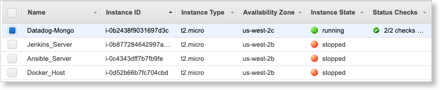

# Datadog Sales Engineer Technical Exercise

Larry Mahoney\
larrymahoney98@gmail.com\
Email address for Datadog Trial Instance:  z98alpha@gmail.com (because I had already done a free trial with larrymahoney98@gmail.com)

## This document is meant to be Customer Facing

I have formatted the remainder of this document to be a customer facing piece that you can leave with a prospect to help close a deal.

This was a really fun project!  And you have an awesome product that just works!

###########################################################################################################

# Let's take a tour of Datadog!  Three Easy Steps!

Congratulations!  You have found the most powerful platform for monitoring metrics, traces and logs on the planet.  Buckle in and lets take it for a test drive.  In the following 3 steps, we will walk you through:
* Step 1 - Setting up your datadog laboratory
* Step 2 - Metrics -- Collecting, Visualizing and Monitoring  
* Step 3 - APM - Trace that Call!


## Step 1 - Setting up your datadog laboratory


* **Linux VM:**  

I have experience with AWS, so I spun up an Ubuntu 18 instance on EC2.



* **Datadog Free Trial:**  

Note that I used z98alpha@gmail.com as the email address for this trial instance because I had already used larrymahoney98@gmail.com for a previous trial to learn more about your cool product!


## Collecting Metrics -- Host and Tags on the Host Map

* **My Host & Tags:**

Here is a screenshot from Infrastructure/Host Map showing my host and it's tags:


* **Database:**  


I installed MongoDB version 4.2.8.


* **Custom Agent Check:**  

Please see the files `my_metric.py` and `my_metric.yaml` for my agent check that produces "My Metric".  I changed the metric interval to 45 seconds in the config file.


* **Bonus Question:** Can you change the collection interval without modifying the Python check file you created?

Yes, you can set the collection interval in the YAML config file with this command:

```python
instances:
  - min_collection_interval: 45
```

## Visualizing Data:

See the file `make_dashboard.py` for my use of the Datadog API to create a Timeboard that contains:

* 'my_metric' scoped over my host.
* The MongoDB Writes/Sec metric with the anomaly function applied.
* 'my_metric' with the rollup function applied with a 1 hour range.


Link to dashboard:
https://p.datadoghq.com/sb/wtoiabphsohwb8fi-c902bc17dca7f4b703f79280584690c8

* **Snapshot of Graph**

I set the timeframe to the past 5 minutes and sent a snapshot to myself:


* **Bonus Question**: What is the Anomaly graph displaying?

The Anomaly graph is showing the actual measured metric with an overlay in gray that shows the 'normal' range of values. This allows the operator to very easily see when a metric is abnormal even if it experiences cyclical perturbations.

## Monitoring Data

I created a Monitor called "My_Metric Monitor" that triggers in these conditions:

* Warning if average above 500 over last 5 minutes
* Alert if average above 800 over last 5 minutes

* No data notification: This monitor also notifies me if there is No Data for this query over the past 10m.

I configured the monitor to email me with notification type, host IP and actual metric value.  Here is a sample email:


* **Bonus Question**:  
Set up two scheduled downtimes for this monitor.

I set up two scheduled downtimes as follows:

  * From 7pm to 9am daily on M-F
  * All day on Sat-Sun

Here is the email that I received from setting up the Monday-Friday downtime.


## Collecting APM Data:

I instrumented the provided Flask app.  See `flaskapp.py`.  I added code to enable analytics, and used ddtrace-run.

* **Bonus Question**:
What is the difference between a Service and a Resource?

A Resource is typically an instrumented endpoint.  But it can also be a database query or a background job.
A Service is a collection of endpoints, queries or jobs.
In this example, the app `flaskapp.py` embodies the service, whereas the endpoints /api/apm and /api/trace are resources.

Screenshot and link to my Dashboard with both APM and Infrastructure Metrics:


https://p.datadoghq.com/sb/wtoiabphsohwb8fi-45cb1ab404e3e28e6792a2286b03646a

## Final Question:

Is there anything creative you would use Datadog for?

COVID Park Alert!
I would get public access to municipal cameras at the city's parks and feed them into a crowd-counting service like Amazon Rekognition.  And then pull that data into Datadog and do analytics on the crowd size data as well as weather data to send alerts when the crowd size is low on days that are sunny!  The alerts would let you know when you can throw your frisbee to your dog at the park with extra social distancing!

## Thanks!

Thank you for reviewing my work!  This was a blast!

Larry Mahoney\
larrymahoney98@gmail.com\
970.214.3685
