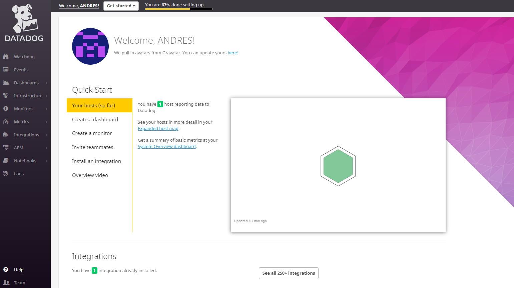

Your answers to the questions go here.  
ENVIRONMENT:  
    •	vagrant  
    •	ubuntu-xenial 16.04  
    •	python3  
    •	mysql  
      
Install the datadog agent 
  
  
Datadog welcome page  
  
  
COLLECTING METRICS:  
  
Creating a new metric called "my_metric"    
  

Config file for the new metric (Change your check's collection interval so that it only submits the metric once every 45 seconds.)   
  
  

Bonus Question Can you change the collection interval without modifying the Python check file you created?  
Yes, you can change the collection interval changing the config file instead  of the python file.  

VISUALIZING DATA:  
  
Script to create a timeboard via the datadog API  
  
  
Monitor created via the API.  
  
  
Bonus Question: What is the Anomaly graph displaying?  
Nothing.  
  
MONITORING DATA:  
  
Monitor the my_metric creating alarms and warnings  
  
  
Email1  
  
  
Email2  
  
  
Bonus Question: Since this monitor is going to alert pretty often, you don’t want to be alerted when you are out of the office. Set up two scheduled downtimes for this monitor.  
Adding two schedule downtime rules:  
1.- rule for the week  
  
  
2.- rule for the weekend  
  
  
COLLECTING DATA APM:  
Run the phthon as "ddtrace-run python3 apm.py"  
  
Dashboard with the apm traces and infrastructure  
  
  
Service "flask"  
  
  
Bonus Question: What is the difference between a Service and a Resource?  
•	Service: A service is a set of processes that do the same job. For instance, a simple web application may consist of two services: A single webapp service and a single database service.  
•	Resource: A resource is a particular action for a service.   
For a web application: some examples might be a canonical URL, such as /user/home or a handler function like web.user.home (often referred to as “routes” in MVC frameworks).  
For a SQL database: a resource is the query itself, such as SELECT * FROM users WHERE id = ?  
