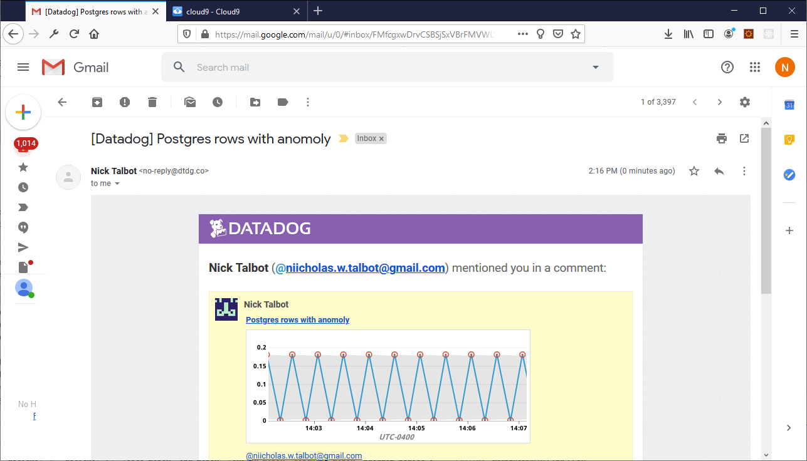
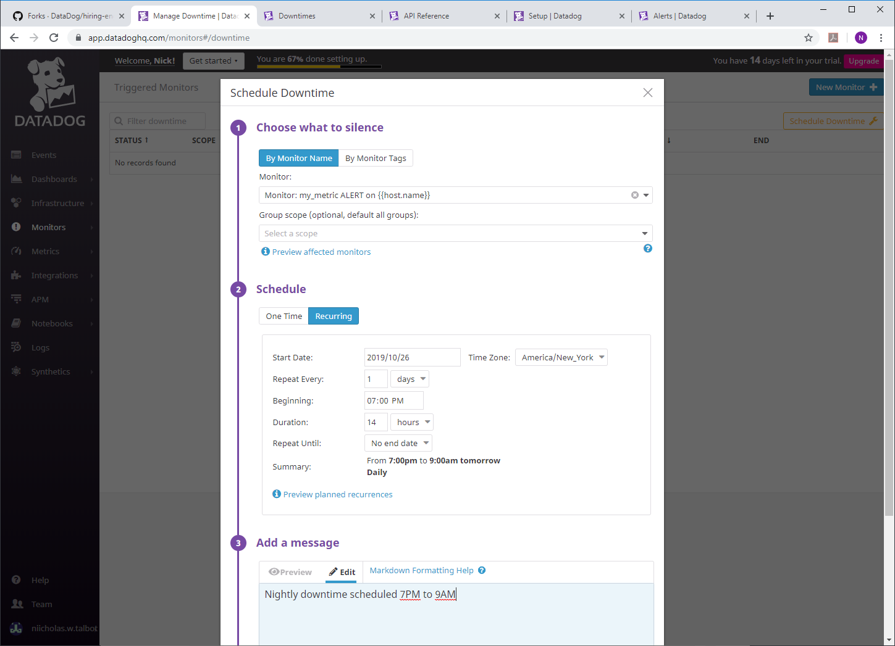
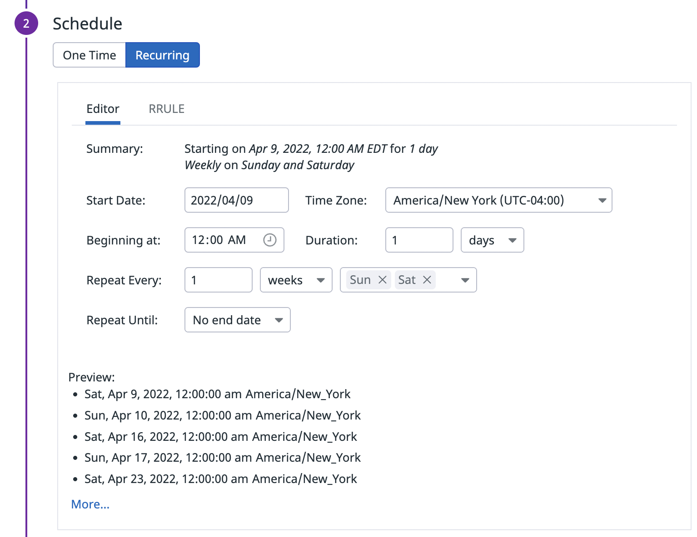
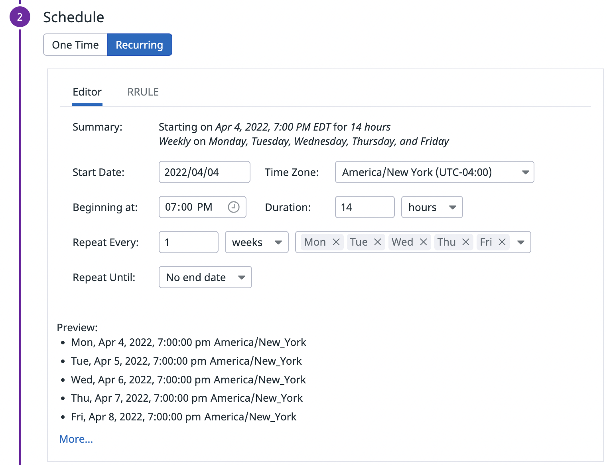
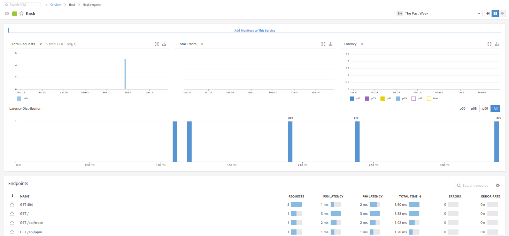

## Collecting Metrics:

* Add tags in the Agent config file and show us a screenshot of your host and its tags on the Host Map page in Datadog.

From datadog.yaml


      tags:
              - environment:sandbox 
              - application:flashquote-sandbox

I also tossed the agent on another old linux box just to have more than one machine showing


* Install a database on your machine (MongoDB, MySQL, or PostgreSQL) and then install the respective Datadog integration for that database.

I chose PostgreSQL for this, I already had postgresql installed.  Added the user and ran permission scripts.

Since Datadog uses a single agent, once you configure the integration by giving it
a login into postgres you're good to go.

From conf.d/postgres.d/conf.yaml

` - host: localhost

    ## @param port - integer - required
    ## Port to use when connecting to PostgreSQL.
    #
    port: 5432

    ## @param user - string - required
    ## Datadog Username created to connect to PostgreSQL.
    #
    username: datadog

    ## @param pass - string - required
    ## Password associated with the Datadog user.
    #
    password: *******`

[Postgres Dashboard](https://app.datadoghq.com/dash/integration/17/Postgres%20-%20Metrics?tpl_var_scope=host%3Anuc&from_ts=1572196143005&to_ts=1572199743005&live=true&tile_size=m)

I generated a bit of activity and got the following...


* Create a custom Agent check that submits a metric named my_metric with a random value between 0 and 1000.

Again since Datadog has a single agent, you can add whatever you want and submit metrics
with a simple config and python file.


Simply add a config file: /etc/datadog-agent/conf.d/ntcheck.yaml

[ntcheck.yaml](ntcheck.yaml)

and python code: /etc/datadog-agent/checks.d/ntcheck.py

[ntcheck.py](ntcheck.py)


* Change your check's collection interval so that it only submits the metric once every 45 seconds.


```
root@nuc:/etc/datadog-agent/conf.d# cat ntcheck.yaml

init_config:

instances:
  - min_collection_interval: 45
root@nuc:/etc/datadog-agent/conf.d#
```

[agent check dashboard](https://app.datadoghq.com/dashboard/bfn-6y5-u5f/custom-agent-check?from_ts=1572199094300&to_ts=1572199994300&live=true&tile_size=m)


You can observe the new 45 second collection interval vs the default 15 second interval by seeing that the graph is more drawn out after the change

* **Bonus Question** Can you change the collection interval without modifying the Python check file you created?

Yes, in fact that's the easiest way to do it.  simply edit the yaml file for the custom agent check and add:
```
  - min_collection_interval: 45
```


## Visualizing Data:

Utilize the Datadog API to create a Timeboard that contains:

* Your custom metric scoped over your host.
* Any metric from the Integration on your Database with the anomaly function applied.
* Your custom metric with the rollup function applied to sum up all the points for the past hour into one bucket


For me the easiest way to do it is with curl because there's no dependencies on any
python libraries.  You can "cheat" and just make a dashboard, do a GET using the api
then take a few things out of the JSON and POST it back with a different name

[Dashboard link](https://app.datadoghq.com/dashboard/uwk-2c9-ydg/apicreateddashboard?from_ts=1572213033582&to_ts=1572213933582&live=true&tile_size=m)


Dashboard script:
[dashboard.sh](dashboard.sh)


Once this is created, access the Dashboard from your Dashboard List in the UI:

* Set the Timeboard's timeframe to the past 5 minutes
* Take a snapshot of this graph and use the @ notation to send it to yourself.


* **Bonus Question**: What is the Anomaly graph displaying?

The anomaly graph uses one of three selectable statistical functions do determine a baseline min and max.  The graph turns red when it is outside of the baselined values.

The anomaly graph can be used to detect when an application is is acting differently than normal such as heavy load, slow response times, etc.


## Monitoring Data

Since you’ve already caught your test metric going above 800 once, you don’t want to have to continually watch this dashboard to be alerted when it goes above 800 again. So let’s make life easier by creating a monitor.

Create a new Metric Monitor that watches the average of your custom metric (my_metric) and will alert if it’s above the following values over the past 5 minutes:

* Warning threshold of 500
* Alerting threshold of 800
* And also ensure that it will notify you if there is No Data for this query over the past 10m.

Please configure the monitor’s message so that it will:

* Send you an email whenever the monitor triggers.
* Create different messages based on whether the monitor is in an Alert, Warning, or No Data state.
* Include the metric value that caused the monitor to trigger and host ip when the Monitor triggers an Alert state.

This is a basic read the docs and do it.  Screenshots below.


* When this monitor sends you an email notification, take a screenshot of the email that it sends you.


* **Bonus Question**: Since this monitor is going to alert pretty often, you don’t want to be alerted when you are out of the office. Set up two scheduled downtimes for this monitor:

  * One that silences it from 7pm to 9am daily on M-F,

  * And one that silences it all day on Sat-Sun.
 

  * Make sure that your email is notified when you schedule the downtime and take a screenshot of that notification.
 


## Collecting APM Data:

I instrumented a prototype Django app I wrote a while ago.  I used ddtrace-run and configured the app appropriately.

First ddtrace needs to be added to the requirements file used by pip so it's in your virtual environment

The whole process is pretty straightforward.  The fact that the Datadog agent is already
running on the machine means there's not a bunch of config as the instrumentation
defaults to sending the data to the local agent which sends the metrics up to
Datadog.

In the settings file turn debug off (optional can do a proerty change instead)
and add the tracer to the INSTALLED_APPS
```
DEBUG = False

INSTALLED_APPS = [
    'ddtrace.contrib.django',
    'markdownify',
    'crispy_forms',
    'rest_framework',
    'django.contrib.admin',
    'core',
    'welcome',
    'user',
    ...
```
To run the app put ddtrace-run in front of the command (after the nohup)
```
(flashquote_env) ntalbot@nuc:~/flashquote/django$ nohup ddtrace-run python manage.py runserver 192.168.11.50:8080 &
[1] 8390
(flashquote_env) ntalbot@nuc:~/flashquote/django$ nohup: ignoring input and appending output to 'nohup.out'
(flashquote_env) ntalbot@nuc:~/flashquote/django$ tail -f nohup.out
/home/ntalbot/flashquote/flashquote_env/lib/python3.7/site-packages/psycopg2/__init__.py:144: UserWarning: The psycopg2 wheel package will be renamed from release 2.8; in order to keep installing from binary please use "pip install psycopg2-binary" instead. For details see: <http://initd.org/psycopg/docs/install.html#binary-install-from-pypi>.
  """)
/home/ntalbot/flashquote/flashquote_env/lib/python3.7/site-packages/psycopg2/__init__.py:144: UserWarning: The psycopg2 wheel package will be renamed from release 2.8; in order to keep installing from binary please use "pip install psycopg2-binary" instead. For details see: <http://initd.org/psycopg/docs/install.html#binary-install-from-pypi>.
  """)
"GET / HTTP/1.1" 200 3318
2019-10-27 16:43:23,104 INFO [django.server] [basehttp.py:154] - "GET / HTTP/1.1" 200 3318
"GET /core/customers HTTP/1.1" 200 3085
2019-10-27 16:43:25,280 INFO [django.server] [basehttp.py:154] - "GET /core/customers HTTP/1.1" 200 3085
"GET /core/customer/3 HTTP/1.1" 200 5704
2019-10-27 16:43:26,687 INFO [django.server] [basehttp.py:154] - "GET /core/customer/3 HTTP/1.1" 200 5704
"GET /core/newquote/3 HTTP/1.1" 200 29710
2019-10-27 16:43:28,768 INFO [django.server] [basehttp.py:154] - "GET /core/newquote/3 HTTP/1.1" 200 29710
"GET /core/newquote/3 HTTP/1.1" 200 29710
2019-10-27 17:27:55,490 INFO [django.server] [basehttp.py:154] - "GET /core/newquote/3 HTTP/1.1" 200 29710
"GET /core/customers HTTP/1.1" 200 3085
2019-10-27 17:34:33,245 INFO [django.server] [basehttp.py:154] - "GET /core/customers HTTP/1.1" 200 3085
"GET /core/customer/3 HTTP/1.1" 200 5704
2019-10-27 17:34:34,462 INFO [django.server] [basehttp.py:154] - "GET /core/customer/3 HTTP/1.1" 200 5704
"GET /core/quote/3 HTTP/1.1" 200 12970
2019-10-27 17:34:35,918 INFO [django.server] [basehttp.py:154] - "GET /core/quote/3 HTTP/1.1" 200 12970
"GET /core/quotes/pdf/3 HTTP/1.1" 200 54443
2019-10-27 17:34:37,639 INFO [django.server] [basehttp.py:154] - "GET /core/quotes/pdf/3 HTTP/1.1" 200 54443
"GET /core/quote/4 HTTP/1.1" 200 12933
2019-10-27 17:34:44,243 INFO [django.server] [basehttp.py:154] - "GET /core/quote/4 HTTP/1.1" 200 12933
"GET /core/quotes/pdf/4 HTTP/1.1" 200 54317
2019-10-27 17:34:46,343 INFO [django.server] [basehttp.py:154] - "GET /core/quotes/pdf/4 HTTP/1.1" 200 54317
```


* **Bonus Question**: What is the difference between a Service and a Resource?
The service is the higher level application or microservice listening on a port and running as a process or set of processes.


The resource is an individual URL or DB query such as a REST endpoint representing an object within an application.

In Django this means the whole app is a service, the DB is a service as well.
Each Django view corresponds to a resource.

Resources are nicely displayed under their cooresponding service.


* Provide a link and a screenshot of a Dashboard with both APM and Infrastructure Metrics.

Here is a dahsboard that has CPU utilization and Django hits along with SQL metrics.  You can see the corresponding increase in CPU when the browser
refresh button was hit a few times.

There are a couple interesting things this dashboard reveals. You  can see a correlation between a longer response time when a single request at the
beginning makes close to 1k postgressql calls.

[public dashboard](https://p.datadoghq.com/sb/47xdxpvf337s3ctr-8f59562f7b1503ac090229b603616026)


To investigate the issue further we can look at the resources to determine the offending query:  It is the one with the longest AVG Latency




Hovering over reveals the Query.  This query would be a good candidate for caching.


I am not including my entire app as it contains business data that is not mine.  
  I thought it's a good APM example since it contains some inefficient queries, and  
  has a data set. If that is a problem, let me know and I will instrument your sample app.  I included a couple
models and views from the Django app so the reader can get an idea, but it's a basic Django app.

[views.py](views.py)

[models.py](models.py)


## Final Question:

Is there anything creative you would use Datadog for?

As edge computing is becoming mainstream there are more and more IoT devices
that are not traditionally connected to the network and power.  If data is being gathered and processed into events on devices powered
by solar and connected to a software defined mesh network, it would be useful
to gather environmental data.  Datadog could be used to gather light and temperature
data for example so that when devices goes offline you could go back and determine
if there is coorelation to periods of extreme temperature or low light.


In this example, I put together an extremely simple circuit that has a photoresistor
and thermister in voltage dividers plugged into analog digital converters.  I used a [beaglebone](https://beagleboard.org/black/)  
(similar to a raspberry pi) as the device.  
Voltage readings are taken and converted to more useful values then reported to
Datadog using the metric API.

Code : [datadog.js](datadog.js)

[public dashboard](https://p.datadoghq.com/sb/47xdxpvf337s3ctr-cf6d4ceebfd57e75bc3d1437a177b845)


Datadog's REST api makes this particularly easy as a device can send metrics
without even having the agent installed.  This would allow a particularly lightweight
device to send metrics so long as it can slap together a JSON string and make an
HTTP POST.  This allows whatever might matter to your application to be monitored even if
it's not necessarily "part" of your application.