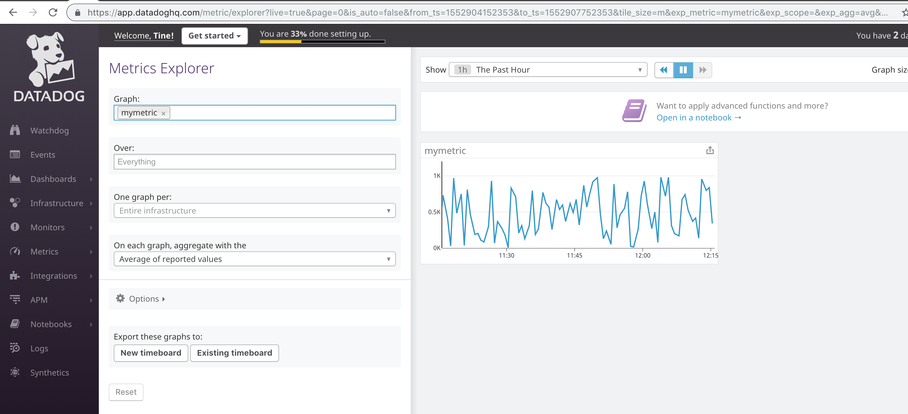

# About the test

I think perhaps Alex (recruiter) sent me the wrong tech excercise link? After completing the test I realized there is both a "Solution Engineer" and a "Solution Architect" branch. I was sent this link: [https://github.com/DataDog/hiring-engineers/tree/solutions-engineer](https://github.com/DataDog/hiring-engineers/tree/solutions-engineer).
The Solution Architect branch looks a lot simpler, so I am guessing it's fine.

## Suggestions

Through the exercise I found a couple of things which were outdated or could be clearer in the README.md file. Especially outdated versions of Vagrant Ubuntu image and Docker Datadog agent added a fair overhead of time and would be good to fix.

Suggestions for updates are committed to README.md in this pull request.

## Feature request

It would be pretty great if the API allowed for:

- Deleting things like a Monitor, Downtime, Dashboard by generic names rather than id. This would allow for repeated testing of API calls with less clicking.

- Creating repeat Downtime with a past start date. It is probably possible to script calculation of POSIX time for "7pm next weekday, in local timezone", but it seems unnecessary.

# Prerequisites - Setup the environment

Initially spun up a Vagrant Ubuntu image, but realized I had no need for the additional layer.
Also tried out the OSX agent, which works fine. 

Ended up deciding on Docker for Mac, as the cleanest solution. The advantage here is that the entire setup is self contained. It can be submitted in this repository and be spun up on any machine which has Docker installed.

Datadog Agent container configured in [docker-compose.yml](./docker-compose.yml) file:

```yaml
  datadog:
    image: datadog/agent:latest
    environment:
      - DD_API_KEY=8923495892e42d2b7919f8764641d254
      - DD_APM_ENABLED=1
    volumes:
      - "/var/run/docker.sock:/var/run/docker.sock:ro"
      - "/proc/:/host/proc/:ro"
      - "/sys/fs/cgroup/:/host/sys/fs/cgroup:ro"
    ports:
      - "5002:5002"
```

Local agent web UI which was available with the OSX agent, does not show up on the mapped port 5002 as expected. This feature is perhaps not included in the Docker agent.
Leaving for now, as the agent runs just fine without it.

# Collecting Metrics

## Add tags to Agent config file

Agent config file copied from datadog container to host filesystem and then mounted in [docker-compose.yml](./docker-compose.yml) file:

```yaml
    volumes:
      - "./datadog-config/datadog.yaml:/etc/datadog-agent/datadog.yaml"
```

Changes to this file are now persistent, as it exists on the host filesystem.

Added tags to the [agent config yaml](./datadog-config/datadog.yaml) file:

```yaml
hostname: eve.docker

tags:
  - env:dockerosx
  - icecream:chocolate
```

Also set a new hostname, for better overview and because it's pretty.

Additionally, changing hostname creates a new host in Datadog monitoring. Initially I had installed the 5.x Agent linked in the README.md, which caused mismatch with API documentation. A new host ensured I could change to 6.x and discard any metrics submitted by 5.x. Nice and clean.

### Result

[Screenshot](./screenshots/Hostmap tags.png): Hostmap tags

</a>

## Install a DB + datadog integration

Added DB service to [docker-compose.yml](./docker-compose.yml) file:

```yaml
services:
  db:
    image: mysql
    command: --default-authentication-plugin=mysql_native_password
    restart: always
    environment:
      MYSQL_ROOT_PASSWORD: example
      MYSQL_DATABASE: exampledb
    volumes:
      - "./docker-entrypoint-initdb.d:/docker-entrypoint-initdb.d"
      - "mysql-data:/var/lib/mysql"

volumes:
  mysql-data:
```

Docker MySQL image used: [https://hub.docker.com/_/mysql](https://hub.docker.com/_/mysql)

Datadog MySQL integration needs a datadog DB user created with specific grants: [https://app.datadoghq.com/account/settings#integrations/mysql](https://app.datadoghq.com/account/settings#integrations/mysql). 

Created [datadog-init.sql](./docker-entrypoint-initdb.d/datadog-init.sql) file, containing the needed queries:

```sql
CREATE USER 'datadog' IDENTIFIED BY 'WIokxj0ir2+UVFOQR35qDbER';
GRANT REPLICATION CLIENT ON *.* TO 'datadog'; #WITH MAX_USER_CONNECTIONS 5;
GRANT PROCESS ON *.* TO 'datadog';
GRANT SELECT ON performance_schema.* TO 'datadog';
```

`MAX_USER_CONNECTIONS` is commented out, as the setting is not needed in this setup and MySQL doesn't like it. Replication grant probably not needed at all, unless DB replication is actually set up. Leaving it here for now, as it doesn't hurt. 

The [datadog-init.sql](./docker-entrypoint-initdb.d/datadog-init.sql) file is only read on first container start, [when the DB is initialized](https://hub.docker.com/_/mysql#initializing-a-fresh-instance). To keep mysql creds persistent across container restarts, `/var/lib/mysql` is mounted to `mysql-data` volume on host in the docker compose file (see above).

This ensures the DB data needed for Datadog agent integration is persistent across container stop/start/up, destroyed on `docker-compose down` and recreated on initial `docker-compose up`.

### Datadog agent config

Agent DB user credentials configured in `/etc/datadog-agent/conf.d/mysql.d/conf.yaml` by copying the file from datadog container to host file system, editing it and mapping it to host file system [docker-compose.yml](./docker-compose.yml) datadog container section:

```yaml
    volumes:
      - "./datadog-config/conf.d/mysql.d/conf.yaml:/etc/datadog-agent/conf.d/mysql.d/conf.yaml"
```

Datadog DB user credentials added here: [conf.yaml](./datadog-config/conf.d/mysql.d/conf.yaml)

### Result

[Screenshot](./screenshots/DB container.png): Checking DB container show up under `Infrastructure -> containers` in Datadog web UI:

</a>

[Screenshot](./screenshots/DB integration.png): MySQL shows up under integrations:

</a>

## Custom Agent check - MyMetric

Modified [hello.py example here](https://docs.datadoghq.com/developers/write_agent_check/?tab=agentv6) to generate a random value between 0 and 1000.

[mymetric.py](./datadog-config/checks.d/mymetric.py) contents:

```python
import random
# the following try/except block will make the custom check compatible with any Agent version
try:
    # first, try to import the base class from old versions of the Agent...
    from checks import AgentCheck
except ImportError:
    # ...if the above failed, the check is running in Agent version 6 or later
    from datadog_checks.checks import AgentCheck

# content of the special variable __version__ will be shown in the Agent status page
__version__ = "1.0.0"


class MymetricCheck(AgentCheck):
    def check(self, instance):
        self.gauge('mymetric', random.randint(0, 1000))
```

Modified [example here](https://docs.datadoghq.com/developers/write_agent_check/?tab=agentv6#collection-interval) to 45 seconds. Result [mymetric.yaml](./datadog-config/conf.d/mymetric.yaml):

```yaml
init_config:

instances:
  - min_collection_interval: 45
```

Mapped the datadog container yaml and py files (above) to host file system in [docker-compose.yml](./docker-compose.yml):

```yaml
    volumes:
      - "./datadog-config/checks.d/mymetric.py:/etc/datadog-agent/checks.d/mymetric.py"
      - "./datadog-config/conf.d/mymetric.yaml:/etc/datadog-agent/conf.d/mymetric.yaml"
```

### Result

[Screenshot](./screenshots/MyMetric.png): MyMetric shows up in Datadog UI `Metrics->Metrics Explorer`:

</a>

## Change your check collection interval to 45 sec

See above.

## Bonus: Can collection interval be changed outside Python check file?

Yes. This goes in [mymetric.yaml](./datadog-config/conf.d/mymetric.yaml) (`/etc/datadog-agent/conf.d/mymetric.yaml`).

# Visualizing Data

> Utilize the Datadog API to create a Timeboard that contains:

## Your custom metric scoped over your host.

Chose curl for the API calls.

Created [saexcercise.sh](./saexcercise.sh) bash script:

```shell
#!/bin/bash

api_key=8923495892e42d2b7919f8764641d254
app_key=f75db8c09aaa5bc351c9d1d983c98fda24d98d43

curl  -X POST -H "Content-type: application/json" \
-d @./json/sadashboard.json \
"https://api.datadoghq.com/api/v1/dashboard?api_key=${api_key}&application_key=${app_key}"
```

JSON exported to separate code, as I ran out of quotation mark levels - and it's neater. [sadashboard.json](./json/sadashboard.json):

```json
{
  "title" : "SA Excercise",
  "widgets" : [
    {"definition": {
      "type": "timeseries",
      "requests": [
        {"q": "avg:mymetric{host:eve.docker}"}
      ],
      "title": "eve.docker - mymetric"
    }}
  ],
  "layout_type": "ordered",
  "description" : "SA Excercise Dash.",
  "is_read_only": true,
  "notify_list": ["mail@tine.dk"]
}
```

### Result

[Screenshot](./screenshots/Dashboard MyMetric.png): MyMetric graph shows up in Datadog UI `Dasboards->SA Excercise`:

</a>

## 


