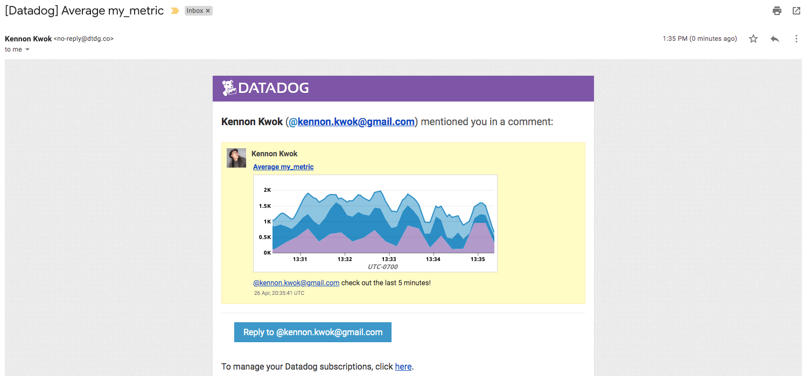

### Level 1 - Collecting your Data

* Bonus question: In your own words, what is the Agent?

  **The Agent is software that collects data from your hosts, which it sends to Datadog.**

* Add tags in the Agent config file and show us a screenshot of your host and its tags on the Host Map page in Datadog.

### Level 2 - Visualizing your Data

* Since your database integration is reporting now, clone your database integration dashboard and add additional database metrics to it as well as your test.support.random metric from the custom Agent check.

  
  
  [Dashboard linked here](https://app.datadoghq.com/dash/272761/mysql---overview-cloned).

* Take a snapshot of your `test.support.random` graph and draw a box around a section that shows it going above 0.90. Make sure this snapshot is sent to your email by using the @notification

### Level 3 - Alerting on your Data
* This monitor should alert you within 15 minutes. So when it does, take a screenshot of the email that it sends you.

* Bonus: Since this monitor is going to alert pretty often, you don't want to be alerted when you are out of the office. Set up a scheduled downtime for this monitor that silences it from 7pm to 9am daily. Make sure that your email is notified when you schedule the downtime and take a screenshot of that notification.

 
