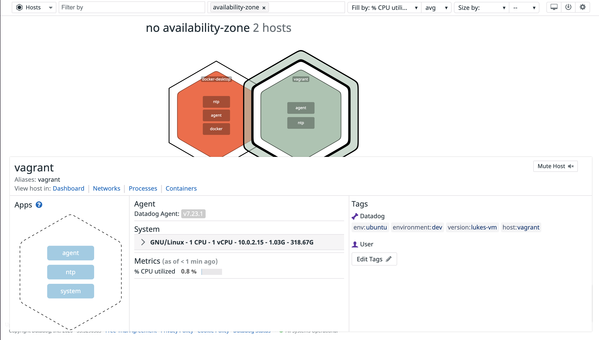

# Hiring Challenge for Data Dog:

## Setting the environment:

Before collecting the metrics, I needed to first set up the environment. To do this, I downloaded two tools, Vagrant and Virtual Box. I first installed Virtual Box as it needed to be opened before installing Vagrant. I went on the documentation on the Vagrant website that showcased the instructions of installing the application. As soon as I had followed  the instructions, I had Vagrant set up along with Precise64, which was a variation of Ubuntu.

## Collecting Metrics:

Once I had set up Ubuntu, I needed to register on the Data Dog website in order to download an agent, which should allow me to collect events and metrics from my Virtual Machine into Data Dog for monitoring and performance data.

In order to add tags, I needed to first follow the directions in setting up the agent by following the instructions labeled in the documentation. Once I've had that set up, and installed the agent on my virtual machine, I was able to get into the configuration files, which allowed me to edit the tags through the text editor vi.

### The location of the tags:


### The results:




Once I have verified that the tags were edited within the agent, I decided to work on setting up the MySQL integration with Datadog. To do this, I needed to first update Ubuntu to the latest version, then run an installer for MySQL server. As soon as MySQL was installed on my machine, I went to the list of integrators on Datadog, which allowed me to select a list of any sort of integrations I wanted to use within my agent. I selected MySQL, and followed the directions to allow me to create a connection between MySQL and my Datadog agent. To verify this, I went back to the Host Map, which shows my results:


I was also able to verify this by running the command line: sudo datadog-agent status, which returned this:


As soon as I was able to verify that mysql had been integrated within my agent, I finally started to work on collecting my metrics. 

To do this, I needed first understand the documentation for Metrics, which I was able to here: https://docs.datadoghq.com/developers/metrics/

And the documentation needed to write up an agent check:

https://docs.datadoghq.com/developers/write_agent_check/?tab=agentv6

Once I was able to understand the different types of metrics, I was able to begin the process. Though I am still not as proficient in Python, I felt it was necessary to write this file using the language rather than writing on Java. 

Here is the script:

```
import random

from datadog_checks.checks import AgentCheck

class CustomCheck(AgentCheck):
    def check(self, instance):
        self.gauge('custom.mycheck', random.randint(0,1000))
```

Submitting a metric once every 45 seconds:

To do this, all you would need to do is changing the configuration file, so entering the conf, which I have named datadog.yaml. In the file, you would need to include the following under instances:

```
instances:
  - min_collection_interval: 45
```

Answer to bonus question: You wouldn't necessarily need to modify the python script that was created since all you would need to do is modify the configuration file.

## Visualizing Data:

To completely understand it from a UI perspective, I decided to go back to my agent on the Datadog website, which allowed me to create different timeboards with several different setups, ranging from System load to uptime. As soon as I was able to understand this better, I decided to look up the documentation, which in return allowed me to choose from three different languages of code. I chose Python, created a file called timeboard.py. Here is how the script currently looks like:

```
from datadog import initialize, api

options = {
    'api_key': 'e077d9fda7b7a9295973f330489e41b1',
    'app_key': '65141ce631b97da2c8a6615cf932a52f00ac04c5'
}

initialize(**options)

title = "Al's board"
description = "Timeboard for the hiring exercise"
graphs = [{
    "definition": {
        "events": [],
        "requests": [
            {"q": "avg:system.mem.free{*}"}
        ],
        "viz": "timeseries"
    },
    "title": "Average Memory Free"
}]

template_variables = [{
    "name": "host1",
    "prefix": "host",
    "default": "host:my-host"
}]

read_only = True
api.Timeboard.create(title=title,
                     description=description,
                     graphs=graphs,
                     template_variables=template_variables,
                     read_only=read_only)
```

In order to secure the API and APP keys, I had to go through settings on the Datadog UI which allowed me to not only see what my API key was, but also create an APP key. Once I was able to fill the script with the information necessary, I needed to work on running the script on my virtual machine.


