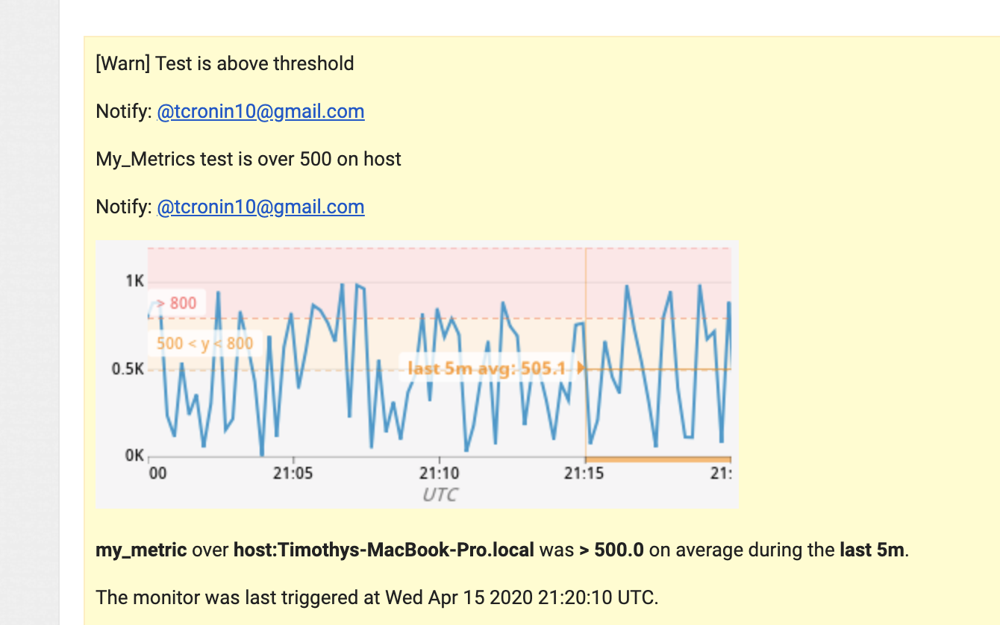

## The Exercise

Please find the answers to the Solution Engineer Tech Challenge below.

## Step 1 - Setup the environment

- Spin up an Ubuntu VM via Vagrant on local machine.
- Install the Ubuntu Agent under `Integrations -> Agent -> Ubuntu`
- Verify the host connection under `Infrastructure -> Host Map`

- Install PostgreSQL on the VM
- Install the respective Datadog integration for PostgreSQL under `Integrations -> PostgreSQL -> Configuration`

<br/>


<br/>

- Add tags in the Agent config file in `/etc/datadog-agent/datadog.yaml`


<br/>

- View and confirm tags in the UI under `Infrastructure -> Host Map -> Your Infrastructure`


<br/>

## Step 2 - Collecting Metrics:

Create a custom Agent check that submits a metric named `my_metric` with a random value between 0 and 1000.

- Create a file `my_metric.py` with the following script and save it to `/etc/datadog-agent/check.d`

```python
  # the following try/except block will make the custom check compatible with any Agent version
  try:
      # first, try to import the base class from old versions of the Agent...
      from checks import AgentCheck
  except ImportError:
      # ...if the above failed, the check is running in Agent version 6 or later
      from datadog_checks.checks import AgentCheck

  # content of the special variable __version__ will be shown in the Agent status page
  __version__ = "1.0.0"

  import random

  class My_Metric(AgentCheck):
      def check(self, instance):
          self.gauge('my_metric.metric_value',random.randint(1,1000))
```

- Create a check configuration file called `my_metric.yaml` and save it in `/etc/datadog-agent/conf.d`
- Edit the check's collection interval in `my_metric.yaml` that it only submits the metric once every 45 seconds.

```
  instances:
      - min_collection_interval: 45
```

<br/>

- **Bonus Question** Can you change the collection interval without modifying the Python check file you created? `Yes, by adding the min_collection_interval param under instance in my_metric.yaml file.`

<br/>

## Step 3 - Visualizing Data:

- Generate an API key and an App Key at `Integrations -> APIs`
- Use the following script to create the timeboard **My Timeboard** that contains
  - `my_metric` scoped over Ubuntu VM
  - A metric from PostgreSQL with anomalies
  - Sum rollup of `my_metric` for the past hour

```
curl -X POST \
  'https://api.datadoghq.com/api/v1/dash?api_key={{api_key}}&application_key={{app_key}}' \
  -H 'Cache-Control: no-cache' \
  -H 'Content-Type: application/json' \
  -d '{
      "graphs" : [{
          "title": "UbuntuVM:My_Metric",
          "definition": {
              "events": [],
              "requests": [
                  {"q": "my_metric.metric_value{*}"}
              ],
              "viz": "timeseries"
          }
      },
     {
          "title": "Postgresql:Anomalies",
          "definition": {
              "events": [],
              "requests": [
                  {"q": "anomalies(avg:postgresql.percent_usage_connections{*}, '\''basic'\'', 2)"}
              ],
              "viz": "timeseries"
          }
      },
     {
          "title": "UbuntuVM:My_Metrics rollup (sum) for the past hour ",
          "definition": {
              "events": [],
              "requests": [
                  {"q": "my_metric.metric_value{*}.rollup(sum, 3600)"}
              ],
              "viz": "query_value"
          }
      }],
      "title" : "My Timeboard",
      "description" : "Timeboard containing three graphs of my metric data and postgresql anomalies",
      "template_variables": [{
          "name": "UbuntuVM",
          "prefix": "host",
          "default": "host:UbuntuVM"
      }],
      "read_only": "True"
}
'
```

<br/>

- Access the timeboard from the UI under `Dashboard -> Dashboard List -> My Timeboard`


<br/>


- Set the Timeboard's timeframe to the past 5 minutes
- Take a snapshot of this graph and use the @ notation to send it to yourself.


<br/>

- **Bonus Question**: What is the Anomaly graph displaying?
  `I used the percent_usage_connections metric for the anomaly graph. Whenever the number of connections to this database as a fraction of the maximum number of allowed connections goes above a certain threshold (i.e. 0.1), the graph displays an anomaly.`

<br/>

## Step 4 - Monitoring Data

- Create a new Metric Monitor called **My Metric Monitor** under `Monitors -> New Monitor`
- Setup the monitor to watch the average of `my_metric` and alert if it’s above the following values over the past 5 minutes:

  - Warning threshold of 500
  - Alerting threshold of 800
  - Notify if there is No Data for this query over the past 10m

  

<br/>

- Configure the monitor’s message so that it will:
  - Send you an email whenever the monitor triggers.
  - Create different messages based on whether the monitor is in an Alert, Warning, or No Data state.
  - Include the metric value that caused the monitor to trigger and host ip when the Monitor triggers an Alert state.
  


<br/>

**Alert Email Example**



<br/>

**Warning Email Example**


<br/>

**No Data Email Example**


<br/>

- **Bonus Question**: Since this monitor is going to alert pretty often, you don’t want to be alerted when you are out of the office. Set up two scheduled downtimes for this monitor:
  - One that silences it from 7pm to 9am daily on M-F,
  - And one that silences it all day on Sat-Sun.
  - Make sure that your email is notified when you schedule the downtime and take a screenshot of that notification.

  <br/>

**Downtime Email Example**


  <br/>

## Step 5 - Collecting APM Data:

Instrument the following Flask app using Datadog’s APM solution:

- Install the python client from `APM -> Docs -> Getting Started -> Python` in the Ubuntu VM.

- Instrument the app by running it with ddtrace cli wrapper `ddtrace-run python my_app.py`
- Fully instrumented sample app below:

```python
from flask import Flask
import logging
import sys

# Have flask use stdout as the logger
main_logger = logging.getLogger()
main_logger.setLevel(logging.DEBUG)
c = logging.StreamHandler(sys.stdout)
formatter = logging.Formatter('%(asctime)s - %(name)s - %(levelname)s - %(message)s')
c.setFormatter(formatter)
main_logger.addHandler(c)

app = Flask(__name__)

@app.route('/')
def api_entry():
    return 'Entrypoint to the Application'

@app.route('/api/apm')
def apm_endpoint():
    return 'Getting APM Started'

@app.route('/api/trace')
def trace_endpoint():
    return 'Posting Traces'

if __name__ == '__main__':
    app.run(host='0.0.0.0', port='5050')
```

  <br/>

- **Bonus Question**: What is the difference between a Service and a Resource?
  `A service is a component within an app such as frontend or a database. Number of services in an app may differ depending on the complexity of it. A resource is connection to a service such a database query or an API call.`
  <br/>

* Create a dashboard with both APM and Infrastructure Metrics.


<br/>

**[Link to the APM and Infrastructure Dashboard](https://app.datadoghq.com/dash/999175/apm-and-infrastructure-metrics?live=true&page=0&is_auto=false&from_ts=1543194942462&to_ts=1543281342462&tile_size=s&tpl_var_scope=host%3AUbuntuVM)**

## Final Question:

Datadog has been used in a lot of creative ways in the past. We’ve written some blog posts about using Datadog to monitor the NYC Subway System, Pokemon Go, and even office restroom availability!

Is there anything creative you would use Datadog for?

```
Datadog metric collecting and analyzing capabilities can be utilized in many consumer goods and services industries.

- e-commerce: collect and analyze customer buying metrics for promotions, sales, geolocation based marketing events etc.
- food - franchise restaurants: collect and analyze customer menu selections to improve food offering, curate menus for different geographies etc.
- fitness - franchise gyms: customer attendance and health metrics can be used to improve membership programs, promotions etc.
- entertainment - video streaming services: use customer access metrics, viewer metrics, free trial signup etc. to improve content, personalized curations for viewers etc.

```
