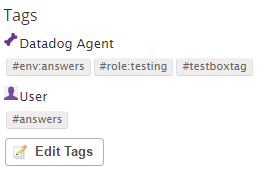

Submitted by Trevor Veralrud

# Challenge Answers

Below are the answers to the Support Engineer challenge. I may be a little verbose in my answers, but that's so you can assess my
thinking process, understanding, and personality a bit better.

## Level 1 - Collecting Data

I setup various VMs while solving this challenge. I did this to get better acquainted with the process of installing and
configuring Agents and Integrations, and also to see how the Dashboard changed when setting up multiple hosts. This presented
some interesting problems of its own, leading to some bonus troubleshooting regarding real hostnames and those set
in the `datadog.conf` file.

### Bonus Question: What is an Agent?

An Agent is the software that runs on your host that is responsible for both collecting information about your system and
integrations, and sending that information to Datadog where it can be visualized and monitored.

### Adding Tags to Agents

There are two ways to add tags to a host.

First, tags can be added to the agent's `datadog.conf` configuration file. Here is a snippet from my configuration file for my `testbox` host:

```
# Set the host's tags
tags: testboxtag, env:answers, role:testing
```

Second, User tags can be added through the Datadog app or API. Agent tags can only be modified on the host itself, while User tags can be added and removed at-will.

Here is a screenshot of my `testbox` host with both Agent and User tags as seen on the Host Map:



I discovered that tags can also be managed on the Infrastructure List by clicking the **Update Host Tags** button. I was able to
set tags on hosts that were offline here.


### Installing a Database Integration

I installed Postgres on my `testbox` host and installed the Postgres integration using the setup instructions provided in
the Integrations section of the Datadog app. _Side note: The inline "Generate Password" link was really cool._

After restarting my agent, I confirmed the integration was working:

```
vagrant@testbox:~$ sudo service datadog-agent info
(...)
    postgres
    --------
      - instance #0 [OK]
      - Collected 2 metrics, 0 events & 2 service checks
```

And moments later, Postgres metrics were being recorded in the app:


### Writing a Custom Agent Check

I followed the [documentation on setting up an Agent Check](http://docs.datadoghq.com/guides/agent_checks/) to create a custom Agent Check.
Admittedly, I was unsure of which method to use for sending my random value metric, as some of the terminology was foreign to me,
but after reading through the [Sending Metrics with DogStatsD](http://docs.datadoghq.com/guides/metrics/) documentation
I decided that `gauge()` was the correct solution. I would later scroll down to the "Your First Check" section and see a custom
check already written, but I withheld a slap to the forehead and was instead thankful for learning something new.

My custom Agent check for sampling a random number is committed to this project along with its configuration file, but because
they are small I have also copied them here:

Contents of `dd-agent/checks.d/random.py`:

```
from checks import AgentCheck
import random


class RandomCheck(AgentCheck):
    def check(self, instance):
        self.gauge('test.support.random', random.random())
```

And a boilerplate `dd-agent/conf.d/random.yaml`:

```
init_config:

instances:
    [{}]
```

After creating the check and related configuration file, I restarted the Agent and similar to the Postgres integration, confirmed that it was working:

```
vagrant@testbox:~$ sudo service datadog-agent info
(...)
    random
    ------
      - instance #0 [OK]
      - Collected 1 metric, 0 events & 1 service check
```

Moments later, the random values were correctly being tracked in the app:


## Level 2 - Visualizing Your Data

During all of the setup of Level 1, I kept stumbling across new parts of the app. It all seemed so interesting and I wanted
to dig in right away, but I resisted until this point in the challenge. But now that we're here... cue that Tom Hanks in
Sleepless in Seattle GIF:


### Creating a Custom Dashboard

I pulled up my Postgres dashboard and used the gear icon in the top right corner to Clone it to a new Custom dashboard:
[Postgres and Random Together at Last](https://app.datadoghq.com/dash/165011/postgres-and-random-together-at-last). Naturally,
I starred this Dashboard to quickly access it from the Dashboard menu.

I then used the "Add Graphs" button next to the Dashboard title to add a Timeseries widget to my new Dashboard, allowing me
to see the values of my custom `test.support.random` metric over time. I selected my custom metric and opted to read the value
from only my `testbox` host. I picked "warm bars" for the style type in this screenshot, but I would later revert to the default lines,
as they showed more granular data.


I also recreated the graph using the **Metrics Explorer** and saved it to my custom dashboard as a secondary method of solving
this question.

### Bonus Question: Timeboards vs. Screenboards

**Timeboards** are the standard dashboards. All widgets appear in a grid, and all graphs are tied to the same time. This gives
you a consistent overview of all of your data.

**Screenboards** are a more flexible, graphical type of dashboard allowing you to add graphs with different times and widgets
not found in Timeboards, such as notes and images. Screenboards can also be shared with a generated public URL, allowing people
to view it without requiring a Datadog account. This is perfect for sharing metrics with upper management, because in my experience,
they tend to freak out and call you all the time if they have access to raw metrics.

Below is an example of a screenboard, which I made publicly available at https://p.datadoghq.com/sb/9a8bf5a28-88d2c2ef77.


### Taking a Snapshot of a Graph

Clicking the camera icon that appears after hovering over a graph allowed me to take a snapshot of the data. I was then able to draw
a box around the section I wanted to highlight.


Now this might lose me some points here, but I was **not** able to get an email by using an @notification. I went into my user
preferences and confirmed both "Reply to posts you follow" and "@mention email notifications from event stream" were
enabled in my Email Subscriptions, but no emails were ever sent, even after adding more comments and mentions to
the event stream. The next day my Daily Digest email was properly delivered, but alas, no @mention emails.

I did see a LOT of funky unrelated stuff in my Spam folder, though.

## Level 3 - Alerting Your Data

### Monitoring the Random Test Metric

I was able to add a new Monitor by using the Monitoring section of the app. I configured it to look at my `test.support.random`
metric with an alert value of 0.9, triggering to go off at least once during the last 5 minutes:


### Bonus Points: Multi Alert By Host

I also configured the Monitor to have a Multi Alert trigger by host. Because the "from" section of the definition was "(everywhere)",
once I set up the Multi Alert by host, another host I had installed the `test.support.random` metric on appeared in the graph:


### Sending a Message

I added a message to the monitor and, because this was a Multi Alert, I used variables to reflect which host was raising the alert.
 I added my email address to be notified and added a link back to my custom dashboard. _Side note: I later discovered that
 you can omit the dashboard name from the URL when linking to it. You only need its unique ID._
 


Multiple emails were properly received for each host:


And here is one in detail:


### Managing Downtime

I used the **Manage Downtime** section of Monitors to setup a recurring daily downtime for my random metric monitor from 7PM to 9AM daily:


I then fudged the numbers so I could get an email:


# Closing Thoughts

Dustin had mentioned that this challenge was designed to be fun, and he was right. I was really impressed with the Datadog
app every step of the way, and I can see supporting user issues being very interesting and challenging. I've hit the tip
of the iceberg with this challenge, and I'd definitely like to learn more.

Thanks for setting this up, I really enjoyed working on it!