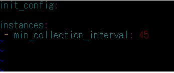

Your answers to the questions go here.

## Prerequisites - Setup the environment
My environment for this exercise is below :
  Vagrant Ubuntu VM 16.04 (xenial)
  Docker (Ubuntu 16.04), MySQL on the Vagrant

## Collecting Metrics:

* Add tags in the Agent config file and show us a screenshot of your host and its tags on the Host Map page in Datadog.

* Install a database on your machine (MongoDB, MySQL, or PostgreSQL) and then install the respective Datadog integration for that database.

### Following is the steps from installing MySQL to installing & confirming Datadog integration. (Karino)
### Install MySQL
>sudo apt-get update
>sudo apt-get install mysql-server

After MySQL is installed, take following steps on Dashboard.

Then give commands shown on Dashboards step by step.

### Create a datadog user in MySQL
>sudo mysql -e "CREATE USER 'datadog'@'localhost' IDENTIFIED BY 'nl7ZchKVbXCEHux(MXG5LbkF';"
>sudo mysql -e "GRANT REPLICATION CLIENT ON *.* TO 'datadog'@'localhost' WITH MAX_USER_CONNECTIONS 5;"
>sudo mysql -e "GRANT PROCESS ON *.* TO 'datadog'@'localhost';"
>sudo mysql -e "GRANT SELECT ON performance_schema.* TO 'datadog'@'localhost';"

### Verification
>mysql -u datadog --password='nl7ZchKVbXCEHux(MXG5LbkF' -e "show status" | \
grep Uptime && echo -e "\033[0;32mMySQL user - OK\033[0m" || \
echo -e "\033[0;31mCannot connect to MySQL\033[0m"
mysql -u datadog --password='nl7ZchKVbXCEHux(MXG5LbkF' -e "show slave status" && \
echo -e "\033[0;32mMySQL grant - OK\033[0m" || \
echo -e "\033[0;31mMissing REPLICATION CLIENT grant\033[0m"

You can see as below when it is successful.

>mysql -u datadog --password='nl7ZchKVbXCEHux(MXG5LbkF' -e "SELECT * FROM performance_schema.threads" && \
echo -e "\033[0;32mMySQL SELECT grant - OK\033[0m" || \
echo -e "\033[0;31mMissing SELECT grant\033[0m"
mysql -u datadog --password='nl7ZchKVbXCEHux(MXG5LbkF' -e "SELECT * FROM INFORMATION_SCHEMA.PROCESSLIST" && \
echo -e "\033[0;32mMySQL PROCESS grant - OK\033[0m" || \
echo -e "\033[0;31mMissing PROCESS grant\033[0m"

You can see as below when it is successful.

### Configure the Agent to connect to MySQL
1) create config file
>cd /etc/datadog-agent
>sudo vi conf.d/mysql.yaml

>---------------------------------
>init_config:
>
>instances:
>     - server: localhost
>       user: datadog
>       pass: nl7ZchKVbXCEHux(MXG5LbkF
>       tags:
>         - optional_tag1
>         - optional_tag2
>    options:
>      replication: 0
>      galera_cluster: 1
>---------------------------------

2) Restart the Agent
>   sudo systemctl stop datadog-agent
>   sudo systemctl start datadog-agent

3) Confirm Agent status
>  sudo datadog-agent status | grep 'mysql'

You can see as below when it is successful.

* Create a custom Agent check that submits a metric named my_metric with a random value between 0 and 1000.
### This is "my_metric" on Metric Explore.  

To create custom Agent Check, I prepared two files
  1) /etc/datadog-agent/checks.d/my_custom_check.py
  2) /etc/datadog-agent/conf.d/my_custom_check.yaml
>/etc/datadog-agent/checks.d/my_custom_check.py
>-----------------------------------------------
> from checks import AgentCheck
> from random import *
> class HelloCheck(AgentCheck):
>    　 def check(self, instance):
>     　 self.gauge('my_metric', randint(0,1000))
>-----------------------------------------------

* Change your check's collection interval so that it only submits the metric once every 45 seconds.
>/etc/datadog-agent/conf.d/my_custom_check.yaml
> -----------------------------------------------
>init_config:
>
>instances:
> - min_collection_interval: 45
>-----------------------------------------------

* **Bonus Question** Can you change the collection interval without modifying the Python check file you created?  
How about changing flush interval?  
https://docs.datadoghq.com/developers/faq/data-aggregation-with-dogstatsd-threadstats/

## Visualizing Data:
* Utilize the Datadog API to create a Timeboard that contains:

* Your custom metric scoped over your host.
* Any metric from the Integration on your Database with the anomaly function applied.
* Your custom metric with the rollup function applied to sum up all the points for the past hour into one bucket
* Please be sure, when submitting your hiring challenge, to include the script that you've used to create this Timeboard.  

<a href="api_a.py">--> This is the link for source code</a>

* Once this is created, access the Dashboard from your Dashboard List in the UI:  
I've created "My_Dashboard_1".  

----------------------------------------------------------
  

* Set the Timeboard's timeframe to the past 5 minutes  
Take a snapshot of this graph and use the @ notation to send it to yourself.     

* **Bonus Question**  What is the Anomaly graph displaying?  
Anomaly graph displays data that is different from regular one with comparing the data with regular values on the same time zone in past.
