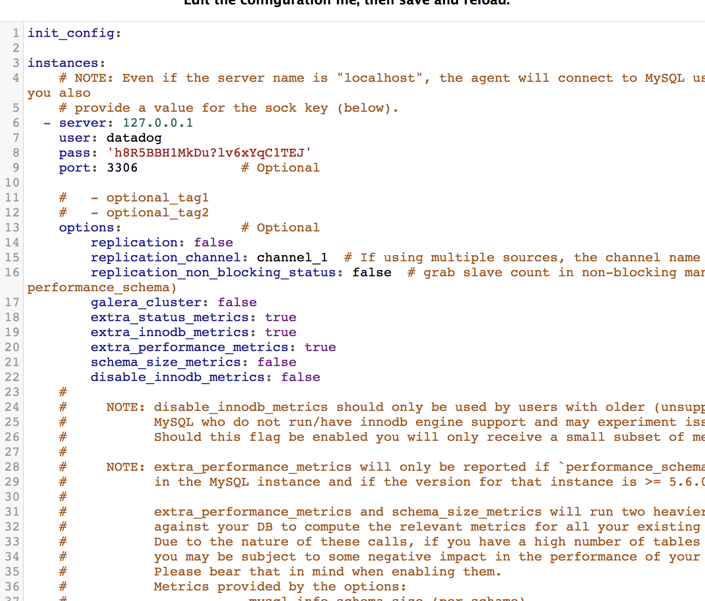

Your answers to the questions go here.

### You can utilize any OS/host that you would like to complete this exercise. However, we recommend one of the following approaches:

### You can spin up a fresh linux VM via Vagrant or other tools so that you don’t run into any OS or dependency issues. Here are instructions for setting up a Vagrant Ubuntu VM. We strongly recommend using minimum v. 16.04 to avoid dependency issues.
### You can utilize a Containerized approach with Docker for Linux and our dockerized Datadog Agent image.
### Then, sign up for Datadog (use “Datadog Recruiting Candidate” in the “Company” field), get the Agent reporting metrics from your local machine.


	-I chose to use both my local osx environment and a Vagrant + Virtual box envrionement to run datadog.

		-osx envrionment:
			-I first downloaded datadog into my local environment envrionment and ran it using the datadog icon located in my 'Applications' folder

		-you may also lauch datadog using the following commands:
			-datadog-agent launch-gui


	-Vagrant + Virtual box environment:

		-Did a fresh install into my ubuntu envrionment usind the following commands:

			- DD_API_KEY=YOUR_API_KEY bash -c "$(curl -L https://raw.githubusercontent.com/DataDog/datadog-agent/master/cmd/agent/install_script.sh)"
			- for the command, I replaced 'YOUR_API_KEY' with the API given to me by datadog
			- API key given: b4371073b027d86e3174258d84d52b8a


	-Starting datadog through the VM


### Add tags in the Agent config file and show us a screenshot of your host and its tags on the Host Map page in Datadog.

	-tags added in the datadog.yaml file


	-tags also added to the datadog UI


### Install a database on your machine (MongoDB, MySQL, or PostgreSQL) and then install the respective Datadog integration for that database.
	-I decided to instal MySQL server on my local osx machine and run the service


### Create custom agent

	-Ran the mysql service and ran the following commands to create user

		mysql> CREATE USER 'datadog'@'localhost' IDENTIFIED BY ‘h8R5BBH1MkDu?lv6xYqC1TEJ’;

	-Grant agent priveleges to collect metrics:
		mysql> ALTER USER 'datadog'@'localhost' WITH MAX_USER_CONNECTIONS 5; (since I am using SQL 8+)

	-Metric collected using the following commands:
		mysql> show databases like 'performance_schema';

	-Also, I configured the conf file under mysql.d to connect to datadog


### Create a custom Agent check that submits a metric named my_metric with a random value between 0 and 1000.

	-Metric collection in mysql.d/conf.yaml in local osx machine



```
	-In the conf.d folder, I created checkvalue.yaml
	-in checkvalue.yaml, I added the following code

			init_config:

			instances:
  				[{}]
```

  	-In checks.d, I created a checkvalue.py file and inserted the following python code:
```
  		from checks import AgentCheck
  		import random
			class HelloCheck(AgentCheck):
  				def check(self, instance):
   					self.gauge('my_metric2', random.randint(1,1000))
```
   -Below are the metrics summary. my_metric2 has been created


### Change your check's collection interval so that it only submits the metric once every 45 seconds.
### Bonus Question Can you change the collection interval without modifying the Python check file you created?

	-In the yaml file put the following statments:


### https://api.datadoghq.com/api/v1/dash?api_key=b4371073b027d86e3174258d84d52b8a&application_key=8a76ab889a96ef312cb024a9147b2e15500eb58d
Utilize the Datadog API to create a Timeboard that contains:

Your custom metric scoped over your host.
Any metric from the Integration on your Database with the anomaly function applied.
Your custom metric with the rollup function applied to sum up all the points for the past hour into one bucket
Please be sure, when submitting your hiring challenge, to include the script that you've used to create this Timeboard.

```
from datadog import initialize, api

options = {
    'api_key': 'b4371073b027d86e3174258d84d52b8a',
    'app_key': '8a76ab889a96ef312cb024a9147b2e15500eb58d'
}

initialize(**options)

title = "My Timeboard"
description = "An informative timeboard."

graphs = [{
    "definition": {
        "events": [],
        "requests": [
            {"q": "avg:system.mem.free{*}"}
        ],
        "viz": "timeseries"
    },
    "title": "Average Memory Free"
    },{


    "definition": {
        "events": [],
        "requests": [
            {"q": "anomalies(avg:mysql.performance.cpu_time{*}, 'basic', 3)"}
        ],
        "viz": "timeseries"
    },
    "title": "SQL Anomaly"
    },{


    "definition": {
        "events": [],
        "requests": [
            {"q": "my_metric{host:precise64}.rollup(sum,3600)"}
        ],
        "viz": "timeseries"
    },
    "title": "my_metric2 SUM UP"


    },
]


template_variables = [{

    "name": "host1",
    "prefix": "host",
    "default": "host:my-host"
}]

read_only = True
print(api.Timeboard.create(title=title,
                     description=description,
                     graphs=graphs,
                    read_only=read_only))


```


Set the Timeboard's timeframe to the past 5 minutes
Take a snapshot of this graph and use the @ notation to send it to yourself.


Bonus Question: What is the Anomaly graph displaying?

The Anomaly graph is showing the performance of the mysql database.


# Below is the email I received when the threshold has been reached


### Bonus Question: Since this monitor is going to alert pretty often, you don’t want to be alerted when you are out of the office. Set up two scheduled downtimes for this monitor:

### One that silences it from 7pm to 9am daily on M-F,
### And one that silences it all day on Sat-Sun.
### Make sure that your email is notified when you schedule the downtime and take a screenshot of that notification.
### Collecting APM Data:


### Given the following Flask app (or any Python/Ruby/Go app of your choice) instrument this using Datadog’s APM solution:

  - For this portion, I chose the middlewhere

  - did a pip install for necessary dependencies when running the script
```
pip install flask
pip install ddtrace
```
  - below is the configured code for the flask application

```
from flask import Flask
import logging
import sys

from ddtrace import tracer
from ddtrace.contrib.flask import TraceMiddleware

# Have flask use stdout as the logger
main_logger = logging.getLogger()
main_logger.setLevel(logging.DEBUG)
c = logging.StreamHandler(sys.stdout)
formatter = logging.Formatter('%(asctime)s - %(name)s - %(levelname)s - %(message)s')
c.setFormatter(formatter)
main_logger.addHandler(c)

app = Flask(__name__)
traced_app = TraceMiddleware(app, tracer, service="my-flask-app", distributed_tracing=False)

@app.route('/')
def api_entry():
    return 'Entrypoint to the Application'

@app.route('/api/apm')
def apm_endpoint():
    return 'Getting APM Started'

@app.route('/api/trace')
def trace_endpoint():
    return 'Posting Traces'


if __name__ == '__main__':
    app.run(host='0.0.0.0', port='8126')

```

  - when I checked my apm settings, it looks like it loaded incorrectly


  - I also configured my datadog.yaml file as seen below:

```

apm_config:
#   Whether or not the APM Agent should run
  enabled: true
#   The environment tag that Traces should be tagged with
#   Will inherit from "env" tag if none is applied here
  env: none
#   The port that the Receiver should listen on
  receiver_port: 8126
#   Whether the Trace Agent should listen for non local traffic
#   Only enable if Traces are being sent to this Agent from another host/container
  apm_non_local_traffic: false
#   Extra global sample rate to apply on all the traces
#   This sample rate is combined to the sample rate from the sampler logic, still promoting interesting traces
#   From 1 (no extra rate) to 0 (don't sample at all)
  extra_sample_rate: 1.0
#   Maximum number of traces per second to sample.
#   The limit is applied over an average over a few minutes ; much bigger spikes are possible.
#   Set to 0 to disable the limit.
  max_traces_per_second: 10
#   A blacklist of regular expressions can be provided to disable certain traces based on their resource name
#   all entries must be surrounded by double quotes and separated by commas
#   Example: ["(GET|POST) /healthcheck", "GET /V1"]
#   ignore_resources: []


```

### Bonus Question: What is the difference between a Service and a Resource?

  - A service is a script that runs a specific part of an application depending on what the service is and where is is located. It acts more of a dependency for the application. It is needed for the application to run depeding on how the business is ran.
  - A resource acts more an add-on for the application.


### Is there anything creative you would use Datadog for?
  - Since datadog is an anyltics based application, it can be used to track SLA's within a company.


### link to timeboard

### https://app.datadoghq.com/dash/924479/my-timeboard?live=true&page=0&is_auto=false&from_ts=1537929894187&to_ts=1537933494187&tile_size=m
