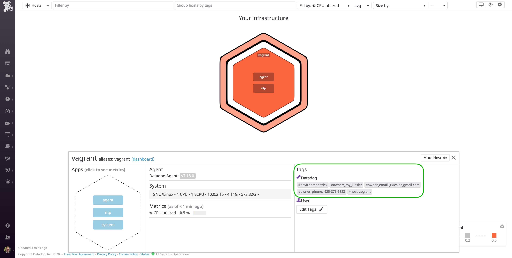

Your answers to the questions go here.

1) Linux VM
 

2) Host Tags

3) Database integration

4) Custom agent check: [my_metric script](my_metric.py)

5) Bonus: I can modify my_metric.yaml 

6) Timeboard: [Script](timeboard.py) 
https://app.datadoghq.com/dash/815645/my-timeboard?live=true&page=0&is_auto=false&from_ts=1526840882490&to_ts=1526844482490&tile_size=m

7) Past 5min

8) Bonus: It's displaying a metric's expected behavior based on historical data.

9) my_metric Monitor: [Monitor script](monitor.py)

10) Monitor notification

11) Bonus: Downtime scripts [Downtime_1](downtime.py) / [Downtime_2](downtime_2.py)

12) Custom Python app instrumentation: [Django app configuration](/apm/calendar/settings.py)

13) Bonus: A "Service" is the name of a set of processes that work together to provide a feature set. A "Resource" is a particular query to a service.

14) Dashboard link: https://app.datadoghq.com/dash/816030/apmagent-metrics?live=true&page=0&is_auto=false&from_ts=1526840602207&to_ts=1526844202207&tile_size=m

15) Fully instrumented app: [Python_app_script](/apm/calendar/views.py)

16) Final question: I would monitor robots at automated warehouses/factories.
