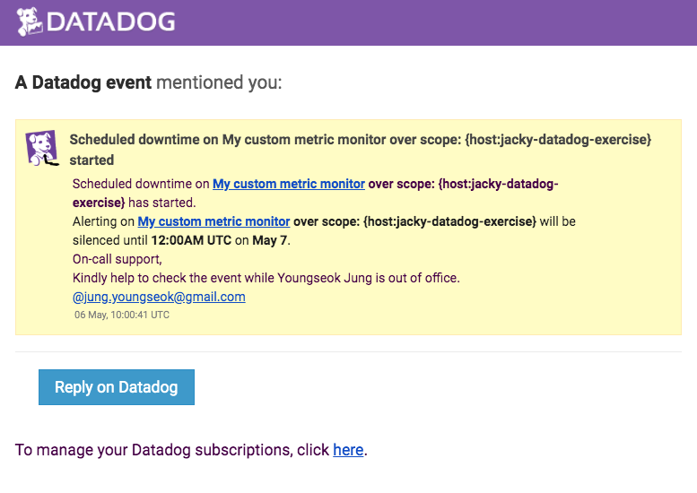

Your answers to the questions go here.

## 0. Prerequisites - Setup the environment
I have spun up Ubuntu 16.04(ubuntu/xenial64) via Vagrant and below is the screenshot of *#vagrant ssh*
0.vagrant_ssh.png


## 1. Collecting Metrics:
* Add tags in the Agent config file and show us a screenshot of your host and its tags on the Host Map page in Datadog.
Here's the host and its tags on the Host Map page.


Tags are added in [datadog.yaml](supporting-files/datadog.yaml)
```
tags: env:exercise, role:was
```

* Install a database on your machine (MongoDB, MySQL, or PostgreSQL) and then install the respective Datadog integration for that database.
I have Installed MySQL 5.7 and the below is the screenshot of MySQL Overview Dashboard


* Create a custom Agent check that submits a metric named my_metric with a random value between 0 and 1000.

The custom check can be generated by creating */etc/datadog-agent/checks.d/custom_jacky_metric.py* and */etc/datadog-agent/conf.d/custom_jacky_metric.yaml* . python script's filename(custom_jacky_metric.py) and yaml config's file name(custom_jacky_metric.yaml) must match. 

``` custom_jacky_metric.py
# the following try/except block will make the custom check compatible with any Agent version
try:
    # first, try to import the base class from old versions of the Agent...
    from checks import AgentCheck
except ImportError:
    # ...if the above failed, the check is running in Agent version 6 or later
    from datadog_checks.checks import AgentCheck
import random

# content of the special variable __version__ will be shown in the Agent status page
__version__ = "1.0.0"

class HelloCheck(AgentCheck):
    def check(self, instance):
        self.gauge('my_metric', random.randint(0,1000), tags=['role:custom_check'])
```

* Change your check's collection interval so that it only submits the metric once every 45 seconds.
I can acheive this by changing *min_collection_interval in custom_jacky_metric.yaml*
``` custom_jacky_metric.yaml
init_config:

instances:
  - min_collection_interval: 45
```

* **Bonus Question** Can you change the collection interval without modifying the Python check file you created?
You can change the interval via min_collection_interval in custom_jacky_metric.yaml or you can try adjusting the interval from Datadog portal(Metric - Summary - my_metric - Edit Interval in METADATA)


## 2. Visualizing Data:
Utilize the Datadog API to create a Timeboard that contains:

* Your custom metric scoped over your host.
* Any metric from the Integration on your Database with the anomaly function applied.
* Your custom metric with the rollup function applied to sum up all the points for the past hour into one bucket

The link to my Timeboard is https://app.datadoghq.com/dashboard/2up-6yx-uk5/jacky-timeboard-for-exercise
By executing the following python script, I was able to create the Timeboard.
``` timeboard.py
from datadog import initialize, api

options = {
    'api_key': '---',
    'app_key': '---'
}

initialize(**options)

title = "Jacky Timeboard for Exercise"
description = "Timeboard exercise in Visualizing Data."
graphs = [{
    "definition": {
        "events": [],
        "requests": [
            {"q": "avg:my_metric{host:jacky-datadog-exercise}"}
        ],
        "viz": "timeseries"
    },
    "title": "Average My metric"
},
{
      "definition": {
        "events": [],
        "requests": [
             {"q": "anomalies(avg:mysql.net.connections{*}, 'basic', 3)"},
        ],
        "viz": "timeseries"
    },
    "title": "Mysql connection Anomalies trend"
},
{
      "definition": {
        "events": [],
        "requests": [
            {"q": "sum:my_metric{host:jacky-datadog-exercise}.rollup(sum, 60)", "aggregator": "sum"},
        ],
        "viz": "query_value",
	"precision": 0
    },
    "title": "My metric Rollup Sum"
}]

template_variables = [{
    "name": "host1",
    "prefix": "host",
    "default": "host:my-host"
}]

read_only = True
api.Timeboard.create(title=title,
                     description=description,
                     graphs=graphs,
                     template_variables=template_variables,
                     read_only=read_only)
```

Please be sure, when submitting your hiring challenge, to include the script that you've used to create this Timeboard.
Once this is created, access the Dashboard from your Dashboard List in the UI:


* Set the Timeboard's timeframe to the past 5 minutes
We can adjust timeframe with shortcut(alt + ]) or selecting the timeframe from the graph(drag & drop).


* Take a snapshot of this graph and use the @ notation to send it to yourself.


* **Bonus Question**: What is the Anomaly graph displaying?
I have applied Anomaly graph on Mysql connection metric. The Anomaly graph shows the metric itself along with expected trend based on Anomaly detection algorithm. If unexpected behavior is detected, those metric values will be highlighted in different color(red). This helps operation engineers to detect abnormal behavior easily and quickly.

## 3. Monitoring Data

Since you’ve already caught your test metric going above 800 once, you don’t want to have to continually watch this dashboard to be alerted when it goes above 800 again. So let’s make life easier by creating a monitor.

Create a new Metric Monitor that watches the average of your custom metric (my_metric) and will alert if it’s above the following values over the past 5 minutes:

* Warning threshold of 500
* Alerting threshold of 800
* And also ensure that it will notify you if there is No Data for this query over the past 10m.

Please configure the monitor’s message so that it will:

* Send you an email whenever the monitor triggers.
* Create different messages based on whether the monitor is in an Alert, Warning, or No Data state.
* Include the metric value that caused the monitor to trigger and host ip when the Monitor triggers an Alert state.
* When this monitor sends you an email notification, take a screenshot of the email that it sends you.

Here's config to achieve the requirements.


After setting the Monitor for my_metric, I was able to get the email notifications.
Here's email notification for no data.


Here's email notification for warning.


Here's the email notification for alert. (I triggered TEST alert to check email message)


* **Bonus Question**: Since this monitor is going to alert pretty often, you don’t want to be alerted when you are out of the office. Set up two scheduled downtimes for this monitor:

  * One that silences it from 7pm to 9am daily on M-F,
  * And one that silences it all day on Sat-Sun.
  * Make sure that your email is notified when you schedule the downtime and take a screenshot of that notification.

We can achieve the requirements by setting Schedule Downtime. Here's the configuration.


The email notification for weekdays

The email notification for weekends 


## 4. Collecting APM Data:
Given the following Flask app (or any Python/Ruby/Go app of your choice) instrument this using Datadog’s APM solution:

```python
from flask import Flask
import logging
import sys

# Have flask use stdout as the logger
main_logger = logging.getLogger()
main_logger.setLevel(logging.DEBUG)
c = logging.StreamHandler(sys.stdout)
formatter = logging.Formatter('%(asctime)s - %(name)s - %(levelname)s - %(message)s')
c.setFormatter(formatter)
main_logger.addHandler(c)

app = Flask(__name__)

@app.route('/')
def api_entry():
    return 'Entrypoint to the Application'

@app.route('/api/apm')
def apm_endpoint():
    return 'Getting APM Started'

@app.route('/api/trace')
def trace_endpoint():
    return 'Posting Traces'

if __name__ == '__main__':
    app.run(host='0.0.0.0', port='5050')
```

* **Note**: Using both ddtrace-run and manually inserting the Middleware has been known to cause issues. Please only use one or the other.

For APM instrument, I ran the following
# DATADOG_SERVICE_NAME="Jacky Flask" ddtrace-run python flaskapp.py 2>&1 | tee flaskapp.log
This allow to execute the flaskapp.py with Datadog APM and print logs to stdout and write the logs into a log file(flaskapp.log). I've gathered the application logs to ship to Datadog Log Explore to see how it works.

I can see APM data from Datadog portal.

I can also see application logs from Datadog Log Explore.


* **Bonus Question**: What is the difference between a Service and a Resource?
A Resource is a particular action for a service. 
In this Flask example, the endpoints (/, /api/apm, /api/trace) are the resources to compose the Jacky Flask Service.

A Service is a set of processes that do the same job. We can say a Resource is a subset to compose a Service.

Provide a link and a screenshot of a Dashboard with both APM and Infrastructure Metrics.
Please include your fully instrumented app in your submission, as well.

Dashiboard with APM and Infrastructure monitoring
- https://app.datadoghq.com/dashboard/5ym-8x5-86y


## 5. Final Question:
Datadog has been used in a lot of creative ways in the past. We’ve written some blog posts about using Datadog to monitor the NYC Subway System, Pokemon Go, and even office restroom availability!

Is there anything creative you would use Datadog for?

