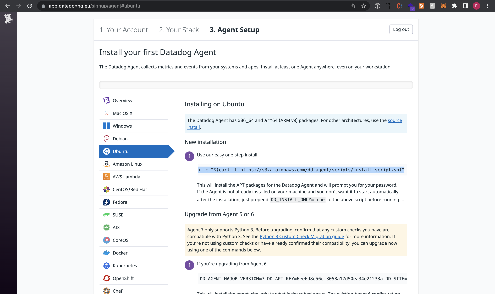

Your answers to the questions go here.

Level 1

* Sign up for Datadog (use "Datadog Recruiting Candidate" in the "Company" field), get the agent reporting metrics from your local machine.

* Bonus question: what is the agent?

The Agent collects events and metrics to send them back to DataDog for monitoring purposes. The agent has three components - the collector, dogstatsd, and the forwarder. The collector captures system metrics on a local machine like memory and CPU. The dogstatsd is a backend server that collects custom metrics from an app. The forwarder consolidates information from both the collector and dogstatsd to send to DataDog.

* Submit an event via the API.
* Get an event to appear in your email inbox (the email address you signed up for the account with)

