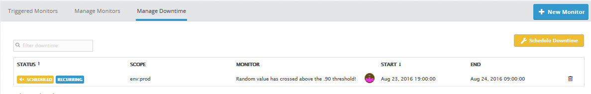

Your answers to the questions go here.

ScreenBoard link: https://p.datadoghq.com/sb/32f6d29a4-ef9b7ead37

Level 1:

A) What is the Agent?: 

The Agent is Python-based software that monitors and reports on a suite of performance metrics on host machines, supporting a growing list of integrations such as AWS and Cassandra. The Agent can deliver information on both standard and custom metrics, sending this data to Datadog for analysis and further action. More broadly, the Agent solves the problem of performance monitoring on a distributed system by providing information that, when combined via Datadog, paints a picture of how clusters of hosts are performing within the ecosystem. For example, if a group of hosts (with a shared tag) is showing historically low CPU usage, we might conclude that it would be more cost-effective to downgrade the computing capacity of those hosts, since the extra CPU power is unnecessary.

B) Screenshot for added tags:

C) Code for custom Agent check:

    import random
    from checks import AgentCheck

    class RandomCheck(AgentCheck):
        def check(self, instance):
            self.gauge('test.support.random', random.random())

Level 2:

A) Screenshot of ScreenBoard:

B) What is the difference between a timeboard and a screenboard?:

TimeBoards and ScreenBoards are the two types of dashboards available with Datadog. Both provide a graphical view into multiple metrics. The key difference is that all graphs on a TimeBoard are on the same time scale, whereas ScreenBoards are more flexible and can have graphs with different time frames. Additionally, while ScreenBoards can be shared as a whole and as a read-only entity or by individual graph, TimeBoard graphs can only be shared individually and annotated by hand. The use cases for TimeBoards and Screenboards are distinct. TimeBoards are generally more useful for taking a granular look at your suite of metrics over some fixed time frame in order to diagnose a problem. ScreenBoards, by contrast, are more favored for providing a higher-level view to multiple team members.

C) Screenshot of annotated graph:

Level 3:

A) Screenshot of Multi-Alert by Host Monitor:

B) Screenshot of monitor alert email:

C) Screenshot of scheduled downtime:

