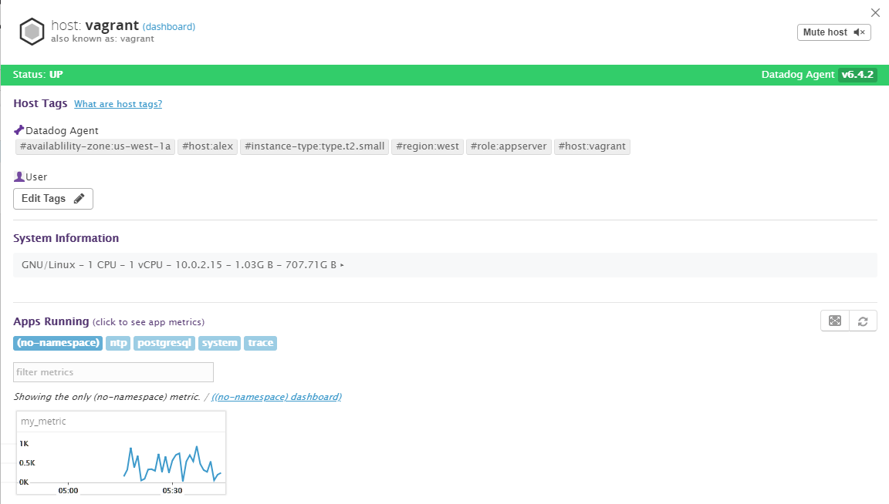

# Install

Open the `hiring-engineers` file and start Vagrent with the following command
```
vagrant up
```
Then log into the machine
```
vagrant ssh
```
Now install the Datadog
```
DD_API_KEY=0df5392e3fcf52b4ee65fef26c2f0cb7 bash -c "$(curl -L https://raw.githubusercontent.com/DataDog/datadog-agent/master/cmd/agent/install_script.sh)"
```

## Collecting Metrics:
* Add tags in the Agent config file and show us a screenshot of your host and its tags on the Host Map page in Datadog.


```
cp datadog.yaml /etc/datadog-agent/datadog.yaml
```
Then restart the agent
```
	sudo service datadog-agent restart
```
* Install a database on your machine (MongoDB, MySQL, or PostgreSQL) and then install the respective Datadog integration for that database.

Login to PostgreSQL
```
sudo -u postgres psql
```

Create Datadog user

```
create user datadog with password 'MktYwzriuIs98mQx4F4t5P5e';
grant SELECT ON pg_stat_database to datadog;
\q
```

* Create a custom Agent check that submits a metric named my_metric with a random value between 0 and 1000.


* Change your check's collection interval so that it only submits the metric once every 45 seconds.

Put `my_metric` files in their respective directories

```
sudo cp /vagrant/My_metric/my_metric.yaml /etc/datadog-agent/conf.d/
sudo cp /My_metric/my_metric.py /etc/datadog-agent/checks.d/
```

# Visualizing Data:
TimeBoard
```
python /vagrant/DataDogAPI/DataDogAPITimeBoard.py
```
Screenshot
```
python /vagrant/DataDogAPI/DataDogAPIScreenShoot.py
```

# Monitoring Data:
```
python /vagrant/DataDogAPI/DataDogAPIMonitor.py

```
* When this monitor sends you an email notification, take a screenshot of the email that it sends you.

# Collecting APM Data:
```
python /vagrant/DataDogAPI/DataDogAPM.py
```
# Final Question:
* Is there anything creative you would use Datadog for?

I want to collect data on parasites in standing fresh water. I want to see how conditions affect the population and patterns. Datadog would be great at aggregating data.
