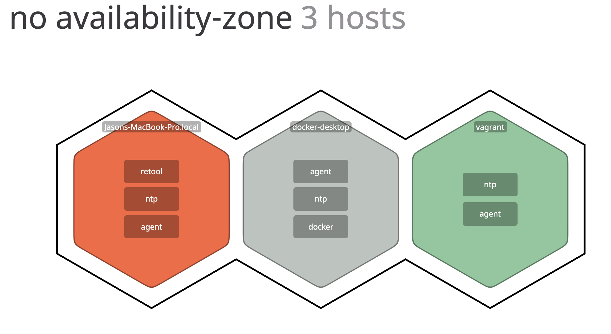
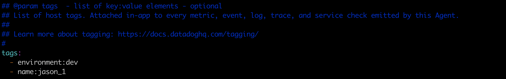
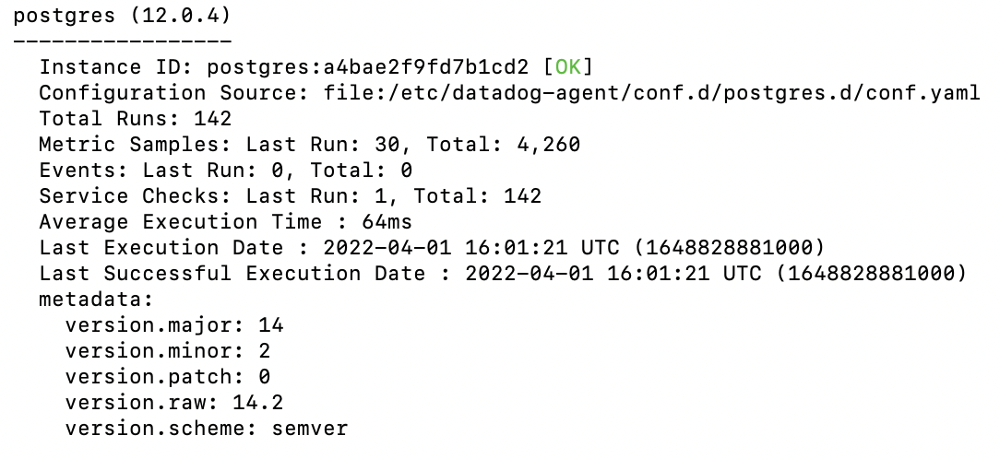
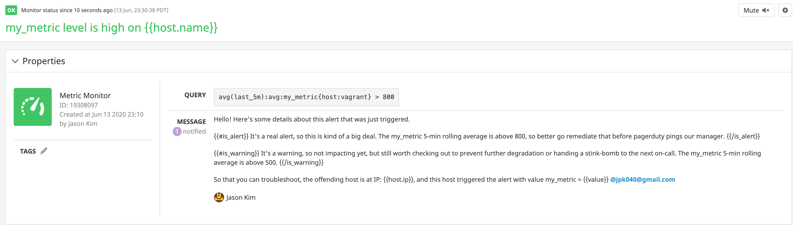
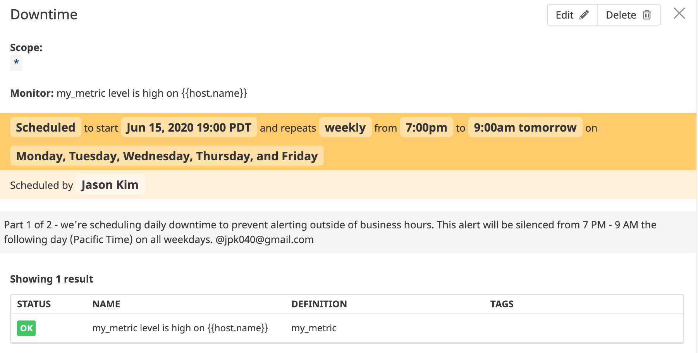

## Introduction

In this README, we'll walk through sample configuration to demonstrate four aspects of Datadog functionality:
- Collecting Metrics
- Visualizing Data
- Monitoring Data
- Datadog APM

Questions/feedback to author: Jason Kim, Sales Engineer (jpk040@gmail.com)
Last updated date: 15 June 2020

## Prerequisites - Setup the environment

Here's a screenshot of three hosts with the Datadog agent installed:
- localhost (OSX)
  - One-step install with `DD_AGENT_MAJOR_VERSION=7 DD_API_KEY=[YOUR_API_KEY] bash -c "$(curl -L https://raw.githubusercontent.com/DataDog/datadog-agent/master/cmd/agent/install_mac_os.sh)"`
- docker-desktop
  - One-step install with `DOCKER_CONTENT_TRUST=1 docker run -d --name dd-agent -v /var/run/docker.sock:/var/run/docker.sock:ro -v /proc/:/host/proc/:ro -v /sys/fs/cgroup/:/host/sys/fs/cgroup:ro -e DD_API_KEY=[YOUR_API_KEY] datadog/agent:7`
- vagrant (ubuntu 18.04)
  - One-step install with `DD_AGENT_MAJOR_VERSION=7 DD_API_KEY=[YOUR_API_KEY] bash -c "$(curl -L https://raw.githubusercontent.com/DataDog/datadog-agent/master/cmd/agent/install_script.sh)"`



## Collecting Metrics

### Add tags in the agent config file

We add tags to an agent (other than `host`) by modifying `/etc/datadog-agent/datadog.yaml` with this section:



And we can see the tags show on this agent:


### Install a database and integration

We install postgres on our vagrant host, create a postgres user for the agent to use as a means of access, and place those user and postgres connection details in `conf.d/postgres.d/conf.yaml`. Note that the postgres user created for this purpose needs the role `pg_monitor`:




### Create a custom agent check

To define a custom metric, we implement in two places:
- `/conf.d/custom_my_metric.yaml` contains initially a boilerplate placeholder:

```
instances: [{}]
```
(spoiler alert, this value will change later!)
- `/checks.d/custom_my_metric.py` contains an implementation of the metric value, in this case returned as a randomized `gauge` metric. By the way, other types of metric return types found [here](https://github.com/DataDog/datadog-agent/blob/6.2.x/docs/dev/checks/python/check_api.md#sending-metrics)

```
# the following try/except block will make the custom check compatible with any Agent version
try:
    # first, try to import the base class from new versions of the Agent...
    from datadog_checks.base import AgentCheck
except ImportError:
    # ...if the above failed, the check is running in Agent version < 6.6.0
    from checks import AgentCheck
    from random import randrange

# content of the special variable __version__ will be shown in the Agent status page
__version__ = "1.0.0"

class HelloCheck(AgentCheck):
    def check(self, instance):
        self.gauge('my_metric', randrange(1000), tags=['max_value:1000'])
```

### Changing check collection interval (with *Bonus* not modifying python file)

We modify collection interval by specifying a parameter in `/conf.d/custom_my_metric.yaml`, so that it now looks like this:

```
init_config:

instances:
  - min_collection_interval: 45
```

#### [Editor's note]
Interestingly, this seemed to change collection interval, but in an unclear way as the Metrics Explorer graph for my_metric adjusted from 20-second intervals to 40- or 60-second intervals. This seemed a little flaky:
- initial 20-second graphed interval didn't match default 15-second reporting interval
- subsequent 40- or 60-second graphed interval didn't match updated 45-second change
- seemed strange to have changing reporting interval, as the check itself doesn't seem to take enough time to account for this delay


To double-check that the change even implemented correctly, we can find that looking at the agent logs specifies the correct polling interval. TODO: maybe there's a better way to fine tune graphing granularity?


## Visualizing Data

Here's a Timeboard with three component widgets:
- Time series tracking custom defined agent metric `my_metric` on `host:vagrant`
- Time series tracking with anomaly range on `postgres.percent_usage_connections`
- A single value showing rollup sum of all `my_metric` values over the last 60 minutes

We can generate Timeboards via API - here's the code of a python script [datadog-timeboard.py](datadog-timeboard.py) used to generate the Timeboard via the `POST /dashboard` API endpoint:


Here's an email I sent to myself by @mentioning my user in the "send snapshot" comment field. The zoomed-in 5 min view was made by click-and-dragging on the parent un-re-sized graph.


*Bonus* - The Anomaly graph is showing a timeseries of the metric `postgres.percent_usage_connections` with a grey overlay showing the expected range of outcomes for a "non-anomalous" value. Non-anomalous is defined by a fit algorithm - which in this case was the `'basic'` parameter in the `anomalies()` function call and represented lagging rolling quantile computation - and a magnitude, specified by the `2` (standard deviations) parameter in `anomalies()`

## Monitoring DataDog

Here's a screenshot of the alert configuration we've set up:



And here's a screenshot of the email that we receive, in this case due to a Warning instance.


*Bonus* - in order to preserve our generous out-of-SLA silencing, we configure downtime windows where this monitor won't file any alerts. Here's the email record of the implementation:


And here's one of our actual downtime configurations:



## Collecting APM Data

Here's a [public link](https://p.datadoghq.com/sb/ugu7owlssk96eujv-9a8b36abf521ef4715aaaa39b77d8e5e) to a dashboard showing both APM (`flask.request_duration`) and infrastructure (host map of avg `system.cpu`)


No changes were made to the included flask app, which is included in this repo as [app.py](app.py) - changes in instrumentation were made via environment variable.

*Bonus* - difference between a Service and a Resource?
- A Service refers to a grouping of endpoints or actions that form a unit of related functionality - in this example, the entire flask server `app.py` is a service
- A Resource is a component of a Service that accomplishes a more granular individual action - in this example, each of the Flask endpoints defined such as `/api/apm` is a distinct Resource

## Final Question - creative uses

For a fun topic, it would be neat to pull (Strava Streams data)[https://developers.strava.com/docs/reference/#api-Streams] to track athletes on long-distance endurance races and forecast performance/alert on deviations of metrics such as speed/altitute covered.

For a more business-oriented topic - (Box Keysafe)[https://www.box.com/security/keysafe] is an encryption service offered by Box where customers can own and manage an AWS KMS Key used to govern encryption/decryption of their Box instance content. This separation of access control into two steps and two ecosystems reassures the customer, but it can be difficult for Box because of the lack ov visibility.
- The AWS KMS instance the customer spins up to manage their key is customer-owned and obfuscated away from Box, for security
- Box tries to maintain connectivity by doing a "pulse check" no-op ping on a frequent basis, but this is only a binary up/down metric
- Monitoring metrics on the AWS KMS instance could provide a customer's Box engineering contact with insight into performance of the underlying KMS service without opening the door to more compromising access
