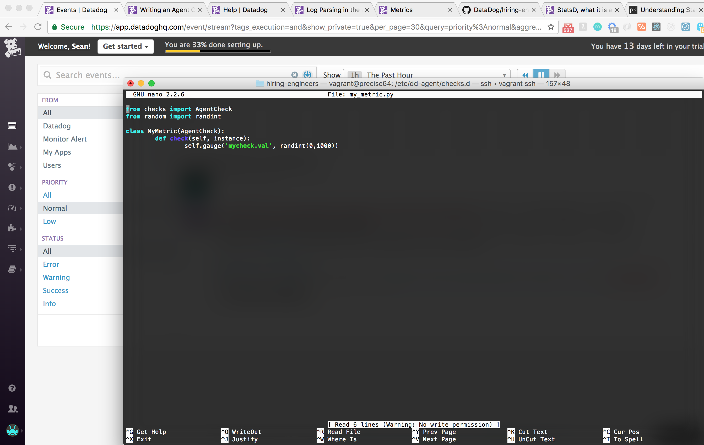

# Sean Clarke for Datadog :dog: :file_folder: - Solutions Engineer Technical Exercise

## Prerequisites - Setting Up the Environment

I created a Ubuntu 12.04 VM using [Vagrant](https://www.vagrantup.com/downloads.html) with [VirtualBox](https://www.virtualbox.org/wiki/Downloads). Once you've downloaded both of these onto your local system, you can follow the instructions: [here](https://www.vagrantup.com/intro/getting-started/) to get started.


### For reference, my setup flow:

  - Create clean Vagrant VM: `vagrant init hashicorp/precise64`

  - Start and Enter the VirtualBox: `vagrant up` & `vagrant ssh` respectively.

  - (*If necessary*) Resolve Guest Additions Mismatch: `vagrant plugin install vagrant-vbguest`

  - To Avoid Dependency Issues, Update & Upgrade All Local Packages: `sudo apt-get update apt-get upgrade`

  - Install Curl: sudo `apt-get install curl`

  - Install Datadog Agent: `DD_API_KEY=YOUR_API_HERE bash -c "$(curl -L https://raw.githubusercontent.com/DataDog/datadog-agent/master/cmd/agent/install_script.sh)"`

## Collecting Metrics

1. In order to modify the agent tags we need to access the config file. On Ubuntu this is found at:
`/etc/datadog-agent/datadog.yaml`.

*To find the spefic location for your system please refer to this [guide](https://docs.datadoghq.com/agent/basic_agent_usage/)*.

So we can simply run: `sudo nano /etc/datadog-agent/datadog.yaml` and modify the file as you see here: 

2. Database Install / Integration (Postgres) - 

3. Custom Agent - 

4. Collection Interval Set to 45 Seconds - 

5. BONUS QUESTION: Yes, in fact you can change the minimum collection interval of the check directly through the corresponding .yaml file. However, in the even the agent defines a value lesser, that value will take precedence.

Eg:
```
  init_config:
      min_collection_interval: 45

  instances:
      [{}]
```

## Visualizing Data

In order to utilize the API I created a python file to submit JSON to the API. The code is as follows:
```
from datadog import initialize, api

options = {
    'api_key': '04bc19c387c40c38952ccf650807ced2',
    'app_key': '81fb25b5736dd9c01c1a7c6e434cce868d9fbefe'
}

initialize(**options)

title = "Aint No Timeboard Like the Present"
description = "A timeboard of my_metrics."
graphs = [
  {
    "definition": {
      "events": [],
      "requests": [{
          "q": "anomalies(sum:postgresql.rows_returned{host:seanclarke.test}, 'basic', 2)"
      }],
      "viz": "timeseries"
  },
  "title": "Graph: Postgres"
},
{
  "definition": {
      "events": [],
      "requests": [{
          "q": "sum:mycheck.val{host:seanclarke.test}.rollup(sum,3600)"
      }],
      "viz": "timeseries"
  },
  "title": "Graph: My Metric (Rollup)"
}
]

read_only = True
api.Timeboard.create(title=title,
                   description=description,
                   graphs=graphs,
                   read_only=read_only)

```

1. Created Timeboard (Custom Metric + Anomaly Func. + Rollup Function) - 

2. Timeboard w/ 5 Minute Timeframe - 

3. Timeboard Email - 

4. BONUS QUESTION: The anomaly graph is used to display cases in which the metrics extend beyond the general accepted range. Essentially, in the event of an anomaly, or unusual behavior, the user will be able to track the occurance.

## Monitoring Data

1. Warning Threshold (500) - 

2. Alert Threshold (800) - 

3. No Data 10 Min+ - 

4. BONUS QUESTION:
  i) Weekday Downtime Email - 

  ii) Weekend Downtime Email - 

## Collecting APM Data

# In order to collect APM data, I proceeded through the steps above and then included the provided flask application as my_app.py in my root directory, and in another attempt my vagrant/ directory. Prior to this step I ran into a variety of issues with Pip, most expressly that the version of pip that comes installed on the VM is 1.0 (absolutely archaic). Because of this, Pip is unable to install much of anything, let alone update itself as PyPi has disabled non HTTPS access. The only manner that allowed me to work around this was to specify the target url in the install command itself and specify https as so:
`pip install -U pip -i https://pypi.python.org/simple/`
# Not only would this uninstall the old version of pip but it allowed me to install pip 9.0.1. I personally feel the community at large could benefit greatly from official documentation from Vagrant and VM regarding this- such a necessary solution shouldn't merely be limited to a lucky google search.

# Having solved this, I come to the point you see in the screenshot below, where-in my flask application is running but there is no response from the the Datadog application. To the best of my understanding, with port forwarding the host machine should be aware / have access to the processes of the VirtualMachine and yet such is not the case.

1. APM Enabled - 

2. DDtrace Running (No APM):
  i) 
  ii) 

3. Bonus Question: A service implies an orchestrated effort designed to accomplish a specific goal, wherein a resource might be used to aide in this goal or other efforts. By nature, a resource an is much more ancillary in nature while a service aims to provide a suite of resources with a targeted application.

## Final Question:

"A lover of all things music, I would love to work with a platform such as Soundcloud in perhaps providing artists will greater feedback regarding users interactions with their tracks. For instance: A timestamp at which point a song was paused to isolate portions of a song that could be improved upon (provided there is a highly concentrated portion)."
