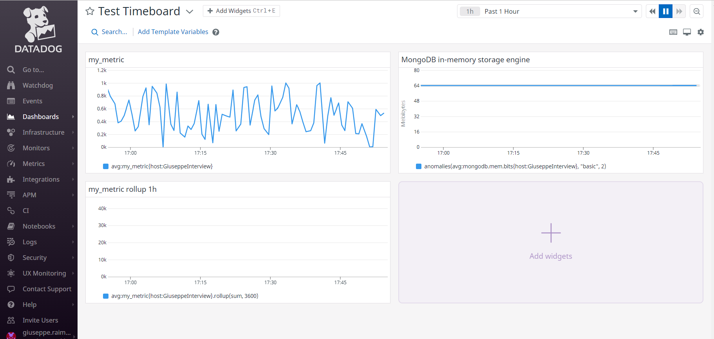
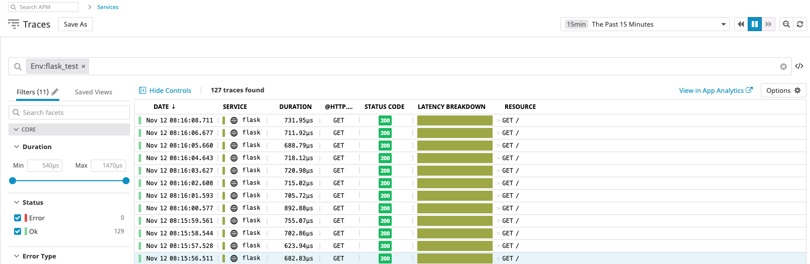

# **System Setup**

## Setting up vagrant

Download [Vagrant](https://www.vagrantup.com/downloads.html) and [Virtual Box](https://www.virtualbox.org/wiki/Downloads) from their respective websites and install them on your machine. Once this is completed, execute the following commands to create a vagrant directory, initialize the vagrant file using Ubuntu 16.04, and start the vagrant instance.

```bash
mkdir vagrant-test
cd vagrant-test
vagrant init ubuntu/bionic64
vagrant up
```

There should now be a Virtual Machine running Ubuntu 16.04 on your machine. You can access this machine via SSH with the following command:

```bash
vagrant ssh
```

## Setting up Datadog account

Create an account at [datadoghq.com](https://www.datadoghq.com/). Click the Get Started Free button on right side of the main menu bar. Fill out the required information and use `Datadog Recruiting Candidate` as the company name. Click Sign Up to complete the registration process.

## Installing the Datadog Agent

As part of the setup process when signing up for a Datadog account, you can choose your operating environment and follow the on screen directions to download and install a Datadog Agent on your machine.

NOTE: To get back to this screen or setup additional hosts, navigate to `Integrations > Agent` to get back to this screen.


Choose the Ubuntu option and it should provide a script with the following command to execute in your SSH session. Be sure to replace the `<API_KEY>` with your own provided by Datadog.

```bash
DD_API_KEY=<API_KEY> bash -c "$(curl -L https://raw.githubusercontent.com/DataDog/datadog-agent/master/cmd/agent/install_script.sh)"
```

Upon completion, the Datadog Agent will be running on your Virtual Machine.

**Congratulations!** You should now have a Datadog Agent sending metrics to Datadog!

# **Collecting Metrics**

## Adding custom tags

To create custom tags, we will be adding a configuration file to our Datadog Agent. Configuration files use a syntax call YAML, for more information on how to use YAML syntax please go [here](https://www.tutorialspoint.com/yaml/index.htm). The documentation on assigning custom tags can be found [here](https://docs.datadoghq.com/tagging/assigning_tags/?tab=go). To see a few other options of creating custom tags, please use the documenation [here](https://docs.datadoghq.com/tagging/).

We will create a new file called `datadog.yaml` and place it in the `/etc/datadog` folder.

```bash
sudo nano /etc/datadog-agent/datadog.yaml
```

Use `CTRL + C` followed by the `y` key to save the file.

We can use the tags property to create an array of KEY:VALUE pairs to represent our custom tags, see below for an example:

```yaml
tags:
  - custom_tag
  - env:test
  - role:exercise
```

Once this is completed, you can verify your custom tags have been created via the Host Map link in the Datadog UI. Navigate to `Infrastructure > Host Map` and click on your host to bring up the detail window. See the tags section on the right hand side. You can also edit your tags from this screen as well.


[Link to Host Map](https://app.datadoghq.com/infrastructure/map?fillby=avg%3Acpuutilization&sizeby=avg%3Anometric&groupby=availability-zone&nameby=name&nometrichosts=false&tvMode=false&nogrouphosts=true&palette=green_to_orange&paletteflip=false&node_type=host&host=901230548)

Using custom tags is extremely useful as it allows users to filter out unwanted hosts so they can get insight into exactly what they are looking for. For instance, we can filter by the `env:test ` tag to see all hosts for a given test environment. Adding second tag specific to an application and we can drill down even farther to see all test hosts for a specific application. Sky's the limit with custom tags!

## Installing MySQL Database

For full installation information, please go [here](https://support.rackspace.com/how-to/installing-mysql-server-on-ubuntu/).

Begin by getting the lastest updates and installing the mysql-server on your VM.

```bash
sudo apt-get update
sudo apt-get install mysql-server
```

Wait for the installer to finish and execute the following command to enter the mysql shell. This will start the shell as the `root` user and require the password. Since we did not setup the password during install, the password is empty so we can just hit enter when prompted to submit with an empty password.

```bash
/usr/bin/mysql -u root -p
```

Make sure to update the root password with your own password.

```bash
UPDATE mysql.user SET authentication_string = PASSWORD('<MAKE_YOUR_OWN_PASSWORD>') WHERE User = 'root';
FLUSH PRIVILEGES;
```

You should now have a running MySQL database on your VM!

## Creating Datadog Integration for MySQL

To create an integration for MySQL, navigate to `Integrations > Integrations` and click install on the MySql card. A Window should popup with instructions for creating your integration for MySQL. The window gives all the details to create your MySQL user for the datadog agent. Click the generate password button to have a password generated for you. This password is not stored so be sure to write it down or it will be lost.

Execute the given commands to create the user and give the proper permissions:

```bash
sudo mysql -e "CREATE USER 'datadog'@'localhost' IDENTIFIED BY '<PASSWORD>';"
sudo mysql -e "GRANT REPLICATION CLIENT ON *.* TO 'datadog'@'localhost' WITH MAX_USER_CONNECTIONS 5;"
```

*For the full metrics catalog, add these lines as well*

```bash
sudo mysql -e "GRANT PROCESS ON *.* TO 'datadog'@'localhost';"
sudo mysql -e "GRANT SELECT ON performance_schema.* TO 'datadog'@'localhost';"
```

To validate your new user was created properly, execute the following commands.

```bash
mysql -u datadog --password='<PASSWORD>' -e "show status" | \
grep Uptime && echo -e "\033[0;32mMySQL user - OK\033[0m" || \
echo -e "\033[0;31mCannot connect to MySQL\033[0m"
mysql -u datadog --password='<PASSWORD>' -e "show slave status" && \
echo -e "\033[0;32mMySQL grant - OK\033[0m" || \
echo -e "\033[0;31mMissing REPLICATION CLIENT grant\033[0m"
```

*If you added the full metrics permissions, execute these command as well*

```bash
mysql -u datadog --password='<PASSWORD>' -e "SELECT * FROM performance_schema.threads" && \
echo -e "\033[0;32mMySQL SELECT grant - OK\033[0m" || \
echo -e "\033[0;31mMissing SELECT grant\033[0m"
mysql -u datadog --password='<PASSWORD>' -e "SELECT * FROM INFORMATION_SCHEMA.PROCESSLIST" && \
echo -e "\033[0;32mMySQL PROCESS grant - OK\033[0m" || \
echo -e "\033[0;31mMissing PROCESS grant\033[0m"
```

You should see the following output if everything went well:

```bash
MySQL user - OK
MySQL grant - OK
```

*If you added the full metrics permissions, you should also see the following lines*

```bash
MySQL SELECT grant - OK
MySQL PROCESS grant - OK
```

After the user is successfully created, we can go ahead and configure the Datadog Agent to use that user to gather the metrics and send them back to Datadog.

To configure MySQL for the Datadog Agent, we will create a `config.yaml` file in the following directory `/etc/datadog-agent/conf.d/mysql.d/config.yaml`. Each integration has their own folder under the `/conf.d` directory for their own configurations.

```yaml
init_config:

instances:
  - server: localhost
    user: datadog
    pass: <PASSWORD>
    tags:
        - optional_tag1
        - optional_tag2
    options:
      replication: 0
      galera_cluster: 1
```

Notice we can also add custom tags here as well. If we have multiple databases for different environments, we can tag them with their environment (`env:test`) or more specifically by name to filter on their data later!

Once this is done we need to restart the Datadog Agent with the following command

```bash
sudo service datadog-agent restart
```

After that is completed we can verify the agent check has passed with the following command

```bash
sudo datadog-agent status
```

Under the checks section, you should see something similar to the following:

```bash
    mysql (1.7.0)
    -------------
      Instance ID: mysql:f123f0491286c61d [OK]
      Total Runs: 297
      Metric Samples: Last Run: 61, Total: 18,116
      Events: Last Run: 0, Total: 0
      Service Checks: Last Run: 1, Total: 297
      Average Execution Time : 43ms
```

Now that we have setup our integration, click the `Install Integration` button at the bottom of the Integration wizard to finish the process.

Your Datadog agent should now be sending metrics back to Datadog! You can verify and see your MySQL database metrics by navigating to `Dashboards > Dashboard List > MySQL - Overview`. This is a preset Dashboard provided by Datadog to view your MySQL metrics. You can also customize this dashboard or create your own.


## Custom Agent Check

To create a custom agent check, we will be writing a custom python script to send a random value to Datadog. We will then write a configuration file that will controll the collection interval.

NOTE: It is recommended to use the prefix `custom_` when naming custom checks to prevent any naming collisions with the preexisting Datadog Agent integrations.

The name of your python script should be unique and be prefixed with `custom_` as mentioned above. 

Create a python file in the following directory `/etc/datadog-agent/checks.d/custom_my_metric.py` and add the following code:

NOTE: We will be using the python random package the generate a random number between 0 and 1000 to simulate our metric.

```python
# import python random package
import random

# the following try/except block will make the custom check compatible with any Agent version
try:
    # first, try to import the base class from old versions of the Agent...
    from checks import AgentCheck
except ImportError:
    # ...if the above failed, the check is running in Agent version 6 or later
    from datadog_checks.checks import AgentCheck

# content of the special variable __version__ will be shown in the Agent status page
__version__ = "1.0.0"


class MyMetric(AgentCheck):
    def check(self, instance):
        self.gauge('my_metric', random.randint(0, 1000))
```

After that is compeleted, create the configuration file in `/etc/datadog-agent/conf.d/custom_my_metric.yaml`

Add the following code to create a minimum collection interval of 45 seconds:

```bash
init_config:

instances:
  - min_collection_interval: 45
```

This does not guarantee our check runs every 45 seconds, but the agent will try at least every 45 seconds. If there are other processes in front of it, the check may have to wait in line or if the check takes longer than 45 seconds to run, it will skip over the next iteration. For more information on custom checks please go [here](https://docs.datadoghq.com/developers/write_agent_check/?tab=agentv6).

We can then validate that the custom metric is configured properly with the following command:

```bash
sudo -u dd-agent -- datadog-agent check custom_my_metric
```

You can also see the logs to verify the call is working as well:

NOTE: There may be a message stating that logs will only occur after each 20 runs, for 45 seconds that would be roughly every 15 minutes.

```bash
cat /var/log/datadog/agent.log  | grep custom_my_metric
```

Output

```
2019-03-24 02:06:51 UTC | INFO | (pkg/collector/runner/runner.go:264 in work) | Running check custom_my_metric
2019-03-24 02:06:51 UTC | INFO | (pkg/collector/runner/runner.go:330 in work) | Done running check custom_my_metric
2019-03-24 02:21:52 UTC | INFO | (pkg/collector/runner/runner.go:264 in work) | Running check custom_my_metric
2019-03-24 02:21:52 UTC | INFO | (pkg/collector/runner/runner.go:330 in work) | Done running check custom_my_metric
2019-03-24 02:36:51 UTC | INFO | (pkg/collector/runner/runner.go:264 in work) | Running check custom_my_metric
2019-03-24 02:36:51 UTC | INFO | (pkg/collector/runner/runner.go:330 in work) | Done running check custom_my_metric
2019-03-24 02:51:52 UTC | INFO | (pkg/collector/runner/runner.go:264 in work) | Running check custom_my_metric
2019-03-24 02:51:52 UTC | INFO | (pkg/collector/runner/runner.go:330 in work) | Done running check custom_my_metric
```

## Bonus Question

> Can you change the collection interval without modifying the Python check file you created?

I believe this is a trick question as the collection interval is created in the configuration YAML file and not the Python script. So technically, yes. You can change the collection interval by modifying the YAML file, not the Phython check file.

# **Visualizing Data**

## Timeboard

Make sure that python is installed on your machine as well as the Python package installer:

```bash
sudo apt-get install python
sudo apt-get install python-pip
```

Once this is completed install the Datadog python package:

```bash
pip install datadog
```

We can create timeboards via the [Datadog API for Dashboards](https://docs.datadoghq.com/api/?lang=python#dashboards)

We will modify the example request to look like the following script to call the Datadog API to create our timeseries dashboard:

```python
from datadog import initialize, api

options = {
    'api_key': '<API_KEY>',
    'app_key': '<APP_KEY>'
}

initialize(**options)

title = 'Example Timeboard'

widgets = [{
    'definition': {
        'type': 'timeseries',
        'requests': [
          {'q': 'avg:my_metric{host:verbanic-exercise}'}
        ],
        'title': 'my_metric over verbanic-exercise host'
    }
},{
    'definition': {
        'type': 'timeseries',
        'requests': [
          {'q': 'sum:my_metric{*}.rollup(sum,3600)'}
        ],
        'title': 'my_metric rollup over last hour'
    }
},{
    'definition': {
        'type': 'timeseries',
        'requests': [
          {'q': 'anomalies(avg:mysql.performance.cpu_time{*}, "basic", 2)'}
        ],
        'title': 'MySql cpu_time Anomalies'
    }
}]

layout_type = 'ordered'

description = 'An example timeboard for technical exercise.'

api.Dashboard.create(title=title,
                     widgets=widgets,
                     layout_type=layout_type,
                     description=description)
```

The `widgets` variable will hold an array of objects that maps to each dashboard widgets to be created.

1) The first will run the average of my_metric for my host using the following request `avg:my_metric{host:verbanic-exercise}`

2) The second will run the sum of my_metric for all hosts and rollup using the rollup function with a summation over the last 3600 seconds or 1 hour using the following request `sum:my_metric{*}.rollup(sum,3600)`

3) The third will run the anomalies function for the average of mysql.performance.cup_time for all hosts using the basic algorithm for a deviation of 2 using the following request `anomalies(avg:mysql.performance.cpu_time{*}, "basic", 2)`

NOTE: Since we are using a test environment, the cpu_time metric has enough activity to provide a good picture on the anomaly graph, this can be see on the [MySQL - Overview Dashboard](https://app.datadoghq.com/dash/integration/12/mysql---overview?tile_size=m&page=0&is_auto=false&from_ts=1553394300000&to_ts=1553397900000&live=true)

To verify the dashboard is created succesfully we can navigate to the Dashboards section and click on our new Dashboard `Example Dashboard`.


[Link to Timeboard](https://app.datadoghq.com/dashboard/j6m-vja-4af/example-timeboard?tile_size=l&page=0&is_auto=false&from_ts=1553382720000&to_ts=1553397120000&live=true)


## Set Timeboard Timeframe to Last 5 Minutes

To change the timeframe to the last 5 minutes, we can use the shortcut keys of `Ctrl + [` and `Ctrl + ]` to zoom in and out on the time range or click and drag on any graph to select the desired timeframe.


[Link to Timeboard last 5 minutes](https://app.datadoghq.com/dashboard/j6m-vja-4af/example-timeboard?tile_size=l&page=0&is_auto=false&from_ts=1553394534217&to_ts=1553394839595&live=false)

## Send a Snapshot

To create the snapshot and send a notification, click on the camera icon on the desired graph, type a message and use the `@` annotation to select the desired recipient. They will receive an email notificaiton with the message and a snapshot of the graph.


## Bonus Question

> What is the Anomaly graph displaying?

The anomaly graph will display a grey band that is the expected behavior with respect to past data. Any metrics that go beyond this expected range will be considered an "anomaly" and displayed as such on the graph. 

# **Monitoring Data**

## Setup Monitoring

To create a Monitor, navigate to the Monitors section and click on New Monitor. Follow the 4 easy steps on the wizard. 

Here is an example message to create custom wording for each of the event types:

```
{{#is_warning}}
WARNING! The my_metric threshold is above {{warn_threshold}} at {{value}}
{{/is_warning}} 

{{#is_alert}}
ALERT! The my_metric threshold is above {{threshold}} at {{value}}
{{/is_alert}} 

{{#is_no_data}}
NO DATA FOUND!
{{/is_no_data}} 

Host {{host.name}} ({{host.ip}}) has triggered this message.

 @verbanicm@gmail.com
```

After clicking the save button a few seconds later, a notification should be received for the my_metric monitor.


Montoring is one of the most important features of Datadog. We can create custom alerts and message to provide detailed information to end users to troubleshoot and maintain the stability of their products.

## Bonus Question

>Since this monitor is going to alert pretty often, you don’t want to be alerted when you are out of the office. Set up two scheduled downtimes for this monitor:
> * One that silences it from 7pm to 9am daily on M-F,
> * And one that silences it all day on Sat-Sun.
> * Make sure that your email is notified when you schedule the downtime and take a screenshot of that notification.

This is an extremely nice feature, especially since I currently have this issue myself with my currently employer. Setting these up is extremely easy and took no time at all!

Here is the screenshot displaying the notification for setting up the weekday downtime:


Here is the screenshot for displaying the notification for setting up the weekend downtime:


Also, since I am completing this on the weekend, I got the alert that the downtime has started:


# **Collecting APM Data**

## Implementing APM

To use APM with Python, we can download and install the Datadog Trace agent using pip. Then use a simple command to execute the python code with our trace agent monitoring the application.

```bash
pip install ddtrace
ddtrace-run python flask_app.py
```

We can use the example application provided for our testing purposes:

```python
from flask import Flask
import logging
import sys

# Have flask use stdout as the logger
main_logger = logging.getLogger()
main_logger.setLevel(logging.DEBUG)
c = logging.StreamHandler(sys.stdout)
formatter = logging.Formatter('%(asctime)s - %(name)s - %(levelname)s - %(message)s')
c.setFormatter(formatter)
main_logger.addHandler(c)

app = Flask(__name__)

@app.route('/')
def api_entry():
    return 'Entrypoint to the Application'

@app.route('/api/apm')
def apm_endpoint():
    return 'Getting APM Started'

@app.route('/api/trace')
def trace_endpoint():
    return 'Posting Traces'

if __name__ == '__main__':
    app.run(host='0.0.0.0', port='5050')
```

To simulate traffic, we can run the following script to call the `/api/apm` endpoint every second forever. To exit the process press `CTRL + C`.

```bash
while(true); do curl localhost:5050/api/apm; sleep 1; done;
```

We can see our APM data if we go to `APM > Services > flask`



We can also see a specific trace for a given request


We can also create custom dashboards to show two different types of data like APM data and Infrastructure data. Below we created a dashboard for APM data showing request hits and request durations and infrastructure data to show our CPU idle time and our network bytes received.

To create this dashbaord navigate to `Dashboards > New Dashboard`, provide a name and select New Timeboard.

You can drag the timeseries widget down to the dashboard and modify the values in the popup to reflect the data and calulations you want to see. As seen previously, you can also use the Datadog API to create your dashboards as well!


[Link to APM and Infra Board](https://app.datadoghq.com/dashboard/dc9-eux-eha/apm-and-infra-board?tile_size=m&page=0&is_auto=false&from_ts=1553399700000&to_ts=1553403300000&live=true)

## Bonus Question

> What is the difference between a Service and a Resource?

A service is a set of processes that do the same job. A resource is a particular action for a service.

For example, a Web Application is a service and a rest endpoint `/api/test` is a resource. A Database is a service and a query is a resource.

# **Final Question**

> Datadog has been used in a lot of creative ways in the past. We’ve written some blog posts about using Datadog to monitor the NYC Subway System, Pokemon Go, and even office restroom availability! 

> Is there anything creative you would use Datadog for?

Tesla can install the Datadog Agent in their cars to report metrics to their dashboards. They can create custom metrics to determine the health of users cars and if something is wrong a metric alert can send a web hook to a custom application that will send the driver a notification that they need to bring their car in for service. Furthermore, they can aggregate the number of issues or failures to show common trends and patterns for their cars to see if there is a more common issue is occuring they can implement a wide spread recall. They can also report metrics when the drivers are using the self driving feature to montior how often and when the self driving feature is used. This could be done for any number of metrics they wish to report for their vehicles, the number of time batteries run out of charge, every time a driver is charging at a super charge station versus at home, etc.