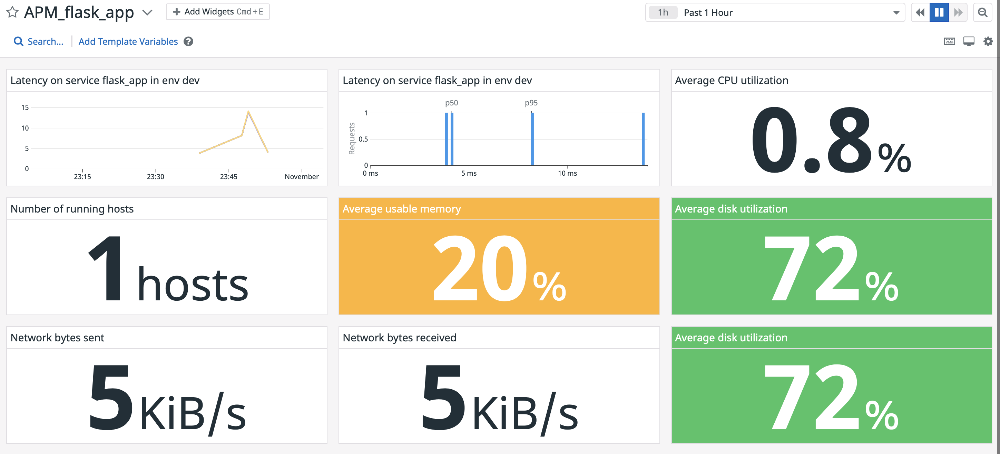

Your answers to the questions go here.
*Add tags in the Agent config file and show us a screenshot of your host and its tags on the Host Map page in Datadog.*


*Can you change the collection interval without modifying the Python check file you created?*
Yes, using the YAML configuration file

*Please be sure, when submitting your hiring challenge, to include the script that you've used to create this Timeboard.*
The script, also present in the file `timeboard.sh`, is made using curl:

```
curl -X POST "https://api.datadoghq.eu/api/v1/dashboard" \
-H "Content-Type: application/json" \
-H "DD-API-KEY: ${DD_API_KEY}" \
-H "DD-APPLICATION-KEY: ${DD_APP_KEY}" \
-d @- << EOF
{"title":"Timeboard",
"description":"",
"widgets":[
    {"definition":{
        "title":"my_metric",
        "title_size":"16",
        "title_align":"left",
        "show_legend":true,
        "legend_layout":"auto",
        "legend_columns":["avg","min","max","value","sum"],
        "time":{},
        "type":"timeseries",
        "requests":[{"formulas":[{"formula":"query1"}],
        "queries":[{"query":"avg:my_metric{*} by {host}","data_source":"metrics","name":"query1"}],
        "response_format":"timeseries",
        "style":{"palette":"dog_classic","line_type":"solid","line_width":"normal"},"display_type":"line"}],
        "yaxis":{"include_zero":true,"scale":"linear","label":"","min":"auto","max":"auto"},
        "markers":[]
        }
    },
    {"definition":
        {
        "title":"mysql_anomalies",
        "title_size":"16",
        "title_align":"left",
        "show_legend":true,
        "legend_layout":"auto",
        "legend_columns":["avg","min","max","value","sum"],
        "time":{},
        "type":"timeseries",
        "requests":[
            {
                "formulas":[{"formula":"anomalies(query1, 'basic', 2)"}],
                "queries":[{"data_source":"metrics","name":"query1","query":"avg:mysql.net.connections{*}"}],
                "response_format":"timeseries",
                "on_right_yaxis":false,
                "style":{"palette":"dog_classic","line_type":"solid","line_width":"normal"},"display_type":"line"}
        ],
        "yaxis":{"scale":"linear","include_zero":true,"label":"","min":"auto","max":"auto"},
        "markers":[]
        }
    },
    {"definition":{"title":"my_metric_rollup","title_size":"16",
        "title_align":"left",
        "show_legend":true,
        "legend_layout":"auto",
        "legend_columns":["avg","min","max","value","sum"],
        "time":{},
        "type":"timeseries",
        "requests":[{"formulas":[{"formula":"query1"}],
        "queries":[{"data_source":"metrics","name":"query1","query":"avg:my_metric{*}.rollup(sum, 3600)"}],
        "response_format":"timeseries",
        "style":{"palette":"dog_classic","line_type":"solid","line_width":"normal"},"display_type":"line"}],
        "yaxis":{"scale":"linear","include_zero":true,"label":"","min":"auto","max":"auto"},
        "markers":[]
        }
    }
],
"template_variables":[],
"layout_type":"ordered",
"is_read_only":false,
"notify_list":[],
"reflow_type":"auto"
}
EOF
```


*What is the Anomaly graph displaying?*
The anomaly graph is displaying a confidence interval indicating the expected range in which a data is considered generated by the process monitored in its "normal" mode.

*When this monitor sends you an email notification, take a screenshot of the email that it sends you.*


*Make sure that your email is notified when you schedule the downtime and take a screenshot of that notification.*


*What is the difference between a Service and a Resource?*
A service will perform an action / is akin to a function call whereas a resource is object-like, like some data to retrieve.

*Provide a link and a screenshot of a Dashboard with both APM and Infrastructure Metrics.*


https://p.datadoghq.eu/sb/449c0ec0-3668-11ec-bc8d-da7ad0900005-3b82b9568b11fdb00598c8c366f011a8

*Datadog has been used in a lot of creative ways in the past. We’ve written some blog posts about using Datadog to monitor the NYC Subway System, Pokemon Go, and even office restroom availability!
Is there anything creative you would use Datadog for?*

May be I could try using Datadog to monitor some connected utilities: a smart TV and its usage, a fridge to monitor my eating tendencies or a enterprise coffee machine to know if its working.
