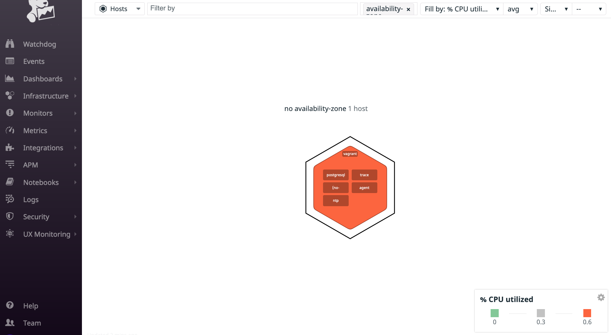
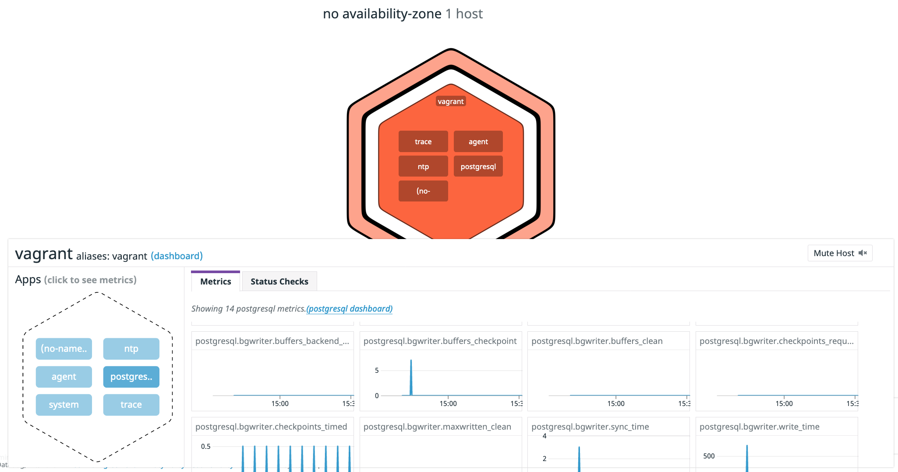
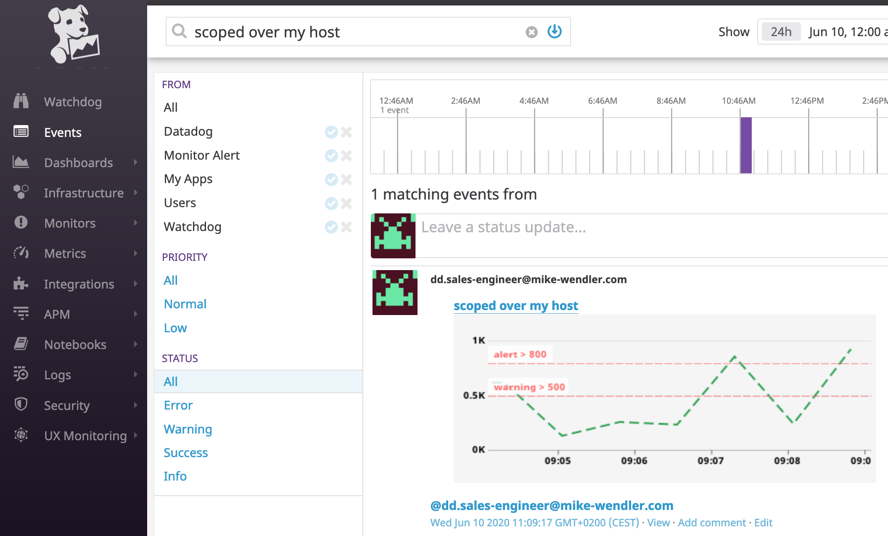

Sales Engineer Candidate Tech Excercise - Mike Wendler (`dd.sales-engineer@mike-wendler.com`)

This is a short demo of a tiny subset of Datadogs functionality to give you a glimpse of what it can do to support you with _operational visibility_ (helping you see what's going on inside your infrastructure and applications).


_Content_
* [Prerequisites](#prerequisites)
* [Setup](#setup)
* [I. Collecting Metrics](#i.-collecting-metrics)
* [II. Visualizing Data](#i.-visualizing-data)
* [III. Monitoring Data](#i.-monitoring-data)
* [IV. Collecting APM Data](#i.-collecting-apm-data)
* [Final Question](#final-question)


# Prerequisites

You should have the following:
* a MacOS or Linux computer
 * git, curl, and a terminal window installed
 * the basic skills to know how to handle those
* an Internet connection
* half an hour or so of quiet time
* fun trying new things

## Setup


**1)** Datadog separates accounts into 2 _sites_ : `eu` for countries in the European Union, `com` for all others. So now type either `https://www.datadoghq.com/` or `https://www.datadoghq.eu/signup` into your browser URL and sign up for an account.
 (In the registration window you could still choose the other _site_
 but once you created your account there is no way back!)

 Once you are logged in please get your [_API key_](https://datadoghq.eu/account/settings#api) which you'll need in a moment.
 While you are at it please create an _Application Key_ which we'll need for _visualizing data_ a little further down the road.

**2)** Next step is to install Vagrant. (This is just one of [a dozen of possible integration options](https://datadoghq.eu/account/settings#agent), but probably the cleanest and easiest to start with as it offers good isolation from all other processes running on your host and thus is less error prone).

Please follow the [instructions](https://www.vagrantup.com/intro/getting-started/install) specific for your target machine to install vagrant. Once done please type `vagrant version` in a terminal window which should result in something like this:


**3)**  Now clone [this repo](https://github.com/m-wendler/hiring-engineers)
(`git clone git@github.com:m-wendler/hiring-engineers.git`) as this comes preconfigured with a handful of files making it easy to spin up a _vagrant box_ with all the required software:

* the datadog agent
* a postgresql database
* a custom check to showcase a custom metric
* a flask app for showcasing APM along with a short program making a few API requests to simulate traffic

(check out branch `solutions-engineer` please).

**4)** Configure your Setup:
Remember your Datadog API key from earlier? Please put this into [setup/config/datadog.yaml] line 10 and [setup/provision.sh] line 3.

**5)** Spin up your host:

Change to the directory `setup` which contains the [_Vagrantfile_]. This describes Vagrant how to spin up a new virtual machine and provision it with all the required artefacts.
Type `sudo vagrant up` in your terminal window and watch the output scrolling down as Vagrant does its work (which might take a few moments).

If this finishes without an error message you can validate that everything is in place:

* `sudo vagrant status` which should show something like 

* Now let's peep inside of the VM with `sudo vagrant ssh` which should greet you with `vagrant@vagrant:~$`.

This is where we'll look at for the _source_ of the data (from the vagrant host and its running applications/services) which is _visualized_ in Datadog. So these are like 2 sides of a coin ...
let's get to it!

## I. Collecting Metrics

### tags

Head over to [_Infrastructure/Host Map_](https://datadoghq.eu/infrastructure/map?fillby=avg%3Acpuutilization&sizeby=avg%3Anometric&groupby=availability-zone&nameby=name&nometrichosts=false&tvMode=false&nogrouphosts=true&palette=green_to_orange&paletteflip=false&node_type=host) to see your host (the orange hexagon) and the applications running on it (the rectangles within the hexagon):



You can click on the hexagon to see more details about your host:


e.g. the custom tags that we defined in the agent's TODO [configuration file] (lower right corner).

To see this at the source please go back to your terminal window where you _ssh_ d into your host (remember the `vagrant@vagrant:~$` prompt?) and type

`sudo datadog-agent status`

which should result in ~ 300 lines of output. Searching for `host tags` shows you:


These are exactly the tags shown in the host details above.

_What are tags good for actually?_ They really come in handy once you have a sizable collection of hosts and apps/services from dozens of teams in different locations (think region/availabilty zones). Tags help you to _categorize_ your artefacts and help you to find them easier in Datadog and to _slice and dice_ your graph queries.
Here is [more about it](https://docs.datadoghq.com/getting_started/tagging/) but the basic recommendation is: tags are cheap, so use them freely (without going over board: each tag should have a precise meaning within your company).


### Integrations

Coming back to the host map (detail) view above with the host hexagon in the bottom left corner.
You can see more details about the apps running on the host by clicking on one of the rectangles depicted them in the hexagon in the bottom left corner.

E.g. details of the postgres server:



Datadog shows 10 postgres metrics graphs in the details pane ... but how?

Technically the agent running on the host needs to get access to the software it wants to monitor, which is done by [_integrating_](https://docs.datadoghq.com/getting_started/integrations/) it. This process is specific to the target software, but luckily Datadog currently supports more than 400 of those and describes how to integrate them in detail. (And if you happen to want to integrate an hitherto unsupported one it describes in detail [how to do that](https://docs.datadoghq.com/developers/integrations/new_check_howto/?tab=configurationfile) as well! So you are covered pretty well).

Let's look at our use case: head to _Integrations/Integrations_ and search for `postgres`:


Clicking on this tile gets you to the [Postgres Integration](https://datadoghq.eu/account/settings#integrations/postgres) description page.

I did everything for you by the Vagrant provisioning:
* provided a postgres specific `conf.yaml` file which gets copied to the agent's directory /etc/datadog-agent/conf.d/postgres.d/
* create a database user with enough permissions to read stats data from postgres.

(BTW: you may notice that I hardcoded the database user's password in here. Maybe good enough for a demo, but please don't do this in production.)

To check that the integration works on the host look at the agent status again in the terminal window (`sudo datadog-agent status`) and search for `postgres`:


The green `OK` signals success here. And `Metric Samples` proves that the agent sent metrics to Datadog.

### Custom metric checks

By now you know how to see the details of this app in Datadog, right?
(Like for postgres above: in the host map detail view click on the rectangle of our custom `my_check` - which is confusingly named though)


You also find the metric by searching for it in the [_Metrics Summary_](https://datadoghq.eu/metric/summary?filter=my_ch):


To [write a custom agent check](https://docs.datadoghq.com/developers/write_agent_check/?tab=agentv6v7#custom-agent-check) we need 2 files:
* a _configuration_ file: `custom_my_check.yaml`, which changes the `min_collection_interval` from the default `15` to `45`.

```yaml
# configuration for the custom check
init_config:

instances:
  # set to 45 (default 15)
  - min_collection_interval: 45
```

* and the actual _check_ file `custom_my_check.py`, which generates a random integer value between `0` and `1000` everytime it is called and sends this with the _metric name_ `my_check`.  

```Python
# a custom check that emits a random value

try:
	from datadog_checks.base import AgentCheck
except ImportError:
	from checks import AgentCheck

import random

__version__ = "1.0.0"

class MyCheck(AgentCheck):
	def check(self, instance):
		metric = random.randrange(1, 1000)
		self.gauge('my_check', metric, tags=['type:check'])
```

(both files MUST have the same _simple_ file name - the file name extension can be different though. This file name is also the _check name_ that the agent uses)

Speaking of _names_: Please bear in mind that a (custom) check (possibly) deals with 2 different kinds of names (which can be confusing):
* the _check_ name, in our case `custom_my_check`.  Technically this is the simple name of the files defining the check (`custom_my_check.yaml` and `custom_my_check.py`).
* and the actual _metric_ name, in our case `my_check`: this is how this metric is referred to in Datadog (e.g. in the above details).

To see that your check works on the host (let's check the check 😉) run this in your terminal window:

`sudo datadog-agent check custom_my_check`

which should result in somthing like:


### Metric interval

The collection interval (the time window within which the metric data is collected in seconds) is set to `15` by default and can be changed in the check's [_configuration file_] (no need to touch the _python file_). As mentioned above the value is currently set to `45`.


## II. Visualizing Data

[Dashboards](https://docs.datadoghq.com/dashboards/) visualize important metrics of your applications, services, and infrastructure so you can see quickly if they are healthy or not.
Dashboards typically contain a number of [_widgets_](https://docs.datadoghq.com/dashboards/widgets/) which visualize one or several metrics in a specific way. Widgets can be arranged on a dashboard either in a grid with equal widget size ([_timeboard_](https://docs.datadoghq.com/dashboards/timeboards/)) or arbitrarily with varying widget sizes ([_screenboard_](https://docs.datadoghq.com/dashboards/screenboards/)).

Let's see an example _timeboard_ with some metrics coming from the applications running on our host.

There is a [shell script](dashboard/create_dashboard.sh) prepared which will create the timeboard automatically using the [datadog API](https://docs.datadoghq.com/api/).

It depends on _curl_ and requires to be called with the [_api_ and _app_ keys](https://datadoghq.eu/account/settings#api) (you prepared during the setup) as parameters, e.g.

    `./create_dashboard.sh <DATADOG API KEY> <DATADOG APP KEY>`

(_Please be aware_ that should you call this script repeatedly it will generate a NEW dashboard with an identical title every time.)

In Datadog navigate to [_Dashboards/Dashboard list_](https://datadoghq.eu/dashboard/lists?q=demo+timeboard) and click on the [search result](https://datadoghq.eu/dashboard/d3v-gz4-uxt):


Now send a snapshot of the custom check graph:
* in the widget select a 5m time window
* click the 2 widget icon and select _send snapshot_
* this will open a notification area
* in there type `@` followed by your name or the name of the desired receipient

E.g. doing this for myself resulted in this graph ending up in my inbox:


and in the event time line:



**What is this [_anomaly function_](https://docs.datadoghq.com/dashboards/functions/algorithms/#anomalies) all about?**

Using this [function]((https://docs.datadoghq.com/dashboards/functions/algorithms/#anomalies)) in a timeseries widget shows the actual timeseries data plus a grey band visualizing a _range_ of expected behaviour based on past data.

The advantage is that you don't have to specify thresholds (which you might not know anyway in the case of new metrics). The algorithm finds out automatically what is normal behaviour and what is anomalous.

## III. Monitoring Data

You shouldn't have to check your dashboards all the time to see if everything is humming along fine. [Alerting](https://docs.datadoghq.com/monitors/) is a way of notifying you if something is off. The Datadog means to do this is a [_monitor_](https://docs.datadoghq.com/monitors/monitor_types/). They come in a variety of types, but the most common one is probably a [_metric_](https://docs.datadoghq.com/monitors/monitor_types/metric/?tab=threshold) monitor.

Let's create a monitor that notifies you in any of these cases for the _my_metric_ metric:
* value above **500** (warning)
* value above **800** (error)
* no values at all within 10 minutes

Please navigate to [Monitors/New Monitor](https://datadoghq.eu/monitors#/create) in Datadog and chose _Metric_.

The following page guides you through 5 steps:


* _Choose the detection method_: default is _threshold_. This is what we want so just leave it as it is.
* _Define the Metric_: type in `my_metric`
* _Set alert conditions_: the triggering comes with a sensible default, so leave this too
  * _Alert threshold_: 800
  * _Warning threshold: 500
  * change the _if data is missing_ option to `Notify` and the time window to `10` (minutes)
* _Say what's happening_: put in something like:

```
@dd.sales-engineer@mike-wendler.com: monitor

{{#is_alert}}
  ALERT - {{value}} is above the defined threshold {{threshold}} - (from host: {{host.name}} / {{host.ip}})
{{/is_alert}}

{{#is_warning}}
  WARNING - {{value}} is above the defined threshold {{warn_threshold}}
{{/is_warning}}

{{#is_no_data}}
  NO DATA - no data for 10 minutes
{{/is_no_data}}
```
(replacing `@dd.sales-engineer@mike-wendler.com` with the receipient of your choice).
* _Notify your team_: again put in a receipient of your choice.

then _save_ and the monitor is live. (Double check in [_Monitors/Manage Monitors_](https://datadoghq.eu/monitors/manage))

In my case I received the following notifications via email for the 3 possible cases:
* if the data is > 500 (_warning_) 

* if the data is > 800 (alert) 

* or if there is no data at all (_no data_) 

**Schedule downtimes**

What if you don't want to be notified ALL the time? A pretty common scenario e.g. is _office hours_: get notified only during regular office working time (the proverbial _nine to five_).

Let's schedule 2 downtimes
* for weekday nights
* and for weekends

Navigate to [_Monitors_/Manage Downtime](https://datadoghq.eu/monitors#/downtime) and press the _Schedule Downtime_ button
which will bring up this window:


* _Choose what to silence_: select the monitor you created earlier
* _Schedule_:
  * since the downtime is supposed to be in place repeatedly choose _Recurring_
  * put in the data like this:  (you need to set _Repeat Every_ to _weeks_ before you see the week days. Plus: the _Start Date_ can not be in the past.)
* _Add a message_: e.g. something like this:
```
@dd.sales-engineer@mike-wendler.com
No notifications during the night on weekdays!
```
* _Notify your team_: a receipient (analogously to the monitor creation)

_Save_ this and repeat with these settings for the _weekend downtime_ : 


For me a notification of a scheduled downtime looked like this: 

## IV. Collecting APM Data

[Datadog APM](https://docs.datadoghq.com/tracing/) provides you with _performance_ metrics for your applications. For this to work you need to instrument your app
e.g. like this:

```python
from ddtrace import tracer

from flask import Flask
app = Flask(__name__)

@app.route('/')
@tracer.wrap('api_entry')
def api_entry():
    with tracer.trace('api_entry'):
        return 'Entrypoint to the application!'

@app.route('/api/apm')
@tracer.wrap('api_apm')
def api_apm():
    with tracer.trace('api_apm'):
        return 'Getting APM started'

@app.route('/api/trace')
@tracer.wrap('api_trace')
def api_trace():
    with tracer.trace('api_trace'):
        return 'Posting traces'

if __name__ == '__main__':
    app.run()
```

To simulate some traffic there is a shell script `run_app.sh` which you can start on the host to run this short python program (which randomly calls the endpoints defined in the flask app above a few times):

```python
import requests
import random

endpoints = ["/", "/api/apm", "/api/trace"]
count = 10

# randomly call one of the possible endpoints (10 times)
while count > 0:
  index = random.randint(0, 2)
  requests.get(f"http://localhost:5533{endpoints[index]}")
  count = count - 1
```

A [demo APM timeboard](https://datadoghq.eu/dashboard/xcj-cwf-2b7)


**Bonus Question**:
* _Service_: A computing building block of a comprising application that provides a coherent functionality to clients. Typically groups endpoints, queries to data providers (e.g. a database), or jobs etc. A service often serves _resources_. (Services in Datadog APM are visualized in the [services list view](https://datadoghq.eu/apm/services) or the [services map](https://datadoghq.eu/apm/services)).

* _Resource_: A (part of a) domain of an application. Typically something like an instrumented web endpoint, database query, or job result. A resource is often served by a _service_.

(These definitions are somewhat specific to (Datadog) APM. In other contexts (e.g. _domain driven design_ or _REST_) these terms might be defined slightly differently)

**Final Question**:

* I could picture
    * a custom check for my ssh and/or docker agent and a monitor to alert me if they aren't up any longer
    * using the new banking APIs to feed my account balance into a dashboard and a monitor if the balance falls below a threshold
    * accessing the 'who is on-call' data from OpsGenie and visualize this on a widget (I can not think of a way how to achieve this currently though)

**Final Remarks**:

* when creating a schedule downtime the year was set to 2021 by default ... noticed this only after a while and found this awkward
* I like to have alert graphs on dashboards. Why is there no link to the underlying monitor details page?
* the JSON format occasionally is a bit inconsistent. I usually create a widget manually and then export the result. Pasting the exported widget definition into my [dashboard.json file](dashboard/dashboard.json) led to errors in some cases and needed to be tweaked.


---

2020-06-24
