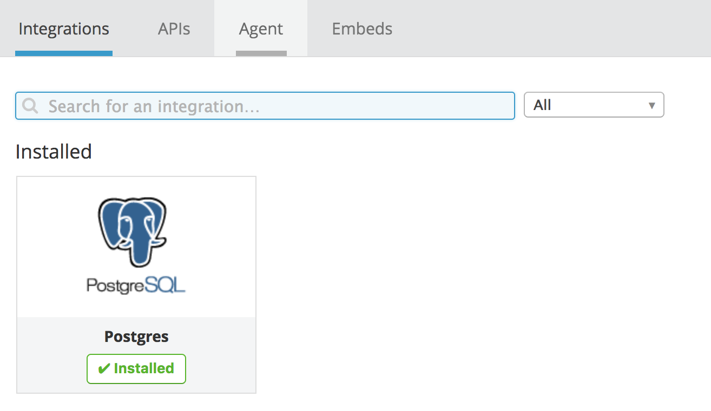
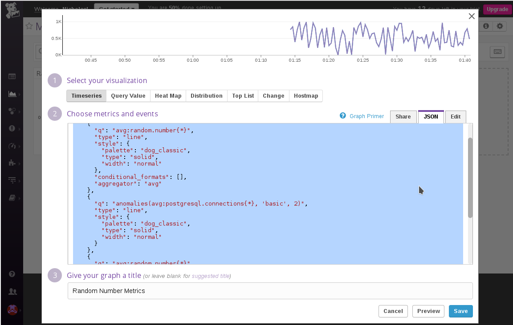

# Datadog Introduction Guide

Datadog is a monitoring service for applications at scale. I will show the setup from first installing the agent and integrating it with several applications to customizing a dashboard and setting up email alerts.

This demonstration will monitor several applications running in an Ubuntu image managed by Vagrant.

- [Setting Up the Environment](#setting-up-the-environment)
  - [VirtualBox](#virtualbox)
  - [Vagrant](#vagrant)
  - [Documentation](#documentation)
- [Collecting Metrics](#collecting-metrics)
  - [Datadog Agent](#datadog-agent)
  - [Tags](#tags)
  - [Postgres](#postgres)
- [Writing an Agent Check](#writing-an-agent-check)
  - [Agent Check](#agent-check)
  - [Collection Interval](#collection-interval)
  - [Bonus Question: Collection Interval](#bonus-question-collection-interval)
- [Visualizing Data](#visualizing-data)
  - [Timeboards](#timeboards)
  - [Bonus Question: Anomaly function](#bonus-question-anomaly-function)
- [Monitoring Data](#monitoring-data)
  - [Alerts](#alerts)
  - [Schedule Downtime](#schedule-downtime)
  - [cURL API](#curl-api)
  - [Collecting Data with APM (Tracing)](#collecting-data-with-apm-tracing)
- [Python Flask App](#python-flask-app)
- [Bonus Question: Service vs. Resource](#bonus-question-service-vs-resource)
- [Final Question](#final-question)
- [Final Thoughts](#final-thoughts)

## Setting Up the Environment

### VirtualBox

[Available here](https://www.virtualbox.org/wiki/Linux_Downloads), I followed the instructions that added it to my apt-get library to make it easier to update in the future. My current version is VirtualBox 5.2.

Make sure [virtualization technology is enabled](http://hackaholic.info/enable-hardware-virtualization-vt-x-amd-v-for-virtualbox) in your BIOS. My laptop is running Debian, so it was disabled by default.

### Vagrant

~~[Vagrant](https://www.vagrantup.com/intro/index.html) is available through `apt-get install vagrant`~~. 

As of writing this document, I encountered an issue with downloading vagrant through apt-get. Downloading through apt-get gave me Vagrant 1.9 [which is incompatible with VirtualBox 5.2](https://github.com/geerlingguy/drupal-vm/issues/1587). I uninstalled Vagrant then reinstalled the latest Vagrant 2.0.2. Find instructions [here](https://github.com/openebs/openebs/issues/32).

### Documentation

That is all the tools we will need to install on our host machine, everything else will be contained inside of the Vagrant image. Before we continue I recommend watching the [DataDog 101 course](https://www.youtube.com/watch?v=uI3YN_cnahk&list=PLdh-RwQzDsaOoFo0D8xSEHO0XXOKi1-5J) and skimming through [the docs](https://docs.datadoghq.com/getting_started/). 

## Collecting Metrics

The basis of Datadog's functionality comes from the metrics it collects from your hosts. In order to send metrics to Datadog we have to install the agent on our system, after that we will configure some applications to send their metrics. 

### Datadog Agent

When you first [log in](app.datadoghq.com) to Datadog you will see instructions on how to install the Datadog agent. For our Vagrant setup, we will be copying the [Ubuntu installation commands](https://docs.datadoghq.com/agent/basic_agent_usage/ubuntu/) into a bootstrap shell script which will be triggered when we run `vagrant up`. This is what the file looks like right now:

```bash
#!/usr/bin/env bash

echo "bootstrap.sh 1: allow apt to install through https"
sudo apt-get update
sudo apt-get install apt-transport-https

echo "bootstrap.sh 2: set up the Datadog deb repo on system and import Datadog's apt key"
sudo sh -c "echo 'deb https://apt.datadoghq.com/ stable 6' > /etc/apt/sources.list.d/datadog.list"
sudo apt-key adv --recv-keys --keyserver hkp://keyserver.ubuntu.com:80 382E94DE

echo "bootstrap.sh 3: install the Agent"
sudo apt-get update
sudo apt-get install datadog-agent

echo "bootstrap.sh 4: copy the example config and plug in API key from .env"
source .env
echo "api key: $DATADOG_API_KEY"
sudo sh -c "sed 's/api_key:.*/api_key: $DATADOG_API_KEY/' /etc/datadog-agent/datadog.yaml.example > /etc/datadog-agent/datadog.yaml"

echo "boostrap.sh 5: start the datadog agent"
sudo initctl start datadog-agent
```

And the Vagrantfile:

```ruby
Vagrant.configure("2") do |config|
  config.vm.box = "hashicorp/precise64"
  
  config.vm.provision :file, source: ".env", destination: ".env"
  config.vm.provision :shell, path: "bootstrap.sh"
end
```

In order to keep my Datadog API key secret, I have added a .env file which contains any secrets I need and is excluded from git tracking. The file is uploaded to the Ubuntu image on startup, then accessed by the bootstrap script. This method seemed to me to be the easiest to implement and most extendible for future updates that may need more secrets available.

Now that [bootstrap.sh](dd_agent_bootstrap.sh) is written, the key has been added to [.env](.env), and the [Vagrantfile](Vagrantfile) is calling both, we are ready to run `vagrant up`. The process should take a few minutes, but at the end we should see something like:

```
default: boostrap.sh 5: start the datadog agent
default: datadog-agent start/running, process 1313
```

I can now go to the Datadog app, and see that the agent is sending data. I ran a couple commands to throttle the CPU (check out [stress](https://www.hecticgeek.com/2012/11/stress-test-your-ubuntu-computer-with-stress/)), just to see how the graphs would react, and I seemed to get the exact output I would expect from throttling 1, then 2 CPUs.


### Tags

One of the most important configurations to set up is tagging. Datadog is meant to monitor large quantities of hosts, and without a way to organize them, important patterns and information could be lost in the noise. Tags allow you to organize your metrics and create more usable visualizations and alerts.

Tags can be set in the datadog.yaml file, the same config file that we set the API key. You can also set them manually in your host map view, but something like this should really be automated. To do this I added a line in the agent bootstrap file to modify the existing yaml config:

```bash
sudo sed -i 's/# tags:.*/tags: role:database, region:us/' /etc/datadog-agent/datadog.yaml
```

Now when we look at this VM, the tags `role:database` and `region:us` are listed.


### Postgres

The Datadog agent is now on the image, so we can set up integrations with any applications running. Integrations are available for [hundreds of applications](https://docs.datadoghq.com/integrations/). We will be setting up a [PostgreSQL DB system](https://www.postgresql.org/about/). I followed the default Vagrant setup files listed in the [Postgres wiki](https://wiki.postgresql.org/wiki/PostgreSQL_For_Development_With_Vagrant#Vagrant) to get it working.

Our new Vagrantfile looks like this:

```ruby
$script = <<SCRIPT
  echo I am provisioning...
  date > /etc/vagrant_provisioned_at
SCRIPT

Vagrant.configure('2') do |config|
  config.vm.box = 'ubuntu/trusty64'

  config.vm.provision 'shell', inline: $script
  config.vm.provision :shell, path: 'postgres_bootstrap.sh'
  config.vm.network 'forwarded_port', guest: 5432, host: 15_432

  config.vm.provision :file, source: '.env', destination: '.env'
  config.vm.provision :shell, path: 'dd_agent_bootstrap.sh'
end
```

I got most of the [postgres_bootstrap.sh](postgres_bootstrap.sh) from the wiki, but added a few lines to create a table and connect a `datadog` user to it. This user I created is what the Datadog agent will use to monitor the DB and send metrics. Adding a user this way is only for demonstration purposes, most databases would have a more stable user provisioning system than a shell script hardcoding SQL into a vagrant vm. Well, they should at least.

After reloading Vagrant to take our new provisioning into effect, we are rewarded with seeing Postgres metrics listed in our host map:



## Writing an Agent Check

### Agent Check

If you cannot find an integration available for your software and still want to collect metrics on it, then you have [multiple options](https://docs.datadoghq.com/developers/metrics/) available to you: the API, DogStatsD, and agent checks. We will quickly implement an agent check here.

In order to create an agent check we need to have a configuration file and then a python script which inherits from AgentCheck. We will have send a random number between 0 and 1000 as a metric.

[random_value.py](bootstrap_scripts/random_value.py)
```python
from checks import AgentCheck
import random

class HelloCheck(AgentCheck):
  def check(self, instance):
    self.gauge('random.number', random.randint(0, 1000))
```

[random_value.config](bootstrap_scripts/random_value.yaml)
```yaml
init_config:

instances:
  [{}]
```
This boilerplate is all that's needed to see our metric in a timeboard:


### Collection Interval

The config file makes more sense when we have setting to adjust. For example, we can change the update interval from the default 20 seconds, to instead only send data every 45 seconds.

```yaml
init_config:
  min_collection_interval: 45
instances:
  [{}]
```

This doesn't mean the the data is sent every 45 seconds though. The Datadog agent is configured to collect and send data every 20 seconds, adding this 45 makes it so that this metric will be skipped until 45 seconds has passed. So after 20 seconds the agent will skip this file, then at 40 seconds it will skip again, and after 60 seconds the metric will be sent. 

### Bonus Question: Collection Interval

> **Bonus Question** Can you change the collection interval without modifying the Python check file you created?

The collection interval can be set through the `min_collection_interval` value under `init_config` in the yaml file, as shown above. It could also be modified by increasing the interval of the agent itself using the datadog.yaml file, since, if the agent only collects data every 60 seconds, then the agent check will be forced to as well.

From how this bonus question mentions modifying the Python file though, I assume it can also be done by editing the AgentCheck instance variable directly in the Python check file e.g. `self.min_collection_interval = 60`, however when I tried this it didn't seem to reflect in the dashboard, and I wasn't able to find any documentation showing how to edit the value through the constructor. It would seem to be accessible based on the source code I see [here](https://github.com/DataDog/dd-agent/blob/master/checks/__init__.py#L337), but I may be misunderstanding the Agent lifecycle, or Python object inheritance. (or have a typo)

## Visualizing Data

### Timeboards

We have already seen/created a few timeboards in the Datadog app, but we can also create them using the[ Datadog API](https://docs.datadoghq.com/api/?lang=python#timeboards). The docs are extremely comprehensive, to the point that there is basically no work to do besides fill in the details. An easy way to generate the JSON data is to go to the app and create a dashboard and use the UI there, then copy from the JSON tab. 



It may seem counterintuitive to create the dashboard twice essentially, but the goal of the API, isn't really to make a single quick dashboard. Using the API to create timeboards allows you to backup your definitions as code and have version control of the dashboards.

My implementation of the dashboard is visible in [timeboard.py](timeboard.py). I added the following metrics:

Random Number Timeboard:

* **random.number**: The metric coming in from the custom agent we installed. 
* **random.number - rollup sum**: Takes the random number metric and for each interval sums all data in the interval to a single point. I set it to rollup over a 5 minute interval, so the sums are hovering around 10K.

Postgres Timeboard:

* **postregressql.db.count - anomalies**: Checks how many databases there are in the Postgres server. The anomaly function highlights any sudden changes in red.


### Bonus Question: Anomaly function

> **Bonus Question**: What is the Anomaly graph displaying?

The [anomaly function](https://docs.datadoghq.com/monitors/monitor_types/anomaly/) is an algorithm that detects unusual changes based on previous metrics history. This can be used for very complex trends, taking into account several variables, but for our situation it just colored the graph when I created a spike in number of databases from 1 to 5.

## Monitoring Data

### Alerts 

We have our graph, but what happens when something goes wrong? What if those random numbers ever get really high? I'll certainly want to know if that random number goes over say 800, that could be important. But I don't want to sit and watch it all day. To solve this problem we can use monitors. 

From either the timeboard gear icon, or the monitor section in the sidebar, I can choose to create a new monitor for the metric random.number. Then we just fill out the form. 

One of the issues that gave me trouble was that in order to use the host.name variable in my message I had to make sure the alert was a multi alert, triggered separately per host. 

The alert will trigger every 5 minutes, emailing me a warning if it is above 600 and an error alert over 800.


### Schedule Downtime

As important as this alert is, we only care about it during work hours. After work, emails should be limited to only the most important. Luckily, we can schedule downtime. The page is accessible through the submenu of monitoring. I created two schedules, one for weekdays from 7pm to 9am the next day, and another for weekends. When scheduling, I made sure to include a description and tagged myself so that I got an email notification of the schedules.


### cURL API

Once again, these tools don't need to be created with the GUI; the API has endpoints for all these alerts and monitoring tools. Instead of Python, this time I have created a small shell script making a cURL request to Datadog that will generate the exact same monitors and schedules. Check it out [here](curl_monitor.sh). One of the benefits of cURL over Python, is that the Python API doesn't have all functionality yet, while cURL can use every endpoint.

### Collecting Data with APM (Tracing)

## Python Flask App

[Tracing](https://docs.datadoghq.com/tracing/) is a more integrated form of monitoring. It is instumented directly into your code so that you can see much more detailed metrics and track down the bottlenecks not just in your infrastructure, but the code itself.

I've added a small [Python Flask API](flask-app.py) to the repo, and instrumented it with the ddtrace package. The API just opens 3 endpoints that give little hello world style outputs. APM is enabled by default past version 5.13, and we are using Agent v6, so no datadog agent config changes should be necessary. 

Or so I thought, until I started Vagrant and kept hitting port errors. It turns out both Python Flask and Datadog default to using port 5000, so I added an extra line to the dd_agent_bootstrap shell script to change the default port to 5002.

```bash
sudo sed -i 's/# expvar_port:.*/expvar_port: 5002/' /etc/datadog-agent/datadog.yaml
```

After making that change, the trace metrics are visible in my host map, so I cURLed the endpoints a couple dozen times to get that warm fuzzy feeling you get when graphs move in a way you expect them to.


## Bonus Question: Service vs. Resource

> **Bonus Question**: What is the difference between a Service and a Resource?

A service is a set of processes that do the same job. For example, in my app, I would say I have 3 services: the Flask web app I just created, the Postgres database, and the random number generator. Most small websites would be similar, a front end API with business logic, a backend database, some non-public-facing utilities. Larger organizations might have multiple databases that serve different purposes.

A resource is a request to that service: an API endpoint, a database query, etc. I have 3 possible resources for my Flask app. There is only one table in my database, however, since there are multiple operations possible for that table, perhaps it would be better to organize resource by select, insert, delete requests, instead of by all operations to a given table. How to group them seems to be up to the designer.

[Official definitions of Service vs Resource](https://docs.datadoghq.com/tracing/terminology/#service)

## Final Question

> Is there anything creative you would use Datadog for? 

I always thought that creativity requires a bit of structure. Before I think of an interesting use, I want to figure out what things Datadog excels at, abstracted out beyond infrastructure and applications, that might give me some better ideas.

* monitoring live events
* sending out alerts for anomalies and thresholds
* simplifying complex systems into human parsable visualizations
* overlaying data from disparate sources in order to establish patterns

So I would want to be alerted when a some kind of threshold is exceeded, and the data is coming from a complex source. 

My immediate thought is groceries. I would want to somehow feed grocery data into Datadog, all of my staple food items would have a timeboard showing each brands' current/future price. If a gallon milk goes below $4, I want to be notified so that I can pick it up on the way home. This seems pretty useful to me since I could overlay several brands from several stores. Accurate data collection might be difficult though.  Creating all the timeboards and linking the various brands for every common food type could also be more trouble than it's worth. It seems like something that might be automatable through AI, if a decent API doesn't already exist though. 

Any other ideas I can think based on those premises would be similar to the grocery idea like monitoring ticket prices or airline fairs, or similar to the examples given in the question like seeing open meeting rooms instead of seeing open bathrooms.

## Final Thoughts

This is my first time working with a lot of this technology. At every chance I could, I chose something I was less familiar with. Postgres over MySql, Vagrant over Docker, etc. I thought these exercises would be a good opportunity to learn some new toys; which is great for my personal edification, but may impact the quality of the explanations. If there are any inaccuracies or silly mistakes I made when using these tools I would appreciate correction. 

Also, I wouldn't recommend anyone follow the project structure in this repo. As I installed more things onto the vagrant image, I kept trying out different styles of writing scripts and configs, and left them all in as examples. I think the best method is where I would just keep copying of all the config files and then copy them to their appropriate directories with the Vagrantfile, doing inline script and using sed and copying from the example files seems unstable and difficult to read to me, but they are options. But anything is fine as long as it is internally consistent.

A new tool I learned was [bfg](https://rtyley.github.io/bfg-repo-cleaner/), at some point in the process I accidentally uploaded an api key to GitHub. This is just a trial account and I immediately updated my keys through the website, but I thought it would be cool to use bfg to also scrape my history clean. [Here](https://github.com/draav/hiring-engineers/commit/fbd9edf19f5322a20783b7a14786fc4d88450f3e#diff-e4e349f3dcefcaa939b79b899a041181) is an example of a file that had it's text replaced.

My final thing I'll talk about is the laptop I'm developing on. I just got a used laptop a week or two back to code on (My main desktop is just a time sink of Reddit and Steam games). I wiped the hard drive and installed Debian, since I've never used Linux outside of a VM. Writing this guide has given me a great chance to flesh out my development environment and figure out what tools I like best. It let me tackle some interesting challenges like getting virtualization working in order to use Vagrant, since that is disabled by default with most installations. I think that starting from scratch is a great way to write guides and how to articles, since you can appreciate all the extra little steps people need to do when they are first getting started, and include extra steps accordingly.

If you've made it this far, thanks for reading.