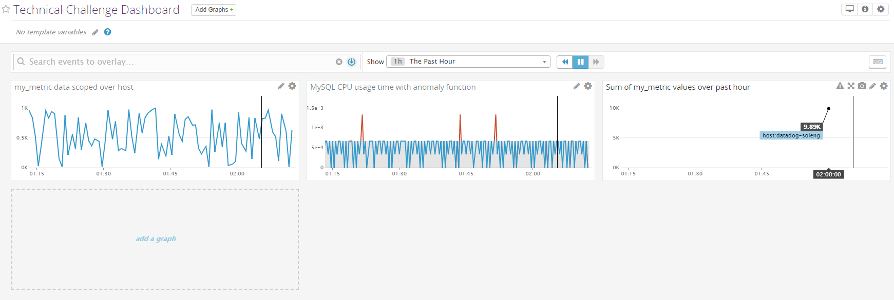

# Prerequisites

I decided to use an Ubuntu 16.04 virtual machine using VirtualBox, as that was the first suggestion in the readme and is an environment I am familiar with. Installation of the agent was very simple using the single-line command provided upon signing up for DataDog. I am using Agent V6, so many of the techniques I am using will not apply to Agent V5.

# Collecting Metrics

After getting the agent installed and running, the next step was to start collecting metrics on the VM running the agent. The first part of this was to add host tags to the file in `/etc/datadog-agent/datadog.yaml`. Inside this file around line 42, you should find a section that looks like this:


I uncommented the line containing "tags:" (make sure there isn't a space at the beginning of the line, or you'll get an error when you try to start the agent service) and created my own tags using the syntax provided in the file:


I then restarted the agent using the command `sudo service datadog-agent restart` and immediatelly saw the new tags show up on my DataDog event stream, and then saw them a few minutes later on the host map:


I then installed MySQL onto my virtual machine, and followed the instructions in Integrations->MySQL in the DataDog application to install the MySQL integration in the agent.


(Note: If your database's root user has a password set, it will probably be easier to enter the commands given here in the MySQL command line instead of in the terminal.)


The next task was to create a custom agent that reported a random number between 0 and 1000. I created a new file in the `check.d` folder in the DataDog agent root called `my_metric.py`:

```python
from checks import AgentCheck
from random import randint

class MyCheck(AgentCheck):
	def check(self, instance):
		self.gauge('my_metric', randint(0, 1000))

```
I then made a file called `my_metric.yaml` in the `conf.d` directory that stores the configuration for the metric I made:

```yaml
init_config:


instances: 
    - min_collection_interval: 45

```

This file is also pretty bare-bones, but it made it easy to complete the next step, which was to change the collection interval so the metric is only submitted once every 45 seconds (This also fulfilled the bonus requirement). Reading through the [docs](https://docs.datadoghq.com/developers/agent_checks/#configuration) revealed that `min_collection_interval` is actually a little bit misleading:

> The collector runs every 15-20 seconds depending on how many integrations are enabled. If the interval on this Agent happens to be every 20 seconds, then the Agent collects and includes the Agent check. The next time it collects 20 seconds later, it sees that 20 is less than 30 and doesn’t collect the custom Agent check. The next time it sees that the time since last run was 40 which is greater than 30 and therefore the Agent check is collected.

This would come into play later on in the challenge.

# Visualizing Data

For this part of the challenge, I was tasked with using the API to create a Timeboard that displayed data about my custom agent and the MySQL integration. To start, I used the Curl shell script given in the docs as a framework, and inserted the graphs I needed in the JSON. When I was poking around in the application, I noticed that when you make a graph in a timeboard, it provides you with JSON that is useful as a starting point to working with the API, so I used that for each of my 3 graphs. I took the URL (inserting each key in its respective place) and the JSON body I had crafted from the docs and the application, and used Postman (my preferred tool for interacting with and testing APIs) to send the POST request to the API.




I really wanted the "Sum of my_metric values over past hour" to be a query value, but after much trial and error, I was unable to succeed in that. I was also unable to figure out how to set the timeframe to the past 5 minutes, so I set it to 1 hour.


The anomaly graph is showing what the algoritm the graph is using expects for the data to be like with the shaded grey area, and what the actual data is like with the line. In the snapshot, every time a part of the graph is red or circled is a time that the actual value was outside the bounds of the expected value.
