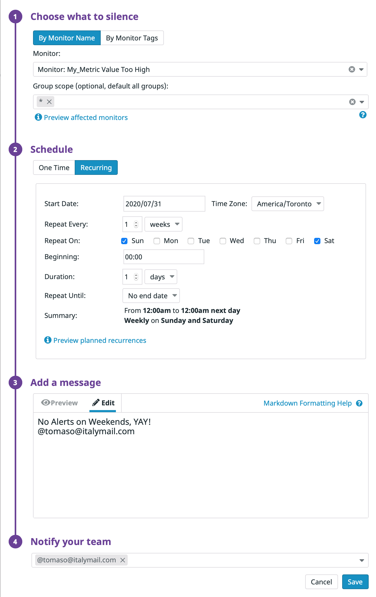

##### Answers - Joe Plonsker

## Prerequisites - Setup the environment

* You can utilize any OS/host that you would like to complete this exercise.

I decided to skip the Vagrant and Containerized approaches, accepting the challenge of getting the exercise done on macOS 10.13.14.

* Then, sign up for Datadog (use “Datadog Recruiting Candidate” in the “Company” field), get the Agent reporting metrics from your local machine.

The initial installation steps for Mac were very straightforward: https://app.datadoghq.com/account/settings#agent/mac


After running the initial installation, I was then taken to the [host page](https://app.datadoghq.com/infrastructure/map?host=498328944&fillby=avg%3Acpuutilization&sizeby=avg%3Anometric&groupby=availability-zone&nameby=name&nometrichosts=false&tvMode=false&nogrouphosts=true&palette=green_to_orange&paletteflip=false&node_type=host).

The agent appeared to be in order when i ran a quick health check, and I was able to start and stop the host via both the command line and the Datadog wdiget icon on my Desktop toolbar:

```
Joes-MacBook-Pro:~ joeplonsker$ datadog-agent health
Agent health: PASS
=== 10 healthy components ===
ad-autoconfig, ad-configresolver, aggregator, collector-queue, dogstatsd-main, forwarder, healthcheck, metadata-agent_checks, metadata-host, tagger
```


## Collecting Metrics:
===========================
* Add tags in the Agent config file and show us a screenshot of your host and its tags on the Host Map page in Datadog.

Typically, the yaml file to set up these metrics is located in `~/.datadog-agent/datadog.yaml`. My file structure more closely resembled the Linux and source code structure: `~/opt/datadog-agent/etc/datadog.yaml` as seen [here](https://help.datadoghq.com/hc/en-us/articles/203037169-Where-is-the-configuration-file-for-the-Agent-). Working within these directories was still manageable and I was able to collect the necessary metrics.

I went ahead and made sure my API key was present in my configuration file and [enabled some tags](https://docs.datadoghq.com/getting_started/tagging/assigning_tags/#assigning-tags-using-the-configuration-files) that, if surfaced, would clearly have been made by me.
```
tags:
  - mytag
  - env:prod
  - role:database
  - user:joe
  - animal:dog
```

And voila, these tags were surfaced on the hosts page as coming from my local machine.


* Install a database on your machine (MongoDB, MySQL, or PostgreSQL) and then install the respective Datadog integration for that database.

I decided to setup a MySQL database as it was the first relational database system I ever encountered in my career. I ran into some minor issues with permissions, as my machine refused to grant universal permissions to the new 'datadog'@'localhost' user. I even tried specifying every unique MySQL action to the new user, but to no avail. I finally realized that I need to get MySQL running at root with `mysql -u root -p`. At this point, I was able to grant all permissions to the new Datadog user. This felt like the MySQL troubleshooting equivalent of 'did you try turning it on and off again'. When in doubt, take the root/sudo route.

With the new user created, I went to add the configuration block to the mysql.d/conf.yaml file.

```instances:
    # NOTE: Even if the server name is "localhost", the agent will connect to MySQL using TCP/IP, unless you also
    # provide a value for the sock key (below).
    - server: 127.0.0.1
      user: datadog
      pass: 'supersecurepassword'
      port: 3306
      options:
          replication: 0
          galera_cluster: 1
          extra_status_metrics: true
          extra_innodb_metrics: true
          extra_performance_metrics: true
          schema_size_metrics: false
          disable_innodb_metrics: false
        ```


One small issue I encountered while setting up the MySQL database monitoring and log collection was that the my.cnf file described [here](https://docs.datadoghq.com/integrations/mysql/) was located in a different directory. This was due to having previously [had MySQL installed via Homebrew](https://stackoverflow.com/a/24250739). Changing the files in the noted directory worked for me.


* Create a custom Agent check that submits a metric named my_metric with a random value between 0 and 1000.

I then followed the instructions [in the Agent check documentation](https://docs.datadoghq.com/developers/agent_checks/) and, using the hello.world example as my basis, made the custom metric at `opt/datadog-agent/etc/checks.d/my_metric.py` and a simple config file at `/opt/datadog-agent/etc/conf.d/my_metric.yaml`.

config file:
```
init_config:

instances:
    [{}]
```


my_metric.py:

```
from checks import AgentCheck
import random

class HelloCheck(AgentCheck):
    def check(self, instance):
        metric_num = random.randint(0, 1000)
        self.gauge('my_metric', metric_num)

```

Running the agent check resulted in a successful response.


```
Joes-MacBook-Pro:checks.d joeplonsker$ datadog-agent check my_metric
 Series
{
  "series": [
    {
      "metric": "my_metric",
      "points": [
        [
          1529094578,
          433
        ]
      ],
      "tags": null,
      "host": "Joes-MacBook-Pro.local",
      "type": "gauge",
      "interval": 0,
      "source_type_name": "System"
    }
  ]
}

Collector


  Running Checks

    my_metric
    ---------
      Total Runs: 1
      Metrics: 1, Total Metrics: 1
      Events: 0, Total Events: 0
      Service Checks: 0, Total Service Checks: 0
      Average Execution Time : 0ms
```


* Change your check's collection interval so that it only submits the metric once every 45 seconds.
* **Bonus Question** Can you change the collection interval without modifying the Python check file you created?

I attempted to change the collection interval by using the Python time module in my my_metric.py file. I saw no specific change in the agent check, so decided to check if there was an alternative in the [configuration documentation](https://docs.datadoghq.com/developers/agent_checks/#directory-structure). I found a min_collection_interval option in an example and updated my yaml file to reflect it, essentially addressing the bonus question of not changing the original Python file:

```
init_config:

instances:
    - username: 'datadog'
      password: 'supersecurepassword'
      min_collection_interval: 45
```

Output was unaffected:

```
Joes-MacBook-Pro:checks.d joeplonsker$ datadog-agent check my_metric
=== Series ===
{
  "series": [
    {
      "metric": "my_metric",
      "points": [
        [
          1529095297,
          201
        ]
      ],
      "tags": null,
      "host": "Joes-MacBook-Pro.local",
      "type": "gauge",
      "interval": 0,
      "source_type_name": "System"
    }
  ]
}
Collector

  Running Checks
    my_metric
    ---------
      Total Runs: 1
      Metrics: 1, Total Metrics: 1
      Events: 0, Total Events: 0
      Service Checks: 0, Total Service Checks: 0
      Average Execution Time : 0ms
```

## Visualizing Data:
===============================

* Utilize the Datadog API to create a Timeboard that contains:
* Your custom metric scoped over your host.
* Any metric from the Integration on your Database with the anomaly function applied.
* Your custom metric with the rollup function applied to sum up all the points for the past hour into one bucket

My timeboard was created by making a POST request via Postman, as this was a platform I had used in the past to generate test calls and create objects in personal projects. I followed the instructions listed [here in the help section](https://help.datadoghq.com/hc/en-us/articles/115002182863-Using-Postman-With-Datadog-APIs). I kept receiving errors that my API key was required, even after importing the Datadog Postman Collection and updating all required keys. It turned out that I was using the latest update of Postman, when what I actually needed was a deprecated version to successfully make the calls (> 6.0). I headed over to the [Postman Changelog](https://www.getpostman.com/apps#changelog), copied the download link for the latest version, and then changed the version number in that URL to get a deprecated version of Postman. I was then able to successfully create a timeboard with an API call:


```
https://app.datadoghq.com/api/v1/dash?api_key=ca9f1bb076cffc9f12d1c4147435a916&application_key=9df1b98fda1accc5c5579d0b653a3697f1145a1f

{"graphs" : [{
    "title": "my_metric timeboard",
    "description": "created through the API",
    "definition": {
        "events": [],
        "requests": [
            {"q": "avg:system.mem.free{*}"},
            {"q": "my_metric{host:Joes-MacBook-Pro.local}"}
        ]
    },
    "viz": "timeseries"

        },
    {
    "title": "my_metric rollup",
      "definition": {
        "events":[],
        "requests": [
          {"q": "sum:my_metric{host:Joes-MacBook-Pro.local}.rollup(avg,3600)"}
        ]
    }
  },
    {
    "title": "DB Anomalies",
       "definition": {
         "events":[],
         "requests": [
          {"q": "anomalies(mysql.performance.open_files{host:Joes-MacBook-Pro.local}, 'basic', 3)"}
        ]
      },
      "viz": "timeseries"
    }
 ],
    "title" : "Joe Timeboards",
      "description" : "Tracking my_metric in the MySQL DB on my comp",
      "template_variables": [{
          "name": "host1",
          "prefix": "host",
          "default": "host:my-host"
      }],
      "read_only": "True"
}
```

[Please note that the API key is included in this PR as this is only a test account. In typical circumstances I would add anything that contained an API key in a gitignore file.]

This call broke several times before I realized I was including Python modules from examples listed in the documentation (rookie mistake). I eventually dropped the code in JSHint to make it a JSON-structured blob.

For the anomalies component, I went with the `mysql.performance.open_files` check on my local machine to monitor the number of open files.

I then used the rollup function to sum up all the point from the last hour:

`sum:my_metric{host:Joes-MacBook-Pro.local}.rollup(avg,3600)`

Originally I wrote the average as 60, but then realized it needs to be written out as 3600 seconds and not 60 minutes, since this call is made via JSON.

Here is the final timeboard:


* Once this is created, access the Dashboard from your Dashboard List in the UI:

* Set the Timeboard's timeframe to the past 5 minutes
* Take a snapshot of this graph and use the @ notation to send it to yourself.

While unable to break it change the timeframe to the past five minutes through the UI, I was able to use the snapshot tool to email myself a note.


* **Bonus Question**: What is the Anomaly graph displaying?

According to the Datadog blog, the anomaly graph is depicting the typical bounds of expected deviation versus the actual captured data over a series of time. The anomaly check I set up in was fairly benign, with a steady amount of four connections to my MySQL server and no deviations. The following gif depicts a much more realistic capture of data:


If the flow of data begins to deviate from that expected pattern, the real-time graph lines of data coming in strays away from the gray area and begins to turn from its typical blue/purple tint to red.

## Monitoring Data

* Create a new Metric Monitor that watches the average of your custom metric (my_metric) and will alert if it’s above the following values over the past 5 minutes:
* Warning threshold of 500
* Alerting threshold of 800
* And also ensure that it will notify you if there is No Data for this query over the past 10m.

I found out the specifics of metric monitoring [in the documentation](https://docs.datadoghq.com/monitors/monitor_types/metric/) and then set up my own [on the monitors page](https://app.datadoghq.com/monitors/manage). I selected 'metric' as my option for monitoring and created monitors for a warning threshold of 500, an alerting threshold of 800, and an alert of no data for 10 minutes.


* Please configure the monitor’s message so that it will:
* Send you an email whenever the monitor triggers.


* Create different messages based on whether the monitor is in an Alert, Warning, or No Data state.

I used the message template variables provided to create specific and targeted messages based on the nature of the alert:

```
{{#is_warning}}Heads up, my_metric on {{host.name}} is hitting its warning threshold: {{value}} [~approx 5 mins ago].{{/is_warning}}

{{#is_alert}}Heads up, my_metric on {{host.name}} is hitting its alert threshold: {{value}} [~approx 5 mins ago].{{/is_alert}}

{{#is_no_data}} Heads up, data has been missing for my_metric on {{host.name}} for the last 10 minutes.{{/is_no_data}} @joe@plonsker.com
```

These messages were then emailed to me when triggered:


* Bonus Question: Since this monitor is going to alert pretty often, you don’t want to be alerted when you are out of the office. Set up two scheduled downtimes for this monitor:

Ah, the joys of going off-call. I set up the specified alerts via the [scheduled downtime page](https://app.datadoghq.com/monitors#/downtime).

* One that silences it from 7pm to 9am daily on M-F:


* And one that silences it all day on Sat-Sun.



* Make sure that your email is notified when you schedule the downtime and take a screenshot of that notification.


## Collecting APM Data:

* Given the following Flask app (or any Python/Ruby/Go app of your choice) instrument this using Datadog’s APM solution:

Due to some updates in Java 8 where the apt endpoint was deprecated, I had trouble getting the installation of Go and its commands to be recognized on my machine. The commands specified in the [APM guide](https://docs.datadoghq.com/tracing/setup/) and [the trace agent repo](https://github.com/DataDog/datadog-trace-agent) would not work for me, and even a fresh installation of Go would not get the commands to be recognized. I eventually edited my bash profile and set Go in my path according to [this question asked on superuser.com](https://superuser.com/questions/472018/bash-cant-find-go-exectuable-after-installing-go-package-for-os-x?utm_medium=organic&utm_source=google_rich_qa&utm_campaign=google_rich_qa). Running the commands of `go get -u github.com/DataDog/datadog-trace-agent/...`, `cd $GOPATH/src/github.com/DataDog/datadog-trace-agent`, `make install`, and `trace-agent --config /etc/dd-agent/datadog.yaml` got it up and running.

```
trace-agent --config ~/.datadog-agent/datadog.yaml
2018-06-14 22:23:08 INFO (trace_writer.go:49) - Trace writer initializing with config: {MaxSpansPerPayload:1000 FlushPeriod:5s UpdateInfoPeriod:1m0s SenderConfig:{MaxAge:20m0s MaxQueuedBytes:67108864 MaxQueuedPayloads:-1 ExponentialBackoff:{MaxDuration:2m0s GrowthBase:2 Base:200ms}}}
2018-06-14 22:23:08 INFO (stats_writer.go:42) - Stats writer initializing with config: {MaxEntriesPerPayload:12000 UpdateInfoPeriod:1m0s SenderConfig:{MaxAge:20m0s MaxQueuedBytes:67108864 MaxQueuedPayloads:-1 ExponentialBackoff:{MaxDuration:2m0s GrowthBase:2 Base:200ms}}}
2018-06-14 22:23:08 INFO (service_writer.go:31) - Service writer initializing with config: {FlushPeriod:5s UpdateInfoPeriod:1m0s SenderConfig:{MaxAge:20m0s MaxQueuedBytes:67108864 MaxQueuedPayloads:-1 ExponentialBackoff:{MaxDuration:2m0s GrowthBase:2 Base:200ms}}}
2018-06-14 22:23:08 INFO (main.go:216) - trace-agent running on host Joes-MacBook-Pro.local
2018-06-14 22:23:08 INFO (receiver.go:142) - listening for traces at http://localhost:8126
2018-06-14 22:23:18 INFO (receiver.go:325) - no data received
2018-06-14 22:24:08 INFO (service_mapper.go:59) - total number of tracked services: 0
....
```


Afterwards I got to tracing my Python app, running `pip install ddtrace` and then importing the tracer in the app.

```

from flask import Flask
import logging
import sys
from ddtrace import tracer

with tracer.trace("web.request", service="my_service") as span:
  span.set_tag("my_tag", "my_value")

# Have flask use stdout as the logger
main_logger = logging.getLogger()
main_logger.setLevel(logging.DEBUG)
c = logging.StreamHandler(sys.stdout)
formatter = logging.Formatter('%(asctime)s - %(name)s - %(levelname)s - %(message)s')
c.setFormatter(formatter)
main_logger.addHandler(c)

app = Flask(__name__)

@app.route('/')
def api_entry():
    return 'Entrypoint to the Application'

@app.route('/api/apm')
def apm_endpoint():
    return 'Getting APM Started'

@app.route('/api/trace')
def trace_endpoint():
    return 'Posting Traces'

if __name__ == '__main__':
    app.run(host='0.0.0.0', port='5050')
    ```

I then ran myapp.py:

```
Joes-MacBook-Pro:Documents joeplonsker$ python myapp.py
2018-06-14 23:13:55,795 - werkzeug - INFO -  * Running on http://0.0.0.0:5050/ (Press CTRL+C to quit)
2018-06-14 23:13:56,629 - ddtrace.api - DEBUG - reported 1 traces in 0.00295s
```

Bonus Question: What is the difference between a Service and a Resource?

A service is [a set of processes that work together to provide a feature set](https://help.datadoghq.com/hc/en-us/articles/115000702546-What-is-the-Difference-Between-Type-Service-Resource-and-Name). Essentially, it is the overall skeleton of an app, containing the parts and basic framework of how it will operate. An example of this would be the webapp itself, the database underlying it, and all api endpoints provided.

A resource is a particular query to a service. An example of this would be a canonical URL or endpoint that a user hits when trying to get data from a service, or a MySQL call to the app's database.

* Provide a link and a screenshot of a Dashboard with both APM and Infrastructure Metrics.

[Link to Dashboard](https://app.datadoghq.com/dash/836105/joes-timeboard-14-jun-2018-2312?live=true&page=0&is_auto=false&from_ts=1529104584269&to_ts=1529108184269&tile_size=m)


## Final Question:

* Datadog has been used in a lot of creative ways in the past. We’ve written some blog posts about using Datadog to monitor the NYC Subway System, Pokemon Go, and even office restroom availability!

* Is there anything creative you would use Datadog for?

I would find a way to create hooks into the TSA's system to monitor and improve their current operations and logistics. Wait time at the TSA should be no longer than 15 minutes. A way to do this would be to monitor overall foot traffic flow through stanchions outfitted with devices pinging to a database with a corresponding Datadog timeboard. Hooks can also be added to TSA body scanners and x-ray machines to see how many passengers and bags require a manual inspection. If the system begins to detect an overall slowdown, TSA management will be paged with a warning to open up new lines and deploy agents to affected checkpoints.
