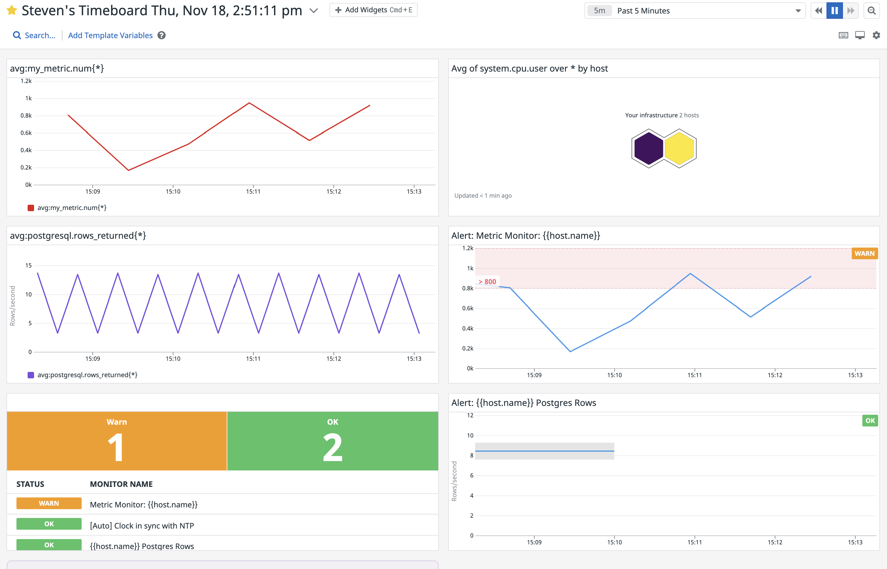

## Collecting Metrics:

For collecting metrics I have installed VirtualBox and utilzed Vagrant to spin up a virtual machine running Linux within a folder rooted on the Desktop. This is the second of two hosts I have linked with the Datadog Agent to show metrics for macOS and Linux. In the vagrant machine I created two files in order to setup metric collection (my_metric): 

1) my_metric.yaml in the config file (conf.d)
* This file utilizes the min_collection_interval instance to sequence my_metric checks every 45 seconds
2) my_metric.py in the checks.d directory
* This file creates a function with a task of creating random intervals between 0-1000 every 45 seconds per the interval set in the config file

With the Agent Check in place we can now begin monitoring, setting alerts, and downtime based on the parameters chosen through Application Performance Monitoring (APM) and real-time interactive dashboards. In the case of a project I recently worked on, The Wishlist App, monitoring how many items added in a day required an alert in order to ensure the average data cache would not overflow.

## Visualizing Data:

Below I've created a custom Timeboard with a few of the metrics being collected between the two hosts provided. There are the alerts for my_metric on our Linux virtual machine as well as an alert for our PostgreSQL database located on the primary host (macOS). The blue line shown on the timeseries graph is the number of rows within the selected database, and the gray band represents anomaly detection. Anomaly detection can tell between normal and abnormal metric trends based off of previous data point accrued over time. Then alert if there is an abnormal detection. Should the number of rows change within the database the user will receive an alert notifying of the change in status (anomaly).

## Monitoring Data:

Alerts are key to having visibility to infrastructure in a proactive manner. By adding Metric Monitors to desired metrics, in the below example "my_metric", you can set thresholds for alerting, so you aren't having to constantly monitor the dashboard. We've placed a Warning threshold and Alerting threshold for our custom metric as well as an alert should No Data be queried in the last 10 minutes.

Additionally your team won't want their inbox filled while out of the office with any alerts that may occur. Datadog has got it covered with downtime scheduling. We've set this monitor to be down after 7pm resuming at 9am daily, and also Saturday and Sunday. Easily tag anyone on the team as needed to receive alerts and schedule downtime whether that be for general out of office days or holidays.

## Collecting APM Data:

Collecting data with Datadog's Application Performance Monitoring (APM) can be setup in a few steps. In our case I've set up a simple Flask application to demonstrate requests to our application via web browser. I've included a link to the dashboard below as well as a screen shot of the updated Timeboard showing request hits to the application. Depending on your service type Datadog has you covered with our extensive list of monitors. Utilize these services (Cache, Custom, DB, Serverless function, Web) to trace any resource scoped to the specific endpoint desired.

[APM Dashboard](https://app.datadoghq.com/dashboard/5zd-pe7-2dx/stevens-timeboard-thu-nov-18-25111-pm?from_ts=1637683991751&to_ts=1637684291751&live=true)

## Final Question:
How many of you have Christmas lights on your house? What happens when one light goes out?

With the holiday season upon us one tradition that never gets old is going to see all of the Christmas lights around the neighborhoods. The biggest problem with Christmas lights is that if one light goes out it can be a killswitch for the entire string of lights. With the IoT integrating into the lighting space, being able to trigger alerts through Datadog for lighting outages before they occur would be something that could be utilized in order to keep the Christmas cheer at a maximum. Also being able to source the direct light that is causing any downtime would be a faster diagnosis thus preventing any prolonged timeline without any lights.