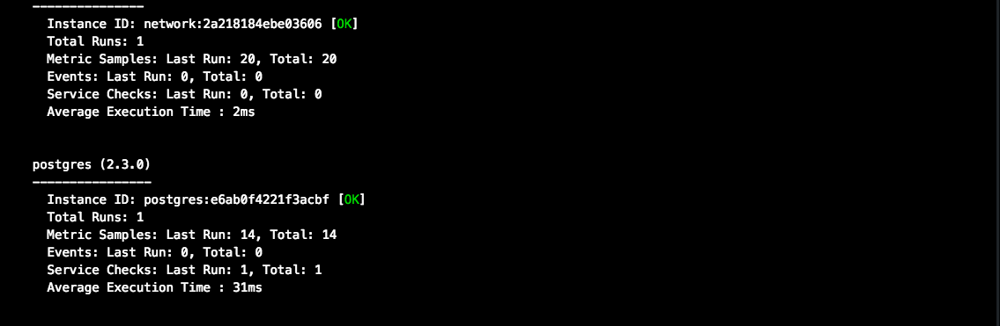
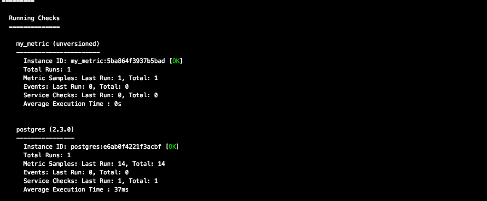

# Prerequisites - Setup the environment

To complete this exercise I had to download both [Vagrant](https://www.vagrantup.com/downloads.html) and [VirtualBox](https://www.virtualbox.org/wiki/Downloads)

After downloading both of these programs I had to install them. Using the Vagrant [Docs](https://www.vagrantup.com/intro/getting-started/project_setup.html) I figured out the commands to install them were:

1. Make a directory (which I already have one since I have this repo.)
2. `vagrant init bento/ubuntu-16.04` to create a Ubuntu 16.04 VM
3. `vagrant up` to start the VM
4. `vagrant ssh` to use the VM

After vagrant has finished installing, I signed up for Datadog and I navigated to the Integrations Tab --> Agent Tab --> Ubuntu Tab.

In this tab  you will see that Datadog gives you a on line command to type into your terminal to install the client.
`DD_API_KEY={YOUR_API_KEY} bash -c "$(curl -L https://raw.githubusercontent.com/DataDog/datadog-agent/master/cmd/agent/install_script.sh)"`

After you've typed this into the terminal that's running Vagrant, your terminal should look like this :

# Collecting Metrics

## Add tags in the Agent config file and show us a screenshot of your host and its tags on the Host Map page in Datadog.

I didn't really know what a tag was or how to implement it so I had to check out the [Tag Docs](https://docs.datadoghq.com/tagging/assigning_tags/?tab=go) which showed me how to  implement a tag using the terminal.

1. You have to `cd ..` until you hit the root directory of the VM.
2. Then navigate to `/etc/datadog-agent` . In this directory you'll find a file named `datadog.yaml`.
3. Vagrant has a built in editor named nano that we can use. We can open the file with `sudo nano datadog.yaml` You need to include the `sudo` or else you won't have permissions to change the file!

These are my tags :

Upon saving these changes , you have to restart the agent using `sudo service datadog-agent restart`. After you've restarted the agent, you can go to the Datadog web application and click the Infrastructure then click Host Map to see your tags.

This is how it should appear :

## Install a database on your machine (MongoDB, MySQL, or PostgreSQL) and then install the respective Datadog integration for that database.

The database I chose to install was PostgreSQL since I have experience using this the most . To install Postgresql on Ubuntu I simply had to refer to the [PostgreSQL docs](https://www.digitalocean.com/community/tutorials/how-to-install-and-use-postgresql-on-ubuntu-18-04). Here I was able to find the commands needed to install and run PostgreSQL.

1. `sudo apt-get update`
2. `sudo apt-get install postgresql postgresql-contrib`

Now that I've downloaded and installed PostgreSQL I can now head over to the Datadog web applications and look under Integrations to find PostgreSQL.

The directions on the Integration told to me to do the following steps :

1. create user datadog with password ( press the generate password key and your password will show up)
2. grant SELECT ON pg_stat_database to datadog;
3. I then had to navigate to `/etc/datadog-agent/conf.d/postgres.d` where I found the `conf.yaml.example` file.
4. I opened the editor using `sudo nano conf.yaml.example` and made some changes.

5. I then pressed `control x ` and nano asked me to save. I clicked yes and then renamed the file `conf.yaml` since it's no longer an example and something I need to use.

6. I restarted the Datadog Agent and ran a status check by running `sudo datadog-agent status`, and the PostgreSQL integration check was successful.

After that I went back into the browser and finished installing the PostgreSQL Integration.

## Create a custom Agent check that submits a metric named my_metric with a random value between 0 and 1000.

Upon reading the [Writing a custom Agent Check](https://docs.datadoghq.com/developers/write_agent_check/?tab=agentv6) I had to create two files

1. A Check file (which is just a regular python file) that needs to be created in the `/etc/datadog-agent/checks.d` directory.
2. A YAML configuration file that needs to be created in the `/etc/datadog-agent/conf.d` directory.

The first thing I did was create a Check file named `my_metric.py` which contains code found in the aforementioned docs. It looks like this :

The YAML configuration file named `my_metric.yaml` looks something like this , for now :

`instances: [{}]`

Even though it's empty , for now , it is quite necessary to have in your configuration file.

I restarted the Datadog Agent. my_metric check is successfully being submitted after checking with `sudo datadog-agent status`.

## Change your check's collection interval so that it only submits the metric once every 45 seconds.

All I had to do here was go back into my YAML config file named `my_metric.yaml` and add some things in. Now my YAML file looks like this:

The only way I was able to check if this was indeed working was running `sudo datadog-agent status` and timing when the total run count  incremented. Upon testing this a few times, it was indeed  updating around 45 seconds.

## Bonus Question Can you change the collection interval without modifying the Python check file you created?

By changing my check's collection interval in the YAMl file , I never had to modify my Python file that I have created.

# Visualizing Data

## Utilize the Datadog API to create a Timeboard that contains:

1. Your custom metric scoped over your host.
2. Any metric from the Integration on your Database with the anomaly function applied.
3. Your custom metric with the rollup function applied to sum up all the points for the past hour into one bucket

So upon looking at the [Datadog Api Docs](https://docs.datadoghq.com/api/?lang=python#timeboards) I figured out that to use the Datadog Api, I have to first install it (DUH!)

To do this I have to first install pip onto my operating system.

`sudo apt-get install python-pip`

Once pip is installed I have to install Datadog.

`pip install datadog`

Next, Datadog API takes in two keys . The "api_key" and the "app_key". We have the API key but we have to go generate our app_key. We navigate on our browser to Integrations and then API and you'll see  where it says generate app_key.

Once you've generated your app_key we create this [Python file](https://github.com/EliasAHH/hiring-engineers/blob/Juan_Solutions_Engineer/codeanswers/timeboard.py) and run `python timeboard.py` in our terminal.

Resources I used to complete this code were :

1. [Anomalies](https://docs.datadoghq.com/monitors/monitor_types/anomaly/)
2. [Graphing](https://docs.datadoghq.com/graphing/)
3. [PostgreSQL](https://docs.datadoghq.com/integrations/postgres/)
4. [Timeboards](https://docs.datadoghq.com/api/#timeboards)

After running the `python timeboard.py ` command I went to my dashboard to see if it was created . Indeed it was :

When I click the timeboard, three graphs are displayed .

##Once this is created, access the Dashboard from your Dashboard List in the UI:

## Set the Timeboard's timeframe to the past 5 minutes

The only way to actually obtain the 5 minute goal is to manually click on the graph it self and move it until you've reached 5 minutes .

## Take a snapshot of this graph and use the @ notation to send it to yourself.

There's a camera button on the top right of the graph you're currently on . Click that to take a snapshot.

Here's the email I received from it.

## Bonus Question: What is the Anomaly graph displaying?

The Anomaly graph is displaying the maximum number of connections to my PostgreSQL database and would tell me if there are any abnormalities. My graph at the moment is showing the max number of 100  and since it's all blue lines it means there are no abnormal behaviors at the moment
