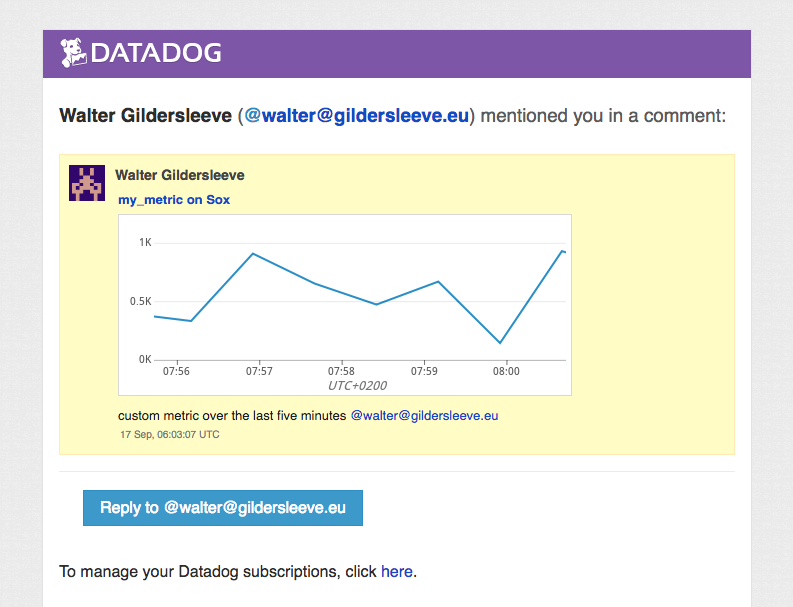

# Answers to the SE Technical Problems


### by [Walter Gildersleeve](https://www.linkedin.com/in/wmgildersleeve/)

## Solutions

### **0. Prerequisites - Setup the environment**
I decided to go with AWS and CentOS 7 operating systems. Vagrant's good and all, but I'm happy to offload extra VMs to Amazon :)

All work is done on the **cafebabe.us** ([google](https://www.google.de/search?q=cafebabe&rlz=1C5CHFA_enGB773GB773&oq=cafebabe&aqs=chrome..69i57j69i60l3.1566j0j2&sourceid=chrome&ie=UTF-8)) domain. This includes the initial node for collecting metrics (replete with database): [sox.cafebabe.us](http://cafebabe.us) plus two nodes for the APM data collection: [woodstock.cafebabe.us](http://woodstock.cafebabe.us:9000/v1/version) and [cinder.cafebabe.us](http://cinder.cafebabe.us/index).

The complete code written for this test is available on [BitBucket](https://bitbucket.org/wgilder/datadog-work/src/master/).


### **1. Collecting Metrics**

#### a. Add tags in the Agent config file
**_sox.cafebabe.us:/etc/datadog/datadog.yaml:_**
```bash
# Set the host's tags (optional)
tags: datadog_agent, env:test, role:database
```


#### b. Install a database

Chose PostgreSQL, my go-to open-source database.

#### c. Create a custom Agent check
**datadog-work:agents/checks.d/random_check.py:**
```python
from checks import AgentCheck
import random

class RandomCheck(AgentCheck):
  def check(self, instance):
    value = random.randint(0,1000)
    self.gauge('my_metric', value)
```

#### d. Change your check's collection interval
**datadog-work:agents/config.d/random_check.yaml:**
```yaml
init_config:

instances:
    - name: primary
      min_collection_interval: 45
```

#### e. Change interval other than in Python

Via the YAML configuration file; see above.

### **2. Visualizing Data**

#### a. Utilize the Datadog API to create a Timeboard

**datadog-work:scripts/create-timeboard.py**
```python
# ~~SNIP~~

def create_db_timeboard():
    graphs = [{
        "title": "my_metric on Sox",
        "definition": {
            "viz": "timeseries",
            "requests": [
                {"q": "avg:my_metric{host:sox.cafebabe.us}",}
            ]
        },
    },{
        "title": "PostreSQL Connections Usage (%)",
        "definition": {
            "viz": "timeseries",
            "requests": [
                {"q": "anomalies(avg:postgresql.percent_usage_connections{host:sox.cafebabe.us}, 'basic', 2)",}
            ]
        },
    },{
        "title": "my_metric hourly rollup average",
        "definition": {
            "viz": "timeseries",
            "requests": [
                {"q": "avg:my_metric{host:sox.cafebabe.us}.rollup(avg, 3600)",}
            ]
        },
    }]

    ts = datetime.datetime.today().strftime("%m%d%H%M%S")
    name = "{}-{}".format(DATADOG_TEST_TIMEBOARD_NAME, ts)
    desc = "Timeboard for showing my_metric information for host sox.cafebabe.us"
    read_only = False
    result = api.Timeboard.create(title=name, description=desc, graphs=graphs, read_only=read_only)
    print (result)

create_db_timeboard()
```

Here's a [link](https://app.datadoghq.com/dash/916998/datadogtesttimeboard-0916150819) to a dashboard created with the script.

#### b. Access the Dashboard in the UI

Full board for the last four hours:


Graph of _my_metric_ for the last five minutes:


#### c. Bonus Question: What is the Anomaly graph displaying?

Given that my database is extremely quiet, not a whole lot :)

But ultimately, graphs with the anomaly function applied show the data as any other graph, but also with an expected range that the data should remain within. Specifically, Datadog is examining over time the data and determining statistical high and low averages for a given day and time. Anything that falls outside these calculated ranges is anomalous.

### **3. Monitoring data**

The Monitor definition for this exercise can be found [here](https://app.datadoghq.com/monitors/6345128)

#### a. Set up monitors and send emails accordingly.

**No data**


**Warning (500<T<800)**


**Alert (800<T)**


#### b. Bonus Question: Set up two scheduled downtimes
~~I created the monitor last night after 19:00, meaning I haven't received a downtime email yet.~~

UPDATE: Here's an email I've since received:


### **4. Collecting APM Data**
I decided to use a small demo web application I use at Puppet. It consists of a web front end and a web API that the front end accesses. Both front and back ends are Python Flask applications delivered as a Docker image.

For the APM collection I created two new VMs, one for the front end, one for the back. Each has the Datadog agent running, with bridging between the Docker instance and the agent. I implemented the middleware solution for both front and back end solutions:

**daybook_ws:app.py**
```python
from flask import Flask
from ddtrace import tracer
from ddtrace.contrib.flask import TraceMiddleware

app = Flask(__name__)
tracer.configure(hostname='172.17.0.1', port=8126)
traced_app = TraceMiddleware(app, tracer, service="daybook_ws", distributed_tracing=False)

from streifen.ws.daybook import routes
```

The applications are in public GitHub repos: [back end](https://github.com/wgilder/daybook_ws/tree/datadog) and the [front end](https://github.com/wgilder/daybook/tree/datadog).


My APM dashboard can be found [here](https://app.datadoghq.com/dash/917189/cindercafebabeus).

#### Bonus question: difference between service and resource
A service is a combined set of processes that constitute a feature. A resource is a single, distinct query to a service. In this sense, a service can be said to consist of one or more resources.

### **5. Is there anything ~~creative~~ you would use Datadog for?**

I don't think it's particularly creative, but I'm surprised there isn't a Jive integration available for Datadog. Certainly, much of what needs to be monitored vis a vis Jive is OOTB: disk usage, dB activity, latency, basic APM data. 

There are, however, a lot of BI data that could be captured that would be very useful, too:
* Page views / minute
* Daily registrations
* User total session time
* Space-based BI information for specific teams
* Term-based activity (searches, tags)

There is a wealth of BI data that teams would _love_ to access. I know this from personal experience as a SA for Jive -- I was constantly asked how Jive could be monitored, both from an infrastructure standpoint as well as for basic BI. There are a lot of large Jive customers that would be thrilled with even a basic Datadog integration!

I've already spoken with a buddy of mine who's the CTO of a services company focused on Jive development. He also felt this was a gap and could potentially be pursuaded to build out something.