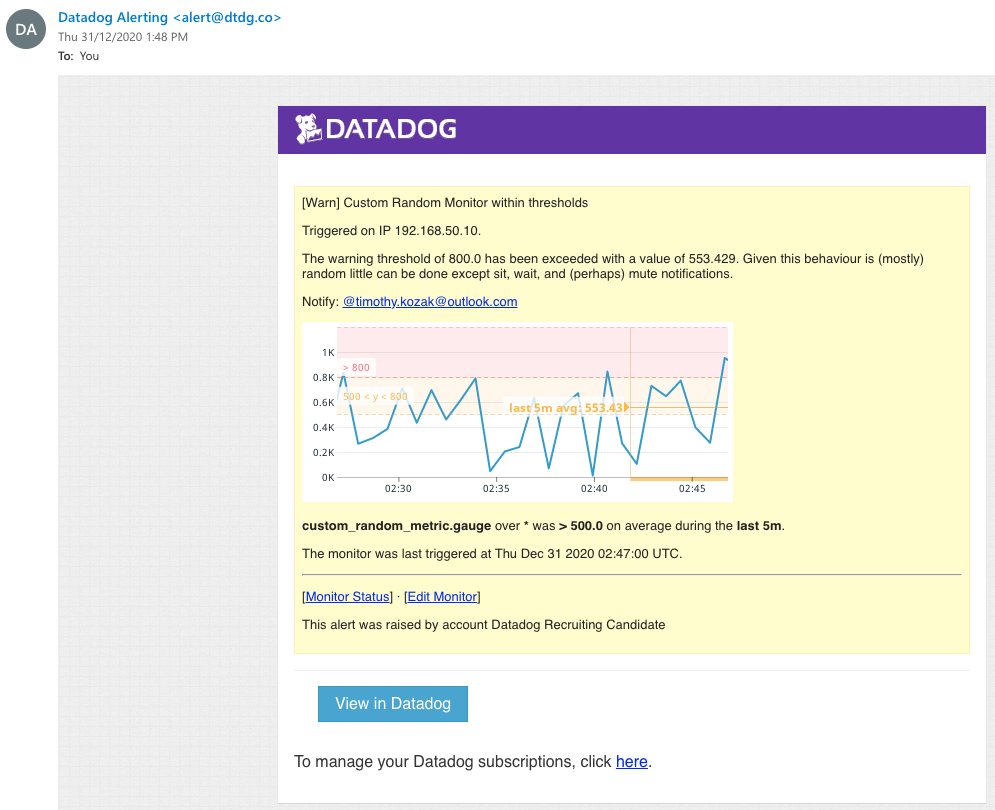

# Answers for Timothy Kozak

## Collecting Metrics

A MariaDB database, hosted in a Docker container (alongside the Datadog Agent) was used for generating the sample metrics that were collected and assessed. A sample corpus/dataset was used containing a large number of records that were then batch imported on a 5 minute basis to generate sufficient data on which to base the dashboards and other visualisations.  Additionally, workloads were tagged via Compose to link the applicable applications and correlate activity.

The configuration Yaml for the Custom Random Agent Check was configured to only collect every 45 seconds:
```init_config:

instances:
  - min_collection_interval: 45
```

__01_host_map.png__


**Bonus Question:** The collection interval is set in the latest version of the release code on an instance level and configured as part of the Yaml file.  One could also make the check script itself just sleep for the duration, as the agent will skip execution until the command returns.  

## Visualising Data 

A curl command was used to POST data to the API endpoint and generate the applicable dashboard.
```curl -X POST "https://api.datadoghq.com/api/v1/dashboard" \
-H "Content-Type: application/json" \
-H "DD-API-KEY: 204fd597ca4e5989771ed60b13ca4a62" \
-H "DD-APPLICATION-KEY: 04360d559f01c56b3e02388ef647039d036c7443" \
-d @- << EOF
{
   "title":"Tim's Custom Dashboard",
   "description":"",
   "widgets":[
      {
         "definition":{
            "title":"Custom Random Metric Over Time",
            "show_legend":false,
            "type":"timeseries",
            "requests":[
               {
                  "q":"custom_random_metric.gauge{*}",
                  "style":{
                     "palette":"dog_classic",
                     "line_type":"solid",
                     "line_width":"normal"
                  },
                  "display_type":"line"
               }
            ],
            "yaxis":{
               "scale":"linear",
               "label":"",
               "include_zero":true,
               "min":"auto",
               "max":"auto"
            },
            "markers":[
               
            ]
         }
      },
      {
         "definition":{
            "title":"Custom Random Metric Past Hour Rollup",
            "time":{
               
            },
            "type":"query_value",
            "requests":[
               {
                  "q":"custom_random_metric.gauge{*}.rollup(sum, 3600)",
                  "aggregator":"sum"
               }
            ],
            "autoscale":true,
            "precision":2
         }
      },
      {
         "definition":{
            "title":"MariaDB Average Writes Over Time",
            "show_legend":false,
            "time":{
               
            },
            "type":"timeseries",
            "requests":[
               {
                  "q":"anomalies(mysql.innodb.data_writes{*}, 'basic', 2)",
                  "style":{
                     "palette":"dog_classic",
                     "line_type":"solid",
                     "line_width":"normal"
                  },
                  "display_type":"line"
               }
            ],
            "yaxis":{
               "scale":"linear",
               "label":"",
               "include_zero":true,
               "min":"auto",
               "max":"auto"
            },
            "markers":[
               
            ]
         }
      }
   ],
   "template_variables":[
      
   ],
   "layout_type":"ordered",
   "is_read_only":false,
   "notify_list":[
      
   ]
}
EOF
```

A sample dashboard is available [here.](https://app.datadoghq.com/dashboard/uez-kw5-gmx/tims-new-hire-dashboard?from_ts=1609368499563&live=true&to_ts=1609368799563)

__02_mariadb_stats.png__


__03_anomaly_dashboard.png__


__04_snapshot_anomaly_graph.png__


The anomaly graph has been configured in basic mode with bounds of 2, indicating that data sitting outside two standard deviations (or approximately 95% of all received datasets) is marked as anomalous.  The grey shaded background shows the tolerance for this 95% corpus, with the trend line going red when outside the two standard deviation baseline.  The basic algorithm used does not take seasonality or long-term trends into account.

The performance metric that is being profiled is set to alert on a five-minute basis.  The actual task itself is a scheduled SQL database import of customer and employee data, that takes approximately 1-2 minutes to complete on the profiled hardware.  Were a longer window used to assess performance, no alert would be generated as the system activity is well within the bounds of expected performance.

## Monitoring Data

A **http_check*** has also been created to periodically poll the published endpoints and generate APM data.

__05_custom_alert_messages.png__


__06_email_alert.png__


__07_downtime.png__


**Bonus Question**: A **service*** is a set of processes that do the same job - for example a web framework and database.  In the sample provided, both the Flask Python web application and the underlying Docker containing it is running it have been tagged as part of the single service (via unified service tagging). This enables event correlation across multiple different systems and/or architectures and is especially important when trying to ascertain and evaluate application performance leveraging distributed or serverless architectures.  Service tagging allows the end user to navigate and correlate across traces, metrics, and logs (i.e. both pure application/built-in metrics and also APM-based integration).

A **resource*** is a particular action for a given service (typically an individual endpoint or query).  A service is typically comprised of multiple resources that are all grouped together and reported on collectively.  The resource is the sub-component – in this example, individual API endpoints (for Flask) or could instead be a database query.  Essentially something instrumentable.

## Collecting APM Data

A copy of the instrumented code has been included with the submission.

A sample dashboard is available [here.](https://app.datadoghq.com/dashboard/k57-ta4-g2h/tims-testapp-dashboard?from_ts=1609367921127&live=true&to_ts=1609368821127)

__08_apm_infra_dashboard.png__


## Creative Uses for Datadog

Here is but a few:

* Monitoring critical infrastructure, such as power and gas.  The pervasiveness of IoT devices allows for tremendous flexibility and capability when it comes to monitoring system state, as well as reporting on anomalous behaviour or even tracing the impact of specific incidents.  Environmental parameters (i.e. over-temperature, lack of pressure) can be scoped and monitored on a high frequency.
* Locally, I’d love to use Datadog to monitor the health of our local river/creek (as it’s suspect to industrial pollution) and report on the prevalence of specific pollutants, firing of alerting for follow-up and possible reporting to the local watchdog.  
* Energy consumption in office buildings, linking current office capacity consumption plotted against energy usage to determine whether there exists opportunities for greater cost savings.
