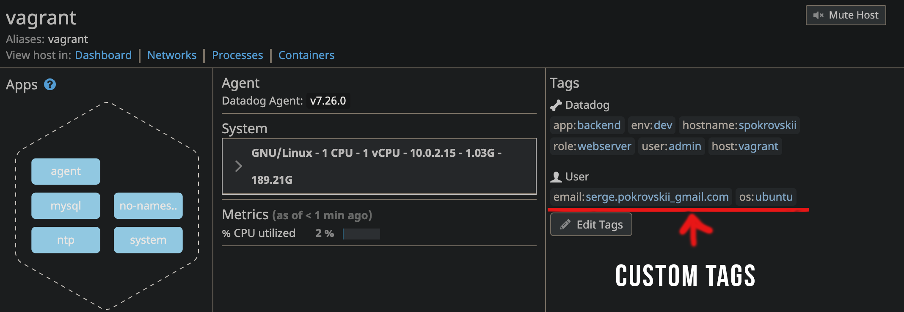

# Prerequisites - Setup the Environment

## Environment
* OS: macOS Catalina 10.15.16
    * Vagrant 2.2.15
    * Ubuntu 18.04
    * MySQL DB 14.14

### VM Setup

For the initial setup I followed recommendations from instructions of the technical exercise and spanned up fresh linux VM via Vagrant. 

First I downloaded [Vagrant](https://www.vagrantup.com/downloads)
After running the installation package I followed the steps of the vagrant installer: 


After successful vagrant installation in the terminal I run command `vagrant init hashicorp/bionic64` - this creates a basic Ubuntu 64 bit box that should be sufficient for running datadog agent and complete technical exercise. 

Next I started environment by running Command `vagrant up` 


## Agent Installation

Now it was time to install datadog agent on my new environment. 

On the https://docs.datadoghq.com/agent/ page I selected platform where agent is going to be running, in my case it is Ubuntu.  There I found a link to installation instructions. 

By using easy one-step install command I was able to successfully install agent. 


`DD_AGENT_MAJOR_VERSION=7 DD_API_KEY={DD_API_KEY} DD_SITE="datadoghq.com" bash -c "$(curl -L https://s3.amazonaws.com/dd-agent/scripts/install_script.sh)"`


To confirm that agent was installed and running I run `sudo datadog-agent status`


# Collecting Metrics 

## Adding tags
First step is to add tags in the Agent config file. 
I started with reading about tags at https://docs.datadoghq.com/getting_started/tagging/. I learned that tagging is basically a method to observe aggregate data points and allows correlation and call to action between metrics, traces and logs by binding different data types. I also learned what tag keys are available. 
I navigated to `/etc/datadog-agent` and modified `datadog.yaml` file by adding the following:
 `hostname: vagrant`
```
tags:
    -environment: dev
    env: dev
```

As a result I can see added tags on the Host Map page in DataDog. 


## Installing DataBase
I used MySQL database for the initial set up. 
To install database I run: 
` sudo apt install mysql-server ` - installs MySQL server
` sudo service mysql start ` - starts the server

After installation is completed I confirmed that MySQL server is running by executing `sudo systemctl status mysql.service` command


##Integration MySQL with Datadog
Next step was to integrate the Agent with the database. 

From reading data dog documentation (https://docs.datadoghq.com/integrations/mysql/?tab=host#data-collected) I learned that on each MySQL server I needed: 
* Create a database user for the Datadog Agent.
* Grant the user privileges. 

Create user with command `CREATE USER 'datadog'@'localhost' IDENTIFIED WITH mysql_native_password by 'datadog99';` where `datadog99` is a password

Grant privileges: 
 `GRANT REPLICATION CLIENT ON *.* TO 'datadog'@'localhost' WITH MAX_USER_CONNECTIONS 5;`

`GRANT PROCESS ON *.* TO 'datadog'@'localhost';`

Enable metrics to be collected from the performance_schema database:
` show databases like 'performance_schema'; `
` GRANT SELECT ON performance_schema.* TO 'datadog'@'localhost'; `

## MySQL Metric Collection

Next step was setting up config file for Metric Collection
In the directory `/etc/datadog-agent/conf.d/mysql.d` I edited the conf.yaml file to specify server, user, password and host: 


Restarted the agent by running `sudo service datadog-agent restart`

## Create a Custom Agent check

For this task I followed documentation on how to write Custom Agent check (https://docs.datadoghq.com/developers/write_agent_check/?tab=agentv6v7)

From there I learned that the names of the configuration and check files must match. So I created check file with name `my_metric.py` in `/etc/datadog-agent/checks.d` directory and configuration file `my_metrick.yaml` in `/etc/datadog-agent/conf.d` directory. 

One of the requirements is to set check's collection interval so it only submits the metric once every 45 seconds. We an achieve that by adding `min_collection_interval` at an instance level

```
   init_config:

   instances:
   - min_collection_interval: 45
```

I learned that it does not mean that the metric is collected every 45 seconds, but rather that it could be collected as often as every 45 seconds.

By using `hello.py` example from the documentation we can write our own check file that would satisfy requirements of submitting a metric with a random value between 0 and 1000. 
In the check file I send a metric `my_metric` on each call. I use `randint` function to get a random value between 0 and 1000. The code of the `my_metric.py` looks like this: 


After restarting agent by running `sudo service datadog-agent restart` I can see 
my changes on the `Metrics -> Explorer` page. In the Graph field I searched for `my_metric` and after selecting it from a dropdown I can see a diagram that shows a time when the call was submitted with the value from 0 to 1000. 


Another way to make sure that my custom metric is being collected by running ` sudo -u dd-agent -- datadog-agent check my_metric` 

## Bonus Question
 Can you change the collection interval without modifying the Python check file you created?

I can change the collection interval by modifying configuration `yaml` file and setting `min_collection_interval` to desired interval: 

```
   init_config:

   instances:
   - min_collection_interval: 45
```


# Visualizing Data:

## Creating a Timeboard with Datadog API


