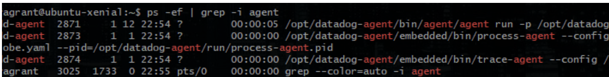
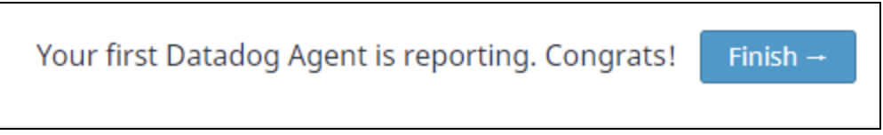

# Benjamin Crom Solutions Engineer Challenge
The nature of logging and alerting is evolving quickly due to the
rapid growth of distributed applications. These applications are often composed
of hundreds or even thousands of individual nodes.  System administrators can no
longer rely on static log files residing in individual filesystems; logs must
now be treated as streams of information to be aggregated and processed in real
time.  Datadog allows administrators to curate and direct all logging traffic
into a single managed platform. This platform provides for the complex alerting
and analysis needs of modern distributed software applications.

# Level 0: Launch using docker-compose
[Docker](https://www.docker.com) automates the deployment of applications
within software containers. For this application we will be using the
[docker-compose](https://docs.docker.com/compose/overview/) tool to automatically
launch several services each in separate docker containers.

- [Install Docker-compose](https://docs.docker.com/compose/install/)
- Check out the GitHub repository and branch containing this datadog docker
application
```shell
git clone git@github.com:benjamincrom/hiring-engineers.git
cd hiring-engineers
git checkout benjamin-crom-solutions-engineer
```
- Create .env file
```shell
echo API_KEY=[YOUR API KEY] >> .env
echo MONGO_DATADOG_USER=datadog >> .env
echo MONGO_DATADOG_PASSWORD=mousepad >> .env
```
- Start application using docker-compose
```shell
sudo docker-compose up
```

# Level 1 - Collecting Your Data
The Datadog Agent is a collection of services which together take input
from system metrics and application integrations then queue it up to be
sent to Datadog.

## Using Tags
Tags make it easier to collect several related nodes in order to view broad
trends across similar servers in real time. The tags for this app 
are set in the the `tags` line of the [datadog.conf](datadog/datadog.conf) file:
```
tags: bcrom_tags, env:dev, role:solutions-engineer
```
These tags will appear when the user clicks on a node in 
the [Host Map](https://app.datadoghq.com/infrastructure/map)


## Monitoring MongoDB
MongoDB is launched via the `db` section of [docker-compose.yml](docker-compose.yaml)
and the Datadog user is added to Mongo by the `provision` secion of
[docker-compose.yml](docker-compose.yaml).
```
db:
  image: mongo
  ports:
   - "27017:27017"
   - "28017:28017"
provision:
  build: provision
  command: bash /etc/provision_datadog_user.sh
```
The [mongo.yaml](datadog/conf.d/mongo.yaml) file in conf.d tells the
Datadog Agent to include Mongo metrics.

## Adding a Custom Check
A [Datadog custom check](http://docs.datadoghq.com/guides/agent_checks/)
can be added by inserting the appropriate files into check.d and conf.d.
See the [Datadog documentation](http://docs.datadoghq.com/guides/agent_checks/)
for details.

After adding the appropriate files and restarting the Datadog Agent one may add graphs
for the new check to a [Custom Dashboard](https://app.datadoghq.com/screen/191295/custom-mongodb-dashboard).

Two files are necessary for a custom check:
- [check_random.py](datadog/checks.d/check_random.py):
  ```python
  import random
  from checks import AgentCheck

  class CheckRandom(AgentCheck):
      def check(self, instance):
          self.gauge('test.support.random', random.random())
  ```
- [check_random.yaml](datadog/conf.d/check_random.yaml):
  ```yaml
  init_config:
    min_collection_interval: 30

  instances:
    [{}]
  ```


# Level 2 - Visualizing Your Data

TimeBoards scope all graphs to the same time scale so that the order
of events is readily apparent. This is useful for
correlating events while debugging. Graphs from a timeboard can each be
individually shared.

ScreenBoards are more customizable tools for providing a high-level look at a
system. ScreenBoards, unlike TimeBoards, can be shared as a read-only entity.

Visualizing custom check:


## Graph Snapshots and @notifications
By clicking the picture icon in the upper-right corner of a graph, one can
call attention to a specific incident and even send emails by using
the @notification utility.




# Level 3 - Alerting on Your Data
Custom alerts can easily be created from the
[Manage Monitors](https://app.datadoghq.com/monitors/manage) page



and can be configured to generate emails within 15 minutes of the alert being
detected.  This alert is a multi-host alert which means it will look to see
if any individual host satisfies the alert conditions when looked at by
itself.  This can be very useful if infrastructure later scales up
and many identical servers must be simultaneously monitored.

Alert email:


In order to not be disturbed after hours one can set downtime windows
via the [Manage Downtime](https://app.datadoghq.com/monitors#/downtime)
page.


# Wrap Up
Datadog is a powerful automated service which greatly enhances a team's
ability to maintain a high degree of awareness and strive for uncompromising
software quality. Datadog also enhances communication within an organization
by defining for the application a common context which is founded on the bedrock
of primary data. Next, we recommend you check out Datadog's [Application Level
Monitoring](https://www.datadoghq.com/apm/) which provides the missing
link in full-stack observability.

