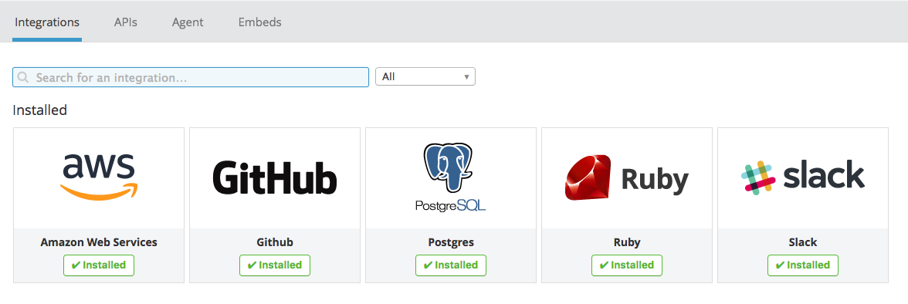

##Collecting Metrics:

1. Add tags in the Agent config file and show us a screenshot of your host and its tags on the Host Map page in Datadog:
    * After trying to open the config file, I was met with "permission denied"
    several times. 

Shortly after, I managed to open the yaml file.
Here are my edits to the yaml file and the tags on the Host Map page

##Roadblocks - 
    I downloaded the virtual box that was recommended, but I'm getting 
    an error when I try to run it. I've attached a screen shot of the error below.
    I've read the Vargrant documentation that was provided in the reference links
    to get the Virtual Box up and running, but I can't progress pass this error.

    Because of that, I downloaded a Datadog Agent for my Mac OS, which is OS 10.12.6.
    As mentioned above, I had some issues opening the yaml file but eventually was able to.
    I followed a few YouTube tutorials on the matter.

    One thing I am confused on, though, is when I make edits to the yaml file,
    am I suppose to be seeing changes to the host map in real time? I put the same
    tags I put for the yaml file in the host map area but one did not happen because of the other.
    I'm not sure where the connection between these two parts are, as stated by the question for 
    #1. 

2.  Install a database on your machine (MongoDB, MySQL, or PostgreSQL) and then install the respective Datadog integration for that database.

I'm using PostgreSQL on my Mac with the corresponding Datadog integration.
I integrated PostgreSQL in my DD Agent, and already had it on my Mac for 
use during my time at General Assembly.

##Roadblocks - 
    None. Installing the integration was an easy process.

3. Create a custom Agent check that submits a metric named my_metric with a random value between 0 and 1000.

    full answer in answers.py file

##Roadblocks -
    Simply making an agent check proved difficult. As mentioned earlier I have
    a DataDog Agent installed on my mac, but the specifc commands for the 
    command line aren't working the way I hoped for. For example: when I do DataDog datadog-agent start command it starts the app, but the 
    command for Agent V6, what I have, doesn't work. I am unsure of how I should
    being the Agent Check. My answer is the answers.py file is written as if I got the Agent Check to work.

4. Change your check's collection interval so that it only submits the metric once every 45 seconds.

    full answer in answers.py file

##Visualizing Data, Utilize the Datadog API to create a Timeboard that contains:

1. Your custom metric scoped over your host.
   
    

 ##Roadblocks -
     I understand that this wants me to incorporate my metric from the 
     previous section above but I'm not sure how to do that. I looked in the
     timeboard menu as well as my command line but again, I couldn't get the
     Agent to run it. 
    
2. Any metric from the Integration on your Database with the anomaly function applied.
    
    full answer in answers.py file

   
    
    
  ##Roadblocks - 
      I found the anomaly function on the DataDog docs (screenshot above) page which I'm going to
      put into my_metric in the answers.py file. My understanding is I need to
      tie these two pieces together which will make it appear on my Timeboard.
      Hence "Visualizing" the data. 

3. Your custom metric with the rollup function applied to sum up all the points for the past hour into one bucket  

    full answer in answers.py file

  ##Roadblocks - I found the rollup function on the Datadog Graphing doc
    and applied it to my function in answers.py. Where to actually include
    the function is something I am unsure about.

    
4. Set the Timeboard's timeframe to the past 5 minutes
    I see where to set the timeframe but do not see any option for 5 minutes
    
     

5. Take a snapshot of this graph and use the @ notation to send it to yourself.
   
   Here's a screenshot of my graph and I set it for the past month so you'd 
   see a wider range of data. Unsure how to send it to myself as the question asks.
    
     

  Bonus Question: What is the Anomaly graph displaying?

    If the Anomaly Function is working, it displays why hiccups that might
    occure during your data monitering. 

##Monitoring Data

Create a new Metric Monitor that watches the average of your custom metric (my_metric) and will alert if it’s above the following values over the past 5 minutes:

1. Warning threshold of 500
     

2. Alerting threshold of 800
     

3. And also ensure that it will notify you if there is No Data for this query over the past 10m.
    

Please configure the monitor’s message so that it will:

1. Send you an email whenever the monitor triggers.
    

2. Create different messages based on whether the monitor is in an Alert, Warning, or No Data state.
    
    
    

3. Include the metric value that caused the monitor to trigger and host ip when the Monitor triggers an Alert state.

  Unsure of how exactly to answer this.

4. When this monitor sends you an email notification, take a screenshot of the email that it sends you.

  

##Bonus Question: Since this monitor is going to alert pretty often, you don’t want to be alerted when you are out of the office. Set up two scheduled downtimes for this monitor:

One that silences it from 7pm to 9am daily on M-F,

And one that silences it all day on Sat-Sun.

Make sure that your email is notified when you schedule the downtime and take a screenshot of that notification.

 ##Roadblocks-
   I understand what the bonus question is asking me to do, however I am not 
sure where these settings are. If given the opportunity to study this further,
perhaps with a guiding hand, I know I could complete it. 

##Collecting APM Data
 Given the following Flask app (or any Python/Ruby/Go app of your choice) instrument this using Datadog’s APM solution:

    full answer in answers.py file
  
  Roadblocks - 
    I understand that APM is Application Performance Monitoring 
  and it cuts the gap between the app and the middleware. However, the "solution"
  as the questiona asks, is it a specifc line of code? Is it a certain method? 
  I am not sure how to go about this but would love to learn more if given the chance
  to work with someone. 

##Final question
    I would use Datadog to monitor for any available parking spaces
    around the city. Specifically in crowded areas like Times Square 
    and especially within parking garages.

