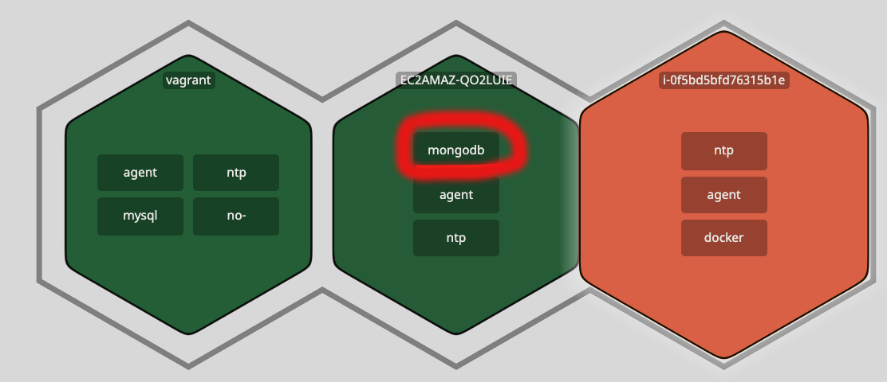
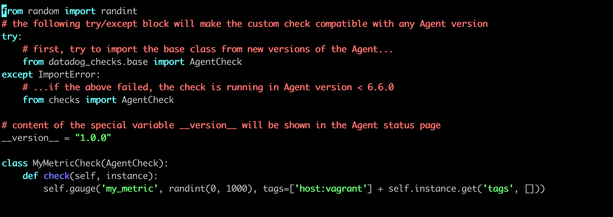
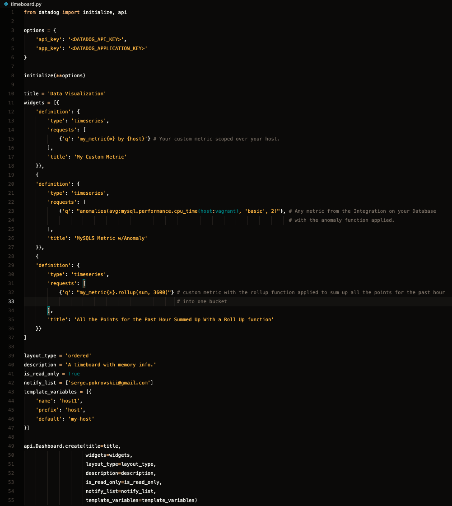
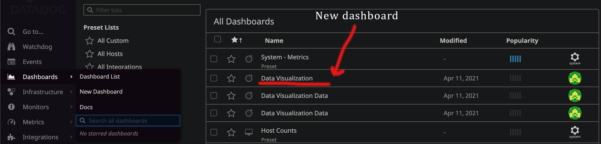
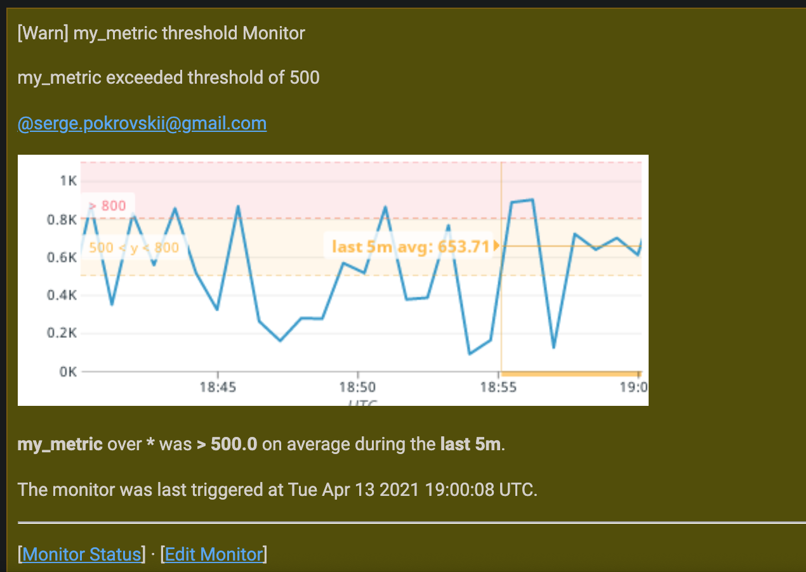
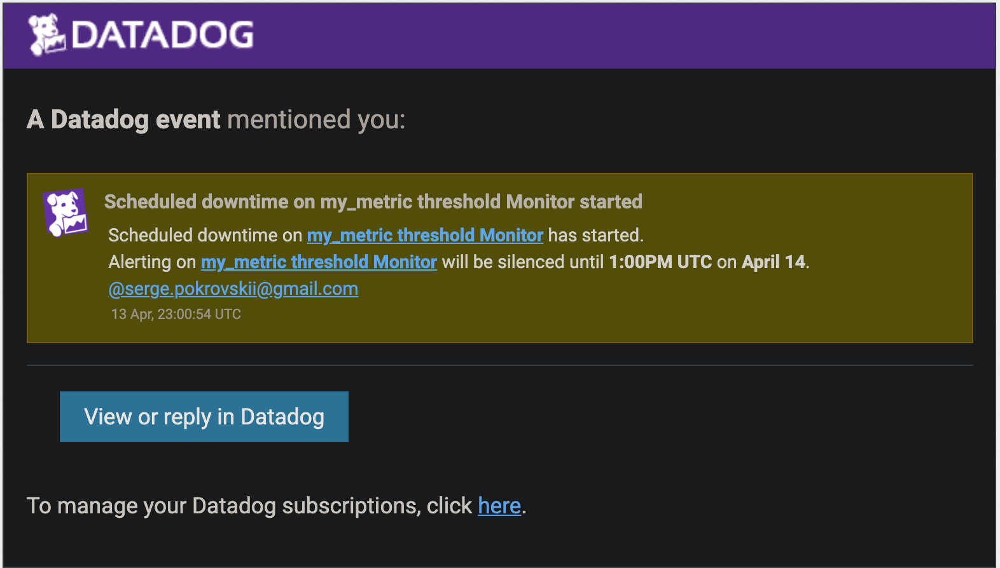
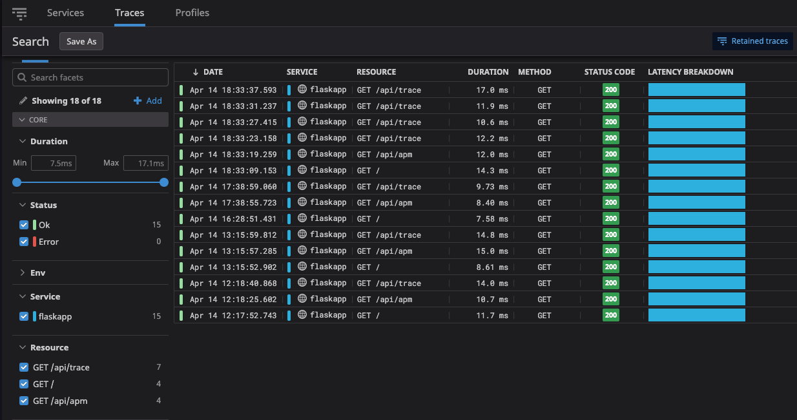

## Prerequisites - Set Up the Environment

### Environment
* OS: macOS Catalina 10.15.16
    * Vagrant 2.2.15
    * Ubuntu 18.04
    * MySQL DB 14.14

#### VM Setup

For the initial setup I followed the recommendations from the instructions of the technical exercise and spun up a fresh linux VM via Vagrant. 

First I downloaded [Vagrant](https://www.vagrantup.com/downloads)
After running the installation package I followed the steps of the vagrant installer: 


After the successful vagrant installation in the terminal I ran command `vagrant init hashicorp/bionic64` - this creates a basic Ubuntu 64 bit box that should be sufficient for running the Datadog Agent and completing the technical exercise. 

Next I started the environment by running command `vagrant up` 


### Agent Installation

Then it was time to install the Datadog Agent on my new environment. 

On the https://docs.datadoghq.com/agent/ page I selected the platform where I would run the Agent, in my case I chose Ubuntu.  There I found a link to installation instructions. 

By using an easy one-step install command I was able to successfully install the Agent. 


`DD_AGENT_MAJOR_VERSION=7 DD_API_KEY={DD_API_KEY} DD_SITE="datadoghq.com" bash -c "$(curl -L https://s3.amazonaws.com/dd-agent/scripts/install_script.sh)"`


To confirm that the Agent was installed and running I ran `sudo datadog-agent status`


#### Additional Hosts
I also created two additional hosts so I could explore the differences of configuring Datadog on different environments. I used AWS EC2 for creating two instances, one for Windows Server 2019 and one for Amazon Linux. I used Windows Server for exploring installation with the Datadog Agent installer and Amazon Linux for learning about the Docker Agent set up.

So in total I had three hosts with the following set ups: 

| Vagrant | AWS EC2              | AWS EC2      |
| ------- | -------------------- | ------------ |
| Ubuntu  | Windows Server 2019  | Amazon Linux |
| MySQL   | MongoDB              | Docker       |    


## Collecting Metrics 

### Adding tags
#### Ubuntu
I started with reading about tags at https://docs.datadoghq.com/getting_started/tagging/. I learned that tagging is basically a method to observe aggregate data points and that allows correlation and call to action between metrics, traces and logs by binding different data types. I also learned what tag keys are available. 

For Vagrant with Ubuntu I had to add tags in the Agent config file. 
I navigated to `/etc/datadog-agent` and modified `datadog.yaml` file by adding the following:
```
tags:
  - user: admin
  - hostname: spokrovskii
  - role:webserver
  - app:backend
```

As a result I was able to see the added tags on the Host Map page in DataDog. 
UI also gives the ability to add custom tags under the `User` and so I added `os:ubuntu` and `email:serge.pokrovskii@gmail.com`.


#### Windows Server 2019
With Windows Server I was able to add tags via the Data Dog Agent Manager. 
I downloaded the Datadog installation file for Windows [from here](https://docs.datadoghq.com/agent/basic_agent_usage/windows/?tab=gui) and installed it by following the prompts, accepting the license agreement, and entering the Datadog API Key. 
After that I had to launch the Datadog Manager. I opened the `Command Prompt` application and ran `"%PROGRAMFILES%\Datadog\Datadog Agent\embedded\agent.exe" launch-gui`.
As a result a browser window opened with the Data Dog Agent Manager and I selected the `Settings` tab and in the list I found `tags`.
I added an array of tags, clicked `Save` and `Restart Agent`.


#### Docker
For Docker, in order to add tags I used the REST API. I created a script that I ran in my terminal:
```
curl -X POST "https://api.datadoghq.com/api/v1/tags/hosts/i-0f5bd5bfd76315b1e" \
-H "Content-Type: application/json" \
-H "DD-API-KEY:API-KEY" \
-H "DD-APPLICATION-KEY: APPLICATION-KEY"\
-d '{ "host": "i-0f5bd5bfd76315b1e", "tags": ["environment:development", "OS:Amazon Linux", "container:Docker"]}'
```
As a result, I saw the tags appear under the user section.


### Installing Databases
#### MySQL Database for Ubuntu
I used a MySQL database for Ubuntu on Vagrant. 
To install the database I ran: 
` sudo apt install mysql-server ` which installs MySQL server
` sudo service mysql start ` which starts the server

After the installation was complete I confirmed that the MySQL server was running by executing the `sudo systemctl status mysql.service` command


The next step was to integrate the Agent with the database. 

From reading the Datadog documentation (https://docs.datadoghq.com/integrations/mysql/?tab=host#data-collected) I learned that when using a MySQL server I needed to: 
* Create a database user for the Datadog Agent.
* Grant the user privileges. 

I created a user with the command `CREATE USER 'datadog'@'localhost' IDENTIFIED WITH mysql_native_password by 'datadog99';` where `datadog99` is the password.

The next step was to grant privileges: 
 `GRANT REPLICATION CLIENT ON *.* TO 'datadog'@'localhost' WITH MAX_USER_CONNECTIONS 5;`

`GRANT PROCESS ON *.* TO 'datadog'@'localhost';`

Then I needed to enable the metrics to be collected from the performance_schema database:
` show databases like 'performance_schema'; `
` GRANT SELECT ON performance_schema.* TO 'datadog'@'localhost'; `

#### MongoDB Database for Windows Server 2019

For Windows Server 2019 I installed a MongoDB database.

I used [documentation](https://docs.mongodb.com/manual/tutorial/install-mongodb-on-windows/) and [this article](https://medium.com/@LondonAppBrewery/how-to-download-install-mongodb-on-windows-4ee4b3493514) to install the MongoDB database.

First, I had to download the MongoDB MSI Installer Package. I followed the Installation Wizard instructions to install the MongoDB database. 
I added shortcuts to my bash profile so it would be easier to start mongoDB. 
```
alias mongod="/c/Program\ files/MongoDB/Server/4.4.5/bin/mongod.exe"
alias mongo="/c/Program\ Files/MongoDB/Server/4.4.5/bin/mongo.exe"
```

I started both `mongod` and `mongo` to run the DB. 
After that I created a user named "datadog" and gave permissions with the following command shell script: 

```
db.createUser({
  "user": "datadog",
  "pwd": "datadog99",
  "roles": [
    { role: "read", db: "admin" },
    { role: "clusterMonitor", db: "admin" },
    { role: "read", db: "local" }
  ]
})
```
In the Datadog Agent Manager I edited the `mongo.d/conf.yaml` file and added the following settings:
```
init_config:
instances:
   - hosts: 127.0.0.1:27017
   - username: datadog
   - password: datadog99
   - database: admin
```
After that I restarted the agent to apply the new settings. 
MongoDb appeared on the integrations page and on the Host Map



### MySQL Metric Collection

The next step was to set up the config file for Metric Collection.
In the directory `/etc/datadog-agent/conf.d/mysql.d` I edited the conf.yaml file to specify server, user, password and port: 


I restarted the Agent by running `sudo service datadog-agent restart`

### Create a Custom Agent Check

For this task I followed the documentation on how to write the Custom Agent check (https://docs.datadoghq.com/developers/write_agent_check/?tab=agentv6v7)

From there I learned that the names of the configuration and check files must match, so I created a check file with the name `my_metric.py` in the `/etc/datadog-agent/checks.d` directory and a configuration file `my_metric.yaml` in the `/etc/datadog-agent/conf.d` directory. 

### Changing check collection interval so that it only submits the metric once every 45 seconds

One of the requirements is to set my check's collection interval so that it only submits the metric once every 45 seconds. I was able to do that by adding `min_collection_interval` at an instance level:

```
   init_config:

   instances:
   - min_collection_interval: 45
```

I learned that `min_collection_interval: 45` does not mean that the metric is collected every 45 seconds, but rather that it could be collected as often as every 45 seconds.

I used the `hello.py` example from the documentation to write my own check file that satisfies the requirements of submitting a metric with a random value between 0 and 1000. 
In the check file I sent the metric `my_metric` on each call. I used the `randint` function to get a random value between 0 and 1000. The code of `my_metric.py` looks like this: 



After restarting the Agent by running `sudo service datadog-agent restart` I could see my changes on the `Metrics -> Explorer` page. In the Graph field I searched for `my_metric` and after selecting it from a dropdown I could see a diagram that shows the time when the call was submitted with a value from 0 to 1000. 


Another way to make sure that my custom metric was being collected was by running the command `sudo -u dd-agent -- datadog-agent check my_metric`. From the output I could see that my Check was running and had all the configs that I set up.


### Bonus Question
 Can you change the collection interval without modifying the Python check file you created?

I was able to change the collection interval by modifying the configuration `yaml` file and setting the `min_collection_interval` to the desired interval: 

```
   init_config:

   instances:
   - min_collection_interval: 45
```


## Visualizing Data:

### Creating a Timeboard with the Datadog API

The one difficulty I had was understanding the difference between a Timeboard vs a Dashboard. Once I understood that a Timeboard is a type of Dashboard I realized that I needed to look into the [documentation for the creation of a new Dashboard](https://docs.datadoghq.com/api/latest/dashboards/).

I decided to use a Python script, so I started with the installation of Python 3 and pip on my VM.

I followed [these instructions](https://linuxize.com/post/how-to-install-python-3-7-on-ubuntu-18-04/) to install Python 3 and [these instructions](https://linuxize.com/post/how-to-install-pip-on-ubuntu-18.04/) to install pip3. 

After that it was time to install the Datadog Library that was going to be used in the Python script: 
`pip install datadog`.

From the [API documentation](https://docs.datadoghq.com/api/latest/?code-lang=python) I realized that in order to access the Datadog programmatic API I had to use the Application key and the API key. 

I was able to access the API key by navigating to the `Integrations` page `API Keys` section. On the same `Integrations page` there is a section that refers to the `Teams page` for the creation of an application key. 

Once I had the keys I used the Python code example provided in the [Dashboards documentation](https://docs.datadoghq.com/api/latest/dashboards/) to create my own script. 

The `timeboard.py` file contains the following code (`timeboard.py' is also included in the repository as a separate file): 


 
 The options object contains the API key and the Application key. 

```
options = {
    'api_key': '<DATADOG_API_KEY>',
    'app_key': '<DATADOG_APPLICATION_KEY>'
}
```


`Options` are  passed to the `initialize` function that was imported from the `datadog` library

`initialize(**options)`

Starting from line 10 I defined the properties of the Dashboard that are going to be created: 

`title = 'Data Visualization'` is the name of the dashboard that is going to be created. That name is going to be used in the Datadog UI to find the dashboard on the dashboard list.

Next we have a `widgets` array. It contains the three widgets that were requested in the "Visualizing Data" section of the technical exercise: 
 * Your custom metric scoped over your host.
 * Any metric from the Integration on your Database with the anomaly function applied.
 * Your custom metric with the rollup function applied to sum up all the points for the past hour into one bucket
```
widgets = [{
    'definition': {
        'type': 'timeseries',
        'requests': [
            {'q': 'my_metric{*} by {host}'} # Your custom metric scoped over your host.
        ],
        'title': 'My Custom Metric'
    }},
    {
    'definition': {
        'type': 'timeseries',
        'requests': [
            {'q': "anomalies(avg:mysql.performance.cpu_time{host:vagrant}, 'basic', 2)"}, # Any metric from the Integration on your Database with the anomaly function applied.
        ],
        'title': 'MySQLS Metric w/Anomaly'
    }},
    {
    'definition': {
        'type': 'timeseries',
        'requests': [
            {'q': "my_metric{*}.rollup(sum, 3600)"} # custom metric with the rollup function applied to sum up all the points for the past hour into one bucket
        ],
        'title': 'All the Points for the Past Hour Summed Up With a Roll Up function'
    }}
]
```
Each widget consists of a `definition` object. That object contains `type`, `requests`, and `title` properties. 

`type` of course specifies the type of the widget.

`requests` specifies what kind of data is going to be displayed in the widget. For example, for the task to visualize "any metric from the Integration on your Database with the anomaly function applied" I decided to select the MySQL performance cpu time metric with the `Basic` [anomaly detection algorithm](https://docs.datadoghq.com/monitors/monitor_types/anomaly/) and a value of 2 bounds (standard deviations for the algorithm). 

For the "custom metric with the rollup function applied to sum up all the points for the past hour into one bucket," I used [these instructions](https://docs.datadoghq.com/dashboards/functions/rollup/) on how the `rollup` function works and how to to use it in the request. I used the rollup function with `sum` and `3600` arguments since I needed to sum up all the points for the past hour or 3600 seconds. 

`title` sets the title of the widget. 

Lines 39 through 47 are being used to set additional properties of the dashboard. On line 49 an API call is being made and all the above mentioned properties are passed to the call so they can be reflected on the Timeboard. 

After saving `timeboard.py` I ran `export DD_SITE="https://api.datadoghq.com/api/v1/dashboard" DD_API_KEY="<API-KEY>" DD_APP_KEY="<APP-KEY>"` and `python3 timeboard.py` to execute the Python file. 

After a successful execution I should be able to see the `Data Visualization` Dashboard name in the Dashboard list and access the Dashboard from `Dashboards` -> `Dashboard list` in the UI: 


#### Timeboard

By clicking on "Data Visualization" (name of the timeboard in the list) I could open the timeboard which looks like this:


The Timeboard can be accessed by following [this link](https://p.datadoghq.com/sb/r994pgswllop6yxx-aae689097938255beefc2e2edd446f2d).


### Timeboard's Timeframe and Snapshot


I set the Timeboard's timeframe to the past 5 minutes in the UI and took a snapshot and sent it to myself. 


I added the `@` notation to find my name in the list to send it to myself. 


### Bonus Question: What is the Anomaly graph displaying?

The graph is displaying a period of time when a metric is behaving differently than it has in the past, taking in account trends, seasonal, day-of-week, and time-of-day patterns. In other words, the anomaly graph is displaying the period of time when a metric doesn't match the prediction. It is well-suited for metrics with strong trends and recurring patterns.

## Monitoring Data
### Create a new Metric Monitor that watches the average of your custom metric (my_metric) and will alert if it’s above the following values over the past 5 minutes:
* Warning threshold of 500
* Alerting threshold of 800
* And also ensure that it will notify you if there is No Data for this query over the past 10m.

To create a new Metric Monitor in the Datadog Application I selected `Monitors` -> `New Monitor` -> `Metric`

In the opened page I selected the metric `my_metric`, warning threshold of 500 and alerting threshold of 800. I also made sure that it will notify me if there is data missing for more than 10 minutes. 


### Configure the monitor’s message so that it will:
* Send you an email whenever the monitor triggers.
* Create different messages based on whether the monitor is in an Alert, Warning, or No Data state.
* Include the metric value that caused the monitor to trigger and host ip when the Monitor triggers an Alert state.

Using the [Notifications documentation](https://docs.datadoghq.com/monitors/notifications/?tab=is_alert) I was able to configure the monitor's message so that it will create different messages based on whatever the monitor triggers by using [conditional variables](https://docs.datadoghq.com/monitors/notifications/?tab=is_alert#conditional-variables): 

* Warning threshold of 500:
```
{{#is_warning}}my_metric exceeded threshold  of 500{{/is_warning}}
```
* Alerting threshold of 800
For displaying the host ip I used the tag variable `{{host.ip}}`
```
{{#is_alert}}my_metric exceeded threshold of 800, my_metric is {{value}}, IP Address: {{host.ip}} {{/is_alert}} 
```
After adding myself to the notification list my email was added to the end of the message `@serge.pokrovskii@gmail.com`
```
{{#is_no_data}}Data is missing for more than 10 minutes{{/is_no_data}} @serge.pokrovskii@gmail.com
```


Screenshot of the email that monitor sent: 


### Bonus Question: Since this monitor is going to alert pretty often, you don’t want to be alerted when you are out of the office. Set up two scheduled downtimes for this monitor:
* One that silences it from 7pm to 9am daily on M-F,
* And one that silences it all day on Sat-Sun.
* Make sure that your email is notified when you schedule the downtime and take a screenshot of that notification.

For downtime management I navigated to `Monitors` -> `Manage Downtime` and clicked `Schedule Downtime`


To schedule downtime for Mon-Fri I had to specify the monitor, metric, start date, days of the week, and time. I left out Group Scope because by default it includes all groups: 


To schedule downtime for Sat-Sun I had to specify all the same fields except the days of the week and time were different: 


Once the scheduled downtime started I received an email notification: 


## Collecting APM Data
* Given the following Flask app (or any Python/Ruby/Go app of your choice) instrument this using Datadog’s APM solution:

In order to use the provided flask application I had to create a Python file and add it to `etc/datadog-agent`. 


The next step was to install the flask library on Ubuntu by executing `pip3 install flask`


After that I was ready to move to the APM setup in Datadog. In the left menu I selected `APM` -> `Get Started`


In the opened window I selected `Host-Based`. Because I already had my Agent installed, I proceeded to the second step `Choose your language` where I selected `python`.


The next step was the installation of the Python client. After running `pip install ddtrace` I got an error:  
```
ModuleNotFoundError: No module named 'Cython'

    ----------------------------------------
Command "python setup.py egg_info" failed with error code 1 in /tmp/pip-build-yesr2sdd/ddtrace/
```
I noticed that I was missing the `Cython` module


`pip3 install cython` fixed the error and I was able successfuly install `ddtrace` 


However when I ran command `DD_SERVICE="flaskapp" DD_ENV="dev" DD_LOGS_INJECTION=true DD_TRACE_ENABLED=true ddtrace-run python3 flaskapp.py` 
I got an error: 
```
-bash: ddtrace-run: command not found
```
The solution was to run `sudo -H pip install ddtrace`.
After that I was able to run the flask app by running: 
` DD_SERVICE="flaskapp" DD_ENV="dev" DD_LOGS_INJECTION=true DD_TRACE_ENABLED=true ddtrace-run python3 flaskapp.py`

In order to send traces to Datadog I had to hit the service's endpoints. I started a new instance of Vagrant in a separate terminal window and used curl commands to hit endpoints. 
For every executed curl command I could see a `GET` request being generated in the terminal and the http response status code 200, which means the request was successful:
```
 vagrant ssh
 curl http://0.0.0.0:5050/
```

```
 curl http://0.0.0.0:5050/api/apm
```

```
 curl http://0.0.0.0:5050/api/trace
```


In the Datadog UI I could see the service that I just added by navigating to `APM -> Services` 


By clicking on the service I could see a detailed view:


To view Traces I clicked `APM -> Traces` in the left main menu or `Traces` in the top menu bar: 



### Bonus Question: What is the difference between a Service and a Resource?

From the documentation about [services](https://docs.datadoghq.com/tracing/visualization/#services) and [resources](https://docs.datadoghq.com/tracing/visualization/#resources) I learned that a Service groups together Resources for the purposes of scaling instances. A resource is a particular domain of an application (it could be a dynamic web endpoint, db query, background job etc), so in other words, a service is a group of resources.  

### Provide a link and a screenshot of a Dashboard with both APM and Infrastructure Metrics.
APM and Infrastructure Metrics:  https://p.datadoghq.com/sb/r994pgswllop6yxx-558bf013ffaf7828a1fe1b51cf857832


### Please include your fully instrumented app in your submission, as well.
For the auto instrumented application I used the provided Flask app that is added to the repository as flaskapp.py file

## Final question

### Is there anything creative you would use Datadog for?

Currently my wife and I are looking into building a house and selling our house, but the situation is a little tricky right now. Real estate prices of existing houses have been rising due to the lack of available homes on the market. Also prices on lumber and other materials have been volatile and rising significantly, which affects the price of building a house. Most builders right now are writing in a clause to allow for adjustments in home pricing due to the cost of materials being so unpredictable. Needless to say, we could definitely benefit from a way to monitor the housing market and material costs right now and I could use Datadog to help me do this.

In order to do this I could connect to an API that would report real estate data and an API that would report lumber and petroleum price data. Then I would set up Datadog to monitor that data and some unique metrics such as the price of building materials, as well as how long a house has been on the market in a certain area, what the asking price was vs the price that it was sold for, and the average difference between those two prices. I'm interested to see how those metrics will change over time and how that will affect the prices of real estate. I would use this to monitor the situation and keep me informed on how things are going so that I don’t miss out on the right time to act.
