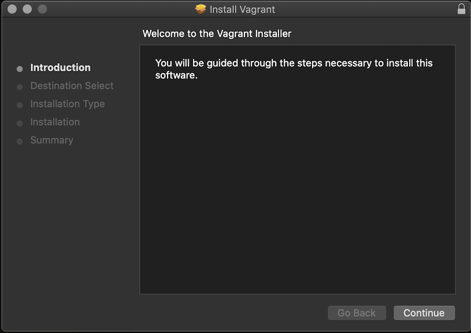
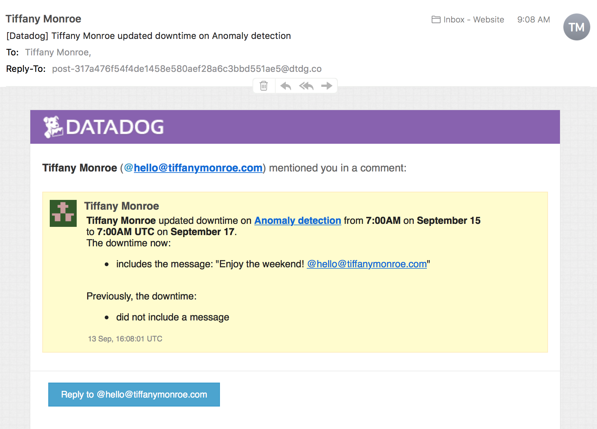
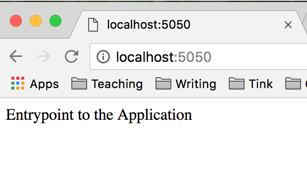

## Tiffany Monroe
Solutions Engineer Applicant

## The Exercise

Don’t forget to read the [References](https://github.com/DataDog/hiring-engineers/blob/solutions-engineer/README.md#references)

## Questions

Please provide screenshots and code snippets for all steps.

## Prerequisites - Setting up the environment

You can utilize any OS/host that you would like to complete this exercise. However, we recommend one of the following approaches:

* You can spin up a fresh linux VM via Vagrant or other tools so that you don’t run into any OS or dependency issues. [Here are instructions](https://github.com/DataDog/hiring-engineers/blob/solutions-engineer/README.md#vagrant) for setting up a Vagrant Ubuntu VM. We strongly recommend using minimum `v. 16.04` to avoid dependency issues.

    Installed Vagrant and VirtualBox.
    Followed Vagrant instructions.

    

    Then, sign up for Datadog (use “Datadog Recruiting Candidate” in the “Company” field), get the Agent reporting metrics from your local machine.

    Installed Agent.

    ```
    DD_API_KEY=ef6beb34bcb4b05c3ddca8d92b616d99 bash -c "$(curl -L https://raw.githubusercontent.com/DataDog/datadog-agent/master/cmd/agent/install_mac_os.sh)"
    ```

    


## Collecting Metrics:

* Add tags in the Agent config file and show us a screenshot of your host and its tags on the Host Map page in Datadog.

    Source: [Tags](https://docs.datadoghq.com/tagging/)

    I followed the tags in the config file for this exercise.

    

* Install a database on your machine (MongoDB, MySQL, or PostgreSQL) and then install the respective Datadog integration for that database.

    I already have MongoDB and PostgreSQL installed. I decided to use PostgreSQL for this exercise.

    Followed instructions from [Integrations](https://docs.datadoghq.com/integrations/postgres/):

    I could see that I needed a database named ```pg_stat_database```

    ```createdb pg_stat_database
    ```
    Used code from instructions.

    ```create user datadog with password '(generated password)';

    grant SELECT ON pg_stat_database to datadog;

    psql -h localhost -U datadog postgres -c "select * from pg_stat_database LIMIT(1);" &&
    echo -e "\e[0;32mPostgres connection - OK\e[0m" ||
    echo -e "\e[0;31mCannot connect to Postgres\e[0m"

    ~.datadog-agent/conf.d/postgres.d/conf.yaml.example
    ```

    Renamed file to match directions.

    ```
    mv conf.yaml.example conf.yaml
    ```

    

* Create a custom Agent check that submits a metric named my_metric with a random value between 0 and 1000.

    Sources: [Agent Check](https://docs.datadoghq.com/developers/agent_checks/),  [Random Value](https://www.pythoncentral.io/how-to-generate-a-random-number-in-python/).

    ```
    touch ~.datadog-agent/conf.d/my_metric.yaml ~.datadog-agent/checks.d/my_metric.py
    ```

    Modified 'Your First Check' code.

    

    Checked metric.

    ```
    datadog-agent check my_metric
    ```

    Response:

    


* Change your check's collection interval so that it only submits the metric once every 45 seconds.

    I started with ```min_collection_interval``` set at 20, following the Configuration directions, so I just changed it to 45. See image above.


* **Bonus Question** Can you change the collection interval without modifying the Python check file you created?

    You change the .yaml file.


## Visualizing Data:

Utilize the Datadog API to create a Timeboard that contains:


* Your custom metric scoped over your host.

    Sources: [Timeboards](https://docs.datadoghq.com/graphing/dashboards/timeboard/),
    [API](https://docs.datadoghq.com/api/?lang=python#timeboards),  [JSON](https://docs.datadoghq.com/graphing/graphing_json/)

    Modified sample code. See script below.

    Response:

    


* Any metric from the Integration on your Database with the anomaly function applied.

    Sources:
    [Anomaly Detection](https://docs.datadoghq.com/monitors/monitor_types/anomaly/), how to create a [monitor](https://docs.datadoghq.com/api/?lang=python#create-a-monitor), how to write the [query](https://docs.datadoghq.com/graphing/functions/algorithms/)

    Modified the anomaly query sample code. See script below.

    Response:

    

* Your custom metric with the rollup function applied to sum up all the points for the past hour into one bucket


    Sources: [Rollup Function](https://docs.datadoghq.com/graphing/functions/rollup/), [Timeboards](https://docs.datadoghq.com/api/?lang=python#timeboards)

    Since the graphs are an array of objects, I added to the array with a graph object containing the rollup function. See image above.


Please be sure, when submitting your hiring challenge, to include the script that you've used to create this Timeboard.

    [Timeboard Script](timeboard.py), [Anomaly Script](anomaly.py)

Once this is created, access the Dashboard from your Dashboard List in the UI:

* Set the Timeboard's timeframe to the past 5 minutes

    

* Take a snapshot of this graph and use the @ notation to send it to yourself.

    I couldn't see an option for a snapshot on this graph and the anomaly isn't showing up on my Timeboard graph.

    

    

* **Bonus Question**: What is the Anomaly graph displaying?

    The graph displays the metric (line) and the bounds (grey band) within a given timeframe.


## Monitoring Data

Since you’ve already caught your test metric going above 800 once, you don’t want to have to continually watch this dashboard to be alerted when it goes above 800 again. So let’s make life easier by creating a monitor.

Create a new Metric Monitor that watches the average of your custom metric (my_metric) and will alert if it’s above the following values over the past 5 minutes:

* Warning threshold of 500

* Alerting threshold of 800

    Used the GUI to create monitor.

      

* And also ensure that it will notify you if there is No Data for this query over the past 10m.

    

Please configure the monitor’s message so that it will:

* Send you an email whenever the monitor triggers.

* Create different messages based on whether the monitor is in an Alert, Warning, or No Data state.

    

* Include the metric value that caused the monitor to trigger and host ip when the Monitor triggers an Alert state.

* When this monitor sends you an email notification, take a screenshot of the email that it sends you.

    

* **Bonus Question**: Since this monitor is going to alert pretty often, you don’t want to be alerted when you are out of the office. Set up two scheduled downtimes for this monitor:

  * One that silences it from 7pm to 9am daily on M-F,

      

  * And one that silences it all day on Sat-Sun.

      


  * Make sure that your email is notified when you schedule the downtime and take a screenshot of that notification.

    

    


## Collecting APM Data:

Given the following Flask app (or any Python/Ruby/Go app of your choice) instrument this using Datadog’s APM solution:

```python
from flask import Flask
import logging
import sys

# Have flask use stdout as the logger
main_logger = logging.getLogger()
main_logger.setLevel(logging.DEBUG)
c = logging.StreamHandler(sys.stdout)
formatter = logging.Formatter('%(asctime)s - %(name)s - %(levelname)s - %(message)s')
c.setFormatter(formatter)
main_logger.addHandler(c)

app = Flask(__name__)

@app.route('/')
def api_entry():
    return 'Entrypoint to the Application'

@app.route('/api/apm')
def apm_endpoint():
    return 'Getting APM Started'

@app.route('/api/trace')
def trace_endpoint():
    return 'Posting Traces'

if __name__ == '__main__':
    app.run(host='0.0.0.0', port='5050')
```

* **Note**: Using both ddtrace-run and manually inserting the Middleware has been known to cause issues. Please only use one or the other.

    Sources: [Flask](http://flask.pocoo.org/docs/1.0/installation/#installation), [APM Setup](https://docs.datadoghq.com/tracing/getting_further/first_class_dimensions/),
    [Tracing Python Apps](https://docs.datadoghq.com/tracing/setup/python/)

    Enable trace collection for the DataDog Agent ```datadog.yaml```

    

    Install virtualenv ```python -m pip install virtualenv```

    Run ```virtualenv venv```

    Activate the environment ```. venv/bin/activate```

    Install Flask ```pip install Flask```

    ```
    python -m pip install ddtrace
    ```

    Run server ```ddtrace-run python app.py```

    Received error message:

    

    If I go to the local host, it's connected.

    

    

    Tried adding receiver port to the config file.

    <img src="img/receiver_port.png"

    Restart Agent. Still receiving error message.


* **Bonus Question**: What is the difference between a Service and a Resource?

    The difference is that a service is "a set of processes," but a resource is "a particular action for a service." [Source](https://docs.datadoghq.com/tracing/visualization/)

Provide a link and a screenshot of a Dashboard with both APM and Infrastructure Metrics.

Please include your fully instrumented app in your submission, as well.


## Final Question:

Datadog has been used in a lot of creative ways in the past. We’ve written some blog posts about using Datadog to monitor the NYC Subway System, Pokemon Go, and even office restroom availability!

Is there anything creative you would use Datadog for?

I think that colleges and universities could use Datadog for monitoring the campus parking situation, peak library usage, or even which classes need more sections offered.
