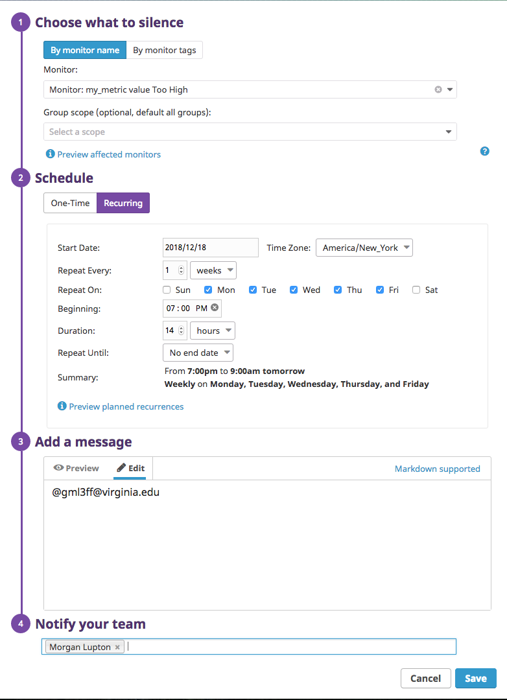
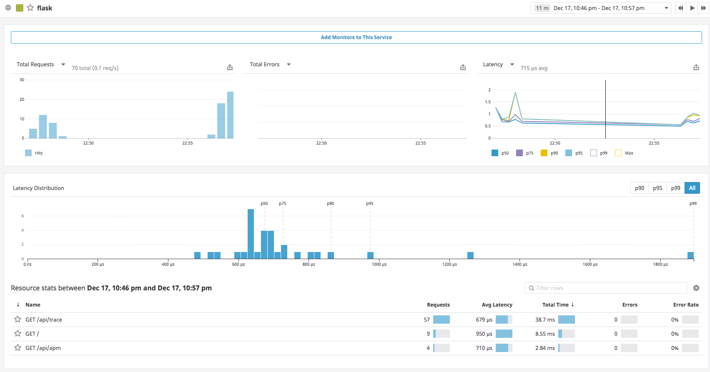

# Collecting Metrics

## Add tags in the Agent config file.

> Here are my host tags as they are configured in `/etc/datadog-agent/datadog.yaml`
```
...
# Set the host's tags (optional)
tags:
   - owner:mlupton
   - env:sandbox
...
```

## Show us a screenshot of your host and its tags on the Host Map page in Datadog.
### `ubuntu-xenial`

> Here's my host, it's a single Ubuntu instance I spun up on my MacBook with Vagrant.


*[Figure 1] Screenshot of Host from Host Map With Custom Host Tags `#env:sandbox`, and `#owner:mlupton`*


## Bonus Question - Can you change the collection interval without modifying the Python check file you created?

> Yes, it is possible to do this by creating a custom check config file for the check you've created. In my case, I created a directory at `/etc/datadog-agent/conf.d/my_check.d/`, where I stored a check file called `mycheck.yaml`. See the contents of this file below:
```
init_config:

instances:
  - min_collection_interval: 45
``` 


# Visualizing Data

## Utilize the Datadog API to create a Timeboard.

> I used the [script here](scripts/my_metric-timeboard.sh) to issue two separate `POST` requests. One [to create the timeboard](scripts/timeboard.json) itself, and the other [to create the anomaly monitor](scripts/monitor.json) for MySQL's CPU usage. Below are the details as they relate to the bullet points listed in the exercise. 


### _Your custom metric scoped over your host._

> The graph below is a screenshot of the custom metric, `my_metric`  being graphed as a timeseries. 


*[Figure 2] `my_metric`'s value graphed over one hour*


### _Any metric from the Integration on your Database with the anomaly function applied._

> This ended up being more difficult than I originally expected. The `anomalies()` function requires the creation of a separate monitor, which requires a separate API request altogether. Although linked above, I've provided the contents of that request below for additional clarity.

monitor.json
```
{
      "type": "metric alert",
      "query": "avg(last_1h):anomalies(avg:mysql.performance.user_time{*}, 'basic', 3, direction='above', alert_window='last_30s', interval=30, count_default_zero='true', timezone='America/New_York') >= 1",
      "name": "MySQL CPU Anomaly Monitor",
      "message": "Unsual CPU activity by MySQL.",
      "tags": ["service:mysql", "host:ubuntu-xenial"],
      "options": {
        "notify_no_data": true,
        "no_data_timeframe": 20
      }   
}
```

> The important piece in the request above is the `"query"` value, which performs the actual check for MySQL's CPU anomaly (See below).
 

`avg(last_1h):anomalies(avg:mysql.performance.user_time{*}, 'basic', 3, direction='above', alert_window='last_30s', interval=30, count_default_zero='true', timezone='America/New_York') >= 1`


> So how did I incorporate this into the timeboard? I created a timeseries graph of the Percentage of CPU time spent in the user space by MySQL, and added a query to the `events` block that would return events triggered by the `MySQL CPU Anomaly Monitor` I created earlier. You can see this section of the timeseries API request below. 


timeseries.json
```
{
      "graphs" : [
...
        {
          "title": "MySQL CPU Time",
          "definition": {
              "events": [{"q": "MySQL CPU Anomaly"}],
              "requests": [
                  {"q":"avg:mysql.performance.user_time{*}"}
              ],
              "viz": "timeseries"
          }
        },
...
      ],
...
```

> The query below matches on the monitor's title and reports anomalies on the graph based on deviations from expected behavior. 

`"events": [{"q": "MySQL CPU Anomaly"}],`


> Here's what the anomaly graph actually looks like. I triggered MySQL anomalies by [running a script](scripts/select_abunch.sh) that spammed the DB with a large number of `SELECT` queries. You can see the anomalies highlighted in red on the graph below. 


*[Figure 3] Anomalous MySQL events after executing `select_abunch.sh`*

### _Your custom metric with the rollup function applied to sum up all the points for the past hour into one bucket._

> To do this, I created an additional query value widget that added up all the datapoints over the past 3600s (last 1 hour). As recommended in the API docs, generating the JSON from the dashboard is far easier than attempting to to do it all manually. You can see the relevant JSON block for this graph below [as it appears in timeboard.json](scripts/timeboard.json#L14).

```
...  
      {
          "title": "Sum of my_metric Values Over One Hour",
          "description": "Adds up the value of my_metric over an hour in one bucket",
          "definition": {
              "events": [],
              "viz": "query_value",
              "requests": [
                {
                  "q": "sum:my_metric.value{host:ubuntu-xenial}.rollup(sum, 3600)",
                  "type": null,
                  "style": {
                      "palette": "dog_classic",
                      "type": "solid",
                      "width": "normal"
                  },
                  "conditional_formats": [
                      {
                        "comparator": ">",
                        "palette": "white_on_red",
                        "value": null
                      },
                      {
                        "comparator": ">=",
                        "palette": "white_on_yellow",
                        "value": null
                      },
                      {
                        "comparator": "<",
                        "palette": "white_on_green",
                        "value": null
                      }
                  ],
             "aggregator": "avg"
            }
          ],
          "autoscale": true
       }
...
```

> Here's what an averaged out value of this bucket looked like over the course of 24 hours.  


*[Figure 4] Query Value Widget Showing Average of `my_metric`'s 1 Hr Sum Over 24 Hours*


### _Set the Timeboard's timeframe to the past 5 minutes._

> I changed the timeboard's timeframe to the past 5 minutes by clicking and dragging across the last 5 minues on one of the timeseries graphs. This works regardless of which timeseries graph you do this to. 


*[Figure 5] My Timeboard With a 5 Minute Timeframe*


### _Take a snapshot of this graph and use the @ notation to send it to yourself._

> I'm assuming that "Take a snapshot of this graph" was intending to say "Take a snapshot of this timeboard," as that's the context we're working in at this point in the exercise. I created a cloned version of the timeboard called "Morgan's My Vagrant Host Metrics," then clicked the Gear Icon underneath the play/pause button, then selected Notifications. From there I added my e-mail using the @ notation so updates would be sent to me. The Notifications window is listed below. 


*[Figure 6] Notifications Setting To Send Updates With @ Notation*


## Bonus Question - What is the Anomaly graph displaying?

> The Anomaly graph tracks anomalies in the percentage of CPU time spent in the user space by MySQL within 3 standard deviations of the mean (as calculated over the past hour). It's a bit of mouthful, but basically anytime the percentage of CPU time exceeds the average of the past hour for more than 30 seconds, a monitor is triggered, resulting in the red highlighted portions of the graph you see above.  

# Monitoring Data

## Create a new Metric Monitor that watches the average of your custom metric (my\_metric) that will alert on specified warning, alert, and no data thresholds. 

> Using the monitor creation wizard (Manage Monitors > New Monitor), I entered the thresholds below for warning, alert, and no data notifications.


*[Figure 7] Threshold Config For Metric Monitors*

## Configure the Monitor's Message.

> I used the conditional variables [mentioned here](https://docs.datadoghq.com/monitors/notifications/?tab=is_alertis_warning#message-template-variables) to set different messages for the alert, warning, and no data thresholds separately. I added myself to the `Notify Your Team` text box in order to send an e-mail to myself. 


*[Figure 8] Notification Setting in Metric Monitor*


> Here's a screenshot from the e-mail I received when the alert was triggered.


*[Figure 9] Alert E-mail Contents*

## Bonus Question - Configure two scheduled downtimes for your monitor.

> First thing I had to do for this step was change the drop down in the "Notify your Team" section of the "Edit Monitor" view such that I would be alerted whenever the alert was modified. 


*[Figure 10] Notify Dropdown Setting*

> Scheduled downtime appears in a totally different view. I configured Scheduled Downtime by navigating to Monitors > Manage Downtime > Schedule Downtime. You can see the settings for both monitors below. 



*[Figure 11] Monitor for M-F Downtime*


*[Figure 12] Monitor for Saturday/Sunday Downtime*

> Here's the e-mail I received related to this scheduled downtime. 


*[Figure 13] Downtime Email*

# Collecting APM Data

> I used the Python code provided to create a Python script named `example_app.py`, installed Flask with `pip`, and changed the following settings in `datadog.yaml` so that the trace agent could track the behavior of my application.

```
...
# Trace Agent Specific Settings
#
apm_config:
#   Whether or not the APM Agent should run
  enabled: true
#   The environment tag that Traces should be tagged with
#   Will inherit from "env" tag if none is applied here
  env: sandbox
#   The port that the Receiver should listen on
  receiver_port: 8126
...
```

> After restarting the datadog-agent, I started the application by issuing `ddtrace-run python example_app.py`. I issued a series of curl statements on the host `0.0.0.0` at port `5050` where the application was running, the app began reporting to APM shortly thereafter, populating information in the dashboard below.



*[Figure 14] APM Dashboard of Flask App `example_app.py`*


## Bonus Question - What's the difference between a Service and a Resoure?

> A service is a set of processes that do the same job (e.g. a group of processes that perform database functions). A resource is a particular action for a service (e.g. a query against a database service, like a SELECT statement). 

# Final Question

> As a big music fan, it could be cool to track either pricing trends for records or release trends for labels, genres and artists over time. Discogs, my former employer, actually provides a public API with every entry in their database. It wouldn't be all that difficult to ingest data from there or from another music-related public REST API (like Spotify). I think the biggest challenge here would be staying within the rate-limit rules these companies have for accessing their data. If you could overcome that, you could see some very interesting results.
