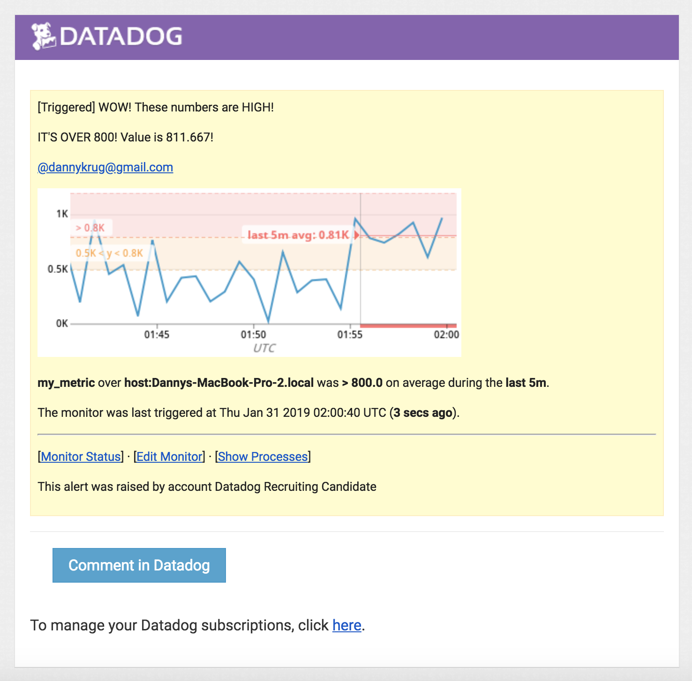
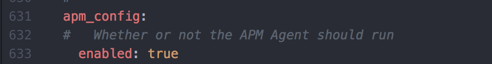

#SETTING UP THE DATADOG AGENT:

I started by exploring both spinning up a, Unbuntu VM with Vagrant as well as just doing a normal Mac OSX setup. I got the Datadog agent running on both the VM and my local Mac. In the end, I decided to go with OSX just due to my familiarity with it. I followed the instructions to install the Datadog agent on Mac via the command line with: DD_API_KEY=2ade393bb089f741e8781a2b4ab182c5 bash -c "$(curl -L https://raw.githubusercontent.com/DataDog/datadog-agent/master/cmd/agent/install_mac_os.sh)"

The agent was up and running fairly quickly.

System dashboard: https://app.datadoghq.com/dash/integration/1/system---metrics?tile_size=m&page=0&is_auto=false&from_ts=1548956580000&to_ts=1548960180000&live=true

#COLLECTING METRICS:

I followed the documentation that instructed me to add tags by editing the Datadog.yaml file in the Datadog-agent folder on my machine. The tags didn’t immediately appear, and after some searching and experimenting, I stopped the agent and restarted it. Upon restarting the agent the tags appeared in both my feed and in the Host Map.

Next up was linking Datadog with Postgres. I’m most familiar with Postgres as it’s what I use to build databases for the Rails backends on most of my apps. I installed the integration through the Integrations menu and then followed the instructions to link it up with my database. Here is my updated Host Map.

Postgres dashboard link: https://app.datadoghq.com/dash/integration/17/postgres---metrics?tile_size=m&page=0&is_auto=false&from_ts=1548956580000&to_ts=1548960180000&live=true

To set up the custom check, I followed the Datadog documentation and created a my_metric.py file in the checks.d directory. I followed the documentation to get a basic check set up and then modified it to have it generate the random value. Initially the my_metric.yaml file in the conf.d directory just included the bare minimum of “instances: [{}]” but then reading further down the documentation I added the collection interval as instructed by the documentation and changed the min_collection_interval to 45. I initially checked to make sure my custom check was working through the “datadog-agent status” command and then dove a little deeper with the “datadog-agent check my_metric” command to get specific info on what was running in the check.

BONUS: The collection interval is controlled through the my_metric.yaml file, so to change the interval there’s no need to touch the python file. One can simply just change the number of the min_collection_interval to edit the collection interval.

#VISUALIZING DATA:

Diving into the Datadog API documentation I first started by getting my API key and creating an APP key as well, both through the integrations tab. After that I fast forwarded to the Timeboards section of the documentation. For starter code, I began with the code sample provided in the documentation and altered it to my needs.

I zoomed in using the alt + ] command until the graph showed 5 minutes, and then used the snapshot function to send the graph to myself with the @ notation.

Link to timeboard: https://app.datadoghq.com/dash/1062334/test-timeboard?tile_size=m&page=0&is_auto=false&from_ts=1548956520000&to_ts=1548960120000&live=true

BONUS: The Anomaly graph is highlighting any points of data that fall out of the normal range. Since my Postgres database is generally pretty quiet, the Anomaly graph isn’t triggering much activity. However if I switch it to monitor the my_metric, it will highlight red if the integer returned is extremely high or low.

#MONITORING DATA:

The easiest way to work on the data monitor was to set it up through the UI. I’m aware that I could have done it by writing a script and running that, but in terms of ease of use and also a desire to learn the system, I decided that the UI would be good for this challenge. I went into the monitors section, clicked “New Monitor” and set the monitor up like so:

After setting up the monitor, I started receiving email alerts about the monitor almost immediately:

I further edited the monitor to include the value if the alert was triggered

BONUS:

Setting up the scheduled downtime for when I’m out of office was fairly simple as well. I went into the Monitors tab and clicked “Manage Downtime,” then clicked the “Schedule Downtime” button and filled out the form so that it would run the downtime from 7pm-9am M-F and all day on Saturday and Sunday. I initially just scheduled the nightly downtime to run every day, figuring that it would overlap with the weekend downtime and everything would work out fine. However, I went back in and edited the nightly downtime to be recurring M-F weekly.

#COLLECTING APM DATA:

At first I attempted to run the flask code that was given in the demonstration. I followed all documentation on the Datadog site instructing me on how to get it all set up. After a while of no trace info appearing, I figured something must be wrong. I switched it up to use a language that I’m more familiar with, Ruby on Rails.

I started by creating a simple Rails app that could create users and store their data in a Postgres db. I then followed the documentation in the APM section of the UI by installing the ddtrace gem and creating the Datadog.rb file in my initializers folder. I ran the app, restart the agent and waiting for the traces to start appearing “shortly” like the APM page mentioned. Upon further inspection, I realized that in order to enable APM on MacOS, I needed to use the separate trace agent file that was available. I found the documentation on that, downloaded the file and attempted to run the file according to the Datadog documentation. I was swiftly hit with an error, so I tried to access it from the trace-agent file directly and was given permission denied.

My Rails app was running with the correctly installed gem and initializer file as instructed, I had downloaded the trace-agent files and I was attempting to run them as instructed by the docs. Yet none of it was clicking. I’ve included screenshots below showing my files and my process. I’m sure whatever the solution is to get this running properly is the type of thing that once I see it done one time, I’ll be able to do it no problem from then on out. The Ruby files are attached in this repo.

I revisited the challenge with the Ubuntu VM that I had spun up all the way back at the beginning. I linked my VM with my local machine through an atom extension so I could edit files in my local text editor. After the file was all setup, I had to edit the Datadog.yaml file to include the code needed to tell the APM to run. I edited the file in the VM using VIM, saved it and booted up the flask app, I also restarted the Datadog agent on the VM. When that didn’t work, I went back to the documentation. I made sure that ddtrace was installed and I tried both versions of configuring tracing manually within the file as well as just using the command line “ddtrace-run” command. I kept getting an error of “ddtrace-run: command not found” which doesn’t make sense because when I install ddtrace it tells me that everything is installed. I checked my version of python to make sure it was compatible with ddtrace and I was on 2.7 which the docs say should be compatible. I upgraded my version of Python to 3.7, made sure ddtrace was up to date, tried to run it again and it still hit me with “command not found.”

Returning to the VM, I tried to run the ruby app to see if that would work, I ran into a lot of problems with gem installation and Ruby versions on the VM. I updated the ruby version as needed on the VM and still the gems wouldn't install properly. It seems that the issue here was the configuration of Ruby and Rails on the VM. I tried following the error messages to the documentation for the gem installation and was stalled out when it directed me to a 404 page on github.

I'm certain that this is the type of thing that once I figure out how to do it once on both MacOS and Ubuntu that I'll be able to replicate it again and again without issue. However, at this current point, without extra guidance, I'm hitting a hard roadblock despite trying every available option that I can think of. 

#FINAL QUESTION:

I think what I’d like to use Datadog to monitor for is both sneaker and concert ticket resale markets. As someone who buys and sells a lot of sneakers, it would be nice to monitor that market across different retailers (StockX, Stadium Goods, Flight Club, etc.) basically anyone that makes their info available online so you could track trends in sneakers as well as track sales prices for anything in my personal inventory. With a visualization of the price of a shoe over time (and also histories of similar shoes), it would aid in figuring out the best time to sell the shoe. Similar to a stock monitor but for sneakers. The same could apply to concert tickets on sellers like Stubhub. I’m a frequent fan of trying to buy really cheap tickets to a show or game day of event. Setting up a monitor with an alert that activates in real time could help score those really cheap last minute tickets faster than whatever email notification service Stubhub already has in place.
