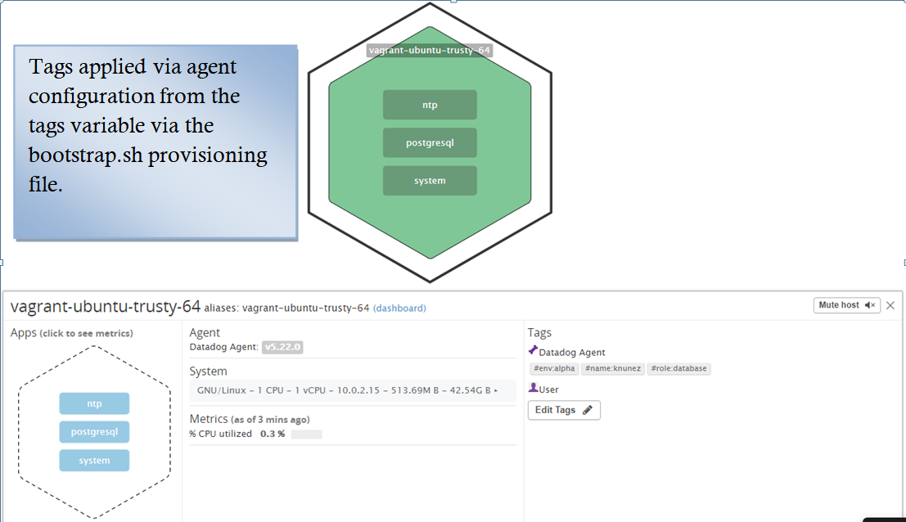
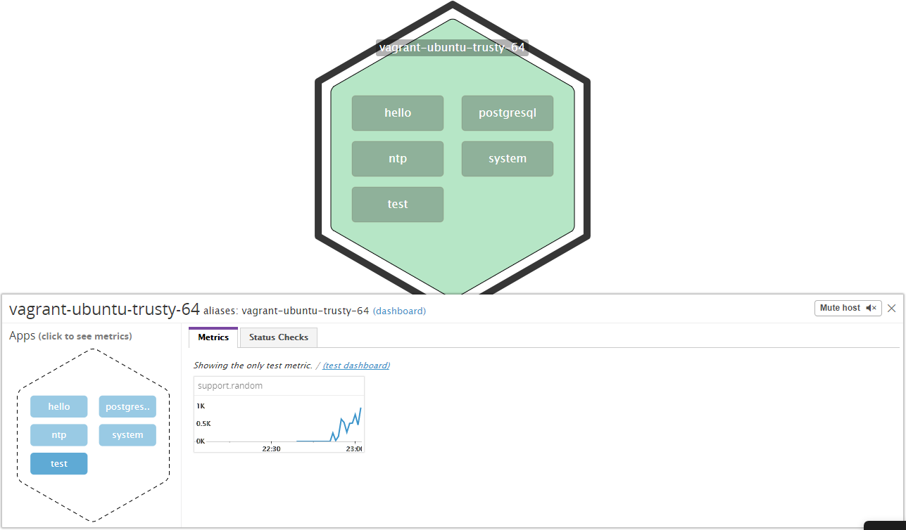
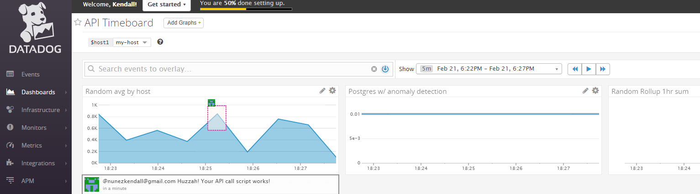

# Datadog Solutions Engineer Exercise

This is a Technical exercise for the Solutions Engineering interview
process at Datadog.

Datadog is a monitoring service which allows you to quickly collect
data, visualize it and monitor your infrastructure at any scale. It does
this by collecting data from over 200 out of the box integrations
allowing you to install the Datadog agent everywhere - every server,
instance, VM & node container-running host to start the metrics flowing
to the Datadog backend. You may also submit custom application metrics by
writing your own agent check and capture the data critical for your
application or service.

Datadog allows you to visualize all of this data within the Datadog web
application. You can utilize the metrics explorer to search for a given
metric and watch its behavior. View / comment on events such as
application deployments as the data comes into the event stream. Filters
and custom Screenboards may also be configured so that you may see the
data they way you would like to in order to identify anomalies, outliers
or forecasts for your infrastructure.

In addition Datadog allows you to monitor your infrastructure wherever
it may live and identify problem areas or issues per your metrics using
Monitors. You may configure email, Slack or HipChat integrations to
receive notifications of any issues which have or are occurring. You may
also silence the alerts or schedule downtime so that in the event of a
maintenance window you are now spammed by alerts.

Go to [https://www.datadoghq.com/](https://www.datadoghq.com/) for more
information!

## Table of Contents

-   [Setup an Ubuntu VM](#setup-an-ubuntu-vm)

-   [Collecting Data](#collecting-data)

    -   [Installing the Agent](#installing-the-agent)

    -   [Configuring Tags](#tagging)

    -   [Installing and Monitoring PostgreSQL](#installing-and-monitoring-postgresql)

    -   [Writing a Custom Agent Check](#writing-a-custom-agent-check)

-   [Visualizing Data](#visualizing-data)

    -   [Creating a Timeboard](#creating-a-timeboard)

    -   [Custom Metic](#custom-metric)

    -   [Anomaly Funcion](#anomaly-function)

    -   [Rollup Function](#rollup-function)

-   [Monitoring Data](#monitoring-data)

    -   [Create a Monitor](#create-a-monitor)

    -   [Email Screenshot](#email-screenshot)

    -   [Schedule Down Time](#schedule-down-time)

-   [Collecting APM Data](#collecting-apm-data)

# Setup an Ubuntu VM

For this we will be utilizing two tools called
[Vagrant](https://www.vagrantup.com/) &
[Virtualbox](https://www.virtualbox.org/), vagrant is a tool for
building and managing development environments. Its a simple and
powerful way to manage virtual machines enforcing consistency across
multiple platforms. VirtualBox is a powerful x86 and
AMD64/Intel64 [virtualization](https://www.virtualbox.org/wiki/Virtualization) product
for enterprise as well as home use.

-   [Install Vagrant](https://www.vagrantup.com/docs/installation/) for
    your operating system.

-   [Installing Virtualbox](https://www.virtualbox.org/wiki/Downloads)
    for your operating system.

-   Clone this repository to your local workstation

    -   git clone
        [https://github.com/knunez/hiring-engineers.git](https://github.com/knunez/hiring-engineers.git)

-   Within the same directory goto the `scripts` folder inside the cloned repository run the
    following command: `vagrant up` This will trigger vagrant to provision
    an ubuntu 14.04

-   Upon first run `bootstrap.sh` will require several parameters:
```bash
    -   your\_api\_key=''

    -   username=''

    -   password=''
```
-   Without these the VM will still start however the following will not
    be installed or configured:

    -   Datadog Agent will not be installed.

    -   The database user for the Datadog agent will not be configured.

    -   PostgreSQL integration will not be configured.

-   You may run `vagrant provision` after the fact to execute the
    `bootstrap.sh`

-   You may now utilize vagrant ssh or ssh with your preferred terminal
    emulator to `vagrant@localhost:2222`, you will now be connected to the
    VM with a command prompt.

-   You may exit by simply typing exit at the prompt.

# Collecting Data
> Bonus question: In your own words, what is the agent?

All monitoring solutions rely on collected data to monitor and alert.
Datadog has a few ways in which to obtain this data, primarily however
this is obtained via the Datadog agent. The Datadog agent is software
which runs on the host and collects data metrics and events which it
then transmits back to Datadog.

## Installing the Agent

Datadog provides step-by-step guides for most common operating systems
which you may see
[here](https://app.datadoghq.com/account/settings#agent). There is a one
line installation script which may be used to install the Datadog agent
for your operating system however this may also be utilized to script
the installation of the agent in a bootstrap or launch script.

Example:

*DD\_API\_KEY=\$YOUR\_API\_KEY bash -c "\$(curl -L
[https://raw.githubusercontent.com/DataDog/dd-agent/master/packaging/datadog-agent/source/install\_agent.sh](https://raw.githubusercontent.com/DataDog/dd-agent/master/packaging/datadog-agent/source/install_agent.sh))"*

Below I have included an excerpt from the included bootstrap configuration
file demonstrating the automation of the Datadog agent. This will only
run on initial `vagrant up` or `vagrant provision`.
```bash
\#!/usr/bin/env bash

\# Input your information here

your\_api\_key=''

username=''

password=''

\# Check for API key.

if [ -z "\$your\_api\_key" ]

then

echo \>&2 "Your API Key is missing, The datadog agent will not install /
Run."

fi

\# Create a Variable for tags formatted as a string or list

tags="name:knunez, env:alpha, role:database"

apt-get update

\# Install desired packages, if already installed nothing will be done.
(This will install the latest version, keep in mind if you require a
specific version of a package.)

apt-get install -y git htop

\# Install / Configure DataDog Agent.

if dpkg-query -W datadog-agent; then

echo \>&2 "Datadog is already installed."

else

DD\_API\_KEY=\$your\_api\_key bash -c "\$(curl -L
https://raw.githubusercontent.com/DataDog/dd-agent/master/packaging/datadog-agent/source/install\_agent.sh)"

fi
```
-   Be sure to input your Datadog API Key in `bootstrap.sh`

    -   Edit `bootstrap.sh`

        -   `Your\_api\_key='Enter API Key Here'`

-   Running `vagrant provision` while the vm is still running will execute
    the bootstraph.sh, install your Datadog Agent and populate the API
    Key to begin the transmission of data.

-   Once this step is complete you may go to your [Infrastructure Host
    Map](https://app.datadoghq.com/infrastructure/map) to see that the
    agent is indeed reporting back to Datadog.

-   A successful initial `vagrant up` or `vagrant provision` should give you
    the following:

## Tagging
> Add tags in the agent config file and show us a screenshot of your host and its tags on the Host Map page in Datadog.

Tagging is used throughout the Datadog product to make it easier to
subset and query the machines and metrics that you have to monitor.
Below I will include an excerpt from `bootstrap.sh` which allows you to
configure the tags in an automated way.
```bash
\# Create a Variable for tags formatted as a string or list

tags="name:your\_name, env:your\_env, role:your\_role"

\# Backup current datadog.conf and set tags in configuration according
to variabl

if [ -e /etc/dd-agent/datadog.conf ]

then

sudo sh -c "sed -i.bk 's/\^.\* tags:.\*/ tags: \$tags/'
/etc/dd-agent/datadog.conf"

else

echo \>&2 "Datadog.conf was missing, setting DD\_API\_KEY & tags"

sudo sh -c "sed 's/\^.\* tags:.\*/ tags: \$tags/'
/etc/dd-agent/datadog.conf.example \> /etc/dd-agent/datadog.conf"
```
-   This excerpt will do the following

    -   Allow you to predefine the desired tags

        -   Tags='Insert your Tags Here'

    -   It will then check if the Datadog.conf file exists

        -   If it does it will create a backup of the file with a .bk
            extension

        -   It will also take your configured tags and add them to the
            Datadog.conf file.

    -   If the configuration file is missing it will copy the example
        configuration and write the desired configuration parameters.

## Installing and Monitoring PostgreSQL
> Install a database on your machine (MongoDB, MySQL, or PostgreSQL) and then install the respective Datadog integration for that database.

- Below I have included an excerpt from `bootstrap.sh` which will do the following upon running intial `vagrant up` or `vagrant provision`
- This bootstrap will first check that the role:database is found within tags:
-	It will then proceed with the install & enable PostgreSQL on boot.
-	It will then go a step further to verify that the username & password has been configured in `bootstrap.sh`
-	Create the Datadog agent user in the database & create the necessary permissions
-	It will install and configure the postgres.yaml integration for the Datadog agent.
-	Finally it will restart the Datadog agent
```bash
# Configure postgres datadog integration & Credentials

if grep -q '^.* tags:.* role:database*' /etc/dd-agent/datadog.conf;
then
        echo >&2 "Running postgres config."
        apt-get install -y postgresql postgresql-contrib
        update-rc.d postgresql enable
        service postgresql start
        if [ -z "$username" ]
        then
                echo >&2 "You username appears to be missing, if this is your first run please enter the desired username."
        else
                if [ -z "$password" ]
                then
                        echo >&2 "Your password appears to be missing, if this is your first run please enter the desired password."
                else
                        sudo -u postgres psql -c "CREATE USER $username WITH PASSWORD '$password';"
                        sudo -u postgres psql -c "GRANT SELECT ON pg_stat_database TO $username;"
                        # Checking if postgres data dog integration file is present & Configuring Credentials.
                        if [ -e /etc/dd-agent/conf.d/postgres.yaml ]
                        then
                                echo >&2 'Starting configuration of postgres dd intergration'
                                sudo sh -c "sed -i.bk 's/^.* username:.*/\    username: $username/' /etc/dd-agent/conf.d/postgres.yaml"
                                sudo sh -c "sed -i.bk 's/^.* password:.*/\    password: $password/' /etc/dd-agent/conf.d/postgres.yaml"
                        else
                                echo >&2 'Copying example postgres integration file'
                                echo >&2 'Starting configuration of postgres dd intergration'
                                sudo sh -c "sed 's/^.* username:.*/\    username: $username/' /etc/dd-agent/conf.d/postgres.yaml.example > /etc/dd-agent/conf.d/postgres.yaml"
                                sudo sh -c "sed -i.bk 's/^.* password:.*/\    password: $password/' /etc/dd-agent/conf.d/postgres.yaml"

                        fi
                fi
        fi
else
        echo >&2 "This is not a Database Server"
fi

# Restart / Reload the datadog configuration

service datadog-agent restart
```


Below you can see the parameters that have been updated within /etc/dd-agent/conf.d/postgres.yaml

```yaml
init_config:

instances:
  - host: localhost
    port: 5432
    username: datadog
    password: monitoring
```

To verify the premissions you may run the following commands:

```bash
psql -h localhost -U datadog postgres -c \
"select * from pg_stat_database LIMIT(1);"
&& echo -e "\e[0;32mPostgres connection - OK\e[0m" || \
|| echo -e "\e[0;31mCannot connect to Postgres\e[0m"

```
When prompted for the password enter the password you configured within `bootstrap.sh`

## Writing a Custom Agent Check

> Create a custom Agent check that submits a metric named my\_metric with a random value between 0 and 1000.

Datadog provides a great guide in order to write a custom [Agent Check](https://docs.datadoghq.com/agent/agent_checks/). There are two files which need to be created one is a python file which contains the logic for the check itself, this file is placed in `/etc/dd-agent/checks.d`. The other is a yaml configuration file for the same check with the same name and this must be placed in `/etc/dd-agent/conf.d/`.

In order to configure follow these steps:

- If your VM is not running issue a `vagrant up`
- Connect to your vm via `vagrant ssh` or your preferred terminal emulator
- In this case we will create the two files in their respective directories. **This can also be automated for deployments if desired.**
- For our example we will be creating a random check with a value between 0 & 1000.
 - `vim /etc/dd-agent/checks.d/my_metric.py
```python
import random
from checks import AgentCheck

class RandCheck(AgentCheck):
    def check(self, instance):
        self.gauge('test.support.random', random.random() * 1000)

```

 - `vim /etc/dd-agent/checks.d/my_metric.yaml`

```yaml
init_config:
 min_collection_interval: 45

instances:
    [{}]
```

In order to verify that the files are correct you may issue the following command `service datadog-agent configtest`
Which should then return the following on the command line.
```
service datadog-agent configtest
my_metric.yaml is valid
postgres.yaml is valid
All yaml files passed. You can now run the Datadog agent.
```
At this point you may restart the datadog agent in your order to view your check within the [Datadog Hostmap](https://app.datadoghq.com/infrastructure/map) to see it reporting.


> Bonus Question Can you change the collection interval without modifying the Python check file you created?

In order to modify the check interval without modifying the python check file you may edit the `min_collection_interval: 45` in the yaml file.
Within the agent check configuration documentation found [here](https://docs.datadoghq.com/agent/agent_checks/) it states that custom checks default to 15 seconds. So setting the minimum check interval between 31 - 45 seconds should ensure the check is ran every 45 seconds.

# Visualizing Data

Visualizing data is fairly important to easily comprehending the reported data. Identifying a potential issue by looking at the raw data would be much more difficult than looking at a graph and seeing a spike or pattern which is out of the normal range. Analyzing or forecasting would be a massive task were it not for easy to interpret visual data.

## Creating a Timeboard

For this time board we will be utilizing Datadogs API to make a call to create a time board with the following:

> Your custom metric scoped over your host.
> Any metric from the Integration on your Database with the anomaly function applied.
> Your custom metric with the rollup function applied to sum up all the points for the past hour into one bucket

Below is our `api.py` script which we will utilize to create our time board with the requirements above. Documentation on the creation and utilization of Datadogs API may be found [here](https://docs.datadoghq.com/api/?lang=python#overview).


## Custom Metric

```python
#Authentication

from datadog import initialize, api

options = {'api_key': '5b51a3a01c54d8424999428fb4298de4',
           'app_key': '7321593bdd549b445f73dac828524ee6757b4225'
}

initialize(\**options)

# Creating the Timeboard & Graphs

title = "API Timeboard"
description = "Timeboard for visualize metrics"
graphs = [{
    "definition": {
        "events": [],
        "requests": [
            {"q": "avg:test.support.random{*} by {host}"}

        ],
        "viz": "timeseries"
    },
    "title": "Random avg by host"
},

```
## Anomaly Function 

```python
{
    "definition": {
        "events": [],
        "requests": [
            {"q": "anomalies(avg:postgresql.percent_usage_connections{*}, 'basic', 3)"}

        ],
        "viz": "timeseries"
    },
    "title": "Postgres w/ anomaly detection"
},
```
## Rollup Function
```
{
    "definition": {
        "events": [],
        "requests": [
            {"q": "avg:test.support.random{*}.rollup(sum,3600)"}

        ],
        "viz": "timeseries"
    },
    "title": "Random Rollup 1hr sum"
}]

template_variables = [{
    "name": "host1",
    "prefix": "host",
    "default": "host:my-host"
}]

read_only = True
api.Timeboard.create(title=title,
                     description=description,
                     graphs=graphs,
                     template_variables=template_variables,
                     read_only=read_only)

```

> Once this is created, access the Dashboard from your Dashboard List in the UI:
> Set the Timeboard's timeframe to the past 5 minutes
> Take a snapshot of this graph and use the @ notation to send it to yourself.

> Bonus Question: What is the Anomaly graph displaying?

The anomaly graph in this scenario is utilizing historical data to identify anomalies with Datatdogs basic algorithm taking into account a standard deviation of 3.


# Monitoring Data

Monitoring data and creating alerts is a vital component when monitoring modern day infrastructure. In the following steps I will configure a monitor to notify me when my_metric:
- Alert when over 800 for the last 5min 
- Warn when over 500 for the last 5min

## Create a Monitor


- Also it will send a notification when there is no data.
- Each alert will contain the hostname & IP along with a custom message based on if its an Alert, Warning or No Data.


## Email Screenshot

This is what the final alert will look like when you receive it in your email.


## Schedule Down Time
> Bonus Question: Since this monitor is going to alert pretty often, you don't want to be alerted when you are out of the office. Set up two scheduled downtimes for this monitor:


## Collecting APM Data
> Given the following Flask app (or any Python/Ruby/Go app of your choice) instrument this using Datadogs APM solution:

Using the following app we will utiliize ddtrace-run to instrument the application and flow data to Datadogs APM.

```flask
from flask import Flask
import logging
import sys

# Have flask use stdout as the logger
main_logger = logging.getLogger()
main_logger.setLevel(logging.DEBUG)
c = logging.StreamHandler(sys.stdout)
formatter = logging.Formatter('%(asctime)s - %(name)s - %(levelname)s - %(message)s')
c.setFormatter(formatter)
main_logger.addHandler(c)

app = Flask(__name__)

@app.route('/')
def api_entry():
    return 'Entrypoint to the Application'

@app.route('/api/apm')
def apm_endpoint():
    return 'Getting APM Started'

@app.route('/api/trace')
def trace_endpoint():
    return 'Posting Traces'

if __name__ == '__main__':
    app.run()

```

I have copied the app to apm.py.
In order to instrument this application I must now install ddtrace, for this I will utilize python pip.
- `pip install ddtrace`

Once this is installed you may instrument it with the following commands.

- `export FLASK_APP=apm.py`
- `ddtrace-run python -m flask run --host=0.0.0.0`


You can now view your trace by going [here](https://app.datadoghq.com/apm/services). Make sure to select your environment.
Below you will find a view of the Datadog APM services dashboard show the APM and infrastructure.


This image shows the relevant traces and can be found [here](https://app.datadoghq.com/apm/search).


> Bonus Question: What is the difference between a Service and a Resource?

A service is The name of a set of processes that do the same job.

A resource is a query to a service.

## Final Question
> Is there anything creative you would use Datadog for?

First this has been a great and interesting excercise, to answer the questions I would find it really interesting to monitor teamspeak and capture data via the apm to see and identify why my friend suddenly sounds like a robot.
