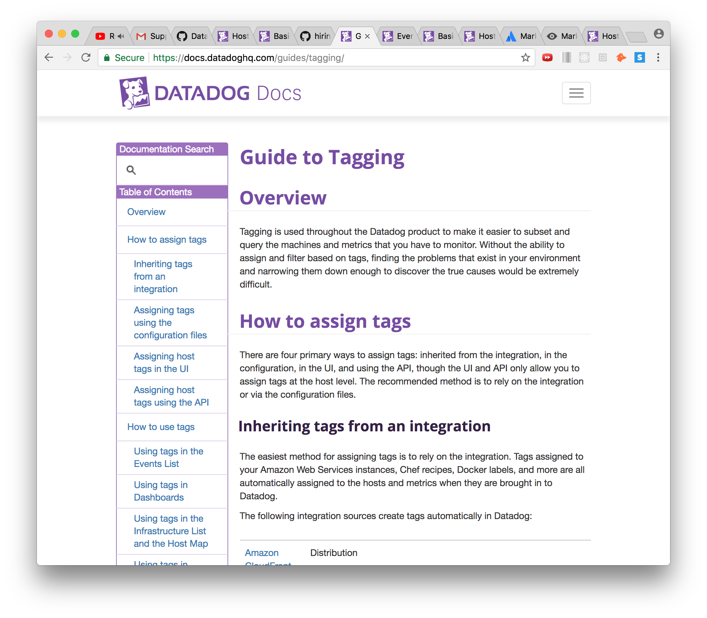
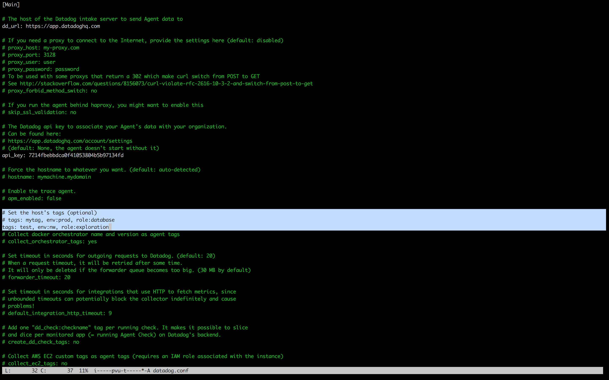

### Level 1: Collecting Your Data 
   1a) Sign Up for Datadog
    
   
   1b) Get the Agent Reporting Metrics From Local Machine
    
   * After signing up, you will be taken to a screen where you can begin to set up your first agent. Here, you can choose which type of Operating System you would like to run the agent on (in my case I installed Vagrant and VirtualBox, so therefore chose Ubuntu) 
      
    
   * After choosing your machine, you will be redirected to a page that shows how to set up the Agent. In Ubuntu's case it was as simple as copying the call provided on the page into my local VM environment. 
     

    

   * After running the call in your terminal, when it finishes you should see the following screens, the first in your terminal and the second on the datadog agent page itself. On the bottom of the Datadog page there will be an option to continue.
     

    

   * Finally, moving forward on the DataDog site will bring you to your Agent page and your first metrics, which look like this: 
     

  **BONUS** What is The Agent? 
    
  * The Agent is the software that collects data, events, and metrics and sends them to Datadog, so that we as the customer can use this data to better monitor the performance of one's applications, as well as use the information to find potential problematic areas in the codebase. There are three pieces to the Agent: 
    1. The collector, which runs checks according to whatever integrations you have and captures system metrics.
    2. Dogstatd, which is a backend server that you can send custom metrics to.
    3. The forwarder, which gets data from the two aforementioned components and queues it up to be sent to Datadog.

2) Tags and the Host Map 
  
  * The first thing you should do is head to the Datadog Docs (which can be found with a quick Google search) and select "Getting Started With the Agent". The Datadog Docs page looks like this:
    

  * After selecting this, there is a scrollbar on the left where you can choose the type of system you are running on (For me it was Ubuntu). Select your OS and it will take you to a a page with more information about Agent usage for each specific OS. Under "Configuration" on this page, there will be a specific path that shows you exactly where your Agent Config file is being held.
      
     
 
  * Now that we know where the file is, go back to the Datadog docs and select "Guide to Tagging" from the scrollbar on the left. This will take you to a page that looks like this:
     
    On this page there is a section titled "Assigning tags using the configuration files", which explains how to correctly create tags in the file we located above.
     

  * Now, in your terminal go to the directory that your specific agent config file is located, open the file and simply add tags under the portion of the file that directs you to do so.
      
     After adding your tags, you will need to restart the agent to update the config files using the necessary command.

  * Now that our tags are set, we can go back to our datadog home page and click on this button to get to the HostMap:
      

  * After getting to the HostMap page, simply click on the host (big green thing in the center), and the tags should show up on the right under "Tags" (specifically under the subheading "Datadog Agent")
     

3) Database Integration (with MySql)

  * First, after deciding which database you would like to install (I chose MySQL), use the magic of Google to find an easy step-by-step process to install the database correctly. This will vary considerably depending on the OS in use.

  * After this, on your metrics home screen go to the puzzle-piece button at the top and select "integrations".
    

  * This will take you to a page with a list of a bunch of potential integrations. Select the one that matches the database you installed, and follow the instructions. The instructions will look similar to this: 
    

  * After following the instructions, restart your Agent and wait five minutes. Then, if successful, you should see something like this if you click on the integration again:
    

  * You can also run your OS versions of the Agent info command (check the agent guide in the docs), and it should return something like this:
    

4) Write a Custom Agent Check 

