Submitted by: David Oslander

## Introduction

My previous submission did not reflect my best work. I don't like to walk away from a challenge or from an opportunity to redeem myself. Ultimately you are my customers, and in my work I strive to ensure customer satisfaction. So I have re-submitted this exercise in order to demonstrate significant improvement in the areas of thoroughness/detail of steps, commentary, and creativity (I created memes!).

## Section 1: Prerequisites - Setup the environment
I started from scratch for this submission.

This time I wanted to get the Datadog agent deployed on OpenShift. I pursued the Kubernetes DaemonSet Setup, documented
[here](https://docs.datadoghq.com/agent/kubernetes/daemonset_setup/).

I started with the free OpenShift offering, "OpenShift Online", which is meant to give developers a get-up-and-running-quickly personal environment on the OpenShift platform. The problem that I encountered is that it doesn't allow users the necessary RBAC privileges to create the ClusterRole, ServiceAccount, and ClusterRoleBinding objects. I think that's to prevent developers from corrupting the environment (to protect developers from themselves). The most powerful role that I could assign was "admin" which is like a Project Manager role in OpenShift. The role that I needed was "cluster-admin", which is like a super-user which can perform any action.

Here's the RBAC error that I received when using the "oc" command-line tool, when I tried to create the objects in OpenShift:

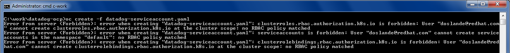

Hoping to have better luck with the OpenShift console, I tried various attempts to create either a ClusterRoleBinding or a RoleBinding that would be tied to a user or service account, but they all failed, like this attempt:

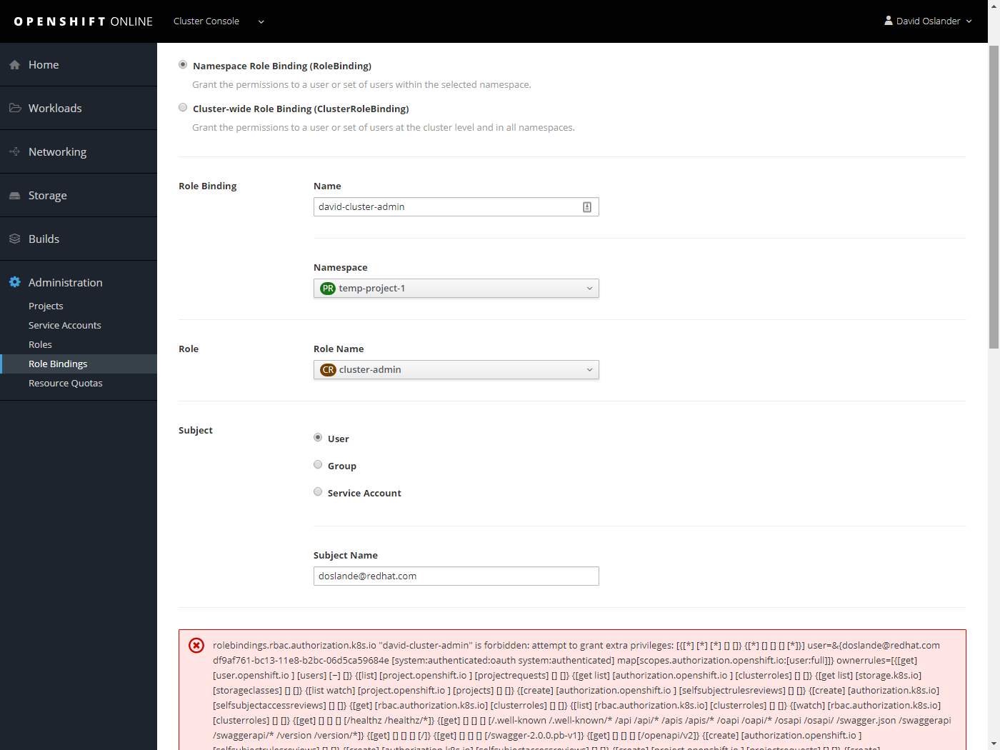

Then I tried the OpenShift Container Development Toolkit ("CDK"), which gives any developer a local one-node OpenShift instance, leveraging VirtualBox. Unfortunately, after getting the instance up and running, it became evident that the same RBAC limitations applied here. In fact, it was an even more restrictive environment because it didn't even give me the option to view the "Cluster Console", which is the area which allows you to administer roles, service accounts, role bindings, et cetera.

Since I'm a Red Hat employee, I looked into the possibility of utilizing a full-fledged OpenShift environment that's provisioned only to employees. But I lacked a business justification to get access to my own environment, and let's be frank, this isn't worth getting fired over :)

After an honest effort, I ultimately decided to move forward without OpenShift. After perusing the [publicly available catalog of Vagrant boxes](https://app.vagrantup.com/boxes/search), I decided to use [bionic64](https://app.vagrantup.com/ubuntu/boxes/bionic64). Heeding the instructions for this exercise, it satisfies the minimum `v. 16.04`

I issued the following commands to get my vagrant environment up:
```
vagrant init ubuntu/bionic64
```
```
vagrant up
```
```
sudo apt-get update
```
FRESH INSTALL:
```
DD_API_KEY=<<MY_API_KEY>> bash -c "$(curl -L https://raw.githubusercontent.com/DataDog/datadog-agent/master/cmd/agent/install_script.sh)"
```
Output showing that the agent started successfully:

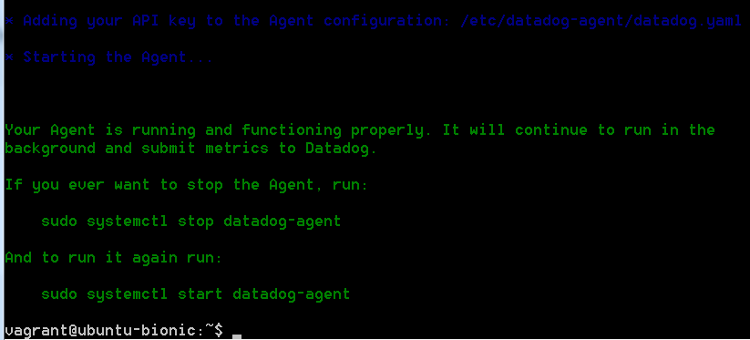

Screen showing in Datadog that the agent is reporting successfully:

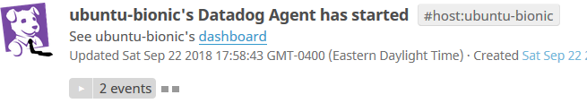

## Section 2: Collecting Metrics

I then went into `/etc/datadog-agent/datadog.yaml` and added my own custom tags using the `key:value` syntax:

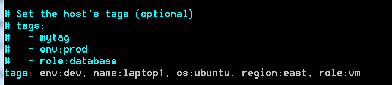

The [documentation](https://docs.datadoghq.com/tagging/assigning_tags/) is clear that the tags must be entered on one line in this file.

Then I restarted the datadog agent for the changes to take effect:
```
sudo service datadog-agent restart
```
Returning to Datadog, the host map shows the tags that I added:

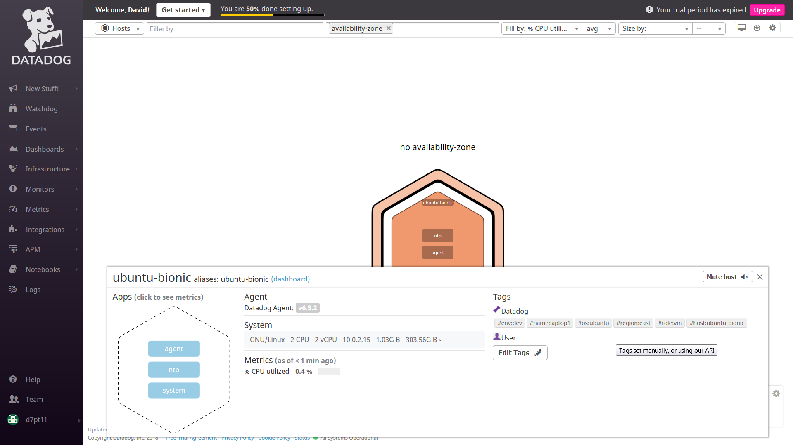

### Install a database on your machine (MongoDB, MySQL, or PostgreSQL) and then install the respective Datadog integration for that database.

I installed mongodb using the instructions for Ubuntu 18.04 that I found [here](https://www.digitalocean.com/community/tutorials/how-to-install-mongodb-on-ubuntu-18-04).

I issued the following commands for the mongodb setup:
```
sudo apt update
```
```
sudo apt install -y mongodb
```
Output showing that install command finished normally:

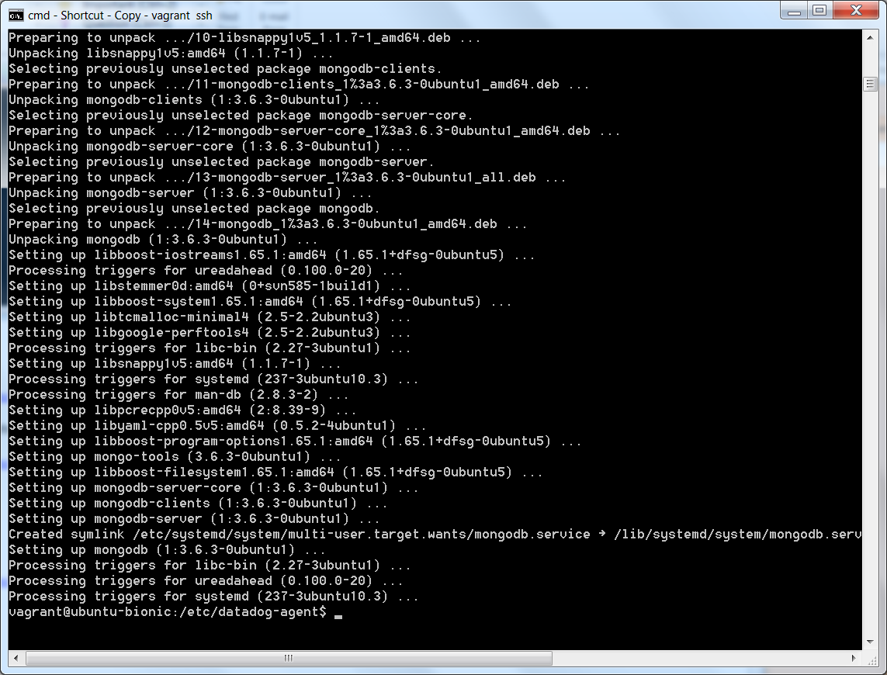

The database server is automatically started after installation. 

Then I checked the status of the mongdb service:
```
sudo systemctl status mongodb
```
Output showing that mongodb is running correctly:

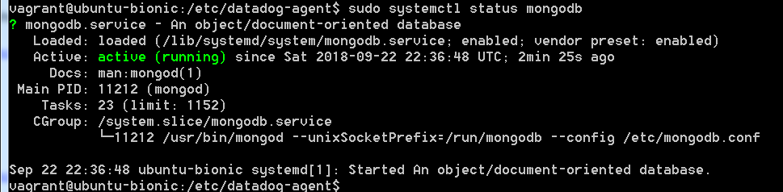

I verified this further by actually connecting to the database server and executing a diagnostic command:
```
mongo --eval 'db.runCommand({ connectionStatus: 1 })'
```
That outputs the current database version, the server address and port, and the output of the status commandOutput from that command:

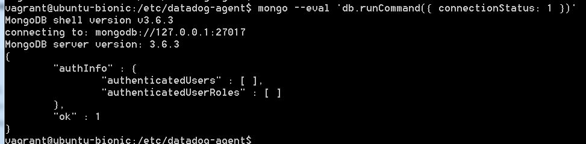

A value of 1 for the `ok` key in the response indicates that the server is working properly.

Next I researched how to setup the mongodb integration in Datadog. I found two sets of instructions that differed a little: 
[#1](https://docs.datadoghq.com/integrations/mongo/) and [#2](https://app.datadoghq.com/account/settings#integrations/mongodb). I probably would have been fine using either of them. #1 was helpful by specifying additional metrics that I could add for mongodb. And #2 suggested that I list two server instances, for ports 27016 and 27017. I tried to incorporate the best suggestions from both sources.

I added this configuration block to my `mongo.d/conf.yaml`:

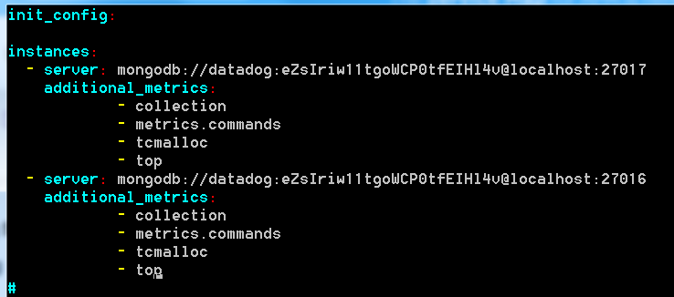

I enabled Collecting logs in the Datadog Agent, with two steps.

**Step 1** by including this in `datadog.yaml`:
```
logs_enabled: true
```
**Step 2** by including this in `mongo.d/conf.yaml`:
```
  logs:
      - type: file
        path: /var/log/mongodb/mongodb.log
        service: mongo
        source: mongodb
```
Then I prepared mongodb by creating a user.
```
# Authenticate as the admin user.
use admin
db.auth("admin", "<YOUR_MONGODB_ADMIN_PASSWORD>")

# On MongoDB 3.x or higher, use the createUser command.
db.createUser({
  "user":"datadog",
  "pwd": "<UNIQUEPASSWORD>",
  "roles" : [
    {role: 'read', db: 'admin' },
    {role: 'clusterMonitor', db: 'admin'},
    {role: 'read', db: 'local' }
  ]
})
```
After adding the `datadog` user, I ran the documentation's suggested verification command:
```
echo "db.auth('datadog', '<<datadog password>>')" | mongo admin | grep -E "(Authentication failed)|(auth fails)" && echo -e "\033[0;31mdatadog user - Missing\033[0m" || echo -e "\033[0;32mdatadog user - OK\033[0m"
```
Successful output from that verification command:

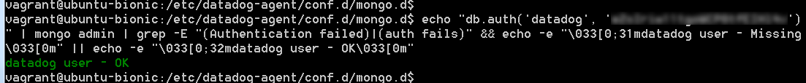

I installed the mongodb integration in Datadog, then I used Metrics Explorer to confirm that metrics are being pulled from mongo:

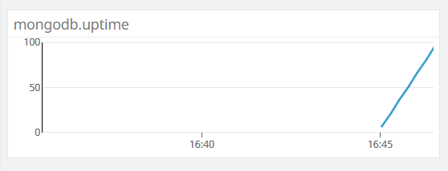

### Create a custom Agent check that submits a metric named my_metric with a random value between 0 and 1000.

I interpreted this to be inclusive of the values 0 and 1000. 
The [python 3 documentation](https://docs.python.org/3.1/library/random.html) says Return a random integer N such that a <= N <= b
Hence I specified this: `random.randint(0,1000)`

I issued the following commands to create the file `/etc/datadog-agent/checks.d/my_metric.py`:

`cd /etc/datadog-agent/checks.d`

`sudo touch my_metric.py`

`sudo vi my_metric.py`

And entered this content into the check file:

```
import random
from checks import AgentCheck
class HelloCheck(AgentCheck):
    def check(self, instance):
        self.gauge('my_metric', random.randint(0,1000))
```
Similarly, I created a corresponding configuration file for the check in in `/etc/datadog-agent/conf.d/my_metric.yaml`:

```
init_config:

instances:
   [{}]
```

Using Metrics Explorer, I confirmed that `my_metric` was reporting:

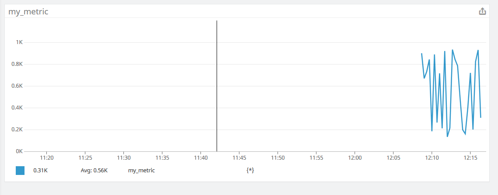

Later, I adjusted the check's collection interval so that it only submits the metric once every 45 seconds, in `/etc/datadog-agent/conf.d/hello.yaml`:

```
init_config:

instances:
   - min_collection_interval: 45
```
I am using Agent 6, so `min_collection_interval` must be added at an instance level. Per the [documentation](https://docs.datadoghq.com/developers/agent_checks/#configuration), by setting the value to 45, it does not mean that the metric is collected every 45 seconds, but rather that it could be collected as often as every 45 seconds. The default is 0 which means it's collected at the same interval as the rest of the integrations on that Agent. That is typically 15-20 seconds depending on how many integrations are enabled.

After changing my check's collection interval to submit the metric once every 45 seconds, and restarting the agent, the data points occur less frequently on the graph as expected:


**Bonus Question** Can you change the collection interval without modifying the Python check file you created?

* Yes, the collection interval can be changed by changing the `min_collection_interval` in the .yaml configuration file. In my case that was `conf.d/my_metric.yaml`

## Section 3: Visualizing Data

The python script that I've used to create my Timeboard is [here](scripts2/create-timeboard.py)

Here's the link to that dashboard that was created via API:

https://app.datadoghq.com/dash/924459/davids-timeboard-created-via-api?live=true&page=0&is_auto=false&from_ts=1537711922107&to_ts=1537726322107&tile_size=m

Here's a screenshot of the Timeboard that I created via API:

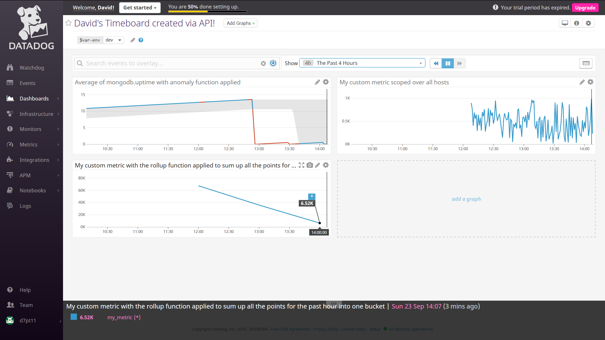

Here's the snapshot of a graph on the Timeboard (scoped to last 5 minutes) that I sent to myself:

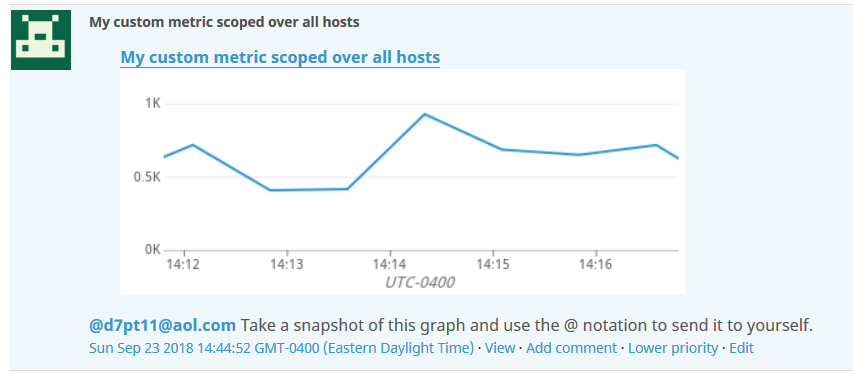

**Bonus Question** What is the Anomaly graph displaying?

The Anomaly graph helps the user to identify significant changes in behavior (anomalies) by comparing the current behavior of a metric to it's past behavior. It is useful for metrics with strong trends or recurring patterns that are otherwise difficult to detect with basic alerting. In short, it uses past data to predict what is expected in the future.

The gray banding represents the "normal" range of deviation for the metric based on past behavior. Here's an example from the Datadog website illustrating an anomaly occurring outside of the gray banding on the graph:

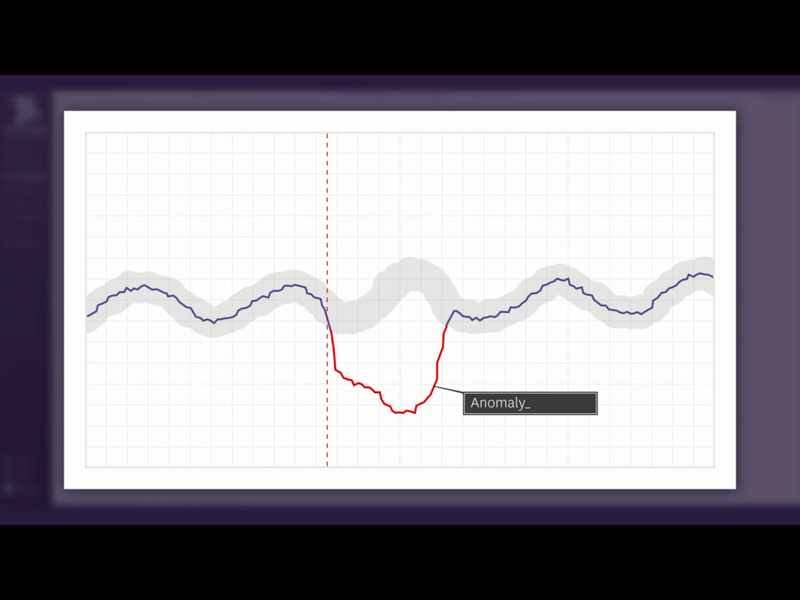

## Section 4: Monitoring Data

To create a new monitor, within Datadog I navigated to Monitor --> New Monitor. And I selected the "Metric" monitor type.

Here are the inputs that I made to create the monitor:

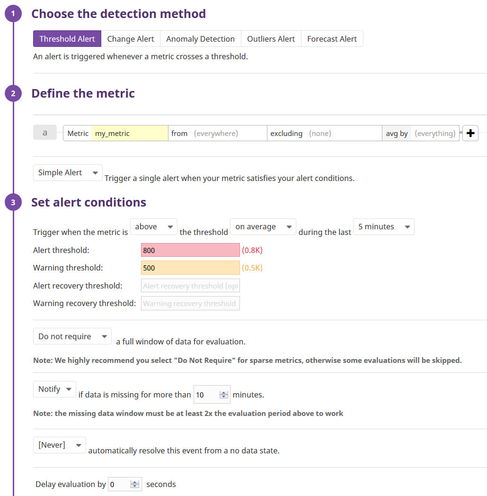

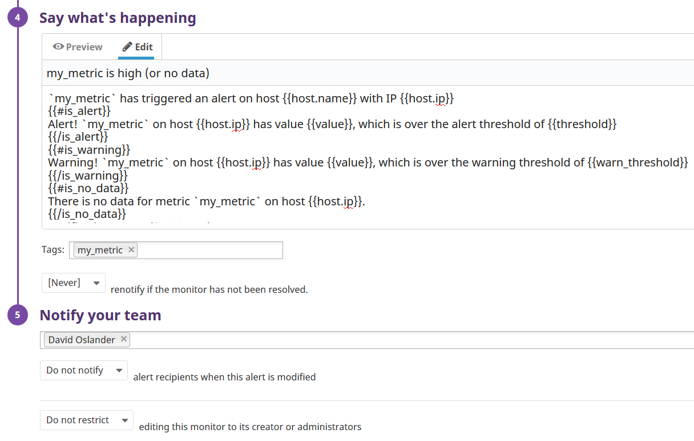


Screenshot of the email sent to me by my monitor:


Here's a screenshot of the email that was sent when sent to me by my monitor when data is missing for more than 10 minutes:

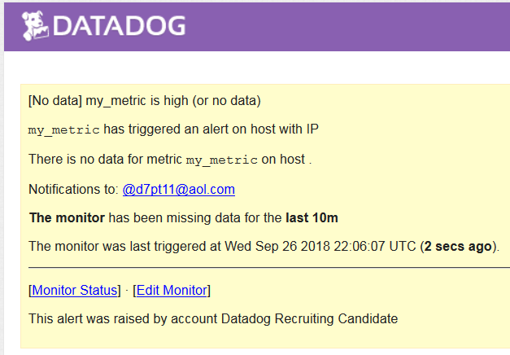

At this point I noticed that the emails were not outputting the host name and host ip as expected. I think my vagrant environment must have been disturbed because when I first started receiving emails, those variable were being resolved correctly. Here's an example which showed `host.name` and `host.ip` being resolved properly:


**Bonus Question** Setup two Downtimes.

Within Datadog, I went to Monitors --> Manage Downtime. I clicked the button for "Schedule Downtime".

The first Downtime silences the monitor from 7pm to 9am daily on M-F. Here are the inputs that I made:

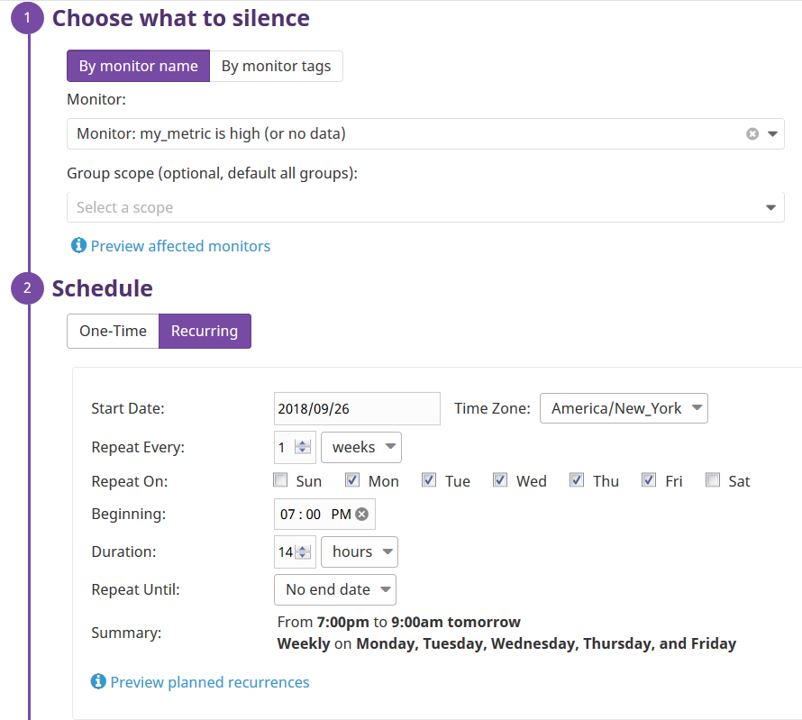

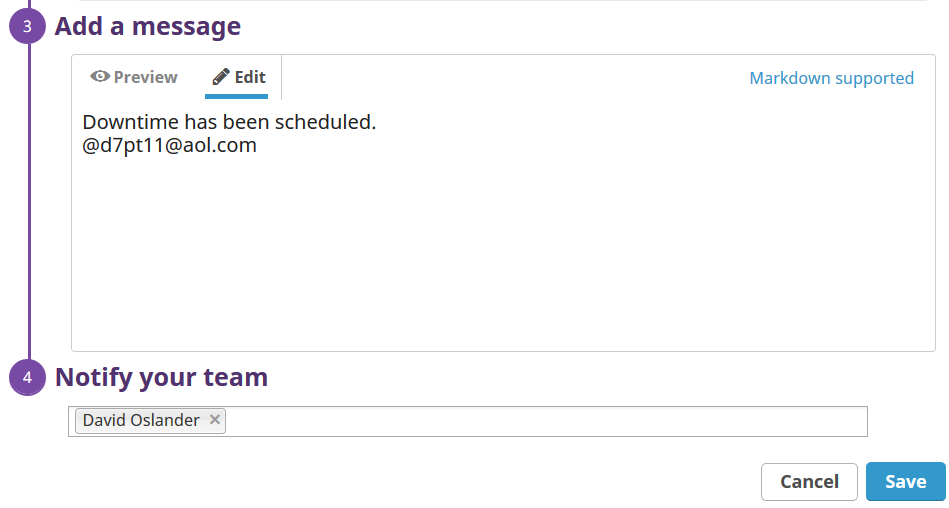

Here's the email notification that I received after saving the Downtime:


The second Downtime silences the monitor all day on Sat-Sun, recurring weekly. Here are the inputs that I made:

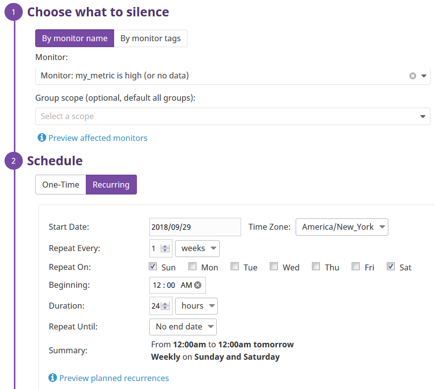

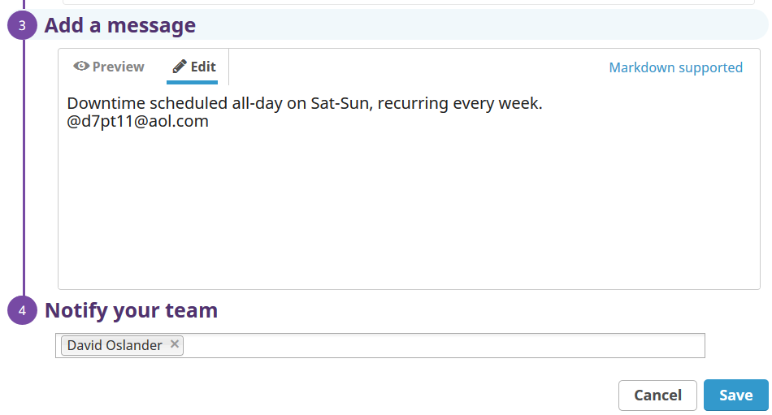

Here's the email notification that I received after saving the 2nd Downtime:

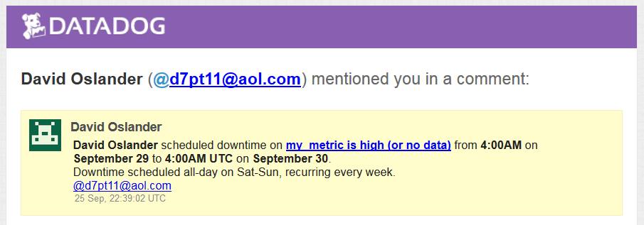

This is when I noticed "UTC" appearing in my emails, so I changed my preferences in Datadog to prefer Eastern Daylight Time, and re-created the Downtime, and then I was pleased to see EDT shown instead of UTC:

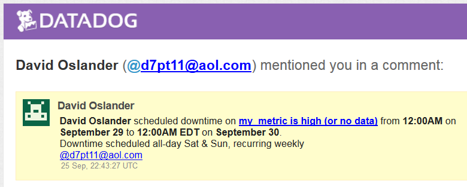

One suggestion for improvement is to increase the width of the input box for the number of hours entered for the duration. I accidentally fat-fingered the input in that box, such that it looked like I had entered 14 hours, but in fact I had entered 614 hours. As a result, the computed Summary said that my downtime was beginning in three weeks! I was thrown off by that discrepancy for a moment:

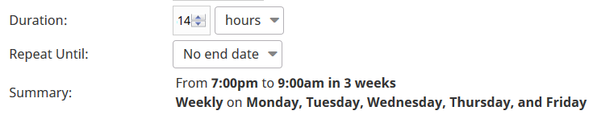

## Section 5: Collecting APM Data

I decided to instrument [the given Flask app](scripts2/flask-app.py) using ddtrace, not by manually instrumenting it. I read up on [the documentation for instrumenting Python apps](https://docs.datadoghq.com/tracing/setup/python/).

Here are the commands that I used to prepare the environment and run the ddtrace-run command:

pip is installed:

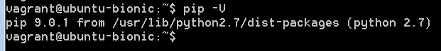

`pip install ddtrace`

dd trace is installed:

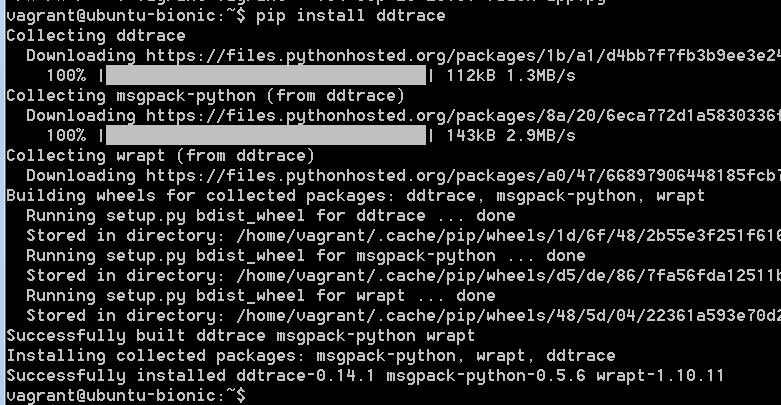

`pin install Flask`

Flask is installed:

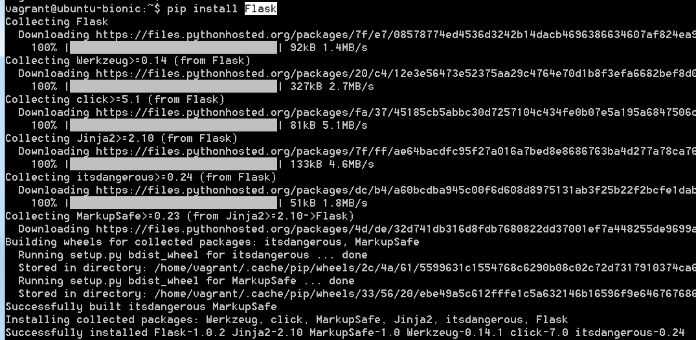

`ddtrace-run python3.6 flask-app.py`

Success:

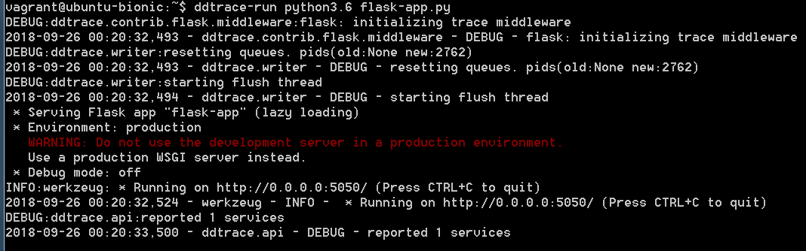

Next I needed to enable my vagrant environment to receive http requests issued in the web browser on my locahost. I stopped my vagrant environment, then I enabled networking in my Vagrantfile by exposing the VM's port 5050 on the host port 8081:

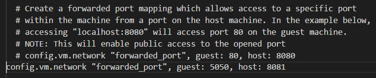

Then I opened up my browser and hit the various endpoints (resources) several times in order to generate some tracing results.

The endpoints that I hit were:

http://localhost:8081

http://localhost:8081/api/trace

http://localhost:8081/api/apm

Then in Datadog, I navigated to APM and found the "flask" service listed. Here is the detail page:

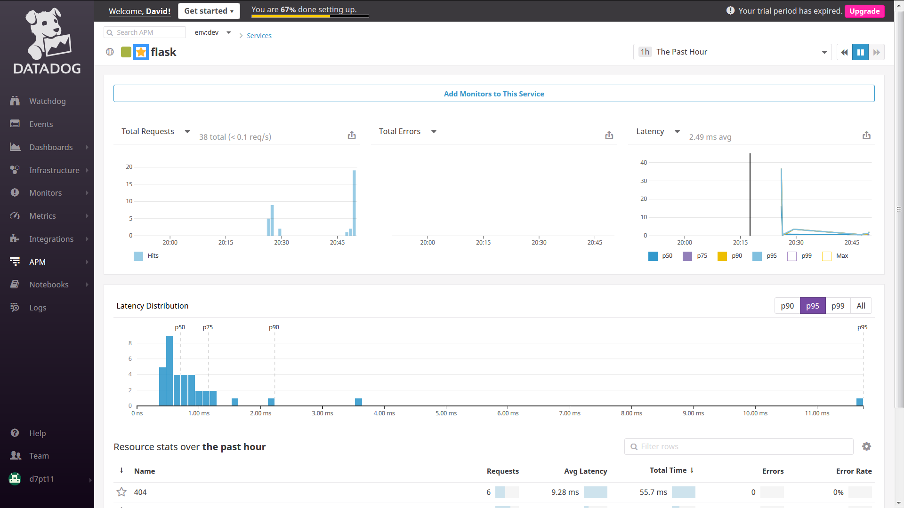


**Bonus Question** What is the difference between a Service and a Resource?

[Per the documentation](https://docs.datadoghq.com/tracing/visualization/), a service is a set of processes that do the same job. A resource is a particular action for a service.
A Service is a higher-level entity that can be traced, such as a web resource or a database. A Service may have several Resources. For example, a
a single webapp service may have several HTTP endpoints, each of which is a resource.

Screenshot of dashboard showing both APM and Infra metrics:

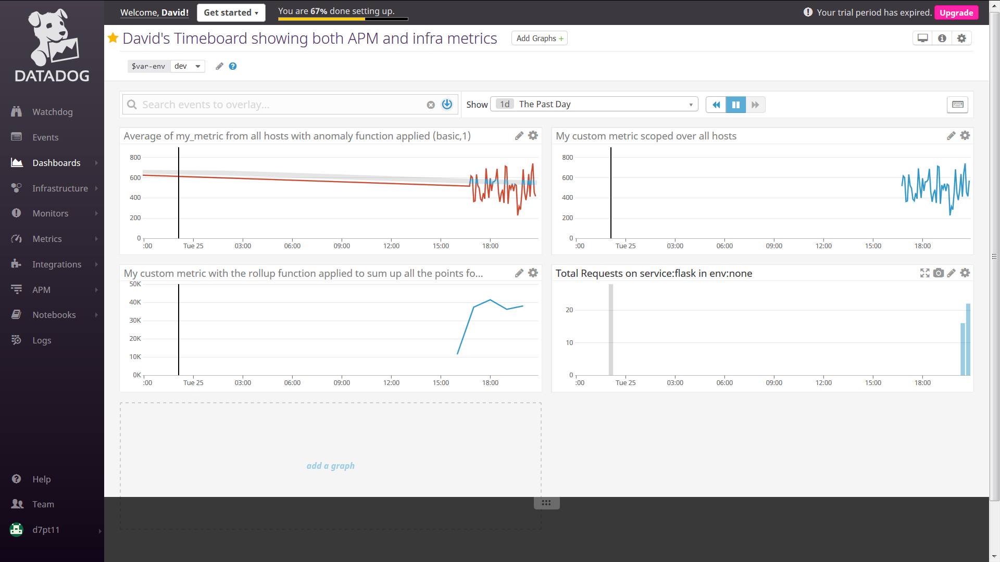


Link to dashboard showing both APM and Infra metrics:

https://app.datadoghq.com/dash/904267/davids-timeboard-showing-both-apm-and-infra-metrics?live=true&page=0&is_auto=false&from_ts=1537837256049&to_ts=1537923656049&tile_size=m


## Final Question

**Is there anything creative you would use Datadog for?**

I visit the Adirondacks every Summer, which has hiking trails that are heavily used. There is limited parking near the trailheads and on the sides of the road. I could imagine IoT devices (with Datadog agent installed) deployed to these areas that report on the occupancy of parking spots. This data could be analyzed by the State to better understand the demand on their parks and trails. They could deploy more personnel to locations under peak conditions, or develop better plans to maintain the trail at the appropriate frequency, or develop a more informed strategy for parking concerns. The State could build an app that allows consumers to see parking availability in real-time, and allow them to identify trails or parks that are hidden gems not overrun by visitors.

Separately, cable companies or power companies could use devices with Datadog agent to proactively identify outages and respond to them without having to rely on individuals reporting outages. Notifications would be used to let consumers know when an outage has occurred and when it has been restored.

## Links to dashboards

My dashboard created via API:

https://app.datadoghq.com/dash/924459/davids-timeboard-created-via-api?live=true&page=0&is_auto=false&from_ts=1537920359193&to_ts=1537923959193&tile_size=m

Link to dashboard showing both APM and Infra metrics:

https://app.datadoghq.com/dash/904267/davids-timeboard-showing-both-apm-and-infra-metrics?live=true&page=0&is_auto=false&from_ts=1537837256049&to_ts=1537923656049&tile_size=m


## Extra Fun

My favorite meme on the internet features the father and son from the American reality TV show, American Choppers. Those hard-headed guys fought regularly on the show, and the meme features five panels of them arguing back and forth. And a chair is thrown!

For the first meme, I imagined them as opposing forces in the Dev vs. Ops battles of the past. Thanks to the rise of DevOps culture, practices, and tooling such as the world-class monitoring solution, Datadog, we can reduce the friction between these teams and enable them to become highly effective.

First meme:


Of course, Datadog was founded shortly thereafter, in 2010.

For the second meme, I designed it to finish with one of the major value propositions of Datadog.

Second meme:

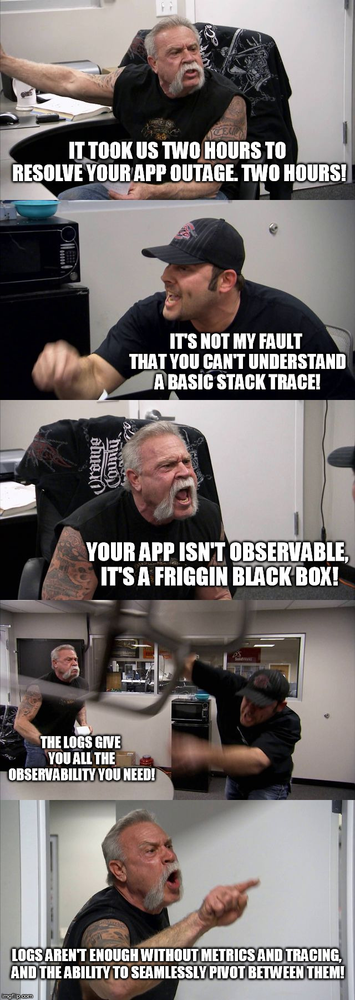
