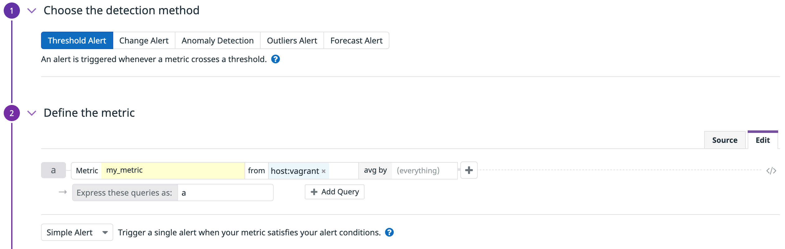
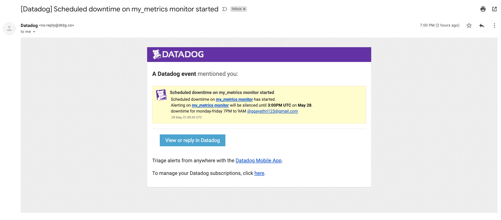

## Submission for Gayathri Gude for Sales/Solutions-Engineering Position

## Prerequisites - Setup the Environment:
I chose to spin up a fresh linux VM via Vagrant. This helped me avoid a lot of dependency issues.
1. First, I installed [VirtualBox 6.1](https://www.virtualbox.org/) :


2. Second, I installed [Vagrant](https://www.vagrantup.com/docs/installation/) :


In order to get this part up and running after installation.. I had to do the following: 
  * Initialize Vagrant: ```vagrant init hashicorp/bionic64```
  * Start the Virtual Machine: ```vagrant up```
  * SSH into the Virtual Machine: ```vagrant ssh```
  * To stop the enviornment: ```vagrant halt```

3. Third, I signed up for the free [Datadog trial](https://www.datadoghq.com/free-datadog-trial/) and installed it to my environment:


After signing up, I needed to install it to my environment. The following command includes a unique API key, which is required by the Datadog Agent to submit metrics and events to Datadog. This key is specified in my Datadog account as well, as shown below the command.     
```DD_AGENT_MAJOR_VERSION=7 DD_API_KEY=7dd72dc2a84300cd72f658f0d7c062d4 DD_SITE="datadoghq.com" bash -c "$(curl -L https://s3.amazonaws.com/dd-agent/scripts/install_mac_os.sh)"```


Here are the commands I used while running the agent locally:
  * Start agent as a service: ```launchctl start com.datadoghq.agent```
  * Stop agent running as a service: ```launchctl stop com.datadoghq.agent```
  * Status of agent service: ```launchctl list com.datadoghq.agent```
  * Launch Gui: datadog-agent ```launch-gui```

## Collecting Metrics:
  * Added tags in the Agent config file(Datadog.yaml). Photos below show the config details, along with the tags shown on the agent GUI page and the Hostmap on the Datadog web application.


  * Installed a database on my machine (MySQL) and then installed the respective Datadog integration for that database. In my case, it was convenient because MySQL check is included in the Datadog Agent package and no additional installation was needed on my MySQL server. I followed the steps as were guided by the [Datadog Integration Page for my SQL](https://docs.datadoghq.com/integrations/mysql/?tab=host).
      * Created a datadog user with a native password hashing method: ```CREATE USER 'datadog'@'localhost' IDENTIFIED WITH mysql_native_password by '<UNIQUEPASSWORD>';```
      * The agent needs a few privileges to collect metrics, so I granted the user the following limited privileges: ```GRANT PROCESS ON *.* TO 'datadog'@'localhost';```
      * I needed to also set the max_user_connections: ```ALTER USER 'datadog'@'localhost' WITH MAX_USER_CONNECTIONS 5;```

  * Created a custom Agent check that submits a metric named my_metric with a random value between 0 and 1000. I followed the [custom agent check documentation](https://docs.datadoghq.com/developers/write_agent_check/?tab=agentv6v7) to accomplish the following file creations:
      * Created a my_metric.py file containing the following:
        ```
        import time
        import random
        try:
            from datadog_checks.base import AgentCheck

        except ImportError:
            from checks import AgentCheck
            
        __version__ = "1.0.0"

        class MyClass(AgentCheck):
              def check(self, instance):
                   #while(True):
                   #time.sleep(45)
                   self.gauge('my_metric', 
                   random.randint(0,1000), 
                   tags=['key1:value1'] + self.instance.get('tags', []))
        ```
      * Created a my_metric.yaml file containing the following:
        ```
        instances: [{}]
        ```
      
  * Change your check's collection interval so that it only submits the metric once every 45 seconds.
        ```import time
        import random
        try:
            from datadog_checks.base import AgentCheck

        except ImportError:
            from checks import AgentCheck
            
        __version__ = "1.0.0"

        class MyClass(AgentCheck):
              def check(self, instance):
                   while(True):
                   time.sleep(45)
                   self.gauge('my_metric', 
                   random.randint(0,1000), 
                   tags=['key1:value1'] + self.instance.get('tags', []))
  * Bonus Question: Can you change the collection interval without modifying the Python check file you created?   
    Yes, you can change the collection interval without modifying the my_metric.py file that I created. You can instead modify the my_metric.yaml file as the following: 
         
         init_config:

         instances:
           - min_collection_interval: 45
           
## Visualizing Data:
  * Utilized the Datadog API and created a timeboard that contains:
    * My custom metric (my_metric) scoped over my host (vagrant) in the past 5 minutes:
    
    * My custom metric (my_metric) scoped over my host (vagrant) in the past hour:
    
    * My custom metric (my_metric) scoped over my host (vagrant) in the past 4 hours:
    
    * Any metric from the integration on my Database with the anomaly function applied:
     
    * My custom metric with the rollup function applied to sum up all the points for the past hour into one bucket:
     
    
    * Script used to create timeboard for my_metric scoped over host: 
    ``` {
    "viz": "timeseries",
    "requests": [
        {
            "q": "avg:my_metric{host:vagrant}",
            "type": "line",
            "style": {
                "palette": "dog_classic",
                "type": "solid",
                "width": "normal"
            }
        }
    ],
    "yaxis": {
        "max": "auto",
        "scale": "linear",
        "min": "auto",
        "label": "",
        "includeZero": true
    },
    "markers": [] } 
    ```
    * Script used to create timeboard for integration on database with the anomaly function applied:
    ```
    {
    "viz": "timeseries",
    "requests": [
        {
            "q": "anomalies(avg:mysql.net.max_connections{host:vagrant}, 'basic', 4)",
            "type": "line",
            "style": {
                "palette": "dog_classic",
                "type": "solid",
                "width": "normal"
            }
        }
    ],
    "yaxis": {
        "max": "auto",
        "scale": "linear",
        "min": "auto",
        "label": "",
        "includeZero": true
    },
    "markers": []}
    ```

    * Script used to create timeboard for rollup function:
    ```
    {
    "viz": "timeseries",
    "requests": [
        {
            "q": "sum:my_metric{host:vagrant}.rollup(sum)",
            "type": "line",
            "style": {
                "palette": "dog_classic",
                "type": "solid",
                "width": "normal"
            }
        }
    ],
    "yaxis": {
        "max": "auto",
        "scale": "linear",
        "min": "auto",
        "label": "",
        "includeZero": true
    },
    "markers": [] }
    ```
    * Set the Timeboard's timeframe to the past 5 minutes
    
    
    * Took a snapshot of a graph and used the @ notation to send it to myself
    
    

    * Bonus Question: What is the Anomaly graph displaying?        
    The Anomaly graph is displaying a gray area around the actual data that essentially shows the potential range of the data to identify if and where the current     data is behaving differently compared to past trends. The ranges (gray area of the graph) are calculated based off of past trends, seasonal day-of-week, and       time-of-day patterns.
    
## Monitoring Data
   * Created a new metric monitor that watches the average of my custom metric (my_metric) and will alert if it’s above the following values over the past 5            minutes:
     ```
     * Warning threshold of 500
     * Alerting threshold of 800
     * Notify me if there is no data for this query over the past 10 minutes 
   
   
     
   * Configured the monitor’s message so that it will:
     ```
     * Send me an email whenever the monitor triggers
     * Create different messages based on whether the monitor is in an Alert, Warning, or No Data state
     * Include the metric value that caused the monitor to trigger and host ip when the Monitor triggers 
       an Alert state
     * When this monitor sends me an email notification, take a screenshot of the email that it sends me 
   
   
   
   
  
   * Bonus Question: Since this monitor is going to alert pretty often, you don’t want to be alerted when you are out of the office. 
     Set up two scheduled downtimes for this monitor:
     ```
     * One that silences it from 7pm to 9am daily on M-F
     * And one that silences it all day on Sat-Sun
     * Make sure that your email is notified during the downtime and take a screenshot of that notification
   
   
   
    
