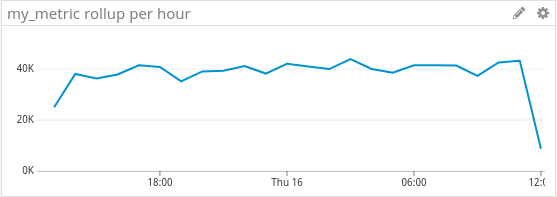
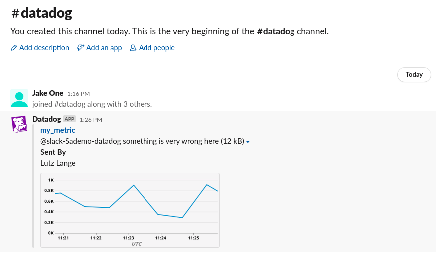
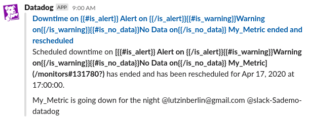
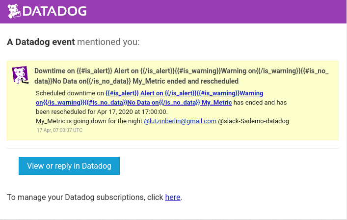
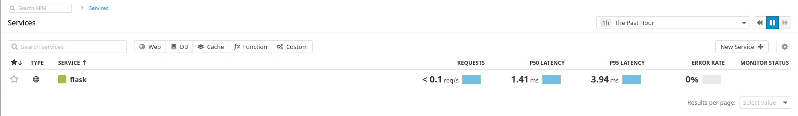
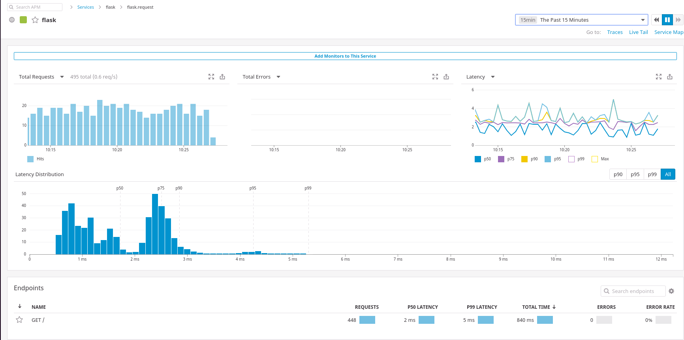
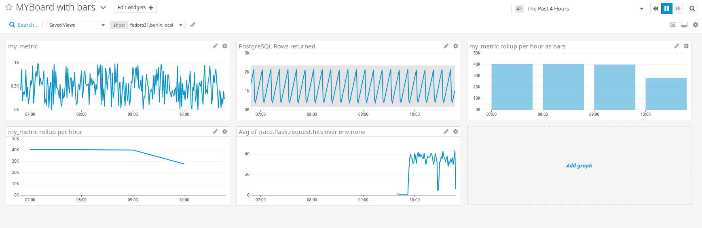
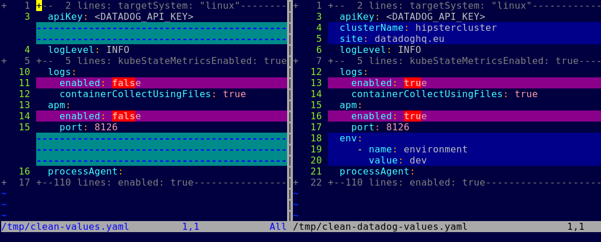
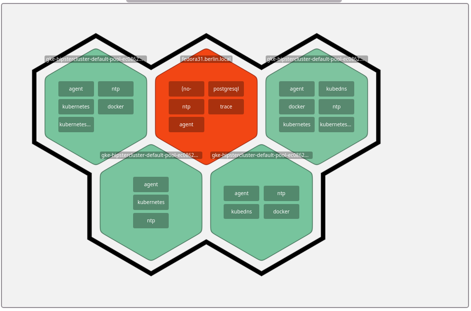

Your answers to the questions go here.

# Collecting Metrics

## Deploy of the Agent

I did setup a Fedora 31 virtual machine using Virt-Manager on my Fedora 31 Notebook.

When It came up, I used the one line install to install the DD Agent :

```bash
DD_AGENT_MAJOR_VERSION=7 DD_API_KEY=2a6eee5aaca2d5b447f71e746277e2ff DD_SITE="datadoghq.eu" bash -c "$(curl -L https://raw.githubusercontent.com/DataDog/datadog-agent/master/cmd/agent/install_script.sh)"
```
## Add Tags to the Agent Config

I trieds setting up some tags but the dd agent did not come up again.

```bash
systemctl status datadog-agent
● datadog-agent.service - Datadog Agent
   Loaded: loaded (/usr/lib/systemd/system/datadog-agent.service; enabled; vendor preset: disabled)
   Active: failed (Result: exit-code) since Fri 2020-04-10 13:29:47 CEST; 23s ago
  Process: 1079 ExecStart=/opt/datadog-agent/bin/agent/agent run -p /opt/datadog-agent/run/agent.pid (code=exited, status=255/EXCEPTION)
 Main PID: 1079 (code=exited, status=255/EXCEPTION)
      CPU: 66ms

Apr 10 13:29:47 f31 systemd[1]: datadog-agent.service: Main process exited, code=exited, status=255/EXCEPTION
Apr 10 13:29:47 f31 systemd[1]: datadog-agent.service: Failed with result 'exit-code'.
Apr 10 13:29:47 f31 systemd[1]: datadog-agent.service: Scheduled restart job, restart counter is at 5.
Apr 10 13:29:47 f31 systemd[1]: Stopped Datadog Agent.
Apr 10 13:29:47 f31 systemd[1]: datadog-agent.service: Start request repeated too quickly.
Apr 10 13:29:47 f31 systemd[1]: datadog-agent.service: Failed with result 'exit-code'.
Apr 10 13:29:47 f31 systemd[1]: Failed to start Datadog Agent.
```

So I tried to start manually to see what the problem would be :

```bash
[root@f31 ~]# /opt/datadog-agent/bin/agent/agent run -p /opt/datadog-agent/run/agent.pid
Error: Failed to setup config unable to load Datadog config file: While parsing config: yaml: line 63: did not find expected key
Error: unable to set up global agent configuration: unable to load Datadog config file: While parsing config: yaml: line 63: did not find expected key
```
I found a space charachter in front of the Tags line that prevented startup. Fixing that the agent came up again. But did not show the new tags in the infrastructure map immediatly. That prompted me to look at the logs a bit deeper : 

```bash
journalctl -f -u datadog-agent
-- Logs begin at Fri 2020-04-10 13:01:36 CEST. --
Apr 10 13:34:58 f31 agent[1249]: 2020-04-10 13:34:58 CEST | CORE | INFO | (pkg/collector/runner/runner.go:261 in work) | Running check network
Apr 10 13:34:58 f31 agent[1249]: 2020-04-10 13:34:58 CEST | CORE | INFO | (pkg/collector/runner/runner.go:327 in work) | Done running check network, next runs will be logged every 500 runs
Apr 10 13:34:59 f31 agent[1249]: 2020-04-10 13:34:59 CEST | CORE | INFO | (pkg/collector/runner/runner.go:261 in work) | Running check load
Apr 10 13:34:59 f31 agent[1249]: 2020-04-10 13:34:59 CEST | CORE | INFO | (pkg/collector/runner/runner.go:327 in work) | Done running check load, next runs will be logged every 500 runs
Apr 10 13:35:00 f31 agent[1249]: 2020-04-10 13:35:00 CEST | CORE | INFO | (pkg/collector/runner/runner.go:261 in work) | Running check file_handle
Apr 10 13:35:00 f31 agent[1249]: 2020-04-10 13:35:00 CEST | CORE | INFO | (pkg/collector/runner/runner.go:327 in work) | Done running check file_handle, next runs will be logged every 500 runs
Apr 10 13:35:08 f31 agent[1249]: 2020-04-10 13:35:08 CEST | CORE | ERROR | (pkg/collector/runner/runner.go:292 in work) | Error running check disk: [{"message": "not sure how to interpret line '  11       0 sr0 7 0 2 0 0 0 0 0 0 5 0 0 0 0 0 0 0\\n'", "traceback": "Traceback (most recent call last):\n  File \"/opt/datadog-agent/embedded/lib/python3.8/site-packages/datadog_checks/base/checks/base.py\", line 713, in run\n    self.check(instance)\n  File \"/opt/datadog-agent/embedded/lib/python3.8/site-packages/datadog_checks/disk/disk.py\", line 121, in check\n    self.collect_latency_metrics()\n  File \"/opt/datadog-agent/embedded/lib/python3.8/site-packages/datadog_checks/disk/disk.py\", line 244, in collect_latency_metrics\n    for disk_name, disk in iteritems(psutil.disk_io_counters(True)):\n  File \"/opt/datadog-agent/embedded/lib/python3.8/site-packages/psutil/__init__.py\", line 2168, in disk_io_counters\n    rawdict = _psplatform.disk_io_counters(**kwargs)\n  File \"/opt/datadog-agent/embedded/lib/python3.8/site-packages/psutil/_pslinux.py\", line 1125, in disk_io_counters\n    for entry in gen:\n  File \"/opt/datadog-agent/embedded/lib/python3.8/site-packages/psutil/_pslinux.py\", line 1098, in read_procfs\n    raise ValueError(\"not sure how to interpret line %r\" % line)\nValueError: not sure how to interpret line '  11       0 sr0 7 0 2 0 0 0 0 0 0 5 0 0 0 0 0 0 0\\n'\n"}]
```

It looks like the disk check has trouble with Fedora 31. I'll ignore that for now. And it just took a few minutes for the tags and hostname change to be visible in the UI:


## Database installation and Monitoring

On to the next task. Installing PostgreSQL :
```bash
# dnf install postgresql-server.x86_64 postgresql.x86_64 -y
# /usr/bin/postgresql-setup --initdb
# systemctl start postgresql
# sudo -u postgres -i
postgres=# postgres=# create user datadog with password 'myddpass';
CREATE ROLE
postgres=# grant pg_monitor to datadog;
GRANT ROLE
```

I had to change the authentication rules for Postgres in order to let the test command work. These are the final, unsecure clear text password settings. But since this is a localhost only example and a simple demo cleartext passwords over unencryted channels locally will suffice. :

```bash
$ grep password$ /var/lib/pgsql/data/pg_hba.conf 
local   all             all                                     password
host    all             all             127.0.0.1/32            password
host    all             all             ::1/128                 password
$ sudo systemctl reload postgresl
$ psql -h localhost -U datadog postgres -c "select * from pg_stat_database LIMIT(1);" && echo -e "\e[0;32mPostgres connection - OK\e[0m" || echo -e "\e[0;31mCannot connect to Postgres\e[0m"
Password for user datadog: 
 datid | datname  | numbackends | xact_commit | xact_rollback | blks_read | blks_hit | tup_returned | tup_fetched | tup_inserted | tup_updated | tup_deleted | conflicts | temp_files | temp_bytes | deadlocks | blk_read_time | blk_w
rite_time |          stats_reset          
-------+----------+-------------+-------------+---------------+-----------+----------+--------------+-------------+--------------+-------------+-------------+-----------+------------+------------+-----------+---------------+------
----------+-------------------------------
 14101 | postgres |           1 |          44 |             7 |       127 |     3386 |        19302 |        1369 |            0 |           0 |           0 |         0 |          0 |          0 |         0 |             0 |      
        0 | 2020-04-10 14:52:19.620935+02
(1 row)
```

Now on to configuring the DD Agent to connect to Postgres

```bash
# cp /etc/datadog-agent/conf.d/postgres.d/conf.yaml.example /etc/datadog-agent/conf.d/postgres.d/conf.yaml
# vi /etc/datadog-agent/conf.d/postgres.d/conf.yaml
# diff conf.yaml conf.yaml.example 
27c27
<     password: myddpass 
---
>     password: <UNIQUEPASSWORD>
60,64c60,62
<     tags:
<       - environment:dev
<       - stage:evaluation
<       - type:database
<       - dbtype:postgre
---
>     # tags:
>     #   - <KEY_1>:<VALUE_1>
>     #   - <KEY_2>:<VALUE_2>
# systemctl restart datadog-agent
```

After that I can see postgres showing up in the [datadog infrastructre map](https://app.datadoghq.eu/infrastructure/map?host=19442128&fillby=avg%3Acpuutilization&sizeby=avg%3Anometric&groupby=availability-zone&nameby=name&nometrichosts=false&tvMode=false&nogrouphosts=true&palette=green_to_orange&paletteflip=false&node_type=host) :


And I can also find the [PostgreSQL Dashboard](https://app.datadoghq.eu/dash/integration/58/Postgres%20-%20Metrics?tpl_var_scope=host%3Afedora31.berlin.local&from_ts=1586343656315&to_ts=1586948456315&live=true&tile_size=m) with metrics : 


Looking at the [host dashboard](https://app.datadoghq.eu/infrastructure?hostname=fedora31.berlin.local), I can also see the disk issue that I mentioned above. :


## Create custom Agent checks

[Documentation Link](https://docs.datadoghq.com/developers/write_agent_check/?tab=agentv6v7)

First we create a config file for the new custom metric "my_metric" in the dd agent config directory. 

```bash
$ sudo cat /etc/datadog-agent/conf.d/my_metric.yaml
instances: [{}]
```

If we want to run this check in other than the default 30s intervals we can change this configuration file and specify the new interval : 
```bash
$ sudo cat /etc/datadog-agent/conf.d/my_metric.yaml
init_config:

instances:
  - min_collection_interval: 45
```

Now we need to implement the custom check. Python script for this. 
```bash
sudo vim /etc/datadog-agent/checks.d/my_metric.py
```
```python
#!/usr/bin/python
# the following try/except block will make the custom check compatible with any Agent version
try:
    # first, try to import the base class from new versions of the Agent...
    from datadog_checks.base import AgentCheck
except ImportError:
    # ...if the above failed, the check is running in Agent version < 6.6.0
    from checks import AgentCheck

# content of the special variable __version__ will be shown in the Agent status page
__version__ = "1.0.0"

class MyCheck(AgentCheck):
    def check(self, instance):
        from random import randrange
        value = randrange(1000)
        self.gauge('my_metric', value, tags=['environment:dev'])
```

Lets verify that the custom check is working
```bash
$ sudo -i
# sudo -u dd-agent -- datadog-agent check my_metric
=== Series ===
{
  "series": [
    {
      "metric": "my_metric",
      "points": [
        [
          1586950622,
          723
        ]
      ],
      "tags": [
        "environment:dev"
      ],
      "host": "fedora31.berlin.local",
      "type": "gauge",
      "interval": 0,
      "source_type_name": "System"
    }
  ]
}
=========
Collector
=========

  Running Checks
  ==============
    
    my_metric (1.0.0)
    -----------------
      Instance ID: my_metric:5ba864f3937b5bad [OK]
      Configuration Source: file:/etc/datadog-agent/conf.d/my_metric.yaml
      Total Runs: 1
      Metric Samples: Last Run: 1, Total: 1
      Events: Last Run: 0, Total: 0
      Service Checks: Last Run: 0, Total: 0
      Average Execution Time : 0s
      Last Execution Date : 2020-04-15 13:37:02.000000 CEST
      Last Successful Execution Date : 2020-04-15 13:37:02.000000 CEST
      

Check has run only once, if some metrics are missing you can try again with --check-rate to see any other metric if available.
```
Now restart the Agent and check the logs for my_metric :
```bash
$ sudo -i
# systemctl stop datadog-agent; systemctl start datadog-agent; journalctl -f -u datadog-agent | grep --color my_metric
Apr 15 13:44:53 f31 agent[885097]: 2020-04-15 13:44:53 CEST | CORE | INFO | (pkg/collector/scheduler/scheduler.go:83 in Enter) | Scheduling check my_metric with an interval of 45s
Apr 15 13:44:54 f31 agent[885097]: 2020-04-15 13:44:54 CEST | CORE | INFO | (pkg/collector/runner/runner.go:261 in work) | Running check my_metric
Apr 15 13:44:54 f31 agent[885097]: 2020-04-15 13:44:54 CEST | CORE | INFO | (pkg/collector/runner/runner.go:327 in work) | Done running check my_metric

```

Now I can find the my_metric in the [Data Dog Metrics Section](https://app.datadoghq.eu/metric/explorer?from_ts=1586950778833&to_ts=1586951678833&live=true&page=0&is_auto=false&tile_size=m&exp_metric=my_metric&exp_agg=avg&exp_row_type=metric)


## Bonus Question
I'm a bit confused by the Bonus question. I did not change the python check file my_metrics.py to change the inverval. I can't see how changing the Python file will have any effect on the interval. The interval is configured through the conf.d/my_metrics.yaml file and thus through settings at the agent. The logical answer here is in short : <b>Yes</b>. 

# Visualizing Data

First in needed to install Postman for Linux. 
```bash
$ wget https://dl.pstmn.io/download/latest/linux64 --output-document - | tar xvzf -
cd Postman
./Postman
```

I loaded the Postman Datadoc Collection into Postman through the Import function.

Next I generated the [API and Application API Key](https://app.datadoghq.eu/account/settings#api).

These were added to Postman through the [creation of an Environment](https://docs.datadoghq.com/getting_started/api/#postman-environment-setup). I did set the datadog_api_key, datadog_application_key and datadog_site vars for my environment "Datadog Trial".

You can verify that it work by running a simple API Call like this : 


For creating the Dashboard. I did copy the Create Dashboard Template and adjusted the body of the Request. After creating the inital dashboard, I was wondering how to inlude a metric with the anomaly function applied. I found this info in the [Datadog UI for the database metrics](https://app.datadoghq.eu/dash/integration/58/postgres---metrics?fullscreen_end_ts=1586961432506&fullscreen_paused=false&fullscreen_section=overview&fullscreen_start_ts=1586356632506&fullscreen_widget=1997745826335092). 
.

I noticed that the Postgres Dashboard and Metrics are quite empty except for the some system Level Metrics as shown above. This is easily explained. There is no load on the database. So lets generate some : 

## Tangent - generating load on the Postgres DB

First I create a new user "joe" and a new database "sampledb" :
```bash
[lutz@f31 ~]$ sudo -i
[root@f31 ~]# sudo -u postgres -i
[postgres@f31 ~]$ createuser --interactive --pwprompt
Enter name of role to add: joe
Enter password for new role: 
Enter it again: 
Shall the new role be a superuser? (y/n) n
Shall the new role be allowed to create databases? (y/n) n
Shall the new role be allowed to create more new roles? (y/n) n
[postgres@f31 ~]$ createdb -O joe sampledb
[postgres@f31 ~]$ logout
[root@f31 ~]# useradd joe
[root@f31 ~]# passwd joe
Changing password for user joe.
New password: 
Retype new password: 
passwd: all authentication tokens updated successfully.
```

Now lets switch to joe and create a table checkin that takes date values. 

```bash
[root@f31 ~]# sudo -iu joe
[joe@f31 ~]$ psql sampledb
psql (11.7)
Type "help" for help.

sampledb=> create table checkin ( time DATE );
CREATE TABLE
sampledb=> \q
```

The idea is to insert data into the checkins table, recording the current timestamp. I did write a quick bash script called [insert.sh](https://github.com/LutzLange/hiring-engineers/blob/master/bash-skripts/inserts.sh) for this :
```bash
[joe@f31 bash-skripts]$ cat inserts.sh 
#!/bin/bash

while true; do
   psql sampledb -h localhost -c 'INSERT into checkin VALUES (now());' 2>/dev/null
   sleep 0.2
done
```

There is still the password issue, joe is an interactive user and psql prompts for a password. Lets fix that and test the inserts :

```bash
[joe@f31 bash-skripts]$ ./inserts.sh 
Password for user joe: 
[joe@f31 bash-skripts]$ vim ~/.pgpass 
localhost:5432:sampledb:joe:joejoejoe
[joe@f31 bash-skripts]$ chmod 600 ~/.pgpass
[lutz@f31 bash-skripts]$ ./inserts.sh 
INSERT 0 1
INSERT 0 1
INSERT 0 1
INSERT 0 1
INSERT 0 1
INSERT 0 1
^C
```
Now we have some insert traffic on sampledb. But we can also do selects as easy as inserts. I did write a [checker.sh](https://github.com/LutzLange/hiring-engineers/blob/master/bash-skripts/checker.sh) bash script for this :
```bash
while true; do
    psql sampledb -th localhost -c 'select COUNT(*) from checkin;' 2>/dev/null | grep -v -e '^$'
    sleep 0.5
done
```
I did start 2 screen session one for inserts, one for checks and now we have some traffic.


Looking at the last 15 min of PostgreSQL Rows Returned shows that the number is going up and up. This will strain resources eventually. 


This is why I needed a final script [delayed_clear.sh](https://github.com/LutzLange/hiring-engineers/blob/master/bash-skripts/delayed_clear.sh) that clears the checkin table in reqular intervals :
```bash
while true; do
  sleep 600
  psql sampledb -h localhost -c 'DELETE from checkin;' 2>/dev/null
done
```

I did start the delayed clear in another screen session. And soon after that the 4h view on my Dashboard looks like this :


Ideas for expansion : 
* move to python instead of bash
  * use python threads
  * use python postgres intergration
* create a new custom metric my_checkins
  * let datadog pull the number of checkins 
  * needs my_checkin.py
  * needs my_checkin.conf

Lets go back to the the task now. 

## Custom metric scoped over your host

I do have that in the dashboard above, but here it is again :


## Any metric from the Integration on your Database with the anomaly function applied.

I found the [documentation for the anomaly function](https://docs.datadoghq.com/dashboards/functions/algorithms/#anomalies). I settled for postgresql.rows_returned as a metric to show.


## Custom metric with the rollup function applied 

I did include this twice as I do think bars look nicer on this than a line graph. My hope was that the line graph would have a line for short time spans but it is empty for these as well.

Here is the line graph :



Here is the bar graph :


## Include the Script that was used to create the Dashboard

I have the Postman Collection Export [here](postman/Datadog-Dashboard-Solution.postman_collection.json). I include the Body of the Request for easy review :
```json
{
    "title": "MYBoard with bars",
    "widgets": [
        {
            "definition": {
                "type": "timeseries",
                "requests": [
                    {
                        "q": "avg:my_metric{*}"
                    }
                ],
                "title": "my_metric"
            }
        },
        {
            "definition": {
                "type": "timeseries",
                "requests": [
                    {
                        "q": "anomalies(postgresql.rows_returned{*},'basic',2)"
                    }
                ],
                "title": "PostgreSQL Rows returned"
            }
        },
        {
            "definition": {
                "type": "timeseries",
                "requests": [
                    {
                        "q": "my_metric{*}.rollup(sum,3600)"
                    }
                ],
                "title": "my_metric rollup per hour"
            }
        },
        {
            "definition": {
                "type": "timeseries",
                "requests": [
                    {
                        "q": "my_metric{*}.rollup(sum,3600)",
                        "display_type": "bars",
                        "style": {
                        	"palette": "dog_classic",
                        	"line_type": "solid",
                        	"line_width": "normal"
                        }
          
                    }
                ],
                "title": "my_metric rollup per hour as bars"
            }
        }
    ],
    "layout_type": "ordered",
    "description": "This is my first DataDag Dashboard",
    "is_read_only": true,
    "notify_list": [
        "lutzinberlin@gmail.com"
    ],
    "template_variables": [
        {
            "name": "host",
            "prefix": "host",
            "default": "fedora31.berlin.local"
        }
    ]
}
```


## Set the Timeboard's timeframe to the past 5 minutes

The only way I found for this was through the URL. I did take the 2nd timestamp and substracted 300000 to get to the start value for a 5min time frame as you can see here :


## Take a snapshot of this graph and use the @ notation to send it to yourself

I could not find the snapshot functionality. I found a [blog post from 5 years ago](https://www.datadoghq.com/blog/real-time-graph-annotations/) that showed the feature. I found another reference in the [DataDag API](https://docs.datadoghq.com/api/?lang=bash#graph-snapshot). I could not get to a snapshot feature within the Dashboard.

The only place in the UI that showed this feature for me was the Metrics Explorer.


I did set up a Slack Integration and Datadog successfully pushed the message through. But I was missing the marking that I made on it.


## Bonus Queston : What is the Anomaly graph displaying?

I found a good explanation in the [documentation](https://docs.datadoghq.com/monitors/monitor_types/anomaly/)

"Anomaly detection is an algorithmic feature that identifies when a metric is behaving differently than it has in the past, taking into account trends, seasonal day-of-week, and time-of-day patterns. It is well-suited for metrics with strong trends and recurring patterns that are hard to monitor with threshold-based alerting."

# Monitoring Data

I used the [Documentation on Notifications to built the Monitor](https://docs.datadoghq.com/monitors/notifications/?tab=is_alert).

Using templates vars in the subject line of a monitor is not ideal. The interpretation work for alerts, but the subject line gets used to name the Monitor as well. This makes for hard to read Monitor names. Also Downtime messages are difficult to read with these VARS still in :

On Slack :



Via Mail :



The Alert Mails and Messages are fine though :


# APM

First step is to get the Flask Demo App up and running

```bash
mkdir ~/bin
vi ~/bin/fapp.py
vi bin/fapp.py 
sudo dnf install python3-flask.noarch -y
[joe@f31 ~]$ ./bin/fapp.py
 * Serving Flask app "fapp" (lazy loading)
 * Environment: production
   WARNING: Do not use the development server in a production environment.
   Use a production WSGI server instead.
 * Debug mode: off
2020-04-16 20:01:01,893 - werkzeug - INFO -  * Running on http://0.0.0.0:5050/ (Press CTRL+C to quit)
2020-04-16 20:02:08,333 - werkzeug - INFO - 127.0.0.1 - - [16/Apr/2020 20:02:08] "GET / HTTP/1.1" 200 -
```

Localhost access worked but I could not get to the service from the Host System. Iptables was identified as blocking the access. I used the following commands to change this and allow access. The Fedora default Firewall is setup to use the iptables state module..

```bash
iptables -nvL --line-numbers
iptables -A IN_FedoraServer_allow -p tcp --dport 5050 -m state --state NEW -j ACCEPT
```

After this Access was possible from the Host System as well.

```bash
[lutz@socke hiring-engineers]$ curl http://f31:5050/
Entrypoint to the Application
```

## Activating Tracing

Dynatrace Agents from version 6 on have APM active per default.

```bash
[root@f31 ~]# pip install ddtrace
WARNING: Running pip install with root privileges is generally not a good idea. Try `pip install --user` instead.
Collecting ddtrace
  Downloading https://files.pythonhosted.org/packages/63/c7/81bbcb44e75f0f828ec7ef49535d5799b5545de27344ef9ab03c70b1bf4e/ddtrace-0.36.1-cp37-cp37m-manylinux2010_x86_64.whl (891kB)
     |████████████████████████████████| 901kB 1.2MB/s 
Collecting msgpack>=0.5.0 (from ddtrace)
  Downloading https://files.pythonhosted.org/packages/d2/9f/5a6805e7e745531da7acc882f9ba4550ffd7d6f05a668a22b385f52741ee/msgpack-1.0.0-cp37-cp37m-manylinux1_x86_64.whl (275kB)
     |████████████████████████████████| 276kB 15.5MB/s 
Installing collected packages: msgpack, ddtrace
Successfully installed ddtrace-0.36.1 msgpack-1.0.0
```

Now on to starting the fapp with ddtrace-run, and lets see if we can generate a trace.

```bash
[joe@f31 ~]$ ddtrace-run python3 ./bin/fapp.py
 * Serving Flask app "fapp" (lazy loading)
 * Environment: production
   WARNING: Do not use the development server in a production environment.
   Use a production WSGI server instead.
 * Debug mode: off
2020-04-17 09:41:24,007 DEBUG [ddtrace.internal.import_hooks] [import_hooks.py:136] - No hooks registered for module 'termcolor'
2020-04-17 09:41:24,007 - ddtrace.internal.import_hooks - DEBUG - No hooks registered for module 'termcolor'
2020-04-17 09:41:24,015 INFO [werkzeug] [_internal.py:88] -  * Running on http://0.0.0.0:5050/ (Press CTRL+C to quit)
2020-04-17 09:41:24,015 - werkzeug - INFO -  * Running on http://0.0.0.0:5050/ (Press CTRL+C to quit)
2020-04-17 09:41:27,156 DEBUG [ddtrace.tracer] [tracer.py:466] - Updating constant tags ['lang:python', 'lang_interpreter:CPython', 'lang_version:3.7.6', 'tracer_version:0.36.1', 'service:flask']
2020-04-17 09:41:27,156 - ddtrace.tracer - DEBUG - Updating constant tags ['lang:python', 'lang_interpreter:CPython', 'lang_version:3.7.6', 'tracer_version:0.36.1', 'service:flask']
2020-04-17 09:41:27,166 DEBUG [ddtrace.tracer] [tracer.py:590] - writing 8 spans (enabled:True)
2020-04-17 09:41:27,166 - ddtrace.tracer - DEBUG - writing 8 spans (enabled:True)
2020-04-17 09:41:27,167 DEBUG [ddtrace.tracer] [tracer.py:592] - 
      name flask.request
        id 6204824835974983533
  trace_id 4092179553333047855
 parent_id None
   service flask
  resource GET /
      type web
     start 1587109287.1550071
       end 1587109287.1659303
  duration 0.010923s
     error 0
      tags 
           flask.endpoint:api_entry
           flask.url_rule:/
           flask.version:1.0.2
           http.method:GET
           http.status_code:200
           http.url:http://f31:5050/
2020-04-17 09:41:27,167 - ddtrace.tracer - DEBUG - 
      name flask.request
        id 6204824835974983533
  trace_id 4092179553333047855
 parent_id None
   service flask
  resource GET /
      type web
     start 1587109287.1550071
       end 1587109287.1659303
  duration 0.010923s
     error 0
      tags 
           flask.endpoint:api_entry
           flask.url_rule:/
           flask.version:1.0.2
           http.method:GET
           http.status_code:200
           http.url:http://f31:5050/
2020-04-17 09:41:27,169 DEBUG [ddtrace._worker] [_worker.py:52] - Starting AgentWriter thread
2020-04-17 09:41:27,169 - ddtrace._worker - DEBUG - Starting AgentWriter thread
2020-04-17 09:41:27,172 INFO [werkzeug] [_internal.py:88] - 192.168.122.1 - - [17/Apr/2020 09:41:27] "GET / HTTP/1.1" 200 -
2020-04-17 09:41:27,172 - werkzeug - INFO - 192.168.122.1 - - [17/Apr/2020 09:41:27] "GET / HTTP/1.1" 200 -
2020-04-17 09:41:28,177 DEBUG [ddtrace.api] [api.py:236] - reported 1 traces in 0.00366s
2020-04-17 09:41:28,177 - ddtrace.api - DEBUG - reported 1 traces in 0.00366s
2020-04-17 09:41:28,178 DEBUG [ddtrace.sampler] [sampler.py:59] - initialized RateSampler, sample 100% of traces
2020-04-17 09:41:28,178 - ddtrace.sampler - DEBUG - initialized RateSampler, sample 100% of traces
```

As you can see above a trace has been recorded. Lets fire more requests :

```bash
while true; do sleep $(echo "scale=2; $RANDOM/10000" | bc); curl http://f31:5050/ &>/dev/null; done
```

And this is what it looks like in the [live trail](https://app.datadoghq.eu/apm/livetail?from_ts=1587109640066&index=apm-search&live=true&query=service%3Aflask+env%3Anone+operation_name%3Aflask.request&to_ts=1587110540066) : 






## Dashboard with APM and Infrastructure Metrics

I did extend [my board](https://app.datadoghq.eu/dashboard/td4-pbd-abz/myboard-with-bars?from_ts=1587098905529&live=true&to_ts=1587113305529) to include trace.fask.request.hits :



# Final Question

I did look at a virtual machine and a classic database in this excercise. This feels a bit old fashioned. Most companies are looking at or are implementing Kubernetes and Containerized services. Microservices Infrastructures and DevOps processes are en vogue to speed up App Delivery and there is a trend to use Public Cloud instead of local Datacenters. What I want to look at is how DataDog fells in this environment. 

DevOps, Containers and Kubernetes are domiating the New Stack. So lets take a quick look at that. 

* Setup GKE Cluster
* Install Helm
* Install Datadog Agent
* Deploy the Google Hipster Shop (microservices-demo) 
* Instrument Google Hipster Shop to be traced by Datadog.

## Prerequisites

* Install Skaffold https://skaffold.dev/docs/getting-started/#installing-skaffold
* Install Google Cloud SDK 
* Install docker-ce and docker-ce-cli > 19.03 and start the daemon
* I do recommended Goland IDE

## Setup GKE Cluster

Can be done easily from the UI. But CLI works as well :

```bash
$ gcloud auth login
$ gcloud services enable container.googleapis.com
$ gcloud container clusters create hipstercluster --machine-type=n1-standard-4 --enable-autoscaling --min-nodes=3 --max-nodes=10 --num-nodes=5 --no-enable-ip-alias --zone=us-central1-a
```
This did setup a 5 node cluster on GKE. We can check on the nodes with kubectl. :

```bash
$ kubectl get nodes 
[lutz@socke microservices-demo]$ kubectl get nodes 
NAME                                            STATUS   ROLES    AGE    VERSION
gke-hipstercluster-default-pool-ec086288-1drk   Ready    <none>   2m4s   v1.14.10-gke.27
gke-hipstercluster-default-pool-ec086288-b7t3   Ready    <none>   2m6s   v1.14.10-gke.27
gke-hipstercluster-default-pool-ec086288-cw1l   Ready    <none>   2m6s   v1.14.10-gke.27
gke-hipstercluster-default-pool-ec086288-n6rq   Ready    <none>   2m3s   v1.14.10-gke.27
gke-hipstercluster-default-pool-ec086288-nj3j   Ready    <none>   2m6s   v1.14.10-gke.27
```

## Install Helm

Next up we install helm locally and use helm to deploy the datadog agent.

```bash
[lutz@socke ~]$ cd testdir/
[lutz@socke testdir]$ tar xvzf ~/Downloads/helm-v3.2.0-rc.1-linux-amd64.tar.gz 
linux-amd64/
linux-amd64/README.md
linux-amd64/helm
linux-amd64/LICENSE
[lutz@socke testdir]$ sudo cp ~lutz/testdir/linux-amd64/helm /usr/local/bin/
[lutz@socke testdir]$ helm version
version.BuildInfo{Version:"v3.2.0-rc.1", GitCommit:"7bffac813db894e06d17bac91d14ea819b5c2310", GitTreeState:"clean", GoVersion:"go1.13.10"}
```

## Deploy the Datadog Agent

Now that we got helm 3.2 we move on to deploying the Datadog Agent on  to the GKE cluster :

[Documentation on Datadog and Kubernetes deployemnt with helm](https://docs.datadoghq.com/agent/kubernetes/?tab=helm).

```bash
$ helm repo add stable https://kubernetes-charts.storage.googleapis.com/ && helm repo update
$ wget https://raw.githubusercontent.com/helm/charts/master/stable/datadog/values.yaml
$ cp values.yaml datadog-values.yaml
$ vi datadog-values.yaml
```
Lets look for the changes that I did :

```bash
[lutz@socke datadog-agent]$ egrep -v '^$|^ *#' values.yaml > /tmp/clean-values.yaml
[lutz@socke datadog-agent]$ egrep -v '^$|^ *#' datadog-values.yaml > /tmp/clean-datadog-values.yaml
[lutz@socke datadog-agent]$ gvimdiff -c 'set diffopt=filler,context:1' /tmp/clean-values.yaml /tmp/clean-datadog-values.yaml
```


Now lets deploy the Datadog agent :

```bash
lutz@socke datadog-agent]$ helm install datadog-agent -f datadog-values.yaml  --set datadog.apiKey=c34e0ee156dd06bf503762cde2a7fe13 stable/datadog
NAME: datadog-agent
LAST DEPLOYED: Fri Apr 17 11:41:19 2020
NAMESPACE: default
STATUS: deployed
REVISION: 1
TEST SUITE: None
NOTES:
Datadog agents are spinning up on each node in your cluster. After a few
minutes, you should see your agents starting in your event stream:
    https://app.datadoghq.com/event/stream
The Datadog Agent is listening on port 8126 for APM service.
```

Lets check if the pods are up : 

```bash
[lutz@socke hiring-engineers]$ kubectl get pods
NAME                                                READY   STATUS    RESTARTS   AGE
datadog-agent-f6ql8                                 3/3     Running   0          3m39s
datadog-agent-gcdf5                                 3/3     Running   0          3m39s
datadog-agent-kube-state-metrics-588b774bdd-xhprk   1/1     Running   0          3m39s
datadog-agent-rs7cz                                 3/3     Running   0          3m39s
datadog-agent-vz974                                 3/3     Running   0          3m39s
```

The Infrastructure Host Maps looks more interesting now :



## Lets get the Hipster Shop up and running

I did for the Google Hipster Shop and did a local clone :

```bash
$ cd ~/git
$ git clone https://github.com/LutzLange/microservices-demo.git
$ cd microservices-demo
```
The Hipster Shop comes with skaffold as a build automation tool. Let first deploy the shop as is to see if everything works fine.

```bash
$ kubectl create namespace hipstershop
$ skaffold run -n hipstershop --default-repo=gcr.io/[Project-ID]
```
For this to work, a local Docker Daemon has to run and all the required build tools need to be installed as well. It takes time and space and a fast enough Internet connection as the images that are built are pushed into the Google Registry. It took ~20 min for me.

Lets check if the shop is up and running :

```bash
[lutz@socke microservices-demo]$ kubectl get pods -n hipstershop
NAME                                     READY   STATUS    RESTARTS   AGE
adservice-8575676798-xxz82               1/1     Running   0          8m57s
cartservice-746d8b99b6-g88xs             1/1     Running   2          8m56s
checkoutservice-5dd747f779-cmt7x         1/1     Running   0          8m55s
currencyservice-578bd86d58-fbc6m         1/1     Running   0          8m54s
emailservice-5d589cf847-wstt6            1/1     Running   0          8m53s
frontend-745bfd854b-2964q                1/1     Running   0          8m51s
loadgenerator-7659d55875-tj886           1/1     Running   3          8m50s
paymentservice-84cddbdbfd-hqznt          1/1     Running   0          8m49s
productcatalogservice-6c7cf995f-cj54t    1/1     Running   0          8m48s
recommendationservice-597cbd7c88-qcrpx   1/1     Running   0          8m47s
redis-cart-6b4747985c-lww55              1/1     Running   0          8m46s
shippingservice-7d698979b8-5kwcw         1/1     Running   0          8m45s
```

This looks good, lets look up the External IP :

```bash
$ kubectl get service frontend-external -n hipstershop
NAME                TYPE           CLUSTER-IP    EXTERNAL-IP     PORT(S)        AGE
frontend-external   LoadBalancer   10.67.246.5   35.224.29.184   80:31311/TCP   10m
```

And now we can call the shop with the browser : 


## Instrument Google Hipster Shop to be traced by Datadog

There is a big list of microservices involved in Hipster Shop and it would be too considerable effort to instrument them all. I'll stick to the frontend service for this excercise.

We need to include the DataDog Google Tracer
```bash
[lutz@socke microservices-demo]$ cd src/frontend
[lutz@socke frontend]$ vi Gopkg.toml
...
[[constraint]]
  name = "gopkg.in/DataDog/dd-trace-go.v1"
  version = "v1.23.1"
...
[lutz@socke frontend] cd ../..
[lutz@socke microservices-demo]$ export GOPATH=$(pwd)
[lutz@socke microservices-demo]$ cd src/frontend
[lutz@socke frontend]$ dep ensure
Warning: the following project(s) have [[constraint]] stanzas in Gopkg.toml:

  ✗  gopkg.in/DataDog/dd-trace-go.v1

However, these projects are not direct dependencies of the current project:
they are not imported in any .go files, nor are they in the 'required' list in
Gopkg.toml. Dep only applies [[constraint]] rules to direct dependencies, so
these rules will have no effect.

Either import/require packages from these projects so that they become direct
dependencies, or convert each [[constraint]] to an [[override]] to enforce rules
on these projects, if they happen to be transitive dependencies.
```
The message above indicated that we still have to do some code changes for this to work. The dep tool is verifying that all packages listed in the toml file are actually used / imported.

I'll refer to the git commit.


