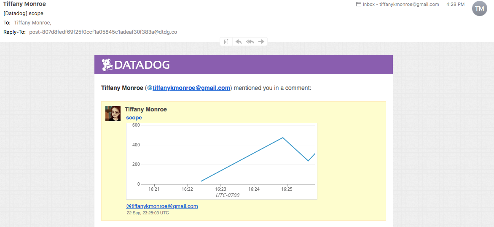
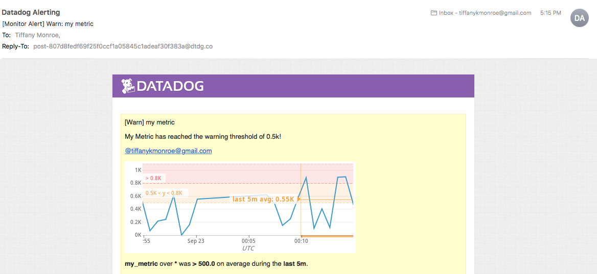

## Tiffany Monroe
Solutions Engineer Applicant

1. [Prerequisites](https://github.com/tiffanymonroe/hiring-engineers/blob/Tiffany_Monroe_Solutions_Engineer_Revised/answers.md#prerequisites---setting-up-the-environment)
2. [Collecting Metrics](https://github.com/tiffanymonroe/hiring-engineers/blob/Tiffany_Monroe_Solutions_Engineer_Revised/answers.md#collecting-metrics)
3. [Visualizing Data](https://github.com/tiffanymonroe/hiring-engineers/blob/Tiffany_Monroe_Solutions_Engineer_Revised/answers.md#visualizing-data)
4. [Monitoring Data](https://github.com/tiffanymonroe/hiring-engineers/blob/Tiffany_Monroe_Solutions_Engineer_Revised/answers.md#monitoring-data)
5. [Collecting APM Data](https://github.com/tiffanymonroe/hiring-engineers/blob/Tiffany_Monroe_Solutions_Engineer_Revised/answers.md#collecting-apm-data)
6. [Final Question](https://github.com/tiffanymonroe/hiring-engineers/blob/Tiffany_Monroe_Solutions_Engineer_Revised/answers.md#final-question)

## Prerequisites - Setting up the environment

Used MacBook Pro OS High Sierra 10.13.4

### Github Setup

Forked Datadog Hiring Engineers Repository (https://github.com/DataDog/hiring-engineers/)

Cloned on local computer: ```git clone https://github.com/tiffanymonroe/hiring-engineers.git```

Changed directories: ```cd hiring-engineers```

Created new branch to work on: ```git checkout -b Tiffany_Monroe_Solutions_Engineer_Revised```

Used Atom to edit text in answers.md.

Checked Github:
```
git add .
git commit -m "new branch"
git push origin Tiffany_Monroe_Solutions_Engineer_Revised
```

Github worked.

### Vagrant Setup

Used instructions from
Downloaded [VirtualBox 5.2.18](https://www.virtualbox.org/wiki/Downloads) platform packages for OS X.

Installation failed: "System software from Oracle America, Inc. was blocked from loading."

Went to System Preferences to "allow" software to load, installation successful.

Downloaded and installed [Vagrant 2.1.5](https://www.vagrantup.com/downloads.html) 64-bit for OS X.

```
vagrant init hashicorp/precise64
vagrant up
```


Reviewed instructions, added SSH: ```vagrant ssh```


### Datadog Setup

Went to Datadog [website](https://datadoghq.com/), signed up for a free trial, put "Datadog Recruiting Candidate" in "Company" field, skipped the "Tell us about your stack" option.

Installed the [Agent](https://app.datadoghq.com/signup/agent) for OS X by typing provided code in Command Line:
 ```
 DD_API_KEY=ecbbdce5a2bc9bb8dc9145af1e490e3a bash -c "$(curl -L https://raw.githubusercontent.com/DataDog/datadog-agent/master/cmd/agent/install_mac_os.sh)"
 ```


Checked that Agent reports metrics: ```datadog-agent status```


Finished setup on [GUI](https://app.datadoghq.com/help/quick_start#mac): "You have 1 host reporting data to Datadog"


## Collecting Metrics

### Tags
Add tags in the Agent config file and show us a screenshot of your host and its tags on the Host Map page in Datadog.


Read documentation on tags, including [getting started](https://docs.datadoghq.com/tagging/) with tags, [assigning](https://docs.datadoghq.com/tagging/) tags, and [using](https://docs.datadoghq.com/tagging/using_tags/) tags.

Read how to [assign tags](https://docs.datadoghq.com/tagging/assigning_tags/#assigning-tags-using-the-configuration-files) in the Agent config file.

Read how to [locate](https://app.datadoghq.com/account/settings#agent/mac) the Agent config file.

Changed directories to locate the Agent config file:

```
cd ../../opt/datadog-agent/etc/conf.d
```

Could not find ```datadog.yaml``` in directory. Went up a level to see which files were located there.

```
cd ..
ls
```

Found ```datadog.yaml``` located in ```etc``` directory.

Uncommented out "tags" section, assigned tags.


Host Map did not show tags.

Restarted Agent.

Tags listed in "Stream."


Went to "Open Web UI" in the Datadog Agent.

Located "Datadog Agent Manager" in "Settings."


Added an extra line between commented out line and "tags" to save.

Restarted Agent, checked Host Map, shows tags.


### Database Integration
Install a database on your machine (MongoDB, MySQL, or PostgreSQL) and then install the respective Datadog integration for that database.


<b>Part 1: Install Database</b>

Read documentation on [installing](https://www.postgresql.org/download/macosx/) PostgreSQL, and installing [Homebrew](https://brew.sh/) packages.

Installed Homebrew from Command Line:
```
/usr/bin/ruby -e "$(curl -fsSL https://raw.githubusercontent.com/Homebrew/install/master/install)"
```

Response:
>Installation successful!

Installed PostgreSQL using [Homebrew](https://formulae.brew.sh/formula/postgresql):

```
brew install postgresql
```

Response:
>Pouring postgresql-10.5.high_sierra.bottle.1.tar.gz

Checked PostgreSQL.

```
psql -l
```

Response:
>psql: could not connect to server: No such file or directory
	Is the server running locally and accepting
	connections on Unix domain socket "/tmp/.s.PGSQL.5432"?

Read PostgreSQL installation instructions in Command Line.
>To have launchd start postgresql now and restart at login:
  brew services start postgresql
Or, if you don't want/need a background service you can just run:
  pg_ctl -D /usr/local/var/postgres start

```
pg_ctl -D /usr/local/var/postgres start
psql -l
```


<b>Part 2: Install Integration</b>

Read documentation on [Integrations](https://docs.datadoghq.com/integrations/postgres/) and, specifically, configuring [PostgreSQL](https://app.datadoghq.com/account/settings#integrations/postgres).


Created a database for integration:

```
createdb pg_stat_database
psql pg_stat_database
```

>psql (10.5)
Type "help" for help.
pg_stat_database=#

Created a read-only "datadog" user with access to PostgreSQL:

```
pg_stat_database=# create user datadog with password 'O10a8OAheqedH8jD9AG9NKb0';
CREATE ROLE
pg_stat_database=# grant SELECT ON pg_stat_database to datadog;
GRANT
pg_stat_database=# \q
```

Verified permissions:

```
psql -h localhost -U datadog postgres -c "select * from pg_stat_database LIMIT(1);" && \
echo -e "\e[0;32mPostgres connection - OK\e[0m" || \
echo -e "\e[0;31mCannot connect to Postgres\e[0m"
```

Response:
>\e[0;32mPostgres connection - OK\e[0m

Changed directories to configure the Agent to connect to the PostgreSQL server:

```
cd ~/../../opt/datadog-agent/etc/conf.d/postgres.d
mv conf.yaml.example conf.yaml
atom .
```

Edited ```postgres.d/conf.yaml``` file, restarted Agent, ran ```datadog-agent status```, installed integration button:


### Agent Check

<b>Part 1:</b> Create a custom Agent check that submits a metric named my_metric with a random value between 0 and 1000.


Read documentation on [Agent Checks](https://docs.datadoghq.com/developers/agent_checks/), researched how to generate a [random number in Python](https://www.pythoncentral.io/how-to-generate-a-random-number-in-python/).

Noted in "[Agent Check Interface](https://docs.datadoghq.com/developers/agent_checks/#agentcheck-interface)" that:
>All custom Agent checks inherit from the AgentCheck class found in checks/__init__.py and require a check() method that takes one argument, instance which is a dict having the configuration of a particular instance. The check method is run once per instance defined in the check configuration (discussed later).

Also, found that:
>the function signature of the metric senders are
```
gauge(self, name, value, tags=None, hostname=None, device_name=None)
```

Followed the "[Your First Check](https://docs.datadoghq.com/developers/agent_checks/#your-first-check)" directions and created a YAML configuration file in the ```conf.d``` directory, as well as a check in the ```checks.d``` directory.

```
touch conf.d/my_metric.yaml checks.d/my_metric.py
atom .
```

Followed [configuration](https://docs.datadoghq.com/developers/agent_checks/#configuration) directions to configure the YAML file.


Modified the "Hello World" example with code from "[Your First Check](https://docs.datadoghq.com/developers/agent_checks/#your-first-check)" and "[How to Generate a Random Number in Python](https://www.pythoncentral.io/how-to-generate-a-random-number-in-python/)."


Checked metric: ```datadog-agent check my_metric```

Response:


<b>Part 2:</b> Change your check's collection interval so that it only submits the metric once every 45 seconds.

Changed min_collection_interval from 20 to 45.


<b>Bonus Question:</b> Can you change the collection interval without modifying the Python check file you created?

The collection interval is modified in the configuration file, ```my_metric.yaml```.


## Visualizing Data

### Timeboard

Read documentation on [timeboards](https://docs.datadoghq.com/graphing/dashboards/timeboard/), the [Datadog API](https://docs.datadoghq.com/api/?lang=python#timeboards), and graphing using [JSON](https://docs.datadoghq.com/graphing/graphing_json/).

Utilize the Datadog API to create a Timeboard that contains:

<b>Part 1:</b> Your custom metric scoped over your host.

Read documentation on [authentication](https://docs.datadoghq.com/api/?lang=python#authentication), which says that access the API requires an application key and the API key. Used [link](https://app.datadoghq.com/account/settings#api) to generate application key.


Modified code from "[Create a Timeboard](https://docs.datadoghq.com/api/?lang=python#create-a-timeboard)":


[Timeboard Script](timeboard.py)

Response:
>python timeboard.py
Traceback (most recent call last):
File "timeboard.py", line 1, in <module>
from datadog import initialize, api
ImportError: No module named datadog


Researched "datadog module python," read documentation on [Python](https://docs.datadoghq.com/integrations/python/) integration.

```
pip install datadog
```

Response:
>-bash: pip: command not found


Researched "pip python," read documentation on installing [pip 18.0](https://pip.pypa.io/en/stable/installing/).

```
curl https://bootstrap.pypa.io/get-pip.py -o get-pip.py
python get-pip.py
```
Response:
>Could not install packages due to an EnvironmentError: [Errno 13] Permission denied: '/Library/Python/2.7/site-packages/pip'
Consider using the `--user` option or check the permissions.


```
python get-pip.py --user
pip install datadog
```

Response:
>-bash: pip: command not found

Read documentation on [Installing Python Modules](https://docs.python.org/3/installing/index.html).

```
python -m pip install datadog
```

Response:
>Could not install packages due to an EnvironmentError: [Errno 13] Permission denied: '/Library/Python/2.7/site-packages/decorator.py'
Consider using the `--user` option or check the permissions.

```
python -m pip install datadog --user
python timeboard.py
```

Response:


<b>Part 2:</b> Any metric from the Integration on your Database with the anomaly function applied.

Read documentation on [anomaly detection](https://docs.datadoghq.com/monitors/monitor_types/anomaly/), how to [create a monitor](https://docs.datadoghq.com/api/?lang=python#create-a-monitor), how to [write the query](https://docs.datadoghq.com/graphing/functions/algorithms/).

Modified code from "[Anomaly Monitors via the API](https://docs.datadoghq.com/monitors/monitor_types/anomaly/#anomaly-monitors-via-the-api)":

```
time_aggr(eval_window_length):anomalies(space_aggr:metric{tags}, 'basic/agile/robust', deviation_number, direction='both/above/below', alert_window='alert_window_length', interval=seconds, count_default_zero='true') >= threshold_value
```

and the example:

```
avg(last_1h):anomalies(avg:system.cpu.system{name:cassandra}, 'basic', 3, direction='above', alert_window='last_5m', interval=20, count_default_zero='true') >= 1
```

[Anomaly Script](anomaly.py)

Response:


<b>Part 3:</b> Your custom metric with the rollup function applied to sum up all the points for the past hour into one bucket

Read documentation on [rollup](https://docs.datadoghq.com/graphing/functions/rollup/), noted:
>The function takes two parameters, method and time: .rollup(method,time). The method can be sum/min/max/count/avg and time is in seconds. You can use either one individually, or both together like .rollup(sum,120). We impose a limit of 350 points per time range. For example, if you’re requesting .rollup(20) for a month-long window, we return data at a rollup far greater than 20 seconds in order to prevent returning a gigantic number of points.

Added a graph object containing the rollup function to the graphs array.


Checked that everything works on the GUI.


### Dashboard

Once this is created, access the Dashboard from your Dashboard List in the UI:

<b>Part 1:</b> Set the Timeboard's timeframe to the past 5 minutes

Discovered that the cursor changed when hovering over the graph, tried dragging the time to set for the past 5 minutes. Successful.


<b>Part 2:</b> Take a snapshot of this graph and use the @ notation to send it to yourself.

Discovered camera icon by hovering over graph, took snapshot, used @ notation to email it.




<b>Bonus Question:</b> What is the Anomaly graph displaying?

The graph displays the metric (line) and the bounds (grey band) within a given timeframe.


## Monitoring Data

Create a new Metric Monitor that watches the average of your custom metric (my_metric) and will alert if it’s above the following values over the past 5 minutes:

    * Warning threshold of 500
    * Alerting threshold of 800
    * And also ensure that it will notify you if there is No Data for this query over the past 10m.

Read documentation on [alerting](https://docs.datadoghq.com/monitors/), though it was easy to figure it out on the GUI.

### Create Monitor

Went to "Monitors" on GUI menu, chose "New Monitor."


Selected "Metric" to create a new metric monitor.


Chose "Threshold" as the detection method, defined "my_metric" as the metric.


Set alert conditions with a "warning threshold" of 500, an "alerting threshold" of 800.


Set alert to notify if there is no data for 10 minutes.


### Create Messages

Please configure the monitor’s message so that it will:

    Send you an email whenever the monitor triggers.

    * Create different messages based on whether the monitor is in an Alert, Warning, or No Data state.

    * Include the metric value that caused the monitor to trigger and host ip when the Monitor triggers an Alert state.


    * When this monitor sends you an email notification, take a screenshot of the email that it sends you.



<b>Bonus Question:</b> Since this monitor is going to alert pretty often, you don’t want to be alerted when you are out of the office. Set up two scheduled downtimes for this monitor:

    * One that silences it from 7pm to 9am daily on M-F,
    * And one that silences it all day on Sat-Sun.
    * Make sure that your email is notified when you schedule the downtime and take a screenshot of that notification.

Read documentation on [downtimes](https://docs.datadoghq.com/monitors/downtimes/), though, it was easy to see it in the GUI, went to "Manage Downtime," and "Schedule Downtime."


Scheduled downtime for 7pm to 9am weekdays, added email notification.

<b>1.</b>


<b>2.</b>


<b>3.</b>


Scheduled downtime for weekends, added email notification.

<b>1.</b>


<b>2.</b>


<b>3.</b>


## Collecting APM Data

### Configuration

Read [APM](https://docs.datadoghq.com/tracing/) documentation, [setup](https://docs.datadoghq.com/tracing/setup/) instructions, and [Agent](https://docs.datadoghq.com/tracing/setup/#agent-configuration) configuration.

Enabled trace collection by updating the ```apm_config``` key in the ```datadog.yaml```, restarted the Agent, and checked status.


```
datadog-agent status
```

Response:


From [Quick Start](https://app.datadoghq.com/help/quick_start) on GUI, noticed that Python wasn't installed as an Integration, chose "installed integration" option.

### Flask App

[Troubleshooting](flask.md) notes before switching to a Rails app.

### Ruby on Rails

Read "[Tracing Ruby Applications](https://docs.datadoghq.com/tracing/setup/ruby/)" and "[Datadog Trace Client](http://gems.datadoghq.com/trace/docs/)" documentation.

Read APM [introduction](https://app.datadoghq.com/apm/intro) on GUI, chose "Ruby," followed instructions.


Installed the Ruby client.

<b>Part 1: Install ddtrace</b>

`gem install ddtrace`

Instrumented application.

```
touch config/initializers/datadog-tracer.rb
atom .
Datadog.configure do |c|
  c.use :rails, service_name: 'my-rails-app'
end
```


Started Rails server, checked Agent status.

```
rails s
datadog-agent status
```

Response:


>Logs Agent is not running

Researched "datadog logs collection not running," read [troubleshooting guide](https://docs.datadoghq.com/logs/faq/log-collection-troubleshooting-guide/).

Checked `datadog.yaml` for configuration issues, could not find `logs_enabled: true`, added it to config file, restarted Agent.

```
datadog-agent status
```

Response:
Logs Agent no longer says not running. APM error remains the same.


Checked for [errors](https://docs.datadoghq.com/logs/faq/log-collection-troubleshooting-guide/#check-for-errors-in-the-logs) in the logs.

`sudo cat /var/log/datadog/agent.log | grep logs`

Response:
>2018-09-23 12:13:00 PDT | INFO | (logs.go:47 in Start) | Starting logs-agent

Read "[Quickstart for Rails Applications](https://docs.datadoghq.com/tracing/setup/ruby/)," changed configuration, restarted Agent.

```
mv datadog-tracer.rb datadog.rb
atom .
Datadog.configure do |c|
  c.use :rails
end
```

Checked status, opened GUI.

```
datadog-agent status
```

Response:
>Core Check Loader:
        Could not configure check APM Agent: APM agent disabled through main configuration file

Reviewed "[APM Setup](https://docs.datadoghq.com/tracing/setup/)" documentation.
>Install the Datadog Agent: Install and configure the latest Datadog Agent. (On macOS, install and run the [Trace Agent](https://github.com/DataDog/datadog-trace-agent#run-on-osx) in addition to the Datadog Agent. See the macOS Trace Agent documentation for more information).

Downloaded and installed latest [OSX Trace Agent](https://github.com/DataDog/datadog-trace-agent/releases/tag/6.5.0) release and [Go 1.1](https://golang.org/dl/) for MacOS (based on the "Developer" directions), restarted Terminal.

Response:
>Go: installation successful!

```
go get -u github.com/DataDog/datadog-trace-agent/...
cd $GOPATH/src/github.com/DataDog/datadog-trace-agent
```

Response:
>-bash: cd: /src/github.com/DataDog/datadog-trace-agent: No such file or directory


The problem seems to be with the installation of the Trace Agent. Returned to OSX directions, instead of "Development" directions.

```
./trace-agent-darwin-amd64-X.Y.Z -config /opt/datadog-agent/etc/datadog.yaml
```

Response:
>-bash: ./trace-agent-darwin-amd64-X.Y.Z: No such file or directory
Realized the file downloaded has a different name.

```
./trace-agent-darwin-amd64-6.5.0 -config /opt/datadog-agent/etc/datadog.yaml
```

Response:
>-bash: ./trace-agent-darwin-amd64-6.5.0: Permission denied

```
sudo: ./trace-agent-darwin-amd64-6.5.0 -config /opt/datadog-agent/etc/datadog.yaml
```

Response:
>sudo: ./trace-agent-darwin-amd64-6.5.0: command not found

Checked various directories to locate Trace Agent. Found in `/Users/tiffanymonroe/go/src/github.com/DataDog/datadog-trace-agent`.

```
make install
```

Response:
>generate versioning information and installing the binary.
go generate ./info
go install ./cmd/trace-agent

```
go generate ./info
go install ./cmd/trace-agent
$GOPATH/bin/trace-agent
```

Response:
>-bash: /bin/trace-agent: No such file or directory.

Noticed the `go` directory in Finder, after exiting out of Agent and Terminal. Looked at `go` directory in Finder and opened Trace Agent by double-clicking icon.

Tracer started:


Tracer tracking:


**Bonus Question**: What is the difference between a Service and a Resource?

    The difference is that a service is "a set of processes" that do the same thing, but a resource is "a particular action for a service."

    [Source](https://docs.datadoghq.com/tracing/visualization/)

Provide a link and a screenshot of a Dashboard with both APM and Infrastructure Metrics.


Please include your fully instrumented app in your submission, as well.

[Disneyland Decoded API](https://github.com/tiffanymonroe/disneyland_decoded_backend/tree/datadog)

## Final Question:

Datadog has been used in a lot of creative ways in the past. We’ve written some blog posts about using Datadog to monitor the NYC Subway System, Pokemon Go, and even office restroom availability!

Is there anything creative you would use Datadog for?

I think that colleges and universities could use Datadog for monitoring the campus parking situation, peak library usage, or even which classes need more sections offered.
