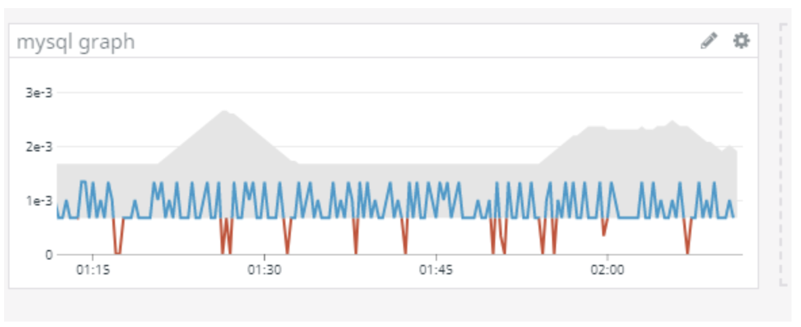
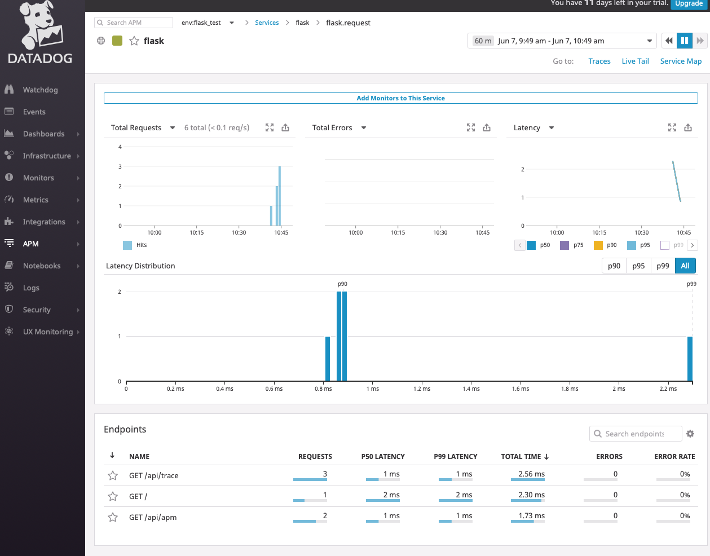
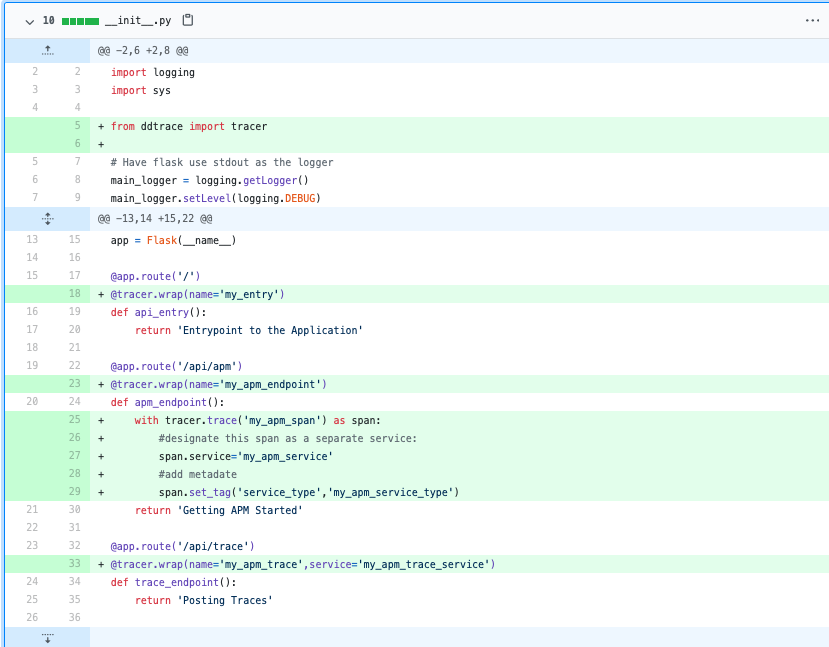
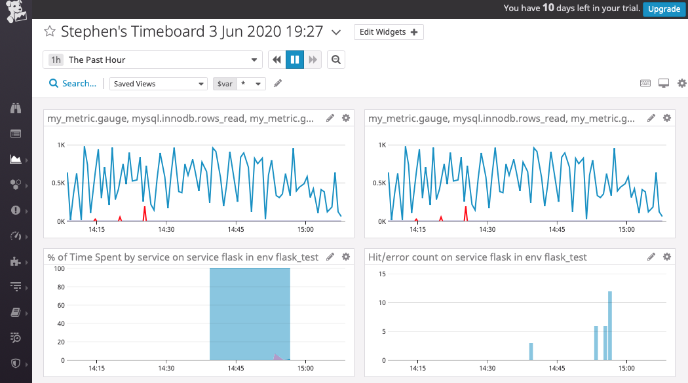
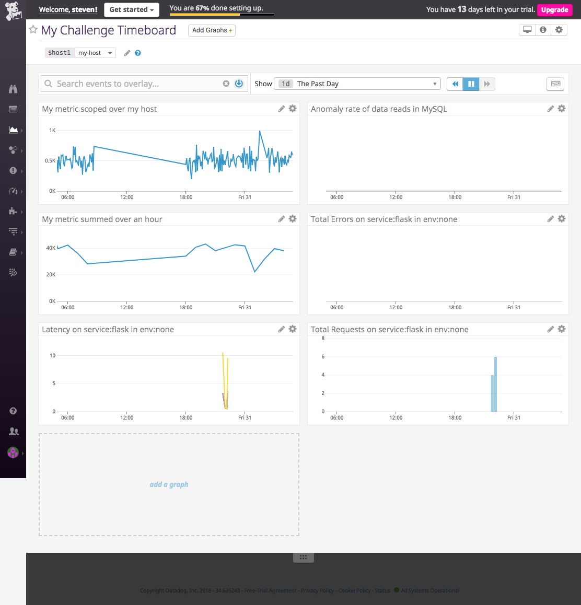

# Answers to the challenge

## Prerequisites - Setup the environment

Summary:
For this part, I decided to use Vagrant and Virtualbox. Following the guide, I installed both Vagrant and Virtualbox. I'm currently using a mac, so I downloaded both of them for the mac (.dmg extension). Following the instructions that come with the installers, I installed both Vagrant and VirtualBox (Detailed explanation is listed at the end).  

Once the installation is completed I created a folder to hold all the work and then I went into the folder and set up vagrant with Linux version 16.04. All vagrant boxes versions can be found here: <https://app.vagrantup.com/boxes/search>. Ubuntu/xenial64 is 16.04, so I went with that.  

```markdown
vagrant init ubuntu/xenial64
```

Once vagrant is finished being set up, I started it with:

```markdown
vagrant up
```

At this point, vagrant will run a VirtualBox with Linux version 16.04. I then SSH'd into it using:

```markdown
vagrant ssh
```

At this point, my user on my terminal changed to "vagrant@ubuntu-xenial" so I knew everything was working as intended.  

<details><summary>Image of SSH terminal</summary>

</details>
<br>

I registered for a 14-day trial account here: <https://www.datadoghq.com/> and clicked the "get started free" button on the upper right. Once registered I skipped the part where I describe my stack.

<details><summary>Detailed installation of VirtualBox and Vagrant</summary>
<p>
For Vagrant, I went to: <https://www.vagrantup.com/downloads.html> and downloaded the macOS 64-bit installer. Once it finished downloading, I double-clicked the downloaded file and then double-clicked the vagrant.pkg icon. At this point after clicking continue and then next, the installer proceeded and started installing into the computer. There will be a security prompt that pops up asking for your computer password to finish the installation. Once installed the downloaded file can be safely deleted.

For VirtualBox, I went to: <https://www.virtualbox.org/wiki/Downloads> and downloaded the VirtualBox for OS X hosts. I repeated the steps listed above in the vagrant installation and installed the VirtualBox on my computer.
</p>
</details>

## Collecting Metrics

To start collecting metrics I had to install the agent on my virtual machine. Since my virtual machine is running Linux, I went with the Ubuntu installation instructions here: <https://app.datadoghq.com/signup/agent#ubuntu>. I was able to find that installing the agent was as simple as running a command in the command line on my virtual machine via ssh. Since I wasn't upgrading, I went with option 1.

```markdown
DD_API_KEY=<API KEY HERE> bash -c "(curl -L https://raw.githubusercontent.com/DataDog/datadog-agent/master/cmd/agent/install_script.sh)"
```

I knew everything was running fine since I saw on both <https://app.datadoghq.com/signup/agent#ubuntu> and my terminal was saying that the agent is running properly.  

### Assigning tags

I looked at this page: <https://docs.datadoghq.com/tagging/assigning_tags/> for information on how to add custom tags for my host. To add tags I would have to edit the datadog.yaml file. The datadog.yaml file is located in /etc/datadog-agent according to: <https://help.datadoghq.com/hc/en-us/articles/203037169-Where-is-the-configuration-file-for-the-Agent->. To edit the file, I had to use vi text editor(vi) with elevated privileges (sudo).  

```markdown
sudo vi datadog.yaml
```

Once inside datadog.yaml loaded on my SSH terminal, I went and explored it a bit and found tags were there already, just commented out. I uncommented it by deleting the "#" and added my own custom tags in accordance to: <https://docs.datadoghq.com/tagging/assigning_tags/>.  

```markdown
tags:
   - name:steven
   - gender:male
   - role:trial
```

Two things I noted was that the host map on the DataDog website took a few mins to update and also to not use tab indentation on .yaml files.  

```markdown
Usefull Vi editor commands:
i   : insert edit mode
esc : exit edit mode
x   : delete at position when not in edit mode
:w  : save file
:q  : quit
```

<details><summary>Image of tags on my host</summary>

</details>
<br>

### Installing a database and integrating

I picked MySQL for this part. Installation of MySQL into the virtual machine was done using the following commands in the SSH:

```markdown
sudo apt-get update
sudo apt-get install mysql-server
```

The installation will download and set up the MySQL server. After installation I made a simple password and used it to go into MySQL using:  

```markdown
mysql -u root -p
```

Once there, I prepped MySQL for the DataDog integration by following this guide: <https://docs.datadoghq.com/integrations/mysql/>. I created a user called datalog:  

```markdown
CREATE USER 'datadog'@'localhost' IDENTIFIED BY 'test123';
```

I then exited MySQL and verified the DataDog user using:  

```markdown
mysql -u datadog --password=test123 -e "show status" | \
grep Uptime && echo -e "\033[0;32mMySQL user - OK\033[0m" || \
echo -e "\033[0;31mCannot connect to MySQL\033[0m"

mysql -u datadog --password=test123 -e "show slave status" && \
echo -e "\033[0;32mMySQL grant - OK\033[0m" || \
echo -e "\033[0;31mMissing REPLICATION CLIENT grant\033[0m"
```

The first one came back green and ok, the second one was missing REPLICATION CLIENT grant. To fix that I went back into MySQL and did the following:

```mysql
GRANT REPLICATION CLIENT ON *.* TO 'datadog'@'localhost' WITH MAX_USER_CONNECTIONS 5;
GRANT PROCESS ON *.* TO 'datadog'@'localhost';
```

I exited MySQL again and tested the command that failed last time and this time it passed. Following the guide I granted access to performance schema by running the following:  

```mysql
GRANT SELECT ON performance_schema.* TO 'datadog'@'localhost';
```

Following the guide, I navigated to /etc/datadog-agent/conf.d/mysql.d and created a file called conf.yaml and opened it again in my terminal editor Vi.

```markdown
sudo touch conf.yaml
sudo vi conf.yaml
```

I copied the supplied code snippet provided in the guide: <https://docs.datadoghq.com/integrations/mysql/>.  

```markdown
  init_config:

  instances:
    - server: 127.0.0.1
      user: datadog
      pass: 'test123' # from the CREATE USER step earlier
      port: 3306 # 3306 is default MySQL port, since I didn't change it should be still 3306
      options:
          replication: 0
          galera_cluster: 1
          extra_status_metrics: true
          extra_innodb_metrics: true
          extra_performance_metrics: false
          schema_size_metrics: false
          disable_innodb_metrics: false
```

I then restarted the agent by running and checked the agent status to see if my MySQL was integrated:

```markdown
sudo service datadog-agent restart
sudo datadog-agent status
```

<details><summary>Image of DataDog agent with MySQL integration</summary>

</details>
<br>

### Creating a custom Agent check

From reading the guide at: <https://docs.datadoghq.com/developers/agent_checks/>, I gathered that I needed to create a my_metric.py inside /etc/datadog-agent/checks.d. Also, I needed to make my_metric.yaml inside /etc/datadog-agent/conf.d. The names of the py file must match with the yaml file. In my case, it would be my_metric.py and my_metric.yaml. The guide provides the template and with a small alteration, I changed the value being sent from 1 to a random number between 1 and 1000.  
my_metric.py:

```python
    import random
    from checks import AgentCheck
    class MyCheck(AgentCheck):
    def check(self, instance):
        self.gauge('my metric value', random.randint(1, 1000))
```

my_metric.yaml:

```markdown
    init_config:

    instances:
        [{}]
```

The agent check can be verified by checking the status of the agent or by going on to DataDog website and looking at the host. There should be a new app in blue once you click on the host. If you click the newly appeared app you can see my custom metric being sent in.

<details><summary>Images of custom metric</summary>


</details>
<br>

### Setting a collection interval for my metric

A minimal interval can be set by editing the my_metric.yaml file inside /etc/datadog-agent/conf.d. This can be achieved by adding min_collection_interval into my yaml file and setting it equal to the minimum amount of time in between checks. In my case, 45 seconds. Alternatively, you can also edit the python file to add a delay using time.sleep() method(I think?). I lack the knowledge of the inner workings of the DataDog agent so I'm not entirely sure if this will mess with anything else.  

my_metric.yaml:

```markdown
instances:
    - min_collection_interval: 45
```

my_metric.py

```python
import random
from checks import AgentCheck
class MyCheck(AgentCheck):
    def check(self, instance):
        self.gauge('my metric value', random.randint(1, 1000))
        time.sleep(45)
```

### Bonus

As mentioned above, to add a minimum interval for the agent check can be achieved by editing the .yaml file inside the /etc/datadog-agent/conf.d. Each agent check file inside /etc/datadog-agent/checks.d has a corresponding .yaml file inside /etc/datadog-agent/conf.d that shares the same name. For example /etc/datadog-agent/checks.d/hello.py and /etc/datadog-agent/conf.d/hello.yaml. By adding min_collection_interval option to hello.yaml, I will only set a minimum interval collection for hello.py. All other checks inside the checks.d will be unaffected.  

## Visualizing Data

From the guide at: <https://docs.datadoghq.com/api/?lang=python#timeboards>, I got a template on how to create a time board using the API.  

```python
from datadog import initialize, api

options = {
    'api_key': '<YOUR_API_KEY>',    # found here https://app.datadoghq.com/account/settings#api
    'app_key': '<YOUR_APP_KEY>'     # create here https://app.datadoghq.com/account/settings#api by giving it a name and pressing the create application key
}

initialize(**options)

title = "My Timeboard"                      # Name for new timeboard
description = "An informative timeboard."   # Description of new timeboard
graphs = [{
    "definition": {                         #content of the graph https://docs.datadoghq.com/graphing/graphing_json/#grammar
        "events": [],
        "requests": [
            {"q": "avg:system.mem.free{*}"}
        ],
        "viz": "timeseries"
    },
    "title": "Average Memory Free"          #name of graph 
}]

template_variables = [{        
    "name": "host1",            #variable name
    "prefix": "host",           #tag associated with variable
    "default": "host:my-host"   #default value on dashboard load
}]

read_only = True        #sets screenboard to read only

api.Timeboard.create(title=title,                               #takes title, description, graphs, template_variables and read_only defined above and creates a timeboard
                     description=description,
                     graphs=graphs,
                     template_variables=template_variables,
                     read_only=read_only)
```

for my requirement I needed the following:  

* Your custom metric scoped over your host.  

```python
{
    "definition": {                        
        "events": [],
        "requests": [
            {"q": "my_metric_value{host:ubuntu-xenial}"}
        ],
        "viz": "timeseries"
    },
    "title": "My metric scoped over my host"          
}
```

* Any metric from the Integration on your Database with the anomaly function applied.

Randomly picked mysql.innodb.data_reads from: <https://docs.datadoghq.com/integrations/mysql/>. Anomaly function guide/template can be found here: <https://docs.datadoghq.com/graphing/functions/algorithms/>

```python
{
    "definition": {                        
        "events": [],
        "requests": [
            {"q": "anomalies(mysql.innodb.data_reads{host:ubuntu-xenial}, 'basic', 2)"}  #anomaly detection on the average data reads using the basic algorhitm with a standard deviation of 2
        ],
        "viz": "timeseries"
    },
    "title": "Anomaly rate of data reads in MySQL"          
}
```

* Your custom metric with the rollup function applied to sum up all the points for the past hour into one bucket. Rollup docs here: <https://docs.datadoghq.com/graphing/functions/rollup/>

```python
{
    "definition": {                        
        "events": [],
        "requests": [
            {"q": "my_metric_value{host:ubuntu-xenial}.rollup(sum,3600)"}  # sum over 3600 seconds which is 1 hour
        ],
        "viz": "timeseries"
    },
    "title": "My metric summed over an hour"          
}
```

* Combining it all together and creating custom_board.py in /etc/datadog-agent/.

```python
from datadog import initialize, api

options = {
    'api_key': '<API_KEY>',
    'app_key': '<APP_KEY>'
}

initialize(**options)

title = "My Challenge Timeboard22"
description = "A timeboard of randomness"
graphs = [
    {
    "definition": {                        
        "events": [],
        "requests": [
            {"q": "my_metric_value{host:ubuntu-xenial}"}
        ],
        "viz": "timeseries"
    },
    "title": "My metric scoped over my host"          
    },
    {
    "definition": {                        
        "events": [],
        "requests": [
            {"q": "anomalies(mysql.innodb.data_reads{host:ubuntu-xenial}, 'basic', 2)"}
        ],
        "viz": "timeseries"
    },
    "title": "Anomaly rate of data reads in MySQL"          
    },
    {
    "definition": {                        
        "events": [],
        "requests": [
            {"q": "my_metric_value{host:ubuntu-xenial}.rollup(sum,3600)"} 
        ],
        "viz": "timeseries"
    },
    "title": "My metric summed over an hour"          
    }
]

template_variables = [{
    "name": "host1",
    "prefix": "host",
    "default": "host:my-host"
}]

read_only = True
api.Timeboard.create(title=title,
                     description=description,
                     graphs=graphs,
                     template_variables=template_variables,
                     read_only=read_only)
```

Lastly, I needed to run the python script to create the timeboard

```markdown
python3 custom_timeboard.py
```

<details><summary>Image of created timeboard</summary>

</details>
<br>

* Set the Timeboard's timeframe to the past 5 minutes

To do this it's very simple. Just left click on the graph and drag to select a five minute period.


* Take a snapshot of this graph and use the @ notation to send it to yourself.
  
<details><summary>Image of timeboard over the last 5 minutes emailed to myself</summary>


</details>
<br>

* **Bonus Question**: What is the Anomaly graph displaying?
  
The anomaly graph tries to give a prediction range of where the metric should be based on past data. The prediction also takes into account trends, seasonal day-of-week, and time-of-day patterns.  

## Monitoring Data

 To monitor the data there are two approaches. One is to set up on the datadog website and the other is to use the API.

 Datadog website:
 -After logging in, look for the monitors tab on the left.  
 -Select new monitor.  
 -Since we're monitoring metric, select metric as the monitor type.  
 -The previous step will bring you to a screen with 5 steps that needs to be filled out.  
* Step 1: since we're looking for an alert when the metric passes a certain value, I chose threshold alert

* Step 2: select the metric you want to monitor. In my case it's my_metric_value and I also picked my host

* Step 3: this is where I specified the values for an alert and a warning alert. In my case I wanted to see when the metric is above the threshold on average during the last 5 minutes. My alert threshold is 800 and my warning threshold is 500. I also wanted an alert if no data is being sent. This can be achieved by changing "Do not notify" to "Notify" if data is missing. Changing it brings up an additional option to select for how long data needs to be missing before issuing an alert. In my case, it's 10 minutes.
  
* Step 4: This is where I customized my alert messages. Following the guide here: <https://docs.datadoghq.com/monitors/notifications/>, I needed to create a message with {{#is_alert}}{{/is_alert}}, {{#is_warning}}{{/is_warning}} and {{#is_no_data}}{{/is_no_data}}. Also this alert requires a title. I also used {{host.ip}}, {{value}}, {{threshold}} and {{warn_threshold}} to see the value of metric, alert threshold and warning threshold respectively.

* Step 5: This is where I set who to notify with these alerts and warnings. I can just set the name of the person I wanted to notify and it autofilled it. Once done I went ahead and press save to save the monitor. If all went well I should be receiving warning and alerts emails from DataDog.

<details><summary>Image of monitor setting using the DataDog GUI</summary>


</details>
<br>

Using the API(guide here: <https://docs.datadoghq.com/api/?lang=python#create-a-monitor)>:

```python
from datadog import initialize, api

options = {
    'api_key': '<API_KEY>',
    'app_key': '<APP_KEY>'
}

initialize(**options)

# Create a new monitor
options = {
    "notify_no_data": True,
    "no_data_timeframe": 20
}
tags = ["app:webserver", "frontend"]
api.Monitor.create(
    type="metric alert",
    query="avg(last_1h):sum:system.net.bytes_rcvd{host:host0} > 100",
    name="Bytes received on host0",
    message="We may need to add web hosts if this is consistently high.",
    tags=tags,
    options=options
)
```

I just added my requirements to this template. The options object already has the no data alert set to 20 minutes. I just had to change that to 10. The options object can also take the warning and the threshold values. I added that in as well. Now I just had to set the query parameters and the message. We're still monitoring my metric so the type should still be metric alert. My query was my_metric_value on average scoped over all the hosts in the last 5 minutes is greater than 800. In other words: avg(last_5m):avg:my_metric_value{*} > 800. I then needed to give it a name and a message. I added email notification using @INSERT@email.here. So putting it all together in a python file:  

```python
from datadog import initialize, api

options = {
    'api_key': '<API_KEY>',
    'app_key': '<APP_KEY>'
}

initialize(**options)

# Create a new monitor
options = {
    "notify_no_data": True,
    "no_data_timeframe": 10,
    "thresholds": {
			"critical": 800,
			"warning": 500
		}
}
tags = []
api.Monitor.create(
    type="metric alert",
    query="avg(last_5m):avg:my_metric_value{host:ubuntu-xenial} > 800",
    name="my_metric_monitor3",
    message="{{#is_alert}}High Metric is too high on {{host.ip}} {{value}}>{{threshold}} {{/is_alert}}{{#is_warning}}High Metric is high {{value}} > {{warn_threshold}}{{/is_warning}}{{#is_no_data}}No Metric is best if not high{{/is_no_data}}. @steven_yuen05@hotmail.com",
    tags=tags,
    options=options
)
```

Same as how I created the timeboard, I had to run this pyton file and the monitor will be created.  

<details><summary>Image of monitor setting using the DataDog API</summary>

</details>
<br>

<details><summary>Email of alert/warning</summary>

</details>
<br>

* **Bonus Question: Silencing the monitor**
  
Downtime on the monitor can be created on the DataDog website.
In the monitor tab, I had to select "Manage Downtime"
Then click on schedule downtime which should bring up a menu with information I filled out

* Step 1: I selected which monitors I wanted to silence

* Step 2: I set it to happen only for a timeframe or make it recurring. In my case I picked recurring. I set the start date and select 1 week on the weekdays at 7:00 pm and lasting for 14 hours and with no end date

* Step 3: Here I can added custom message for the downtime

As for silencing it over the weekend, I followed the same steps as above and create a recurring downtime happening at 12.00 am on Saturday and Sunday that last for 1 day.

<details><summary>Downtime settings for weekdays and weekend</summary>


</details>
<br>

## Collecting APM Data

I first needed to install both ddtrace and flask onto my virtual machine.

```markdown
 pip install flask --user
 pip install ddtrace --user
```

Afterward, I created a file call logger.py with the script provided. I did, however, edit the file and changed the port number from a string to an integer. Afterward, I launched the script following the guide on <https://app.datadoghq.com/apm/install#>. I then hit each of the endpoints using a terminal browser on my virtual machine (I used links):

```markdown
ddtrace-run python3 my_app.py
sudo apt-get install links
links http://0.0.0.0:5050/
links http://0.0.0.0:5050/api/apm
links http://0.0.0.0:5050/api/trace
links http://0.0.0.0:5050/random
```

<details><summary>APM graphs and integration into my dashboard</summary>


</details>
<br>

* **Bonus Question:Resource vs. Service**
  
A "Service" is the name of a set of processes that work together. It deals with data and returns information that other programs or apps can consume when requested. An example of a web service would be an API.  
A "Resource" is any information that is returned when querying a particular service. An example would a JSON object after a GET request for a service.

## Final Question# Answers to the challenge


