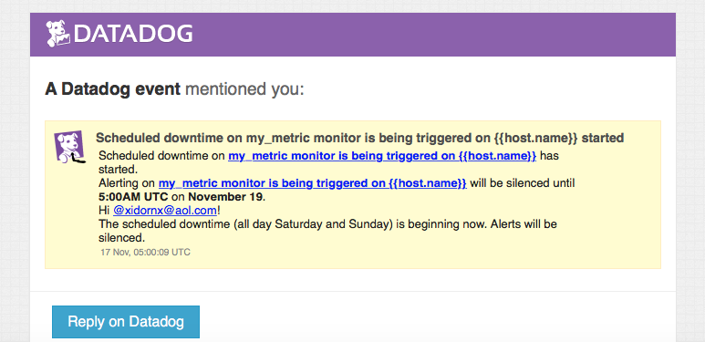
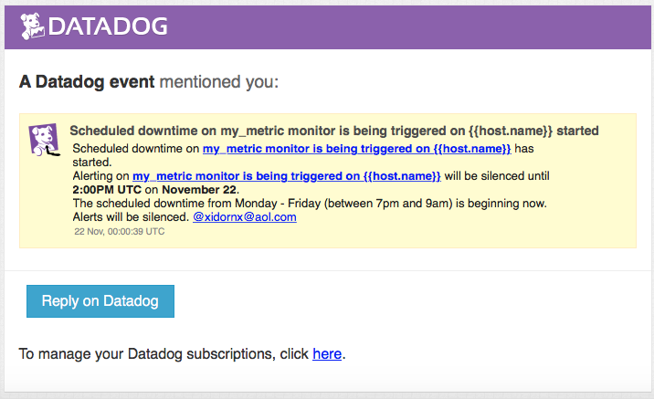

# Datadog primer

## Introduction
Datadog is a monitoring solution built to take on the new challenges of modern infrastructure and workloads. In this new landscape, gaining status and performance insights requires a new approach that takes into account the continuous state of flux of compute resources.

The explosion of software-as-a-service (SaaS) and the ubiquity of APIs have ushered in a new era of integrations. When considering the suitability of a new tool, the easiness of integration is one of the main factors to be evaluated. Datadog currently offers 200+ turn-key integrations and a simple SDK for rolling your own.

In this document, we will demonstrate how easy it is to go from zero to metrics reporting, dashboards and alerts for a single server, while laying down the groundwork to scale this solution to any number of hosts.

## The scenario
Our goal for this demonstration is to monitor the performance of db1, an on-premises Linux server running ubuntu, serving as a database (postgresql). We will capture system metrics, database-specific metrics by leveraging the Datadog Postgresql integration, and demonstrate the reporting of a custom metric.

We will then create dashboards for a better user experience while working with these metrics, and alerts to notify the operators of possible issues.

## Technical overview
### Preamble
For this demonstration, we will use [vagrant](https://vagrantup.com). Vagrant is a tool that allows us to replicate virtual environments based off a single configuration file. The technical details of the configuration can be found in the [appendix](#appendix)
```
$ vagrant init ubuntu/xenial64
### customize Vagrantfile
$ vagrant up
```
We now have a brand new ubuntu instance to be used in the subsequent steps.

### Subscribing for Datadog
Datadog provides a 15-day trial in which you can explore the platform at will, no credit card required. There are no limitations in terms of functionality available to a trial user.

Let's start by signing up for the service:


Take note of the API key. This secret key is what authenticates and authorizes your servers when using Datadog's APIs.

### Collecting data
In order to gather data from a host, we need a program (therefore called an Agent) that runs in the background and periodically records measurements we need. The Agent is also responsible for uploading the measurements to Datadog.

Since we already foresee the need to replicate the installation of the Datadog agent across multiple hosts in the future, we will leverage a configuration management tool (puppet) in order to create an easily repeatable procedure.

After running puppet and waiting for a few minutes, we can see our host reporting on datadog, by going to Infrastructure &gt; Host map:


We will now install Postgresql and enable the corresponding Datadog integration, in order to get Postgresql specific metrics into Datadog:

```
ubuntu@db1:/vagrant$ sudo /opt/puppetlabs/bin/puppet apply --modulepath '/tmp/vagrant-puppet/modules-c3357bd14dd107edea878eb05feaf422:/etc/puppet/modules' --hiera_config=/tmp/vagrant-puppet/hiera.yaml --detailed-exitcodes --environmentpath /tmp/vagrant-puppet/environments/ --environment test ./install_postgresql.pp
Notice: Compiled catalog for db1.hitronhub.home in environment test in 0.86 seconds
Notice: /Stage[main]/Postgresql::Server::Install/Package[postgresql-server]/ensure: created
Notice: /Stage[main]/Postgresql::Server::Config/Concat[/etc/postgresql/9.5/main/pg_hba.conf]/File[/etc/postgresql/9.5/main/pg_hba.conf]/content: content changed '{md5}cbf62fe357451a5b84acf6e43e82329f' to '{md5}85cf7197535eff9999ba5de8665bb53e'
Notice: /Stage[main]/Postgresql::Server::Config/Concat[/etc/postgresql/9.5/main/pg_ident.conf]/File[/etc/postgresql/9.5/main/pg_ident.conf]/content: content changed '{md5}f11c8332d3f444148c0b8ee83ec5fc6d' to '{md5}9300ac105fe777787ac9e793b8df8d25'
Notice: /Stage[main]/Postgresql::Server::Reload/Exec[postgresql_reload]: Triggered 'refresh' from 1 event
Notice: /Stage[main]/Main/Postgresql::Server::Role[datadog]/Postgresql_psql[CREATE ROLE datadog ENCRYPTED PASSWORD ****]/command: command changed 'notrun' to 'CREATE ROLE "datadog" ENCRYPTED PASSWORD \'$NEWPGPASSWD\' LOGIN NOCREATEROLE NOCREATEDB NOSUPERUSER  CONNECTION LIMIT -1'
Notice: /Stage[main]/Datadog_agent::Integrations::Postgres/File[/etc/dd-agent/conf.d/postgres.yaml]/ensure: defined content as '{md5}0797259967ffb29c27e7a57959d824b0'
Notice: /Stage[main]/Datadog_agent::Ubuntu/Service[datadog-agent]: Triggered 'refresh' from 1 event
Notice: Applied catalog in 12.12 seconds
```


At last, we will create a custom check to report on an arbitrary metric. For this example, we will simply generate a random number between zero and one and report that value. The code for this check can be found [here](vm/files/random_check.py). We will also reconfigure the datadog agent to make use of this new check by using this [puppet manifest](vm/install_random_check.pp):


To recap: in this section we covered how to get started with Datadog, leveraged a turn-key integration to report on our database, and configured the collection of a custom metric.

In this next section, we will see how to create functional dashboards to visualize this data.

### Visualizing your data
Now that db1 is gathering data and shipping it to Datadog, it is time to create some dashboards that allow us to use the data in a meaningful way.

Let's start by going to Dashboards > New dashboard:


Now we have a choice between a Timeboard and a Screenboard. There are substantial differences between the two, let's explore the Timeboard first.


As we can see, there are many ways by which we can express a measurement, from single numbers to graphs and gauges. Let's add some measurements:


Adding a chart:


The end result:


We added some system metrics, like CPU/memory/disk usage, and also some database metrics, like connection pool usage and rate of inserts. Suppose an operator has to figure out why this database server is slow while performing queries, he/she could take one look at the Timeboard and figure out:

1. whether the slowness is caused by some system limits being hit, and if so:
2. whether it is high CPU usage, high memory usage, or disk I/O exceeding the provisioned IOPS

The reason why this is possible, is because all timeboards have a control that specifies the time window for the timeboard, and <b>all widgets on a timeboard are updated to reflect the currently selected time window</b>. This allows an operator to easily correlate distinct metrics and figure out trends or issues much faster.

Now assume, for the purpose of this exercise, that our test.support.random metric is a computed metric of overall healthiness of this system, and we would like a more general dashboard to showcase that. The Screenboard is probably the best fit for this purpose, since it differs from the Timeboard in three crucial ways: 

1. it allows widgets to be placed in a free-form way,
2. it provides us with different widgets, like the event stream and embedded iframes, and
3. it allows us to <b>set the time window per widget</b>.

Let's see what that looks like:


Pressing F gives us a "full-screen" mode where everything is scaled to occupy the whole window:


Screenboards can also be shared publically. To see this screenboard live on datadog, click [here](https://p.datadoghq.com/sb/c83082073-7915f64bea).

In this section we covered how to visualize your data and some of the different ways to do so.
We will now see how to configure Datadog to take actions when certain conditions are met.

### Alerting on your data
Operations teams leverage metric collection systems in many ways, and one of the most important features is the ability to automatically notify an operator when a certain metric exceeds a threshold. This enables operation teams to respond swiftly in case of issues, guaranteeing business continuity.

In the last section, we defined test.support.random to be an overall indicator of system health. This synthetic measurement a minimum value of 0 and a maximum of 1. For the purposes of this exercise, we assume that the higher the score, the more unhealthy the system is. We will configure the alert to trigger if this metric exceeds 0.90 at least once, during the last 5 minutes:


All we have to do is wait a little, and voila:


This is just a test system, and considering the way we set up test.support.random, there's a 10% chance the alert will be triggered on each check (which happens approximately every 20 seconds). We probably don't want to notify our operators after business hours, then we use a scheduled downtime to disable the alerts until 9am the next day:




Datadog will then notify the operators, once, on the scheduled downtime:


In this section we briefly showcased one way to trigger actions (alerting) upon fulfilling some predefined conditions on certain metrics.

## Conclusion
This concludes our brief introduction to Datadog. In this document we covered the basics, which should empower new users to get up to speed with the platform. This is by no means a comprehensive guide, however. We provide many [guides](https://docs.datadoghq.com/) and [videos](https://docs.datadoghq.com/videos/) that cover basic elements like gathering data to advanced topics such as creating new integrations, doing autodiscovery with containers and single sign-on.

For the technical details on the sample scenario discussed in the document, check the [Appendix](#appendix) section.

## Appendix
### Setup an Ubuntu VM
Puppet was used to install and configure both Postgresql and the Datadog agent. First, the appropriate puppet modules are installed into the target folder (on the host):
```
$ puppet module install -i ./modules datadog-datadog_agent
Notice: Preparing to install into .../modules ...
Notice: Created target directory .../modules
Notice: Downloading from https://forgeapi.puppet.com ...
Notice: Installing -- do not interrupt ...
/.../modules
└─┬ datadog-datadog_agent (v1.11.0)
  ├── lwf-remote_file (v1.1.3)
  ├── puppetlabs-concat (v2.2.0)
  ├── puppetlabs-ruby (v0.6.0)
  └── puppetlabs-stdlib (v4.18.0)
$ puppet module install -i ./modules puppetlabs-postgresql
Notice: Preparing to install into /.../modules ...
Notice: Downloading from https://forgeapi.puppet.com ...
Notice: Installing -- do not interrupt ...
/.../modules
└─┬ puppetlabs-postgresql (v5.1.0)
  ├── puppetlabs-apt (v4.1.0)
  ├── puppetlabs-concat (v2.2.0)
  └── puppetlabs-stdlib (v4.18.0)
```

This is what the directory structure looks like afterwards (including the environments and hieradata directories):
```
$ tree -d -L 2
.
├── environments
│   └── test
├── hieradata
│   └── nodes
└── modules
    ├── apt
    ├── concat
    ├── datadog_agent
    ├── postgresql
    ├── remote_file
    ├── ruby
    └── stdlib
```

`vagrant init` is used to generate a sample Vagrantfile, and then [it is configured](vm/Vagrantfile) to bootstrap the machine by installing the puppet agent, and [running puppet with this manifest afterwards](vm/environments/test/manifests/default.pp):

With this in place, `vagrant up` brings the machine up.
```
❯ vagrant up
Bringing machine 'default' up with 'virtualbox' provider...
==> default: Importing base box 'ubuntu/xenial64'...
==> default: Matching MAC address for NAT networking...
==> default: Checking if box 'ubuntu/xenial64' is up to date...
... a *lot* of output omitted for brevity ...
==> default: Running provisioner: shell...
    default: Running: inline script
==> default: Selecting previously unselected package puppet-release.
==> default: (Reading database ... 53902 files and directories currently installed.)
==> default: Preparing to unpack /tmp/puppet.deb ...
==> default: Unpacking puppet-release (1.0.0-1xenial) ...
==> default: Setting up puppet-release (1.0.0-1xenial) ...
==> default: Get:1 http://security.ubuntu.com/ubuntu xenial-security InRelease [102 kB]
==> default: Ign:2 http://apt.puppetlabs.com xenial InRelease
... 
==> default: Get:31 http://archive.ubuntu.com/ubuntu xenial-backports/universe Sources [4,404 B]
==> default: Fetched 12.0 MB in 3s (3,313 kB/s)
==> default: Reading package lists...
==> default: Reading package lists...
==> default: Building dependency tree...
==> default:
==> default: Reading state information...
==> default: The following NEW packages will be installed:
==> default:   puppet-agent
==> default: 0 upgraded, 1 newly installed, 0 to remove and 11 not upgraded.
==> default: Need to get 15.1 MB of archives.
==> default: After this operation, 86.8 MB of additional disk space will be used.
==> default: Get:1 http://apt.puppetlabs.com xenial/puppet amd64 puppet-agent amd64 5.1.0-1xenial [15.1 MB]
==> default: dpkg-preconfigure: unable to re-open stdin: No such file or directory
==> default: Fetched 15.1 MB in 1s (10.6 MB/s)
==> default: Selecting previously unselected package puppet-agent.
==> default: Preparing to unpack .../puppet-agent_5.1.0-1xenial_amd64.deb ...
==> default: Unpacking puppet-agent (5.1.0-1xenial) ...
==> default: Processing triggers for libc-bin (2.23-0ubuntu9) ...
==> default: Setting up puppet-agent (5.1.0-1xenial) ...
==> default: Running provisioner: puppet...
==> default: Running Puppet with environment test...
==> default: Notice: Compiled catalog for db1.hitronhub.home in environment test in 0.34 seconds
==> default: Notice: /Stage[main]/Datadog_agent::Ubuntu/Datadog_agent::Ubuntu::Install_key[C7A7DA52]/Exec[key C7A7DA52]/returns: executed successfully
==> default: Notice: /Stage[main]/Datadog_agent::Ubuntu/Datadog_agent::Ubuntu::Install_key[382E94DE]/Exec[key 382E94DE]/returns: executed successfully
==> default: Notice: /Stage[main]/Datadog_agent::Ubuntu/File[/etc/apt/sources.list.d/datadog.list]/ensure: defined content as '{md5}5bc86f192cd8c8b96356fbebd98d90b1'
==> default: Notice: /Stage[main]/Datadog_agent::Ubuntu/Exec[datadog_apt-get_update]: Triggered 'refresh' from 1 event
==> default: Notice: /Stage[main]/Datadog_agent::Ubuntu/Package[datadog-agent]/ensure: created
==> default: Notice: /Stage[main]/Datadog_agent/File[/etc/dd-agent]/owner: owner changed 'dd-agent' to 'root'
==> default: Notice: /Stage[main]/Datadog_agent/File[/etc/dd-agent]/group: group changed 'dd-agent' to 'root'
==> default: Notice: /Stage[main]/Datadog_agent/File[/etc/dd-agent/datadog.conf]/ensure: defined content as '{md5}513b9d508f3a77a0bf738a027e512d05'
==> default: Notice: /Stage[main]/Datadog_agent::Ubuntu/Service[datadog-agent]/ensure: ensure changed 'stopped' to 'running'
==> default: Notice: Applied catalog in 15.47 seconds
```

For the scenario described in this document, we also created a synthetic metric called `test.support.random` that simply reports a random number between 0 and 1 every interval check. [This is the puppet manifest](vm/install_random_check.pp) that installs the check and reconfigures the agent to use it:
```
ubuntu@db1:/vagrant$ sudo /opt/puppetlabs/bin/puppet apply --modulepath '/tmp/vagrant-puppet/modules-c3357bd14dd107edea878eb05feaf422:/etc/puppet/modules' --hiera_config=/tmp/vagrant-puppet/hiera.yaml --detailed-exitcodes --environmentpath /tmp/vagrant-puppet/environments/ --environment test ./install_random_check.pp
Notice: Compiled catalog for db1.hitronhub.home in environment test in 0.02 seconds
Notice: /Stage[main]/Main/File[/etc/dd-agent/checks.d/random_check.py]/content: content changed '{md5}f2b353656321ce5d0cdcd1fa688bb04e' to '{md5}3d6723ba582f507d6c1c8e3211dcc0a8'
Notice: /Stage[main]/Main/File[/etc/dd-agent/conf.d/random_check.yaml]/content: content changed '{md5}ba3dd257d1afc95d1cb5221acaca70cb' to '{md5}8e681717a3d07dcb0394a2a38ac3d139'
Notice: /Stage[main]/Main/Service[datadog-agent]: Triggered 'refresh' from 2 events
Notice: Applied catalog in 0.51 seconds
```

### Collecting your data
The agent is a program that runs in the background, polling for metrics at set intervals and uploading said metrics to Datadog. It also includes DogStatsD, a custom StatsD implementation that allows metric gathering via push, and metric aggregation prior to forwarding the metrics upstream.

For this example, the agent has been provisioned with the correct tags from the start (in the previous step). The puppet module has a [comprehensive interface](https://github.com/DataDog/puppet-datadog-agent/blob/master/manifests/init.pp#L5) and can easily leverage the hiera auto-lookup facilities to configure the agent in one shot. This mirrors the behaviour of a real-world automated deployment.

Postgresql was then installed using [this manifest](vm/install_postgresql.pp):
```
ubuntu@db1:/vagrant$ sudo /opt/puppetlabs/bin/puppet apply --modulepath '/tmp/vagrant-puppet/modules-c3357bd14dd107edea878eb05feaf422:/etc/puppet/modules' --hiera_config=/tmp/vagrant-puppet/hiera.yaml --detailed-exitcodes --environmentpath /tmp/vagrant-puppet/environments/ --environment test ./install_postgresql.pp
Notice: Compiled catalog for db1.hitronhub.home in environment test in 0.86 seconds
Notice: /Stage[main]/Postgresql::Server::Install/Package[postgresql-server]/ensure: created
Notice: /Stage[main]/Postgresql::Server::Config/Concat[/etc/postgresql/9.5/main/pg_hba.conf]/File[/etc/postgresql/9.5/main/pg_hba.conf]/content: content changed '{md5}cbf62fe357451a5b84acf6e43e82329f' to '{md5}85cf7197535eff9999ba5de8665bb53e'
Notice: /Stage[main]/Postgresql::Server::Config/Concat[/etc/postgresql/9.5/main/pg_ident.conf]/File[/etc/postgresql/9.5/main/pg_ident.conf]/content: content changed '{md5}f11c8332d3f444148c0b8ee83ec5fc6d' to '{md5}9300ac105fe777787ac9e793b8df8d25'
Notice: /Stage[main]/Postgresql::Server::Reload/Exec[postgresql_reload]: Triggered 'refresh' from 1 event
Notice: /Stage[main]/Main/Postgresql::Server::Role[datadog]/Postgresql_psql[CREATE ROLE datadog ENCRYPTED PASSWORD ****]/command: command changed 'notrun' to 'CREATE ROLE "datadog" ENCRYPTED PASSWORD \'$NEWPGPASSWD\' LOGIN NOCREATEROLE NOCREATEDB NOSUPERUSER  CONNECTION LIMIT -1'
Notice: /Stage[main]/Datadog_agent::Integrations::Postgres/File[/etc/dd-agent/conf.d/postgres.yaml]/ensure: defined content as '{md5}0797259967ffb29c27e7a57959d824b0'
Notice: /Stage[main]/Datadog_agent::Ubuntu/Service[datadog-agent]: Triggered 'refresh' from 1 event
Notice: Applied catalog in 12.12 seconds
```
This puppet manifest:
1. installs postgresql
2. runs initdb, creating an initial cluster
3. starts the service
4. creates a regular user for the datadog agent
5. reconfigures the datadog agent to enable the postgresql integration
6. restarts the agent for the new configuration to take effect

### Caveats
To replicate these examples, first one must edit and rename the files under `hieradata`. Remove the `.template` extension and inject your own credentials.

Rebooting the virtual machine will trigger a cleanup in /tmp. The Vagrant Puppet provisioner works by mounting VirtualBox shared folders for the environments and modules directories, but hiera.yaml is copied to /tmp in the guest, which means that trying to run the later manifests (install\_postgresql.pp and install\_random_check.pp) will fail since there will be no hiera configuration in place. An easy fix is to change the puppet command line to read `--hiera_config=/vagrant/hiera.yaml` instead.
