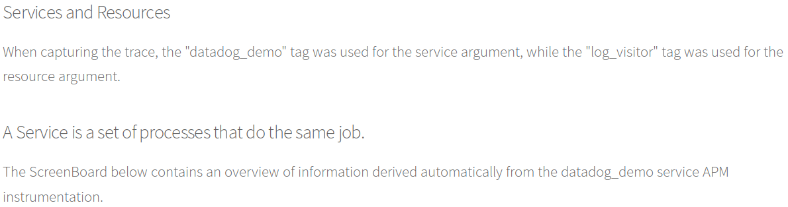

Please check out the [Live Demo](http://datadog.alexarnesen.com) of an instrumented server. All answers here are screen caps from the live site. The site contains live Datadog dashboards and graphs. I have embedded screenshots of the site in this answers file for convenience.

## Collecting Metrics:

### The Agent

### Postgres 

### Nginx

### Custom Agent Check

## Visualizing Data:

## Monitoring Data

## Collecting APM Data:

## Final Question:

I would like to point Datadog at the billing and utilization API's of a public utility cloud provider running a very large (and expensive) application. I would use Datadog as a tool to understand cloud service costs and how to minimize them.

## Live Dashboard Links

<a href="https://p.datadoghq.com/sb/e946a7b66-593e3ffa04a653c75777e39ace0301fb">host_metrics</a> 
<a href="https://p.datadoghq.com/sb/e946a7b66-3a2b105ee8e4f7c3606e57649a65a3bd">used_connections</a> 
<a href="https://p.datadoghq.com/sb/e946a7b66-d90e4d3761fe1726ceac73c81710a2e5">custom_metric</a> 
<a href="https://p.datadoghq.com/sb/e946a7b66-44126084cf456cae0c859f22c7bfb25c">nginx_metrics</a> 
<a href="https://p.datadoghq.com/sb/e946a7b66-74e8542df6444cf85fc79195702a90f9">monitor_dash</a> 
<a href="https://p.datadoghq.com/sb/e946a7b66-b389d80deb1ec89734b899a75db237be">apm_service_overview</a> 
<a href="https://p.datadoghq.com/sb/e946a7b66-bb2640631907327dc233cce14477c70f">apm_and_infrastructure</a>