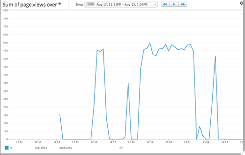
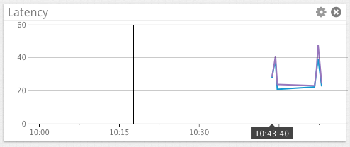
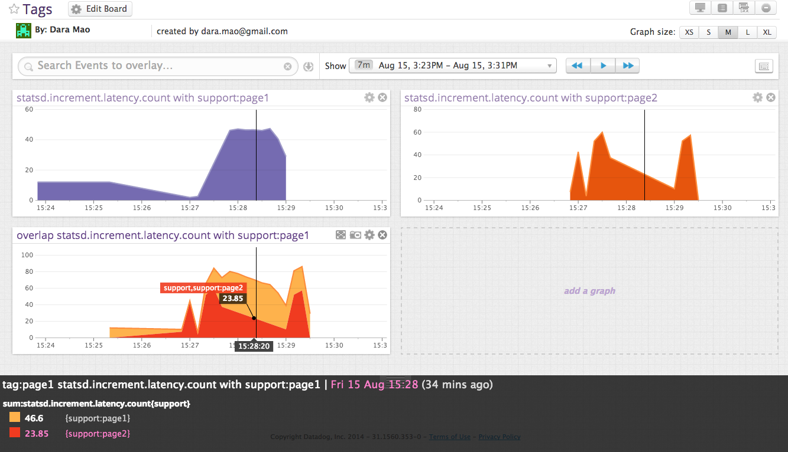
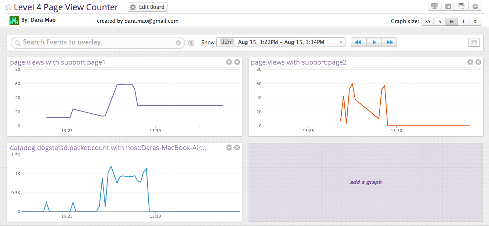

Submission for support engineer at Datadog   
Date: 08/15/2014   
From: Dara Mao  
Email: dara.mao@gmail.com 

===

## Questions and My answers:

### Level 1

* <strong>Sign up for Datadog, get the agent reporting metrics from your local machine. Answer:</strong> I have set up the agent reporting metrics for my local machine: `host:Daras-MacBook-Air-2.local`

* <strong>Bonus question: what is the agent?   Answer: </strong> The agent is a piece of software that collects events and metrics on the users hosts for monitoring and managing performance data.

* <strong>Submit an event via the API.  Answer: </strong> 
 To submit an event via the API, my code:	
			
		 require 'dogapi'
		 api_key = 'DATADOG_API_KEY'
		 dog = Dogapi::Client.new(api_key)
		 
		 response = dog.emit_event(Dogapi::Event.new('Level 1 question 3', :msg_title => 		'Support Engineer Dara Mao')) 

* <strong>Get an event to appear in your email inbox (the email address you signed up for the account with)  Answer: </strong> By adding @dara.mao@gmail.com in the event body. 
 My code:

		 require 'dogapi'
		 api_key = 'DATADOG_API_KEY'
		 dog = Dogapi::Client.new(api_key)
		 
		 response = dog.emit_event(Dogapi::Event.new('Level 1 question 4 to 		@dara.mao@gmail.com', :msg_title => 'Support Engineer Dara Mao'))

### Level 2

* <strong>Take a simple web app ([in any of our supported languages](http://docs.datadoghq.com/libraries/)) that you've already built and instrument your code with dogstatsd. This will create **metrics**.  Answer: </strong> I have implemented dogstatsd for one of my rails project, [Blackbox](https://github.com/daramao/blackbox2014).

* <strong>While running a load test (see References) for a few minutes, visualize page views per second. Send us the link to this graph!  Answer: </strong> This is the [page view graph](https://app.datadoghq.com/dash/dash/26531?from_ts=1408118740578&to_ts=1408122340578&tile_size=m&fullscreen=50557073) I generated using ApacheBench load test as follows:  

	My code for page view:	
			
		 require 'statsd'
		 statsd = Statsd.new
		 statsd.increment('page.views')

	My code for load test:	
	 
		 ab -n 157 -c 10 http://127.0.0.1:3000/periods/show
		 ab -n 2000 -c 10 http://127.0.0.1:3000/periods/show
		 ab -n 364 -c 100 http://127.0.0.1:3000/periods/show
		 ab -n 10034 -c 1 http://127.0.0.1:3000/periods/show
		 ab -n 100 -c 10 http://127.0.0.1:3000/periods/show
		 ab -n 750 -c 100 http://127.0.0.1:3000/periods/show
	
* <strong>Create a histogram to see the latency; also give us the link to the graph. Bonus points for putting together more creative dashboards.  Answer: </strong> This [dashboard](https://app.datadoghq.com/dash/dash/26531?from_ts=1408119105197&to_ts=1408127463053&tile_size=m) includes histogram along with page view load test. 

 	My code for histogram:	
			
		 require 'statsd'
		 statsd = Statsd.new
		 begin = Time.now
		 statsd.increment('page.views')
		 end = Time.now
		 frame = end - begin
		 statsd.histogram('statsd.increment.latency', frame)

### Level 3

* <strong>tag your metrics with `support` (one tag for all metrics)
* tag your metrics per page.  Answer: </strong> I have added `:tags =>['support, support:page1']` and `:tags =>['support, support:page2']` to all the metrics for 2 pages of the app. 
* <strong>visualize the latency by page on a graph (using stacked areas, with one color per `page`)  Answer: </strong> Attached [dashboard](https://app.datadoghq.com/dash/dash/26557?from_ts=1408130627940&to_ts=1408131066693&tile_size=m) of graphs.

	My code for load test:	

		 ab -n 120 -c 100 http://127.0.0.1:3000/periods
		 ab -n 500 -c 10 http://127.0.0.1:3000/periods/show
		 ab -n 45 -c 1 http://127.0.0.1:3000/periods
		 ab -n 1532 -c 10 http://127.0.0.1:3000/periods/show
		 ab -n 3495 -c 1 http://127.0.0.1:3000/periods
		 ab -n 1200 -c 100 http://127.0.0.1:3000/periods/show

### Level 4

* <strong>count the overall number of page views using dogstatsd counters.</strong> 
* <strong>count the number of page views, split by page (hint: use tags)</strong> 
* <strong>visualize the results on a graph</strong> 
* <strong>Bonus question: do you know why the graphs are very spiky?  Answer: </strong> Attached [dashboard](https://app.datadoghq.com/dash/dash/26561?from_ts=1408130545001&to_ts=1408131288068&tile_size=m) of graphs. The spikes in the graphs are due to time lapse in page load. 

