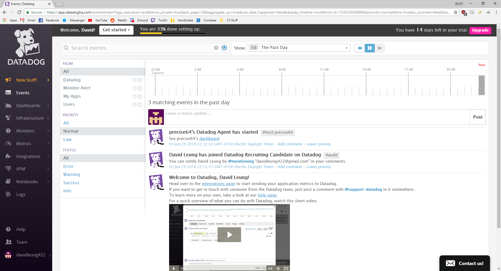

# Datadog Solutions Engineer Exercises - David Leung

## Prerequisites - Setup the environment

### Vagrant Installation
I am completing this exercise using Windows 10 and to avoid any OS or dependency issues, I setup a Vagrant Ubuntu VM. To setup the virtual machine, I used the command 'vagrant init hashicorp/precise64' after installing the Vagrant packages. Unfortunately, I had already installed Vagrant before taking a screenshot.

Then I used the command 'vagrant up' to start up the virtual machine and used the command 'vagrant ssh' to connect to it and interact with the virtual machine.

### Datadog Account Signup

Signed up for a Datadog with the appropriate company title.

Then I followed the instructions on screen to lead me through the sign up process.

### Datadog Agent Installation

I chose the Ubuntu Datadog Agent because I was running a Ubuntu VM with Vagrant.

I followed the instructions to install the agent onto a Ubuntu machine. After pasting the one line of command, I needed to install curl before proceeding.

After installing curl, the installation sequence was able to run and it was able to give me an installation success message.

I was able to access the main dashboard.

## Collecting Metrics

### Adding tags
The instructions told me to add tags to the Agent config file which would also display onto the Host Map page in Datadog. I was able to find the config file from this [page](https://help.datadoghq.com/hc/en-us/articles/203037169-Where-is-the-configuration-file-for-the-Agent-) and learned how to add tags appropriately from this [instructional page](https://docs.datadoghq.com/getting_started/tagging/assigning_tags/#assigning-tags-using-the-configuration-files). Initially I had trouble seeing the tags displayed onto the Host Map because my spacing wasn't correct in the 'datadog.yaml' file.

Here are the tags written in the configuration file:

Here are the tags displayed on the Host Map:

### Installing database
I chose to install a PostgreSQL database onto my machine because I have some experience with this specific database and am used to the commands. To understand how to install the Datadog integration for Postgre, I used the available [instructional page](https://docs.datadoghq.com/integrations/postgres/).

When I run the 'sudo datadog-agent status' command to display Agent information, it shows a successful PostgreSQL integration to my host.

### Creating custom Agent check
The next steps were to create a custom Agent check that submits a metric with a random value between 0 and 1000. I used these [directions](https://docs.datadoghq.com/developers/agent_checks/) to understand how to create an Agent check. From these instructions, I created a `mycheck.py` file inside the `checks.d` directory and a `mycheck.yaml` file inside the `conf.d` directory. To have the metric return a random value within a specified range, I used the `random.randInt()` function from the standard Python library.

`mycheck.py`

Afterwards, I had to change the check's collection interval so that it only submits the metric once every 45 seconds. The bonus question also challenged me to change this interval without editing the python file I created. After studying the AgentCheck class, I came to the conclusion that using `min_collection_interval` would be the best way to limit my_metric's collection interval.

`mycheck.yaml`

## Visualizing Data:

## Monitoring Data

## Collecting APM Data:

## Final Question
