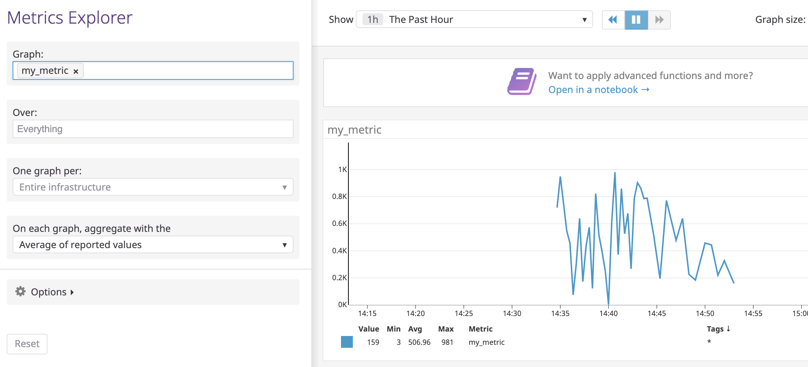
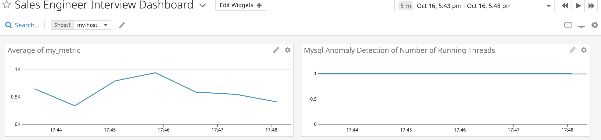
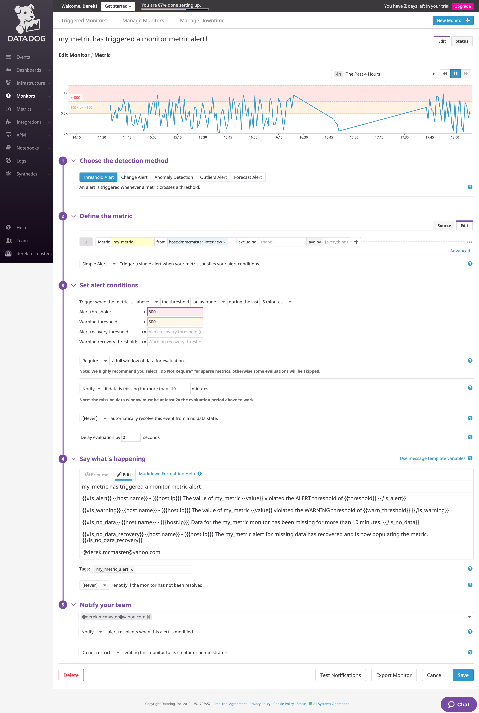
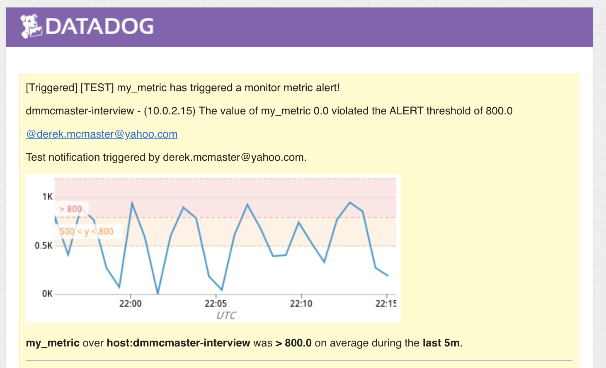
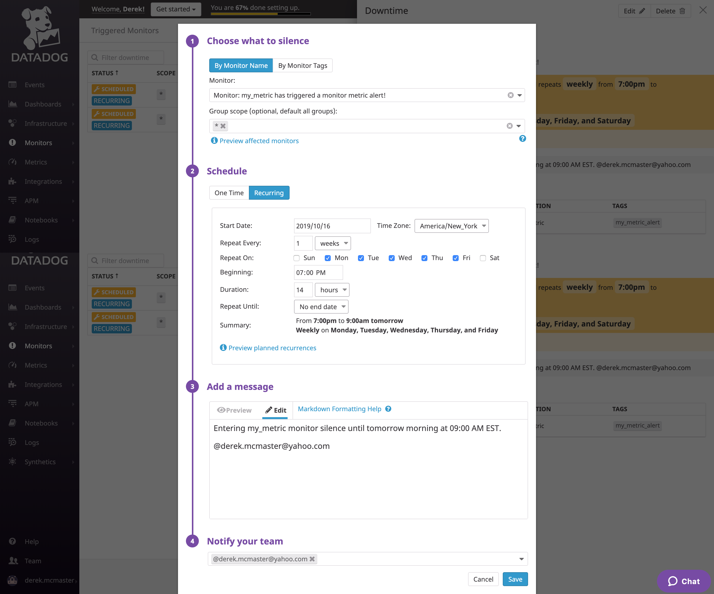
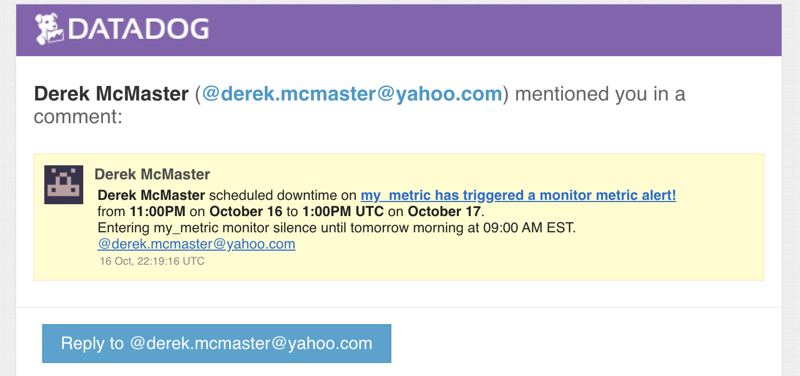
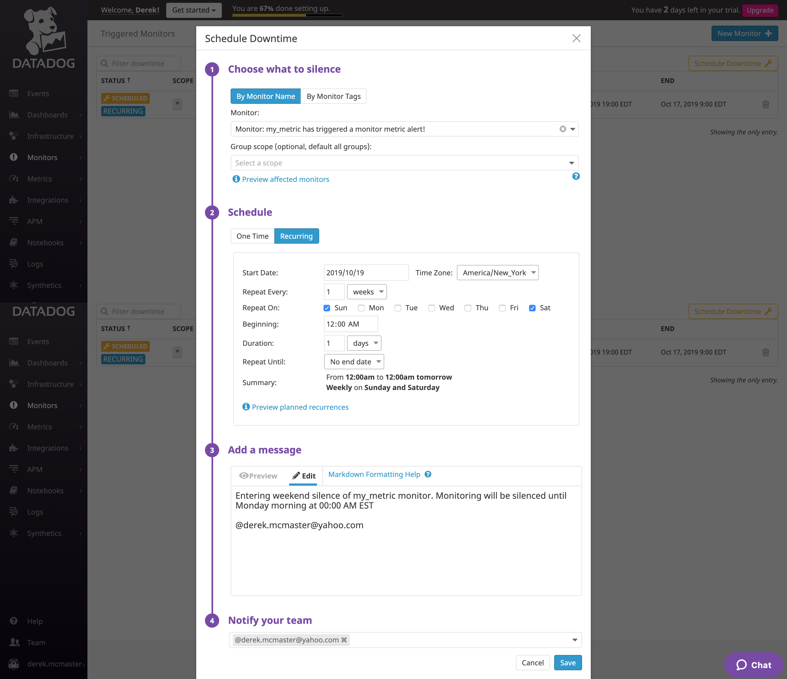
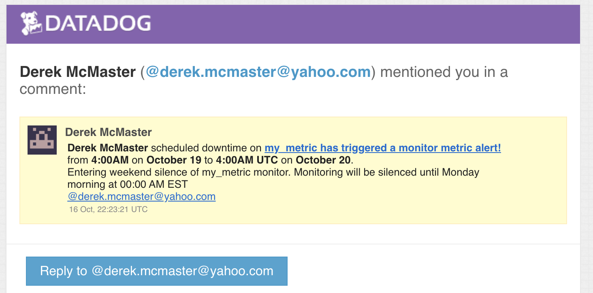
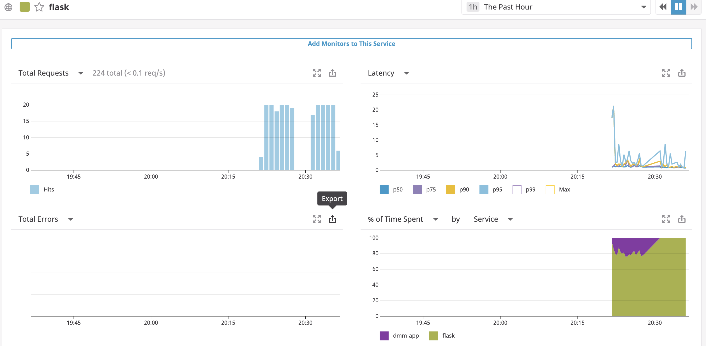

## Prerequisites - Setup the environment

I am going to walk through this technical exercise on the following environment:
 - MacBook Pro running `MacOs Mojave (10.14.X)`
 - VirtualBox 6.0 - [download link](https://www.virtualbox.org/wiki/Downloads)
 - Preferred Terminal (iTerm2 - [DL](https://www.iterm2.com/)) and Text Editor ([vim](https://www.vim.org/))

To avoid OS dependency issues I decided to use Vagrant which can be installed using the [installer on the vagrant website](https://www.vagrantup.com/intro/getting-started/install.html) or through [Homebrew](https://sourabhbajaj.com/mac-setup/Vagrant/README.html) if you're a Mac user. I used the Ubuntu 16.04 distribution, also known as Xenial Xerus, as the README recommended.

To get the Vagrant box setup and running you use the simple commands found in the vagrant docs.

```Shell
$ vagrant init ubuntu/xenial64
$ vagrant up
```
This will download the Ubuntu Xenial image and create a `VagrantFile` in your current directory and then start the virtual machine.

I then registered for a Datadog account using the provided instructions.

## Collecting Metrics:
-----
### Tagging

  The first task surrounding collecting metrics is adding custom tags to the Datadog Agent. As referred to in the [documentation](https://docs.datadoghq.com/tagging/assigning_tags/?tab=agentv6), tags are added within the main `datadog.yaml` file found in the root directory of the application --> [`/etc/datadog-agent`](https://docs.datadoghq.com/agent/guide/agent-configuration-files/?tab=agentv6)


The first custom attribute I added was a custom hostname but feel free to use the default hostname provided:
```
## @param hostname - string - optional - default: auto-detected
## Force the hostname name.

hostname: dmmcmaster-interview
```
I then added a few custom tags to the Agent by uncommenting the tag line and adding the following:
```
## @param tags  - list of key:value elements - optional
## List of host tags. Attached in-app to every metric, event, log, trace, and service check emitted by this Agent.

tags:
   - environment:dev
   - os:ubuntu_xenial
```

After I added these attributes to the `datadog.yaml` file I saved and restarted the Datadog agent using the following command which I will refer throughout the post:

```Shell
$ sudo service datadog-agent restart
```
And then verified the status after restart:
```Shell
$ sudo service datadog-agent status
```

After allowing a short period of time for the agent to sync with the UI the following appeared in the Host Map under the Infrastructure Tab of the UI.


Success!

### Database Integration

The next step was to add a database integration to the Agent. I chose to use MySQL because of previous experience using it but there are countless other database integrations supported by Datadog. I first installed MySQL on the Ubuntu VM with the simple command:
```Shell
$ sudo apt-get update (updates package registry)
$ sudo apt-get install mysql-server
```
I selected MySQL from the list under the Integrations tab of the UI and followed the configuration instructions. I created the Datadog user and granted it the necessary permissions. I finally added the config code to the mysql config file found at `/etc/datadog-agent/conf.d/mysql.d/conf.yaml`
```Shell
init_config:

instances:
  - server: 127.0.0.1
    user: datadog
    pass: ******
    port: 3306 //MySQL default
    options:
        replication: 0
        galera_cluster: true
        extra_status_metrics: true
        extra_innodb_metrics: true
        extra_performance_metrics: true
        schema_size_metrics: false
        disable_innodb_metrics: false
```
I then restarted the Agent and checked the status. After syncing, the UI showed the MySQL integration on the UI.


And shortly thereafter, the metrics began populating the MySQL dashboard in the Dashboard tab of the UI.


- [Link](https://app.datadoghq.com/dash/integration/12/mysql---overview?from_ts=1571359140144&to_ts=1571362740144&live=true&tile_size=m)

### Custom Metric

* Create a custom Agent check that submits a metric named my_metric with a random value between 0 and 1000.

If the nearly infinite amount of integrations don't satisfy your use case, Datadog makes it very simple to create a custom metric. Per the [documentation](https://docs.datadoghq.com/developers/write_agent_check/?tab=agentv6) on agent checks, all you have to do is add a script in the `/etc/datadog-agent/checks.d/` directory with a corresponding yaml file in the `/etc/datadog-agent/conf.d/` directory with the **SAME NAME** before the extension.

This metric's goal was to send a random integer between 0 and 1000 on a specified interval to the UI. 

I first created a python script that would produce the intended result of a random integer when called:

#### my_metric.py

```python
try:
    from checks import AgentCheck
except ImportError:
    from datadog_checks.checks import AgentCheck

from random import randint

__version__ = "1.0.0"


class MyMetricCheck(AgentCheck):
    def check(self, instance):
        self.gauge('my_metric', randint(0,1000))
```

To make sure the Agent evaluated this metric and synchronized it to the UI I created a base YAML file with the same name.

#### my_metric.yaml
```yaml
init_config:

instances: [{}]
```

After restarting the Agent, my_metric began populating in the UI --> Metrics --> Explorer:


### Configure The Metric

Our metric is now populating but what if we wanted it to collect on a specified interval? The default collection interval of the Agent is 15 seconds. We will now change the interval to every 45 seconds. To do this you simply add one line to the my_metric.yaml file:

```yaml
init_config:

instances:
  - min_collection_interval: 45
```

Restart the Agent and again the metric is still populating but at the newly specified interval.



You can also verify the check is running by using the following command when ssh'd into the vagrant VM:

```Shell
$ sudo -u dd-agent -- datadog-agent check my_metric

```

### **Bonus Question** 

You can change the interval without modifying the python script. You would add the variable to the \<metric\>.yaml file like the above example.

## Visualizing Data:
-----
The next task is to create a Dashboard of various graphs as described in the instructions. The caveat here is to use the Datadog API instead of the UI to create it. To do this I am going to use [Postman](https://www.getpostman.com/) which is, in my opinion, the easiest and most robust tool to test APIs.

I first retrieved my API key and my Application Key from the API subtab of the Integrations tab of the UI and added them to the [Postman Environment Variables](https://learning.getpostman.com/docs/postman/environments_and_globals/manage_environments/). Using the URL found in the [API documentation](https://docs.datadoghq.com/api/?lang=bash#create-a-dashboard) I created three graphs. The full payload can be found [here](src/dashboard.json) but I will explain snippets based on the different graphs.


#### Graphs
1) my_metric scoped over the host.
```json
...
{
  "definition": {
      "type": "timeseries",
      "requests": [
          {"q": "avg:my_metric{*}"}
      ],
      "title": "Average of my_metric"
  }
}
...
```
As you can see we want to plot this as a timeseries. And we want to plot the average of my_metric over `"*"` which in our case is the one host registered.

2) The anomaly detection of any database metric. I chose anomaly detection of the average number of open threads or connections to the database.
```json
  {
      "definition": {
          "type": "timeseries",
          "requests": [
              {"q": "anomalies(avg:mysql.performance.threads_running{*}, 'basic', 2)"}
          ],
          "title": "Mysql Anomaly Detection of Number of Running Threads"
      }
  },
```
Again we wanted to plot this as a timeseries. Using the anomalies function we chose the average of the desired metric over the host again. I chose basic detection over robust and agile algorithms and a value of 2 for the bounds of the anomalous values.

3) The Rollup over the past hour of my_metric.
```json
  {
      "definition": {
          "type": "timeseries",
          "requests": [
              {"q": "my_metric{*}.rollup(sum, 3600)"}
          ],
          "title": "Average Sum Rollup of my_metric by hour"
      }
  }]
```
Potting the rollup as a timeseries, we wanted the sum as opposed to the other methods applied by default with the time of 3600 second or one hour of data points.

Again, the full POST payload can be found [here](src/dashboard.json). After sending the request successfully we can navigate to the Dashboard tab of the UI and see the dashboard has been created.


- [Link](https://app.datadoghq.com/dashboard/66j-zgm-abd/sales-engineer-interview-dashboard?from_ts=1571276292111&to_ts=1571362692111&live=true&tile_size=m)

Suppose, however, there was a timeframe when our metric collection was particularly interesting and you wanted to share that with other members of your team or escalate it to a higher level of investigation With the Datadog UI that is as simple as sending a tweet. You can click and drag the time window to a particular 5 minute interval of interest and prefixing an `@` symbol before an email address or another Datadog user in your Company's account send that screenshot to them as I have done below:




Once you submit the message the recipient will receive an email notification!


#### **Bonus Question**

What is the Anomaly graph displaying?

- The anomaly graph is displaying the metric and reports occurrences of the values that are above or below the set standard deviation within the configured algorithm in the function call.

## Monitoring Data

Now that we have a metric configured to report into a dashboard, we would like to monitor the value of the metric to make sure we're operating in a normal range of values. We want to make sure a developer or other stakeholder is alerted when there are values showing up that are not within the normal range. We are going to create a new Monitor that is configured to the my_metric metric. We should warn the developer when the value passes 500 and alert them when it is above 800. Finally, we should alert developers if no data is coming in from my_metric over the past 10 minute window as the service may be down. Shown below is the configured monitor through the Datadog UI.



Notice towards the bottom we also configure a smart alert message based on which configuration is alerting and we also provide an email of a team member to send it to when it goes off. We use the `{{#variable}}...{{/variable}}` notation to change the message for alert versus warning versus other configured thresholds. In a future, more advanced configuration we can also add an escalation policy. We also have access to the built-in variables related to the agent like host information. As you can see in the screenshot above, the host name and host IP are included in the message which, when triggered, produce a sample alert:



#### **Bonus Question**:

Since this metric is not critical to the performance or availability of our application, we can setup downtime windows where the alert will be silenced and won't send notifications. As seen in the [Monitoring documentation](https://docs.datadoghq.com/monitors/downtimes/) you can easily schedule these windows in the UI. Below are the 2 downtime configurations as laid out in the exercise.

1) First is from 7 PM to 9 AM on the weekdays, Monday through Friday.





2) The Second is all day on Saturday and Sunday - no reporting on the weekends.





## Collecting APM Data:

The next task was interacting with Datadog's APM solution. Using the [APM documentation](https://docs.datadoghq.com/getting_started/tracing/#apm-agent-setup) I ventured to get the tracing metrics from the given Python app.

The first thing I did was uncomment the APM lines in the `datadog.yaml` file.

```
####################################
## Trace Collection Configuration ##
####################################

apm_config:

  enabled: true
```

After that I downloaded the necessary tools and packages I would need to collect the trace metrics using the following commands.

```Shell
$ sudo apt-get install python-pip
$ pip install flask
$ pip install ddtrace
```

After that was completed, I restarted the Datadog agent for the changes to take effect. All that was necessary to get the traces populating onto the APM dashboard was running the provided python code (below) with the `ddtrace-run` command

```python
from flask import Flask
import logging
import sys

# Have flask use stdout as the logger
main_logger = logging.getLogger()
main_logger.setLevel(logging.DEBUG)
c = logging.StreamHandler(sys.stdout)
formatter = logging.Formatter('%(asctime)s - %(name)s - %(levelname)s - %(message)s')
c.setFormatter(formatter)
main_logger.addHandler(c)

app = Flask(__name__)

@app.route('/')
def api_entry():
    return 'Entrypoint to the Application'

@app.route('/api/apm')
def apm_endpoint():
    return 'Getting APM Started'

@app.route('/api/trace')
def trace_endpoint():
    return 'Posting Traces'

if __name__ == '__main__':
    app.run(host='0.0.0.0', port='5050')
```

And ran it using:
```
$ ddtrace-run python app.py
```

To create some mock data I ssh'd into the vagrant VM and generated some fake traffic using the following bash command which executed a GET request every 3 seconds.

```Shell
$ while sleep 3; do curl -i -H "Accept: application/json" -H "Content-Type: application/json" -X GET 0.0.0.0:5050/api/trace; done
```
The APM dashboard began populating from the flask app.



I then created a dashboard plotting a few of the metrics generated by the tracing.


- [Link](https://app.datadoghq.com/dashboard/49y-2vn-uja/apm-and-infra-dashboard?from_ts=1571359008986&to_ts=1571362608986&live=true&tile_size=m)

#### **Bonus Question**:

What is the difference between a Service and a Resource?

A service is something that satisfies a business requirement, typically on a resource.

A resource is a piece of data that is affected by the CRUD operations

For example, a resource could be a certain piece of clothing sold on an ecommerce site. A service would be checking if that article of clothing was still in inventory to be able to sell it, otherwise marking it as sold out.

## Final Question:

Datadog has been used in a lot of creative ways in the past. We’ve written some blog posts about using Datadog to monitor the NYC Subway System, Pokemon Go, and even office restroom availability!
Is there anything creative you would use Datadog for?

There are so many things you could apply Datadog monitoring to but one that sticks out in my mind is monitoring room temperatures, noise levels, and other various factors to see what conditions would help me get the best night sleep!