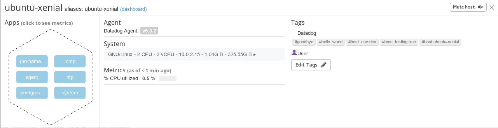
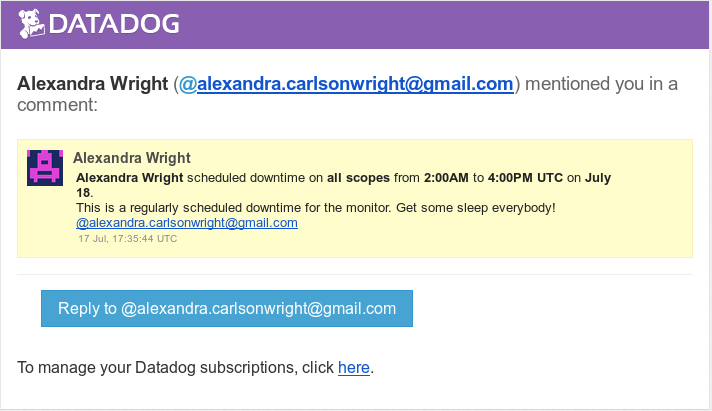

## Solutions Engineer Technical Challenge

To begin the technical challenge, I needed a fresh linux environment to avoid dependency issues. After weighing the pros and cons of Docker vs. Vagrant, I ended up installing Vagrant and following along on the Vagrant tutorial to create my first vagrant box. I was impressed by how easy it was to create a fresh Ubuntu box – the process took under 5 minutes. If I created a new virtual machine with Virtual Box alone, the process would have taken closer to half an hour. I also took the liberty of installing rmate on my vagrant box and the Remote Code extension for VisualStudio Code on my host machine. In tandem, this allows VisualStudio code to edit remote files via SSH. This was a massive step up from editing configuration files with nano.

### Collecting Metrics

The first portion of the project involves setting up the environment to collect metrics. This involves configuring the Agent, defining a custom metric,  and setting up the database on the guest machine.

The first step of the project was to set up the Datadog Agent configuration file so the host map would display custom host tags. Since I am using version 6 of the agent, I ran the following command: `sudo rmate /etc/datadog-agent/datadog.yaml` to open the main configuration file. I changed the tags line to the following:

```yaml

  tags: host_env:dev, host_testing:true, hello_world, goodbye

```

After restarting the Datadog service via `sudo service datadog-agent restart` and waiting a few moments for the metrics to be collected, I saw the new tags pop up in the host map:



The next step was to install and PostGres and integrate it with DataDog. I followed [these instructions](http://www.alexandrawright.net/posts/your_first_heroku_deployment_with_rails) to install Postgres and do basic configuration.Following the   [the Datadog docs suggestions](https://docs.datadoghq.com/integrations/postgres/) I set up the postgres.d/[conf.yaml](code_snippets/conf.yaml) file, created the datadog user, and assigned it the appropriate permissions to access Postgres.

To define a custom metric, I ran the following command:

```bash
  touch  /etc/datadog-agent/checks.d/mycheck.py && touch /etc/datadog-agent/conf.d/mycheck.yaml
```
This creates a python file, and a .yaml file. I added the following to the associated files: 

##### [mycheck.py](code_snippets/mycheck.py)
```python
#mycheck.py
from checks import AgentCheck
import random

class MyCheck(AgentCheck):
    def check(self, instance):
      rand = random.randint(0,1001)
      print(rand)
      self.gauge('my_metric', rand)
```
##### [datadog.yaml](code_snippets/mycheck.yaml)

```yaml
#mycheck.yaml
init_config:

instances:
  -   min_collection_interval: 45
```

The python file contains a class that submits metrics to Datadog, and the .yaml file contains settings that change how a check should be ran. I made mycheck submit a random number between 1 - 1000 to the Datadog service every 45 seconds.

#### Bonus Question: Can you change the collection interval without modifying the Python check file you created?

This is sort of a trick question. I was able to change the collection interval using the `min_collection_interval` key in the mycheck.yaml file, which is not a python file!

### Visualizing Data

To visualize incoming metrics from the Postgres database and my custom metric, I created a timeboard using the Timeboard API. The API works by constructing graphs from JSON. The JSON contains the desired metrics to be used and how to format the graphs. This collection of graphs that start at the same time is a Timeboard! In the name of modularity, I wrote a Ruby CLI app that submits .json files to the Timeboard API endpoint. 

The [create_timeboard](code_snippets/create_timeboard) app is located in this repo. To use it, make the file executable, run using `./create_timeboard`, and then follow the prompts. The .json file I used to create the graphs is included as well. For more instructions on usage, take a look at the readme in the create_timeboard folder.


Starting from the left, the first graph is a timeseries that shows the average score of my_metric, the second is a query value that shows the sum of the score with the rollup function applied over the last hour, and the final is a timeseries graph that shows the average number of records inserted into the database.

All data collected from the metrics is stored, making it possible to take a "snapshot" of any moment in time since the metrics started being collected. I found the snapshot feature to be really cool – You can take a snapshot of a graph over a specific timeframe, annotate it, and send it to your team. 


#### Bonus Question: What is the anomaly graph displaying?

My anomaly graph is displaying the amount of records inserted into the database over time. I am using a basic anomaly algorithm, which looks at the immediate history of the graph to find outliers. Most of the time, the database service is not inserting rows, so anything inserted is tagged as abnormal.

### Monitoring Data

Monitors are an incredibly useful service offered by Datadog. They offer users the ability to define triggers that will alert them via email if the proper conditions are met. 

I made a new Metric Monitor that uses the threshold alert setting. I set up a threshold monitor that will email me a warning if my_metric goes over 500,  an alert if my_metric goes over 800, an a message if there has been no data for the past 10 minutes. Here is an example warning email:


When defining notifications, you can use message template variables which contain information about the notification. I used the template variables to display different messages depending on what sort of threshold triggered the alert 


#### Bonus Question: Since this monitor is going to alert pretty often, you don’t want to be alerted when you are out of the office. Set up two scheduled downtimes for this monitor:

In order to not be bombarded with messages when I should be sleeping, I added two regularly scheduled downtimes. One of them occurs every weekday, from 7 pm to 9 am. The other commences on the weekend, stopping all notifications from 7pm Friday until 9 am the following Monday.




### Collecting APM Data:

One of Datadog’s newest (and coolest!) features is application monitoring via its integrated APM. The APM is able to give detailed statistics about every facet of a web application’s performance, from its database to every controller action. 

I set up an instance of one of my favourite projects [SudokuNow](https://github.com/f3mshep/sugoi-sudoku). SudokuNow is a Rails API with a React frontend that dynamically generates sudoku puzzles, and allows users to play them. Since it is a Rails app,  I was able to instrument it with ddtrace using the following steps:

1. Add the ddtrace gem to my project’s gemfile
2. `bundle install`
3. From the root of the application: `touch config/initializers/datadog-trace.rb`
4. Add the following to the newly created file:


```ruby
Datadog.configure do |c|
  c.use :rails, service_name: 'my-rails-app'
end
```
There is a branch with the instrumented version of the application, available [here](https://github.com/f3mshep/sugoi-sudoku/tree/data-dog).

I restarted the Datadog service, and waited a few moments for the ddtrace agent to sync up with the Datadog Web app. I was pleasantly surprised by how insightful and useful the new metrics provided by the APM are!

After creating a dash with each resource from my rails service I was able to pinpoint which actions in my controller were performing the worst. I also particularly liked being able to look at a resource that hits the database, and see how much of the time spent is from the HTTP request compared to accessing the database. 


A live version of this Timeboard is available [here!](https://app.datadoghq.com/dash/863639/main-dash)

In this timeboard, I also included metrics from my infrastructure. This way, I was able to trace a request and follow along on a specific timeframe to watch how resource intensive a particular request could be.


I also absolutely adore the breakdown of the time spent on a resource handling a request - The light blue area represents the app handling the HTTP request, whereas the dark blue area represents time interacting with the database.


#### Bonus Question: What is the difference between a Service and a Resource?

A service is a “set of processes that do the same job”. For example, a collection of processes that make up a web application, or a set of processes that make up a database. A resource is a particular action for a service. In the case of my rails service, a resource would be my #show controller action.

### Final Question – Creative Usage

In my downtime, one thing I like to do is play League of Legends, an online multiplayer game. A problem that I have had, and seen other players have, is issues with latency between their game client and the server. High latency can make the game difficult or impossible to play, because your champion will move after the latency delay!

While I cannot magically fix the Internet and get rid of latency, I thought it would be useful to build a web app that tells you when latency, or ping, is in acceptable ranges. As a first step, I decided to write a custom check that pings the League of Legends servers and submits the latency to the Datadog service.

I ran into a couple snags while designing the a check. First, there is a predefined TCP ping check in the Datadog Agent conf.d folder, but that would not work to check the ping due to the architecture of the League of Legends game servers. I needed to use ICMP to check the ping properly. There are a few ICMP python libraries, but they require sudo privileges to work.

To get around this, I wrote a [python check](code_snippets/ping.py) that runs an OS ping command, and pipes the stdout as a string into a variable. It then uses RegEx to parse the string to find the latency in milliseconds. The check then submits a gauge to the Datadog service with the latency. If the server is unresponsive, it will submit an event with a timestamp and the server IP instead.  The associated [.yaml file](code_snippets/ping.yaml) contains the IP addresses of the two League of Legends servers.


Check out the live version [here](https://app.datadoghq.com/dash/863948/lol-ping)

The timeseries graph uses anomaly detection. If the ping is outside the normal range, it is highlighted in red!

As a next step, I would like to set up several servers across the USA using a VPS provider such as DigitalOcean. Each VPS could be integrated with Datadog, and each would run my ping checker. 

When a user accesses the main website, it would use HTML geolocation API, and then find the VPS that is closest to the user. The web application would then give the user metrics from that region’s designated server. These metrics could include such as the health of the server, the last time it went down, and an estimated range of latency they might see.