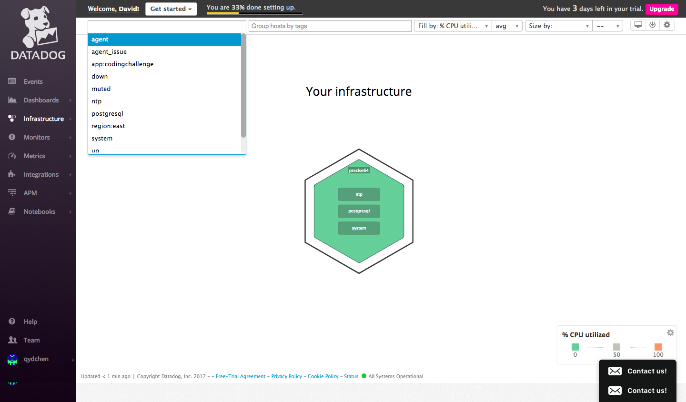

# Collecting Metrics:

***Add tags in the Agent config file and show us a screenshot of your host and its tags on the Host Map page in Datadog.***

```
tags: region:east, app:codingchallenge
```



***Install a database on your machine (MongoDB, MySQL, or PostgreSQL) and then install the respective Datadog integration for that database.***

In the postgres.yaml file:
```
init_config:

instances:
  - host: localhost
    port: 5432
    username: datadog
    password: HwUFx2fFVefYm9yc2osaEEoE
    dbname: postgres
    tags:
      - role:db
      - region:east
      - app:backend
```

***Create a custom Agent check that submits a metric named my_metric with a random value between 0 and 1000.***

```Python
from checks import AgentCheck
from random import randint
class MetricCheck(AgentCheck):
  def check(self, instance):
      self.gauge('metric.datadog', randint(0,1000))
```

***Change your check's collection interval so that it only submits the metric once every 45 seconds.***

We can modify the associated yaml file and set the min_collection_interval to 45.

***Bonus: Question Can you change the collection interval without modifying the Python check file you created?***

Yes, we can modify the my_metric.yaml file in /etc/dd-agent/conf.d

```
init_config:
    min_collection_interval: 45

instances:
    [{}]
```

# Visualizing Data:

***Utilize the Datadog API to create a Timeboard that contains:***

- Your custom metric scoped over your host.
- Any metric from the Integration on your Database with the anomaly function applied.
- Your custom metric with the rollup function applied to sum up all the points for the past hour into one bucket


***Once this is created, access the Dashboard from your Dashboard List in the UI:***

- Set the Timeboard's timeframe to the past 5 minutes
- Take a snapshot of this graph and use the @ notation to send it to yourself.


- Bonus Question: What is the Anomaly graph displaying?

Anomaly graph looks for strange behavior in a given metric based on the metric's past performance.

# Monitoring Data:

***Create a new Metric Monitor that watches the average of your custom metric (my_metric) and will alert if it’s above the following values over the past 5 minutes:***

- Warning threshold of 500
- Alerting threshold of 800
- And also ensure that it will notify you if there is No Data for this query over the past 10m.

***Please configure the monitor’s message so that it will:***

- Send you an email whenever the monitor triggers.
- Create different messages based on whether the monitor is in an Alert, Warning, or No Data state.


- Include the metric value that caused the monitor to trigger and host ip when the Monitor triggers an Alert state.
- When this monitor sends you an email notification, take a screenshot of the email that it sends you.


***Bonus Question: Since this monitor is going to alert pretty often, you don’t want to be alerted when you are out of the office. Set up two scheduled downtimes for this monitor:***

- One that silences it from 7pm to 9am daily on M-F,


- And one that silences it all day on Sat-Sun.


- Make sure that your email is notified when you schedule the downtime and take a screenshot of that notification.


# Collecting APM Data:

***Bonus Question: What is the difference between a Service and a Resource?***

A Service is the name of a set of processes that work together to provide a feature set. For example, my capstone project at App Academy http://www.safehavn.site/#/ has a webapp service (Ruby on Rails) and a database service (PostgreSQL).

A Resource is a particular query to a service; resource is also known as a route in MVC frameworks such as Ruby on Rails. A Resource is connected to a Service by the Service Name and the Name of the top-level span of the trace.

Sample resources:
```
qins-air:SafeHavn qyc$ be rake routes
           Prefix Verb   URI Pattern                      Controller#Action
             root GET    /                                static_pages#root
        api_users POST   /api/users(.:format)             api/users#create {:format=>:json}
         api_user PATCH  /api/users/:id(.:format)         api/users#update {:format=>:json}
                  PUT    /api/users/:id(.:format)         api/users#update {:format=>:json}
      api_session POST   /api/session(.:format)           api/sessions#create {:format=>:json}
                  DELETE /api/session(.:format)           api/sessions#destroy {:format=>:json}
        api_homes GET    /api/homes(.:format)             api/homes#index {:format=>:json}
                  POST   /api/homes(.:format)             api/homes#create {:format=>:json}
     new_api_home GET    /api/homes/new(.:format)         api/homes#new {:format=>:json}
    edit_api_home GET    /api/homes/:id/edit(.:format)    api/homes#edit {:format=>:json}
         api_home GET    /api/homes/:id(.:format)         api/homes#show {:format=>:json}
                  PATCH  /api/homes/:id(.:format)         api/homes#update {:format=>:json}
                  PUT    /api/homes/:id(.:format)         api/homes#update {:format=>:json}
                  DELETE /api/homes/:id(.:format)         api/homes#destroy {:format=>:json}
        api_trips GET    /api/trips(.:format)             api/trips#index {:format=>:json}
                  POST   /api/trips(.:format)             api/trips#create {:format=>:json}
         api_trip GET    /api/trips/:id(.:format)         api/trips#show {:format=>:json}
                  DELETE /api/trips/:id(.:format)         api/trips#destroy {:format=>:json}
      api_reviews GET    /api/reviews(.:format)           api/reviews#index {:format=>:json}
                  POST   /api/reviews(.:format)           api/reviews#create {:format=>:json}
       api_review GET    /api/reviews/:id(.:format)       api/reviews#show {:format=>:json}
api_confirmations POST   /api/confirmations(.:format)     api/confirmations#create {:format=>:json}
 api_confirmation GET    /api/confirmations/:id(.:format) api/confirmations#show {:format=>:json}
                  DELETE /api/confirmations/:id(.:format) api/confirmations#destroy {:format=>:json}
```

# Final Question:

***Is there anything creative you would use Datadog for?***

I would use Datadog to monitor cities in [Simcity 4](https://en.wikipedia.org/wiki/SimCity_4).

To give some background, Simcity 4 is one of the hardest city building video games ever made. Without proper budget balancing, mayors can be removed from their seat when the city's wallet is at a $100k deficit. There are countless ways that mayors can be in a financial deficit. A few examples below:

- power outages
- water outages
- improper sanitation system
- nuclear catastrophe
- a punitive tax policy
- a loose tax policy
- traffic congestion
- air pollution
- water pollution
- poor healthcare
- poor education
- high crime

We can use Datadog to monitor all these scenarios in a dashboard and trigger alerts.

- When the city's monthly revenue is close or below the expenses of the city, trigger a warning; when it is dire, trigger an alert
- When a power plant's condition depreciates below 70%, trigger an alert to replace the power plant. (Very important for nuclear power plants)
- When a water pump's condition depreciates below 70%, trigger an alert to replace the water pump.
- When garbage buildup is above the capacity of garbage disposal, trigger an alert to suggest more landfill, enable recycling ordinances, etc.
- When tax policy is high and is deterring city growth, trigger an alert; vice-versa for a low tax policy.
- When a particular street/highway/subway/bus stop exceeds it's capacity, trigger an alert.
- When air or water pollution is high in a residential or a commercial zone, trigger an alert.
- When a hospital or a school is under budget or about to strike, trigger an alert.
- When crime is too high at a certain area or there are not enough prisons, trigger an alert.
