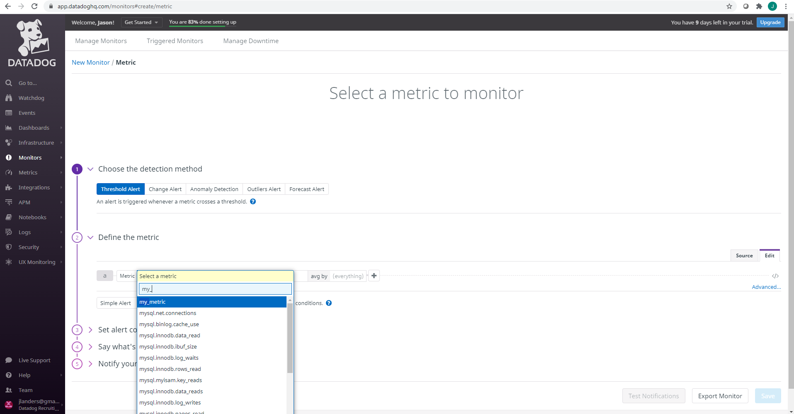

# Jason Landers - Solutions Engineer - Answers

- [Jason Landers - Solutions Engineer - Answers](#jason-landers---solutions-engineer---answers)
  * [About My Environment](#about-my-environment)
  * [Vagrant Setup](#vagrant-setup)
  * [Agent Installation](#agent-installation)
  * [Database Installation](#database-installation)
  * [Database Instrumentation](#database-instrumentation)
  * [Tie it Together - Datadog and MySQL](#tie-it-together---datadog-and-mysql)
  * [Creating a Custom Agent Check](#creating-a-custom-agent-check)
  * [Use the Datadog API to create a Timeboard](#use-the-datadog-api-to-create-a-timeboard)
  * [Monitoring Data](#monitoring-data)
  * [Collecting APM Data](#collecting-apm-data)
  * [Is there anything creative you would use Datadog for?](#is-there-anything-creative-you-would-use-datadog-for)

## About My Environment

For the exercise I used [Vagrant](https://www.vagrantup.com/) with the official [HashiCorp Ubuntu 18.04 box](https://app.vagrantup.com/ubuntu/boxes/bionic64) and [VirtualBox](https://www.virtualbox.org/) as the underlying VM engine. 

## Vagrant Setup

I created a new directory to house the environment on my local PC called datadog-exercise

```shell
> mkdir datadog-exercise
> cd datadog-exercise
```


now within my new (empty) directory, it's time to fire up the base Ubuntu VM with Vagrant that will come to run my Datadog agent instance as well as the MySQL server and other components the exercise calls for. We first need to initialize Vagrant:

```shell
> vagrant init hashicorp/bionic64
```


> **NOTE:** If you charge ahead and run 'vagrant up' like the Vagrant output above suggests the VM will start but you'll have **no network connectivity**. That's because the default Vagrantfile requires you to edit it first in order to select the type of networking you want to use for this VM. I didn't want any NAT related headaches so I opted for bridged mode which I enabled by editing the Vagrantfile that Vagrant created in c:\Users\jland\datadog-exercise\Vagrantfile.  

I opened the Vagrantfile in Notepad++ and uncommented the line for config.vm.network "public_network" and saved the file.


Now after saving and closing it's safe to run vagrant up:

```shell
> vagrant up
```

One thing you may run into like I did is the fact that if you have multiple network interfaces Vagrant will pause and ask you which interface it should bind to for bridged mode. In my case my primary LAN adapter is 1) Intel(R) Wi-Fi 6 AX201 160MHz so I entered a "1" at the prompt. 

> My other interface, Blackberry VPN, is an artifact of a hobby project I was recently working on to resuscitate an old Blackberry which was totally successful and fun to play with again. That's a story for another time!


```
1
```

Once Vagrant finishes you'll be back at the command prompt and the VM should be running! Now to continue we need to get a shell on the VM so we simply run:

```shell
> vagrant ssh
```


## Agent Installation

Because we're going to need several packages to complete the exercise the very first thing to do is update the package repos in this image:

```shell
$ sudo apt update
```


Now that the VM environment is initialized and ready, we need to change gears and get a Datadog trial spun up! 

I opened a browser and hit [datadoghq.com](https://www.datadoghq.com/). From there, I clicked FREE TRIAL and entered my information to start the trial:


After selecting the components of my stack and viewing the web-based walkthrough tips I headed over to Integrations -> Agent and selected Ubuntu to get the pre-populated one-step install command from Datadog for the agent:


> **NOTE:** I obfuscated with *** my actual Datadog API Key in the screenshot above. For anyone following along, you will see your actual API key instead of the asterisks.

Now copy the code blocked text under Step 1 for the agent install and flip back to the CLI to run it! If you copy and paste from your own instance, <DD_API_KEY> below will instead be populated with your actual API key. 

```shell
$ sudo DD_AGENT_MAJOR_VERSION=7 DD_API_KEY=<DD_API_KEY> DD_SITE="datadoghq.com" bash -c "$(curl -L https://s3.amazonaws.com/dd-agent/scripts/install_script.sh)" 
```

Once everything completes you should see a successful status message like the following:


The instructions ask us to add tags and show the host with those custom tags on the Host Map page of Datadog. So lets open up datadog.yaml and put those tags in:

```shell
$ sudo vi /etc/datadog-agent/datadog.yaml
```

> **NOTE:** I am also going to take this opportunity to set a custom hostname

I uncommented the hostname field and added a custom hostname and then did the same for the tags section just below that:


> **PROTIP:** Take every opportunity to have fun with it!

Save those changes and then we just need to restart the Datadog agent:

```shell
$ sudo systemctl restart datadog-agent
```

Now after waiting a few minutes for everything to sync up we should be able to see this new host and agent in Datadog with those custom tags and the custom host name on the [Host Map page](https://app.datadoghq.com/infrastructure/map) like the instructions asked for:


> Pay no attention to the other hosts showing in my Host Map view. Those are from other runs as I was working the exercise which I didn't document.

You can see in the screenshot above the custom tags we added in the datadog.yaml config file now show up under Tags for the host! Pretty cool if you ask me. 

## Database Installation

The next thing the instructions ask us to do is install a database server and instrument it with the Datadog integration for it. I opted for mysql. 

```shell
$ sudo apt install mysql-server
```

Once the install completes, it's time to configure the basics for MySQL. We don't want our test environment becoming vulnerable by running insecure services even for a little while! 

```shell
$ sudo mysql_secure_installation
```


> **NOTE:** I chose to leave the test database in place so that when the time comes for instrumentation with Datadog I have some test data to query.

## Database Instrumentation

Now we're getting to the fun stuff. Lets keep going and instrument this! First, we need to lay some groundwork by adding a user for Datadog to MySQL per the [integration instructions in the Datadog web UI](https://app.datadoghq.com/account/settings#integrations/mysql).

First, we need to get into the mysql CLI shell:

```shell
$ sudo mysql -u root -p
```


Now we can add the datadog user with the following:

```mysql
CREATE USER 'datadog'@'localhost' IDENTIFIED WITH mysql_native_password by 'landers';
```


To test that the user was added successfully you can type exit to exit the mysql shell and then run the following test from the Datadog instructions:

```shell
$ mysql -u datadog --password=landers -e "show status" | grep Uptime && echo -e "\033[0;32mMySQL user - OK\033[0m" || echo -e "\033[0;31mCannot connect to MySQL\033[0m"
```

If the user was added successfully you should see output similar to this:


Now that the user is added, we need to specify some privileges for Datadog within MySQL. Lets go back into the MySQL CLI and then once there run the following:

```mysql
GRANT REPLICATION CLIENT ON *.* TO 'datadog'@'localhost' WITH MAX_USER_CONNECTIONS 5;

GRANT PROCESS ON *.* TO 'datadog'@'localhost';
```

You should see output similar to:


> **NOTE:** The Datadog docs mention that if the performance_schema feature of MySQL is turned on we can also capture additional metrics from that. I definitely wanted to see what that adds so I exited from the MySQL shell and I edited the mysql config at /etc/mysql/mysql.conf.d/mysqld.cnf and added the line performance_schema under the [mysqld] stanza. Finally, I restarted the MySQL service to enable the feature and then returned to the MySQL CLI to enable permissions for the performance_schema for the datadog user.

```mysql
mysql> GRANT SELECT ON performance_schema.* TO 'datadog'@'localhost';
```

Don't forget when all permissions changes are said and done to make MySQL recognize the changes with a flush:

```mysql
mysql> FLUSH PRIVILEGES;
```

## Tie it Together - Datadog and MySQL

Now that we have MySQL set up and ready with a datadog user and the respective permissions we need to tell the Datadog agent how to use it. Lets go add the mysql config in /etc/datadog-agent/conf.d/mysql.d. There is an example config file in there already but I found it to be cleaner and simpler to create a new config file with just what we need from the Datadog integration docs:

```shell
sudo -u dd-agent vi /etc/datadog-agent/conf.d/mysql.d/conf.yaml
```

If you're copy and pasting from the Datadog integration guide (or this guide) and you're using vi be sure to do `:set paste` before pasting so as not to have extra tabs added.

I added a basic config calling out the datadog user, adding the password and the port (MySQL default is 3306 which is what I'm using)


Now we need only to save and then restart the datadog agent:

```shell
$ sudo systemctl restart datadog-agent
```

After a few minutes the Datadog web UI recognizes the integration and the status changes to reflect that:


And the host now shows mysql with a nice drilldown to metrics and a helpful link to the [MySQL Overview Dashboard](https://app.datadoghq.com/dash/integration/12/MySQL%20-%20Overview?from_ts=1619468250597&live=true&to_ts=1619471850597&tpl_var_scope=host%3Ahireme.landers)!


[MySQL Overview Dashboard](https://app.datadoghq.com/dash/integration/12/MySQL%20-%20Overview?from_ts=1619468250597&live=true&to_ts=1619471850597&tpl_var_scope=host%3Ahireme.landers):


## Creating a Custom Agent Check

The next task in the instructions is to create a new custom Agent Check called my_metric which provides a random value between 0 and 1000. There is also a requirement to ensure that the collection interval is such that the check's metric will only be submitted once every 45 seconds. Lets dig in!

First, we have to create a new folder in the datadog-agent directory at: /etc/datadog-agent/ called checks.d:

```shell
$ sudo -u dd-agent mkdir checks.d
```

Then after we cd into that directory lets add the actual script which I'm going to call my_metric.py:

```shell
$ sudo -u dd-agent vi /etc/datadog-agent/checks.d/my_metric.py
```

and these are the contents of the script which you can copy/paste if you're interactively following along:

```python
import random

from datadog_checks.base import AgentCheck

__version__ = "1.0.0"

class MyClass(AgentCheck):
    def check(self, instance):
        self.gauge(
            "my_metric",
            random.randint(0, 1000),
            tags=["KPIs:my_metric","metric_submission_type:gauge"],
        )
```

This script will return a metric called my_metric whenever it is run with a value between 0 and 1000. But wait, the spec we were given says that we should limit the collection interval to once every 45 seconds. We *could* do something about that here in this script, however, the spec goes on to mention that as a bonus task we should try to see how we can limit the collection interval **without** modifying the Python check file/script. For that, lets save and exit out of this and set up the collection. 

Start by creating a new folder in the conf.d directory of datadog-agent at: /etc/datadog-agent/conf.d called my_metric.d:

```shell
$ sudo -u dd-agent mkdir /etc/datadog-agent/conf.d/my_metric.d
```

Then, add and edit a new file that we will call my_metric.yaml:

```shell
$ sudo -u dd-agent vi /etc/datadog-agent/conf.d/my_metric.d/my_metric.yaml
```

Paste the following into the file and then save and quit:

```
init_config:

instances:
  - min_collection_interval: 45
```

The Datadog documentation provides this helpful means of validating that the metric check is working:

```shell
$ sudo -u dd-agent -- datadog-agent check my_metric
```


If all is well you should see output similar to the above. After some time, you will also see my_metric show up as available in the Metrics Explorer and other views:


## Use the Datadog API to create a Timeboard

The next portion of the exercise calls for a script which leverages the Datadog API to automatically build a Timeboard (a dashboard where all the metrics are sync'd to the same timeframe as opposed to multiple unique timeframes per-metric or group of metrics) that contains:

 * The new my_metric scoped over my host
 * Any metric from the Integration of the MySQL database with the anomaly function applied
 * My my_metric custom metric with the rollup function applied to sum up all the data points for the past hour into one bucket

There's a little bit more but taking one thing at a time lets get that much going. 

First things first, I need the JSON to build the dashboard to spec per the above requirements. I used the GUI to lay out a dashboard with the proper metrics and I also added in a few additional. Then I exported the dashboard JSON and copied it into the below script which is also included in my pull request as [makeMyMetricDashboard.py](./scripts/makeMyMetricDashboard.py). Note that as before I added asterisks in place of my actual API and app keys:

```python
from datadog import initialize, api

options = {
    'api_key': '****************************************',
    'app_key': '****************************************'
}

initialize(**options)

title = 'my_metric dashboard!'
widgets = [
    {
      "definition": {
        "title": "my_metric scoped over host CPU",
        "title_size": "16",
        "title_align": "left",
        "show_legend": True,
        "legend_layout": "auto",
        "legend_columns": [
          "avg",
          "min",
          "max",
          "value",
          "sum"
        ],
        "type": "timeseries",
        "requests": [
          {
            "q": "avg:system.cpu.user{*}",
            "style": {
              "palette": "dog_classic",
              "line_type": "solid",
              "line_width": "normal"
            },
            "display_type": "line"
          },
          {
            "q": "avg:my_metric{*}",
            "style": {
              "palette": "dog_classic",
              "line_type": "solid",
              "line_width": "normal"
            },
            "display_type": "line"
          }
        ],
        "yaxis": {
          "scale": "linear",
          "label": "",
          "include_zero": True,
          "min": "auto",
          "max": "auto"
        },
        "markers": []
      }
    },
    {      "definition": {
        "title": "MySQL Connections (with Anomalies)",
        "title_size": "16",
        "title_align": "left",
        "show_legend": True,
        "legend_layout": "auto",
        "legend_columns": [
          "avg",
          "min",
          "max",
          "value",
          "sum"
        ],
        "type": "timeseries",
        "requests": [
          {
            "q": "anomalies(avg:mysql.net.connections{*}, 'basic', 3)",
            "style": {
              "palette": "dog_classic",
              "line_type": "solid",
              "line_width": "normal"
            },
            "display_type": "line"
          }
        ],
        "yaxis": {
          "scale": "linear",
          "label": "",
          "include_zero": True,
          "min": "auto",
          "max": "auto"
        },
        "markers": []
      }
    },
    {
      "definition": {
        "title": "my_metric sum for the hour",
        "title_size": "16",
        "title_align": "left",
        "type": "query_value",
        "requests": [
          {
            "q": "avg:my_metric{*}.rollup(sum, 3600)",
            "aggregator": "avg"
          }
        ],
        "autoscale": True,
        "precision": 2
      }
    },
    {
      "definition": {
        "title": "My Host Map",
        "title_size": "16",
        "title_align": "left",
        "type": "hostmap",
        "requests": 
		{"fill": {
            "q": "avg:system.cpu.user{*} by {host}"
          }
        },
        "node_type": "host",
        "no_metric_hosts": True,
        "no_group_hosts": True,
        "style": {
          "palette": "Viridis",
          "palette_flip": False
        }
      }
    },
    {
      "definition": {
        "title": "Top Host Processes (Total CPU%)",
        "title_size": "16",
        "title_align": "left",
        "time": {},
        "type": "toplist",
        "requests": [
          {
            "process_query": {
              "search_by": "",
              "filter_by": [],
              "limit": 10,
              "metric": "process.stat.cpu.total_pct"
            }
          }
        ]
      }
    }
  ]
layout_type = 'ordered'
description = 'A dashboard created with the API'
is_read_only = True

api.Dashboard.create(title=title,
                     widgets=widgets,
                     layout_type=layout_type,
                     description=description,
                     is_read_only=is_read_only)
```

Running this script adds a new dashboard to my Dashboards list in the UI called [my_metric dashboard!](https://app.datadoghq.com/dashboard/hfg-fzv-dvn/mymetric-dashboard?from_ts=1619470337455&live=true&to_ts=1619473937455) which looks like this:


To answer the bonus question about what the anomaly graph is displaying, it's showing the predicted vs actual MySQL connections based on a lookback of the historical value and correctly identifying a spike in logins which I created specifically to show what it would look like if there was a surge of new connections. The exercise calls for me to take a snapshot of the graph and, using the @ notation, send it to myself and take a screenshot. My screenshot of the notification is here:


## Monitoring Data

The next portion of the exercise deals with configuring alerts with maintenance windows and custom messages. Specifically, the exercise says that we need a new Metric Monitor which alerts if it is above the following values over the past 5 minutes:

	* Warning threshold of 500
	* Alerting threshold of 800
	* Also ensure that it notifies you if there is No Data or the query over the past 10 minutes.

We're also supposed to configure the monitor's message so that it will:

* Send me an email whenever the monitor triggers
* Create different messages based on whether the monitor is in an Alert, Warning, or No Data state.
* Include the metric value that caused the monitor to trigger and the host IP when the Monitor triggers an Alert state.

To start, click the blue New Monitor button from the Monitors -> Manage Monitors view in Datadog. Then from the Select a monitor type menu, choose Metric. 

One the page that loads, start typing my_metric into the box next to Metric and you should see it auto-populate with the Metric:



Scrolling down a little, you'll see the Set Alert conditions portion of the screen which allows us to enter the threshold values and set up the No Data alerting:


That takes care of the initial configuration with the values, now lets set the message(s) depending on what the alert details are when it's triggered. Fortunately, Datadog provides a robust templating capability which allows us to knock out all of the message requirements of the exercise pretty easily. Scrolling down to Step 4 of the web UI you'll see a message edit box. The following is the text that I used which accomplishes the spec'd requirements of providing a different message depending on the alert severity and type, including the host IP when it's an alert, and including the metric value when it's a warning:

```
{{#is_alert}}my_metric is very high on {{host.name}} at IP {{host.ip}} {{/is_alert}}
{{#is_warning}}my_metric is {{value}} which is above the warning threshold of 500 on {{host.name}}{{/is_warning}}
{{#is_no_data}}my_metric has stopped sending data on {{host.name}}{{/is_no_data}}
```

Once that's done, add yourself or your team in Step 5 for the actual notification. Then just double check for any other desirable options and when you're done click Save from here!


Because the metric being monitored is set for a random 0-1000 value once every 45 seconds It doesn't take long before it triggers which results in an email being sent. The instructions specifically also ask for a screenshot of the notification which for me looked like this:


I also went ahead with the bonus question section which talks about setting up downtimes for the monitor based on a desire to not get alerts on a weekend nor to get alerts from 7PM-9AM on weekdays. After I configured those downtimes I notified the team (myself in this case) and received the following notifications:


And this one for the weekend suppression:


## Collecting APM Data

The final section of the exercise pertains to APM tracing. I had a lot of fun with this. First, I had to turn on APM in the agent config. 

```shell
$ sudo -u dd-agent vi /etc/datadog-agent/datadog.yaml
```

Scroll down or search for the section with apm_config and uncomment those lines needed to enable it. I also took the opportunity to call my environment "dev" for reporting purposes.


I also took the opportunity to enable other disabled parts of the config such as process monitoring in order to see what those views looked like for myself in Datadog (hint: totally worth turning those on!). One more quick restart of the agent:

```shell
$ sudo systemctl restart datadog-agent
```

Now that we have the agent prepped to support the APM data, we need to generate some! I took note of the mention in the directions about not mixing ddtrace-run and Middleware insertions. I know I could have just run the ddtrace-run command and probably gotten a lot of the same information. However, I wanted to better understand the components and makings of the manual Middleware option. I also experimented with a custom tag that incorporates the client's IP address which was really cool to see run. Using the outline of the app provided in the exercise directions, I came up with the following [instrumented version](./scripts/APMDemo.py):

```python
from flask import Flask
from flask import request
from ddtrace import tracer
from ddtrace import config
import logging
import sys

config.flask['service_name'] = 'apm-demo'

# Have flask use stdout as the logger

main_logger = logging.getLogger()
main_logger.setLevel(logging.DEBUG)
c = logging.StreamHandler(sys.stdout)
formatter = logging.Formatter('%(asctime)s - %(name)s - %(levelname)s - %(message)s')
c.setFormatter(formatter)
main_logger.addHandler(c)

app = Flask(__name__)

@app.route('/')
def api_entry():
    with tracer.trace("api_entry") as span:
        span.set_tag("client_ip", request.remote_addr);
        return 'Entrypoint to the Application'

@app.route('/api/apm')
def apm_endpoint():
    with tracer.trace("APM_Endpoint") as span:
        return 'Getting APM Started'

@app.route('/api/trace')
def trace_endpoint():
    with tracer.trace("Trace_Endpoint") as span:
        return 'Posting Traces'

if __name__ == '__main__':
    app.run(host='0.0.0.0', port='5050')
```

I saved that as APMDemo.py and ran it with:

```shell
$ python APMDemo.py
```

I then used my desktop browser to access each of the endpoints defined in the skeleton app:

- http://192.168.86.34:5050/
- http://192.168.86.34:5050/api/apm
- http://192.168.86.34:5050/api/trace

And after a few minutes we see the service in the APM -> Services view! 


And similarly we have Traces showing the individual invocations in the APM -> Traces view.


Now that I have a robust combination of APM Tracing information as well as MySQL process insight and host-level performance information I am able to create a unified dashboard encompassing the whole range of components and their dependencies to fully and easily understand at-a-glance the health, performance, and stability of my entire environment!

[APM & Infrastructure Metrics Dashboard](https://app.datadoghq.com/dashboard/uh6-jc5-qqw?from_ts=1619480851857&live=true&to_ts=1619484451857)


## Is there anything creative you would use Datadog for?

Yes! There are so many possibilities. My COVID hobby project has been to create a chore tracking application for my son which helps to remind him of his daily chores but also tracks in real time his earnings against them as he completes them. We don't let him update those values himself - my wife or I use a mobile web interface. The system is built on Google Firebase and makes extensive use of Google Firebase services such as authentication, site hosting, Firestore, and many serverless functions to name a few. It has a dashboarding capability which I integrated into wall mounted displays powered by Raspberry Pis and I even created an Alexa skill to go with it so I can trigger different dashboard displays with voice commands. What started as a simple client<->server<->db application has quickly grown into a sprawling suite of microservices driven largely off cloud-based serverless functions.

I'm very excited to instrument it all with Datadog! I often wonder about component performance not necessarily even for troubleshooting sake but for optimization. Especially since I was new to Firestore and picked it for this project in order to better learn it I'm certain that my queries from my API layer into Firestore could be more efficient. Being able to instrument this app easily will definitely give me the insights I need at the granularity I need to very quickly assess the performance of different query structures in a way I can only speculate about now. As funny as it is to think about in terms of a home COVID project, my journey and challenges very directly map to the larger but similar real issues and concerns within every enterprise. 
